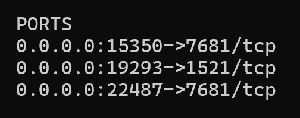

### 수정사항
1. PortAllocator (포트 배정 서비스 추가)
2.  단순 http 요청 docker status 추가
3. 용어 정리 (용어 혼재 사용)
	1. hostPort -> containerPo
4. 

### 미해결 과제
1. 포트 연결시 TCP 인지 UDP 인지도 선택여부에 두어야 하는가?
2. 컨테이너 삭제시 ttyd 또한 삭제가 필요 현재는 그대로 방치됨
3. 도커 볼륨 관련
4. 

현재 container.js 에서 너무 많은 일을 하고 있어
new_container.js 와 container.js 로 분리해줘

### container table 과 ttyd table
1. container table 과 ttyd table 2개로 분리할 필요 없이 1개의 테이블에 있어도 되는 거 아닌가? (실시간 status 시)
2.   tydContainerId;                                   //ttyd 컨테이너 ID  
    private String ttydHostPort;              //ttyd 호스트 포트  
	// ttyd 컨테이너의 컨테이너 포트의 경우 고정되어 있으므로 필요 없음
	필요 status 
3. status 에 ttyd 접근 포트 필요함
4. 

### 나
ttyd 실행시 포트 설정 => 직접 포트 접근 막기  
https://chat.qwen.ai/c/633a43de-01b2-4739-abbd-13139669c810  

| 명령어                                   | 이해          | 상세                              |
| ------------------------------------- | ----------- | ------------------------------- |
| `-p 127.0.0.1:hostPort:containerPort` | 로컬에서만 접근 가능 | host url 이 달라져도 localhost 로만 접근 |

docker template 만들기  
docker document 만들기  
  
  
서버 클라이언트 api 호환 마지막  
### 건혁님

forword endpoint  
status  
hostname  

vscode (version 1.100)

### 현재 도커 터미널 관련 아키텍쳐
터미널에 접근하는 것을 ttyd 로 했는데 1개의 터미널당 1개의 ttyd 컨테이너가 필요하고 ttyd 가 각 컨테이너의 프록시 역할을 해  
  
  
이것은 아키텍쳐 적으로 너무 복잡해  
이것을 고치기 위해 
1. websocket 프론트 부분은 terminal.html?containerId={containerId}
2. 프론트 부분은 xterm.js 로 구성
3. 백엔드 부분은 spring websocket 으로 구성 (특정 도커와 적절히 연결)
4. 마지막에 기존 ttyd 의존성 완전 삭제

1. 백엔드
	1. WebSocket 설정 `WebSocketConfig.java`
	2. 터미널 핸들러 작성 `TerminalWebSocketHandler.java`
	3. 컨테이너 터미널 세션 관리 클래스 `DockerTerminalSessionManager.java`
	4. 실제 터미널 실행 클래스 `DockerTerminalSession.java`
	5. Docker Java 클라이언트 확장 기능`DockerJavaClient.java` - 일부 메서드 추가
	6. OutputStream 커스텀 클래스
2. 프론트엔드

