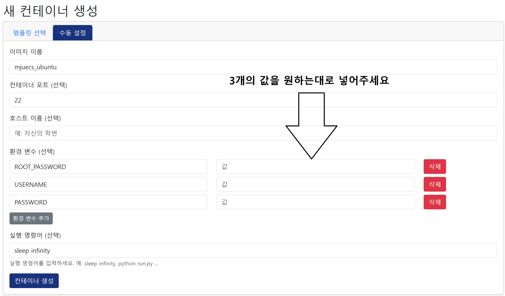
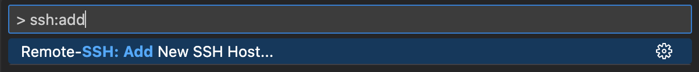
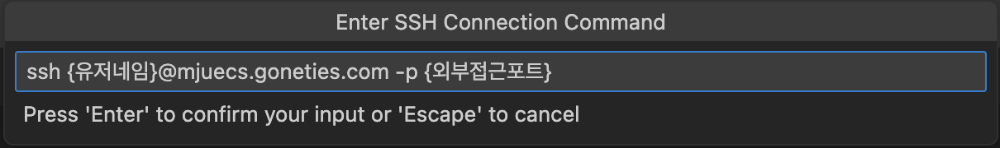
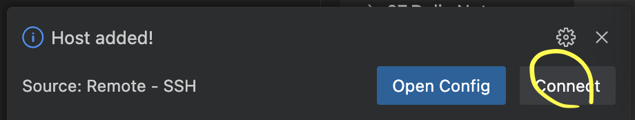
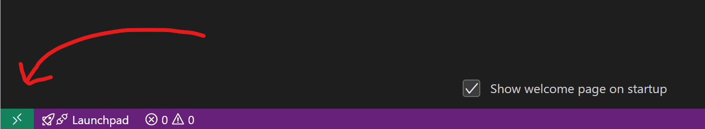

# 🐧 mjuecs ubuntu (Ubuntu 22.04 기반) Docker 컨테이너 가이드

> 이미지 출처: [ubuntu (Docker Hub)](Docker%20Hub))

---

## 1. 컨테이너 생성

### 1-1. 템플릿 선택

- `mjuecs ubuntu` 템플릿을 선택합니다.
- 이 템플릿은 Ubuntu 22.04를 기반으로 하며, SSH 서버와 사용자 계정 생성 custom 이 되어 있습니다
### 1-2. 환경변수 설정

컨테이너 생성 시 **다음 환경변수를 설정**해야 합니다:

|환경변수|설명|
|---|---|
|`ROOT_PASSWORD`|루트 계정의 비밀번호 (예: `rootpass123`)|
|`USERNAME`|생성할 일반 사용자 계정명 (예: `student01`)|
|`PASSWORD`|해당 사용자 비밀번호 (예: `studentpass123`)|
3002975.png)

> 이 설정에 따라 컨테이너 최초 실행 시 자동으로 사용자 계정이 생성되고 sudo 권한이 부여됩니다.

---

### 1-3. 컨테이너 정보 접근
- 컨테이너가 생성된 후, 해당 컨테이너 정보 페이지로 이동합니다.
### 1-4. 웹터미널 접근 준비
- **웹터미널 접근 비밀번호 복사** 버튼을 클릭하여 복사합니다.
- 그 후 **웹터미널 열기** 버튼을 클릭하여 웹터미널을 실행합니다.
### 1-5. 웹터미널 로그인
- **아이디**: 학번
- **비밀번호**: 위에서 복사한 **웹터미널 접근 비밀번호**

---

## 2. VS Code에서 원격 SSH 연결

해당 컨테이너는 ssh 설정과 유저 생성이 자동으로 이루어지며 바로 vscode 연결이 가능합니다

---

### 2-1. VS Code 확장 설치
1. VS Code 실행
2. Extensions(확장) 메뉴에서 `Remote - SSH` 검색 및 설치
---

### 2-2. SSH 접속

1. vscode 에서 `ctrl + p` 접근 이후 ssh 입력
2. 새로운 host 연결
3. 컨테이너 생성시 입력한 사용자 이름, 외부 접근포트의 경우 컨테이너 정보창 외부 접근 포트 번호
   
4. config 는 아무거나 설정 (전역 설정, 유저 설정)
5. 연결 
 6. 비빌번호 입력 -> 접속 완료

### 2-3. 이후 접속
1. VS Code 하단의 녹색 버튼 클릭 → **Remote-SSH: Connect to Host**
2. mjuecs.gonetis.com 선택
3. 비밀번호 입력 → 접속 완료
    
---

