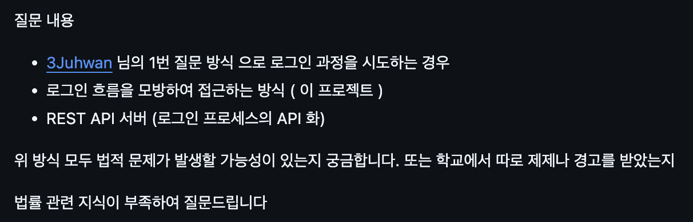
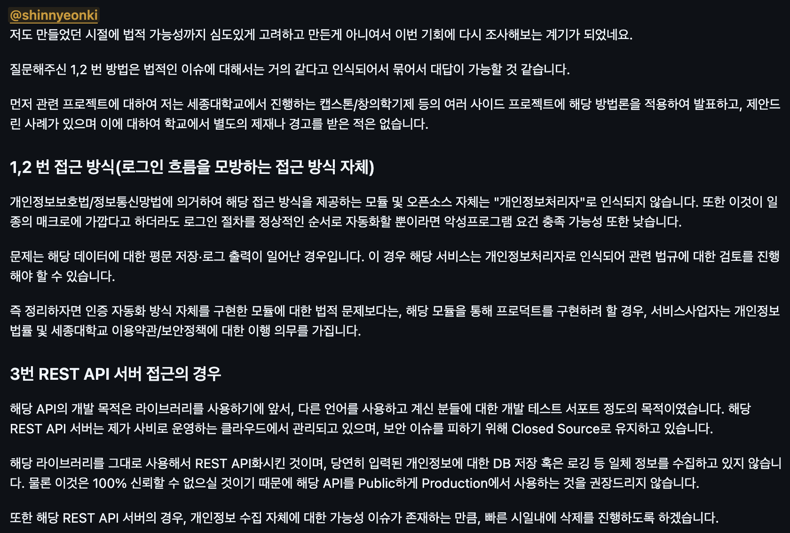

1. 실제 시연 => oracle database 연결, 김직수 교수 클라우드 등등
2. 기술적 검토
	1. 로그인시 명지대 서버와 통신하는 과정
3. 법적 검토 => 최근 skt 보안 사고로 인해 이것을 조금 확실하게 따질 필요가 있어 보임
	1. 실제 프로덕트를 운영하더라도 수익이 없고 학생들이 한 프로젝트를 제제하는 경우는 잘 없음(세종대) 하지만 초기에는 학번만 저장하면 실제 서비스해도 법적인 문제가 발생하지 않을 것이라는 생각을 하였음
	2. 현제 해당 프로젝트는 학교의 비밀번호 아이디를 입력하여 로그인 할 수 있도록 만들어 두었음
	3. 비밀번호의 경우 당연히 민감한 개인정보라고 생각하여 초기 설계부터 완전히 저장하지 않는 방향으로 설계하였음 하지만 학교의 학번이 민감한 개인정보인 경우 이것이 법적으로 문제가 될수 있다는 생각을 하였고 해당하는 학교에 로그인이 가능한 프로젝트를 구현한 세종대 github 프로젝트(sejong-univ-auth) 에 직접 질문을 통해 법적 내용을 공유받아 해당 내용을 공유하려고함
	4. 실제로 내가 질문한 내용
	5. [이슈](https://github.com/iml1111/sejong-univ-auth/issues/21)
	6. 접근방식 제공모듈 자체는 개인정보 처리자로 인식되지 않아 상관없지만 해당 모듈(방법론)을 사용하여 프로젝트를 진행할 경우 개인정보 처리자로 인식이 되며 관련 법규에 대한 제제를 받는다
	7. 서비스 사업자는 개인정보 법률 및 해당대학교 이용약관 보안정책에 대한 이행의무를 가진다
		1. 현재 학번을 database 평문저장하고 있음
		2. 개인정보 법률 -> 정확한 판단이 불가
			1. 아이디 -> github  등 여러가지 사이트가 이미 아이디를 공개적인 검색으로 사용
			2. 학번 단독으로 저장되었는데 이 경우 개인정보로 보아도 되는가?
		3.  실제 명지대 보안 정책 -> 학교의 보안정책은 괜찮다
			1. 3장 6조 1항 
				1. 학교는 이용자가 이 약관의 의무를 위반하거나 서비스의 정상적인 운영을 방해한 경우, 경고, 일시정지, 영구이용정지 등으로 서비스 이용을 단계적으로 제한할 수 있다.
				2. 동일 계정으로 계속 요청을 하면 일정 시간(10분) 자동으로 막힘으로 고려할 필요가 없다
			2.  3장 9조 5항 아호
				1. 학교의 동의 없이 영리를 목적으로 서비스를 사용하는 행위
	8. 해당 법적인 검토를 통해 실제 프로덕션 상황에서 실제 어떠한 문제가 발생할 수 있는지 간접적인 경험이 되었음