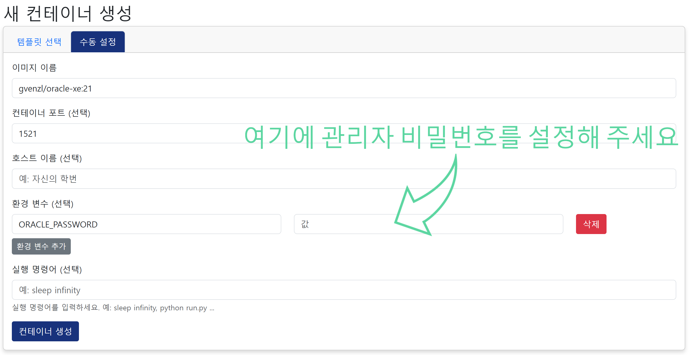
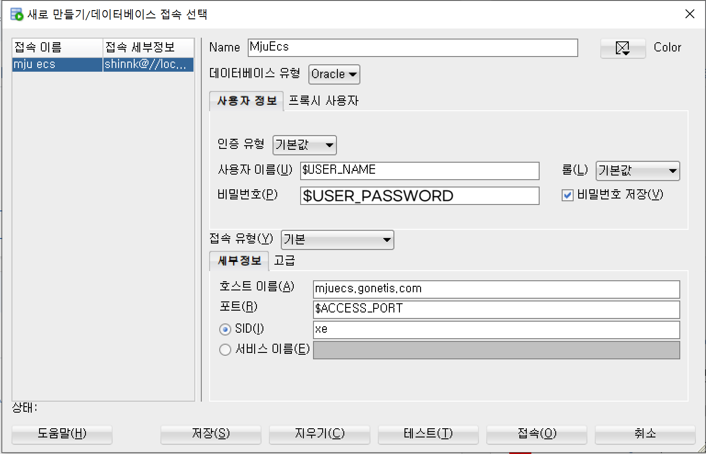

# Oracle Database Docker 컨테이너 가이드

> 이미지 출처: [gvenzl/oracle-xe (Docker Hub)](Docker%20Hub))

---

## 1. 컨테이너 생성

### 1-1. 템플릿 선택

* Oracle Database 11, 18, 21 중 하나를 선택합니다.

### 1-2. 환경변수 설정

* 필수: `ORACLE_PASSWORD` 환경변수에 **관리자 비밀번호**를 입력
* 나머지 변수는 선택

📷 예시ed%20image%2020250517080578.png)

### 1-3. 컨테이너 정보 접근

* 컨테이너 정보 페이지로 이동합니다.

### 1-4. 웹터미널 접근 준비

* **웹터미널 접근 비밀번호 복사** 버튼을 클릭하여 비밀번호를 복사
* 이후 **웹터미널 열기** 버튼 클릭

### 1-5. 웹터미널 로그인

* **아이디**: 학번
* **비밀번호**: 위에서 복사한 **웹터미널 접근 비밀번호**

---

## 2. 사용자 및 DB 생성

### 변수 설명

아래 명령어들에서 사용하는 변수들은 자신에게 맞게 대체합니다.

| 변수명                | 설명                     |
| ------------------ | ---------------------- |
| `$ORACLE_PASSWORD` | 컨테이너 생성 시 설정한 관리자 비밀번호 |
| `$USER_NAME`       | 생성할 사용자 이름             |
| `$USER_PASSWORD`   | 생성할 사용자 비밀번호           |
| `$ACCESS_IP`       | DB 접근용 IP 주소(mjuecs.gonetis.com)           |
| `$ACCESS_PORT`     | DB 접근용 포트 번호           |

---

### 2-1. SQL\*Plus 접속

터미널에서 관리자 계정으로 SQL\*Plus 접속:

```bash
sqlplus sys/$ORACLE_PASSWORD as SYSDBA
```

---

### 2-2. 사용자 생성 및 권한 부여

#### ✅ Oracle 11 버전인 경우:

```sql
CREATE USER $USER_NAME IDENTIFIED BY $USER_PASSWORD;
GRANT CREATE SESSION TO $USER_NAME;
GRANT CONNECT, RESOURCE TO $USER_NAME;
GRANT CREATE MATERIALIZED VIEW TO $USER_NAME;
ALTER USER $USER_NAME DEFAULT TABLESPACE users QUOTA UNLIMITED ON users;
```

#### ✅ Oracle 18 / 21 버전인 경우:

```sql
ALTER SESSION SET "_ORACLE_SCRIPT"=true;
CREATE USER $USER_NAME IDENTIFIED BY $USER_PASSWORD;
GRANT CREATE SESSION TO $USER_NAME;
GRANT CONNECT, RESOURCE TO $USER_NAME;
GRANT CREATE MATERIALIZED VIEW TO $USER_NAME;
ALTER USER $USER_NAME DEFAULT TABLESPACE users QUOTA UNLIMITED ON users;
```

---

## 3. 외부 연결 확인

* 설정한 IP(url)와 포트를 이용해 Oracle 클라이언트 도구 또는 SQL Developer로 접속 테스트

📷 예시

---
