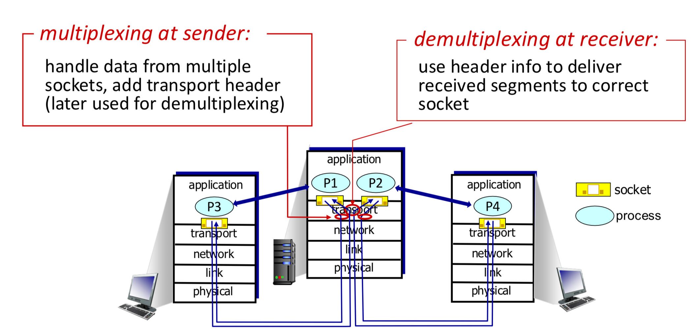
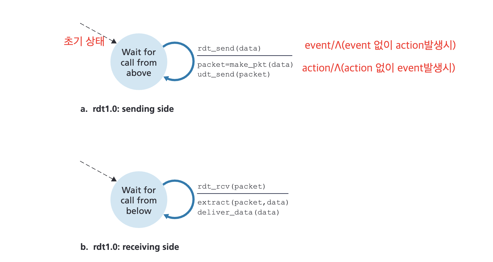
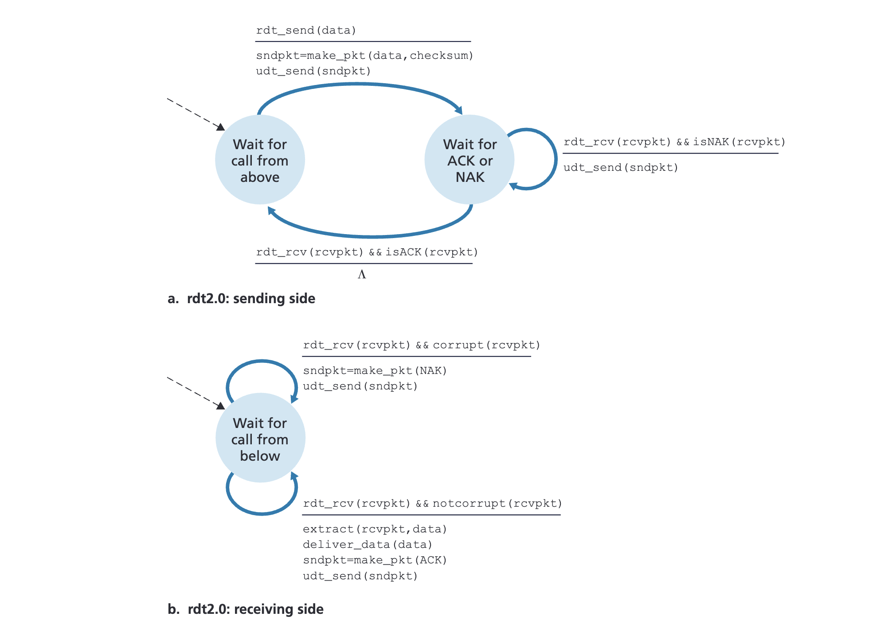
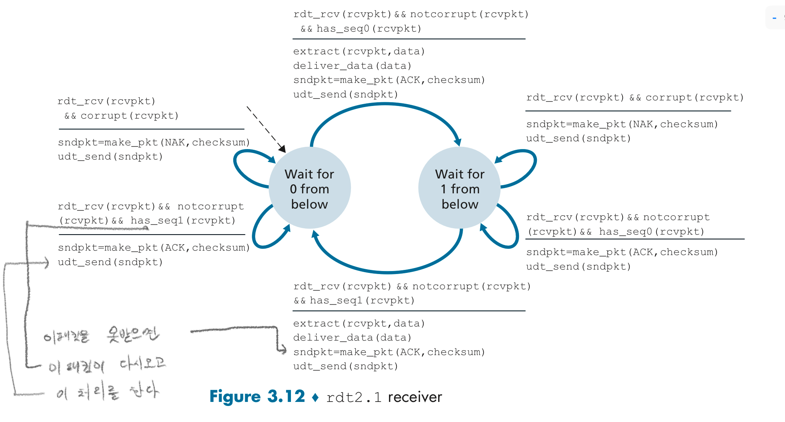
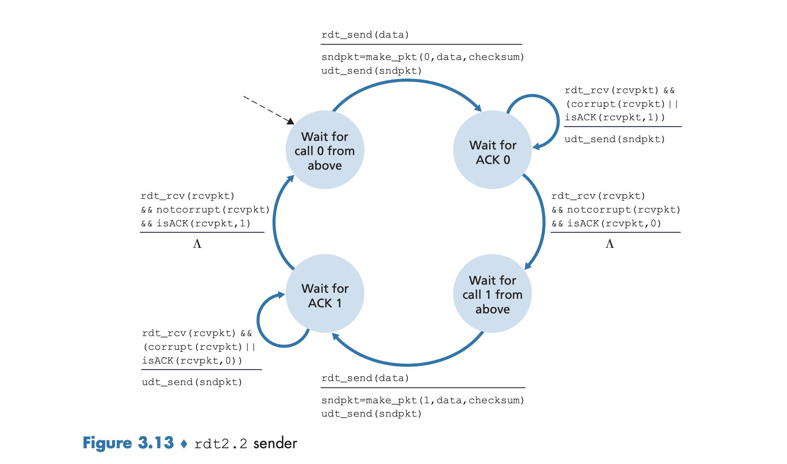
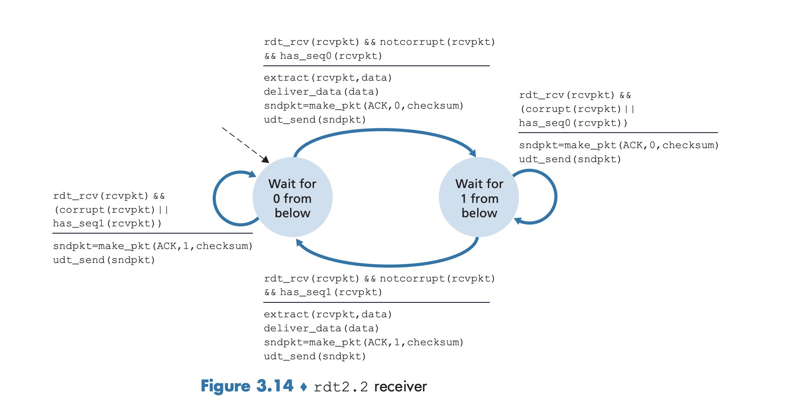
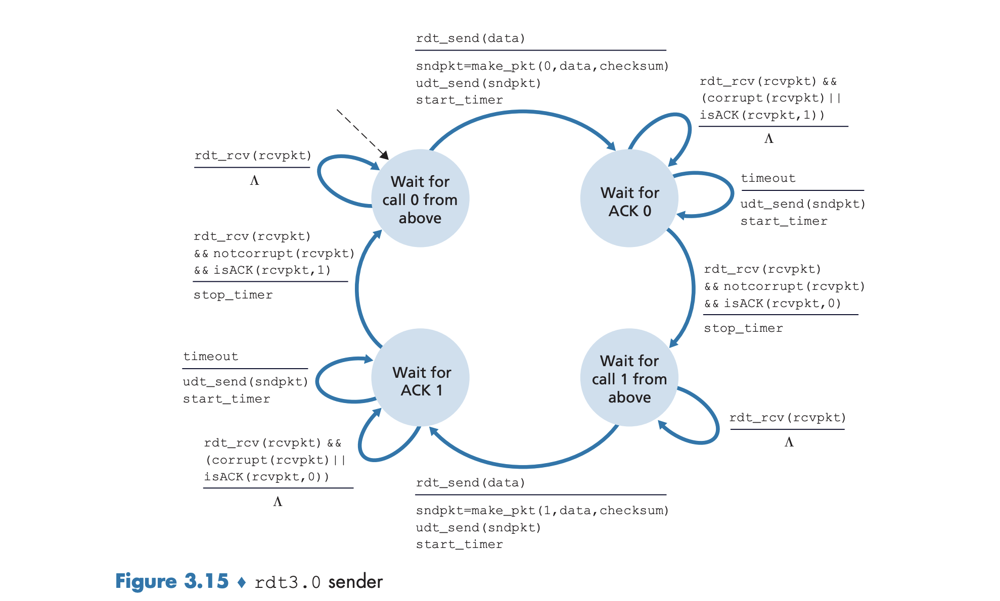
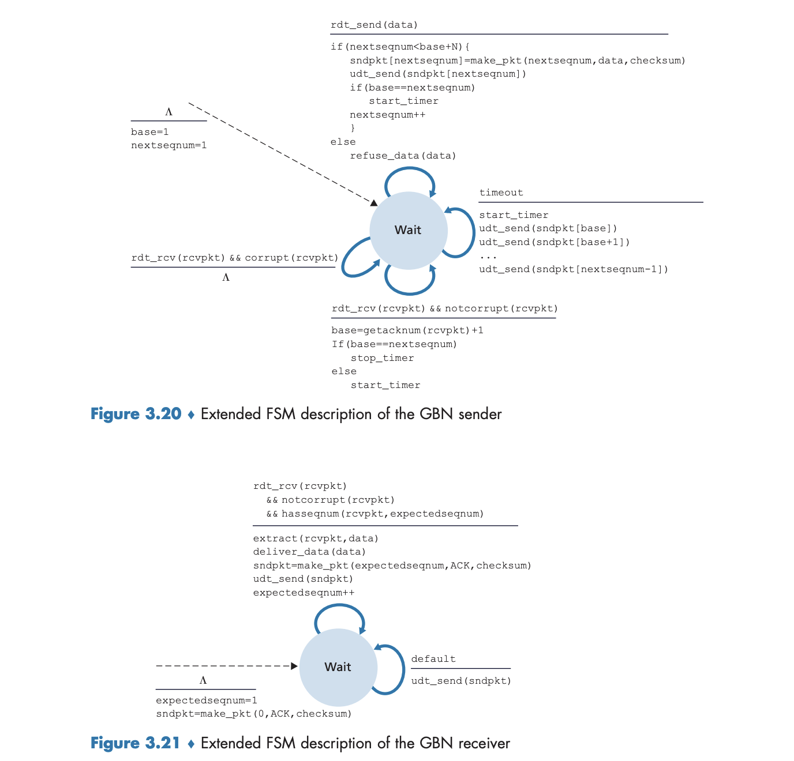

packet 이름 : segment

> udp 의 패킷을 특수하게 네트워크 계층에서 사용하는 패킷의 이름인 datagram 이라는 이름을 사용할 때도 있다

### 개괄

**udp, tcp 공통 기능**
- 프로세스대 프로세드 데이터 전달(multiplexing, demultiplexing)
- 오류 검출(check sum)

**tcp 특수 기능** 
- 신뢰적인 데이터 전송
	- 흐름제어
	- 순서번호
	- 확인응답
	- 타이머
- 혼잡제어

### 프로세스대 프로세드 데이터

트랜스포트 계층 다중화, 역 다중화 : 호스트대 호스트 전달을 프로세스대 프로세스 전달로 확장하는 과정

네트워크 소켓의 식별자 포멧
- transport -> socket (-> application(process)) : depmultiplexing 적절한 소켓으로 데이터를 전송 : 분리하는 과정
- socket -> transport (-> network) : multiplexing 소켓으로 부터 받은 데이터를 패킷화(segment) 해서 아래 계층으로 보낸다

udp 식별자
- source port
- destination port

> 상황 : udp 소켓 `19157`을 가진 호스트 A 의 프로세스가 호스트 B 의 UDP 소켓 `46428`을 가진 프로세스에게 애플리케이션 데이터 전송을 원한다고 가정하자. 

> 호스트 A 의 트랜스포트 계층은 애츨리케이션 데이터, 출발지 포트 번호(19157), 목적지 포트번호(46428), 그리고 2개의 다른값 #ModificationRequired 을 포함하는 트랜스포트계층 세그먼트를 생성한다.  
> 트랜스포트 계층은 만들어진 세그먼트를 네트워크 계층으로 전달한다.
> 네트워크 계층은 세그먼트를 IP 데이터그램으로 캡술화하고 best-effort 서비스로 수신 호스트로 전달한다.
> ... 이동중 ...
> 수신호스트에서 네트워크 계층에서 받은 segment는  트랜스포트계층에서 목적지 포트번호 46428을 검사하고 그 세그먼트를 포트 46428로 식별되는 소켓에 전달한다

- 호스트 A의 소켓: `(A의 IP 주소, 19157)`
- 호스트 B의 소켓: `(B의 IP 주소, 46428)`

### checksum
헤더의 checksum 필드는은 16비트로 이루어져있음

송신자는 data의 모든 16비트 워드의 합산에 대해 다시 1의 보수를 수행해서 checksum 에 넣는다
합산시에는 윤회식 합산(wrap around)를 수행한다

수신자는 data의 모든 16비트 워드합산과 checksum 을 합치면 1111111111111111 이 나오면 오류가 없다고 판단한다(0이 한개라도 있으면 오류가 발생했다고 판단한다)

### 신뢰적인 data전송
#### rdt 1.0

> 완벽하게 신뢰적인 채널 상에서의 데이터 전송

- 비트오류 없음
- 패킷로스가 없음

#### rdt 2.0 (전송 후 대기 stop-and-wait)

> 비트 오류가 있는 채널상에서의 신뢰적인 데이터 전송

- 패킷로스가 없음

필요기능
- 오류검출
- 수신자 피드백
- 재전송

긍정확인응답(ACK), 부정확인응답(NAK)

만약 ack, nak 응답자체가 훼손되었을 경우는 어떻게 하는가?
##### rdt 2.1

- 체크섬(checksum) 비트를 충분히 추가하여 송신자가 수신된 패킷의 오류를 검출할 뿐만 아니라, 오류를 직접 수정할 수 있도록 합니다.
- 송신자는 ack, nak 를 받지 않는 모든 패킷을 재전송 한다 **중복 패킷 처리 문제** 수신자는 ACK 또는 NAK가중복된 데이터 패킷이 도착할 가능성이 있습니다.

데이터 패킷에 새로운 필드를 추가하고 필드안에 순서번호(sequence number)를 삽입하는 방식으로 데이터 패킷에 송신자가 번호를 붙이는 것이다
1개의 비트 즉 2개의 상태번호만 있으면 된다

2.0 상태에서 2배 크기의 fsm 이다 sequence number 개수로 인해

nak 대신 이전패킷의 비정상 수신의 ack 를 보내도 되지 않을까?
nak 대신 last recived ok
#### rdt 2.2
ack 자체에 순서번호(sequence number)를 포함해서 보내도록 하고 nak 는 필요없다  

### rdt3.0 (alternating-bit protocol)

 > 비트 오류와 패킷로스가 있는 채널상에서의 신뢰적인 데이터 전송

rdt3.0 송신자 측에서 (오류 발생이나 이전 패킷에) 대한 ack 가 발생하면 바로 재전송하지 않고   timeout 까지 기다리고 그렇게 하는 이유가 2번 연속으로 보내는 경우가 발생할 수 있다 인데 이것의 예시가 떠오르지 않아 질문드립니다

### pipelining

필요기능 :  
sequence number 의 범위가 커져야 한다  
프로토콜의 송신측과 수신측은 패킷 1개 이상을 버퍼링 해야 한다

**L (Packet Size)** : 패킷의 크기(packet size)  
**R (Transmission Rate)** : 송신 속도 (1Gbps)  
**RTT (Round-Trip Time)** : 데이터 패킷이 발신자에서 수신자로 전달된 후, ACK가 다시 발신자에게 돌아오는 데 걸리는 전체 왕복 시간  

#### GBN (go back N)
**특정 조건에서 송신자가 이미 전송한 여러 패킷(N개)을 다시 전송해야 하는 특징**

#### Selective Repeat (SR)
**손실된 패킷만 재전송하는 특징**

### 🔄 **1. GBN vs SR: 개요 요약**

| 항목 | Go-Back-N (GBN) | Selective Repeat (SR) |
|------|------------------|------------------------|
| **ACK 방식** | 누적적 ACK (Cumulative ACK) | 개별 ACK |
| **패킷 재전송** | 타임아웃된 패킷부터 window 내 모든 패킷 재전송 | 오직 손실/에러 난 패킷만 재전송 |
| **Receiver 버퍼링** | 불필요 (out-of-order 패킷 모두 폐기) | 필요 (out-of-order 패킷 저장 후 순서 정렬) |
| **Window 크기 제한** | N (window size) | 최대 2^k-1 / 2 (sequence number space 절반) |

---

#### 🧱 **2. 시나리오 설정 (공통)**

- **최대 SEQ 번호**: 7 (즉, k=3 bits)
- **Window Size (N)**: 4
- **전송해야 할 패킷**: pkt0, pkt1, pkt2, pkt3, pkt4, pkt5
- **pkt2 유실**
- **ACK 수신 순서**: ACK0, ACK1, ACK2 지연됨 → timeout 발생

---

#### 🟩 **3. Go-Back-N (GBN) 시뮬레이션**

###### ✅ **Sender 측**

| Event | Window (base ~ nextseqnum - 1) | Sent Packets | Status | Notes |
|-------|-------------------------------|---------------|--------|-------|
| 초기 상태 | [0, 0] | 없음 | 대기 | base = 0, nextseqnum = 0 |
| rdt_send(data0) | [0, 0] → [0, 0] | pkt0 보냄 | 전송 | nextseqnum = 1 |
| rdt_send(data1) | [0, 1] | pkt1 보냄 | 전송 | nextseqnum = 2 |
| rdt_send(data2) | [0, 2] | pkt2 보냄 | 전송 | nextseqnum = 3 |
| rdt_send(data3) | [0, 3] | pkt3 보냄 | 전송 | nextseqnum = 4 |
| ACK0 수신 | [1, 3] | - | base = 1 | 타이머 재시작 |
| ACK1 수신 | [2, 3] | - | base = 2 | 타이머 재시작 |
| Timeout (pkt2 미수신) | [2, 3] | pkt2~pkt3 재전송 | 재전송 | 타이머 리셋 |
| ACK2 수신 | [3, 3] | - | base = 3 | 타이머 중지 |
| ACK3 수신 | [4, 3] → [4, 4] | - | base = 4 | 다음 패킷 보낼 수 있음 |

> 🔁 **GBN 특징**: 누적 ACK를 기준으로 window sliding하며, 한번 유실되면 window 내 모든 패킷 재전송.

---

###### ❌ **Receiver 측**

| 수신 패킷 | expectedseqnum | 결과 | ACK 전송 |
|-----------|----------------|------|------------|
| pkt0 | 0 | in-order | ACK0 |
| pkt1 | 1 | in-order | ACK1 |
| pkt3 | 2 | out-of-order | ACK1 재전송 |
| pkt4 | 2 | out-of-order | ACK1 재전송 |
| pkt5 | 2 | out-of-order | ACK1 재전송 |
| pkt2 | 2 | in-order (마침내) | ACK2 전송 |
| pkt3 | 3 | in-order | ACK3 전송 |
| pkt4 | 4 | in-order | ACK4 전송 |
| pkt5 | 5 | in-order | ACK5 전송 |

> ⚠️ **GBN Receiver**: 잘못된 순서의 패킷은 무시하고 마지막으로 받은 in-order 패킷에 대한 ACK 계속 송신.

---

#### 🟦 **4. Selective Repeat (SR) 시뮬레이션**

##### ✅ **Sender 측**

| Event | Window (base ~ nextseqnum - 1) | Sent Packets | Status | Notes |
|-------|-------------------------------|---------------|--------|-------|
| 초기 상태 | [0, 0] | 없음 | 대기 | base = 0, nextseqnum = 0 |
| rdt_send(data0) | [0, 0] → [0, 0] | pkt0 보냄 | 전송 | nextseqnum = 1 |
| rdt_send(data1) | [0, 1] | pkt1 보냄 | 전송 | nextseqnum = 2 |
| rdt_send(data2) | [0, 2] | pkt2 보냄 | 전송 | nextseqnum = 3 |
| rdt_send(data3) | [0, 3] | pkt3 보냄 | 전송 | nextseqnum = 4 |
| ACK0 수신 | [1, 3] | - | base = 1 | 타이머 재시작 |
| ACK1 수신 | [2, 3] | - | base = 2 | 타이머 재시작 |
| ACK3 수신 | [2, 3] | - | 아직 base = 2 | pkt2는 미수신 |
| Timeout (pkt2) | [2, 3] | pkt2 재전송 | only pkt2 재전송 | 타이머 리셋 |
| ACK2 수신 | [3, 3] | - | base = 3 | 모든 ack 받음 |
| rdt_send(data4) | [3, 4] | pkt4 보냄 | 전송 | nextseqnum = 5 |

> 📦 **SR 특징**: 누적 ACK 아님 → 각각의 패킷에 대해 독립적으로 확인 가능. loss가 하나뿐이라면 그 하나만 재전송.

---

##### ✅ **Receiver 측**

| 수신 패킷 | expectedseqnum | 결과 | ACK 전송 | 버퍼 내용 |
|-----------|----------------|------|------------|-------------|
| pkt0 | 0 | in-order | ACK0 | - |
| pkt1 | 1 | in-order | ACK1 | - |
| pkt3 | 2 | out-of-order | ACK3 | pkt3 save |
| pkt4 | 2 | out-of-order | ACK4 | pkt4 save |
| pkt5 | 2 | out-of-order | ACK5 | pkt5 save |
| pkt2 | 2 | in-order | ACK2 | pkt3, pkt4, pkt5 deliver 가능 |
| (after ACK2) | 6 | - | - | buffer empty |

> 💡 **SR Receiver**: out-of-order 패킷을 버퍼링하여 순서 복구 후 일괄 전달 (in-order delivery)

---

#### 📊 **5. 주요 비교 요약**

| 항목 | Go-Back-N | Selective Repeat |
|------|-----------|------------------|
| **ACK 종류** | 누적 ACK | 개별 ACK |
| **재전송 범위** | window 내 전체 | 손실된 패킷만 |
| **Receiver 버퍼** | 필요 없음 | 필요함 |
| **채널 효율성** | packet error 많으면 낮음 | packet error 많아도 높음 |
| **복잡도** | 낮음 | 높음 |
| **사용 예** | UDP 기반 간단한 RDT | TCP (유사 구조) |

---

#### 🧾 **결론**

- **GBN**은 **간단하지만 비효율적**입니다. 하나의 패킷 유실 시 window 내 모든 패킷을 다시 보내야 해서 네트워크 과부하를 유발할 수 있습니다.
- **SR**은 **더 복잡하지만 효율적**입니다. 손실된 패킷만 재전송하고, receiver 측에서 out-of-order 패킷을 적절히 버퍼링하여 순서 정렬 후 전달합니다.

### RTT

Sample RTT 대략적인 RTT

#### RTT 문제
아래는 **Exponential Weighted Moving Average (EWMA)**와 관련된 TCP의 Round-Trip Time (RTT) 추정 및 Timeout Interval 계산을 다루는 문제 3개입니다. 각 문제는 초기값과 샘플 데이터를 제공하며, 여러분이 주어진 공식을 적용하여 값을 계산하도록 설계되었습니다.

---

##### **문제 1: EstimatedRTT 계산**
**주어진 정보:**
- 초기 EstimatedRTT = 100ms
- α (가중치 계수) = 0.125 (즉, \( $\alpha = 1/8$ \))
- SampleRTT 값:
  - 첫 번째 SampleRTT = 120ms
  - 두 번째 SampleRTT = 90ms
  - 세 번째 SampleRTT = 110ms

**질문:**
1. 첫 번째 SampleRTT를 기반으로 업데이트된 EstimatedRTT를 계산하세요. 
2. 두 번째 SampleRTT를 기반으로 다시 업데이트된 EstimatedRTT를 계산하세요. 
3. 세 번째 SampleRTT를 기반으로 최종 EstimatedRTT를 계산하세요.

---

##### **문제 2: DevRTT (RTT 변동성) 계산**
**주어진 정보:**
- 초기 DevRTT = 0ms
- β (가중치 계수) = 0.25
- 위에서 계산한 EstimatedRTT 값들:
  - 첫 번째 EstimatedRTT = 101.25ms
  - 두 번째 EstimatedRTT = 100.625ms
  - 세 번째 EstimatedRTT = 101.094ms
- SampleRTT 값:
  - 첫 번째 SampleRTT = 120ms
  - 두 번째 SampleRTT = 90ms
  - 세 번째 SampleRTT = 110ms

**질문:**
1. 첫 번째 SampleRTT를 기반으로 업데이트된 DevRTT를 계산하세요.
2. 두 번째 SampleRTT를 기반으로 다시 업데이트된 DevRTT를 계산하세요.
3. 세 번째 SampleRTT를 기반으로 최종 DevRTT를 계산하세요.

---

##### **문제 3: TimeoutInterval 계산**
**주어진 정보:**
- 위에서 계산한 최종 EstimatedRTT = 101.094ms
- 위에서 계산한 최종 DevRTT = 2.34375ms
- TimeoutInterval 공식:
  $\text{TimeoutInterval} = \text{EstimatedRTT} + 4 \cdot \text{DevRTT}$

**질문:**
1. 최종 TimeoutInterval을 계산하세요.
2. 만약 Timeout이 발생했다면, TimeoutInterval은 어떻게 업데이트되나요? (초기 TimeoutInterval = 1초)
3. Timeout 이후에 새로운 SampleRTT = 105ms가 측정되었고, EstimatedRTT와 DevRTT가 업데이트되었다고 가정할 때, TimeoutInterval을 재계산하세요.

---

##### **풀이 방법 안내**
1. **EstimatedRTT 계산**: 아래 공식을 사용합니다.
   $\text{EstimatedRTT} = (1 - \alpha) \cdot \text{EstimatedRTT} + \alpha \cdot \text{SampleRTT}$
2. **DevRTT 계산**: 아래 공식을 사용합니다.
   $\text{DevRTT} = (1 - \beta) \cdot \text{DevRTT} + \beta \cdot |\text{SampleRTT} - \text{EstimatedRTT}|$
3. **TimeoutInterval 계산**: 아래 공식을 사용합니다.
   $\text{TimeoutInterval} = \text{EstimatedRTT} + 4 \cdot \text{DevRTT}$

---

##### **힌트**
- 계산 과정에서 소수점 처리를 정확히 해야 합니다.
- TimeoutInterval이 두 배로 증가하는 경우는 Timeout이 발생했을 때만 해당됩니다.
- 모든 계산은 단계별로 진행하고, 중간 결과를 기록하세요.

---

##### **예상 답안 형식**
###### **문제 1 예시 답안:**
1. 첫 번째 EstimatedRTT:
   $\text{EstimatedRTT} = 0.875 \cdot 100 + 0.125 \cdot 120 = 101.25 \, \text{ms}$
2. 두 번째 EstimatedRTT:
   $\text{EstimatedRTT} = 0.875 \cdot 101.25 + 0.125 \cdot 90 = 100.625 \, \text{ms}$
3. 세 번째 EstimatedRTT:
   $\text{EstimatedRTT} = 0.875 \cdot 100.625 + 0.125 \cdot 110 = 101.094 \, \text{ms}$

###### **문제 2 예시 답안:**
1. 첫 번째 DevRTT:
   $\text{DevRTT} = 0.75 \cdot 0 + 0.25 \cdot |120 - 101.25| = 2.5 \, \text{ms}$
2. 두 번째 DevRTT:
   $\text{DevRTT} = 0.75 \cdot 2.5 + 0.25 \cdot |90 - 100.625| = 2.1875 \, \text{ms}$
3. 세 번째 DevRTT:
   $\text{DevRTT} = 0.75 \cdot 2.1875 + 0.25 \cdot |110 - 101.094| = 2.34375 \, \text{ms}$

###### **문제 3 예시 답안:**
1. 최종 TimeoutInterval:
   $\text{TimeoutInterval} = 101.094 + 4 \cdot 2.34375 = 110.5875 \, \text{ms}$
2. Timeout 발생 시:
   $\text{TimeoutInterval} = 2 \cdot 110.5875 = 221.175 \, \text{ms}$
3. Timeout 이후 재계산:
   (새로운 EstimatedRTT와 DevRTT를 기반으로 다시 계산)

---

이 문제들은 EWMA와 TCP 타임아웃 메커니즘을 이해하고 실제 계산 능력을 테스트하기 위해 설계되었습니다. 문제를 풀면서 주어진 공식을 잘 적용해 보세요! 😊

### TCP

#### TCP의 기본 동작 원리**
TCP는 세 가지 주요 이벤트를 처리하며, 각 이벤트에 따라 특정 작업을 수행합니다:

##### **(1) 애플리케이션으로부터 데이터 수신**
- TCP는 애플리케이션 계층으로부터 데이터를 받아 이를 TCP 세그먼트로 캡슐화합니다.
- 각 세그먼트에는 시퀀스 번호(sequence number)가 포함됩니다. 이는 세그먼트 내 첫 바이트의 바이트 스트림 번호를 나타냅니다.
- 타이머가 이미 실행 중이 아니라면, 세그먼트를 IP 계층으로 전달할 때 타이머를 시작합니다.

##### **(2) 타임아웃 발생**
- 타임아웃이 발생하면, TCP는 해당 세그먼트를 재전송합니다.
- 이후 타이머를 다시 시작합니다.

##### **(3) ACK(Acknowledgment) 수신**
- 수신자로부터 ACK가 도착하면, TCP는 ACK 필드 값 `y`와 `SendBase`를 비교합니다.
  - `SendBase`: 가장 오래된 미확인 바이트의 시퀀스 번호.
  - `y > SendBase`라면, 하나 이상의 세그먼트가 성공적으로 전달되었음을 의미합니다.
  - TCP는 `SendBase`를 업데이트하고, 아직 확인되지 않은 세그먼트가 남아 있다면 타이머를 다시 시작합니다.

#### **TCP의 신뢰성 보장 메커니즘**
TCP는 데이터 전송의 신뢰성을 보장하기 위해 다양한 기법을 사용합니다. 이 과정에서 TCP는 **Go-Back-N(GBN)**과 **Selective Repeat(SR)** 프로토콜의 특징을 혼합한 하이브리드 방식으로 동작합니다. 이를 아래와 같이 상세히 설명하겠습니다.

---

##### **(1) 타임아웃 및 재전송**
- TCP는 각 세그먼트에 대해 **타임아웃 간격(`TimeoutInterval`)** 을 설정합니다.
  - `TimeoutInterval`은 `EstimatedRTT`(예상 왕복 시간)과 `DevRTT`(왕복 시간 편차)를 기반으로 계산됩니다.
  - 만약 특정 세그먼트에 대한 ACK가 타임아웃 내에 도착하지 않으면, 해당 세그먼트를 **재전송**합니다.
  - **지수 백오프 알고리즘**: 타임아웃이 발생할 때마다 다음 타임아웃 간격은 이전 값의 두 배로 설정됩니다. 예를 들어, 초기 타임아웃 간격이 0.75초라면, 첫 번째 재전송 후에는 1.5초, 두 번째 재전송 후에는 3.0초로 증가합니다. 이는 네트워크 혼잡 상태를 완화하기 위한 제한된 형태의 혼잡 제어입니다.

---

##### **(2) 누적 ACK(Cumulative Acknowledgment)**
- TCP는 기본적으로 **누적 ACK 방식**을 사용하여 수신자가 받은 데이터를 확인합니다.
  - 예: 수신자가 `ACK = y`를 보내면, 이는 "바이트 번호 `y` 이전의 모든 데이터가 성공적으로 수신되었음"을 의미합니다.
  - 이를 통해 송신자는 손실된 세그먼트를 빠르게 감지하고 재전송할 수 있습니다.
  - **하이브리드 특징**: 일부 TCP 구현은 순서가 맞지 않는(out-of-order) 세그먼트를 버퍼링하며, 선택적 ACK(SACK, Selective Acknowledgment) [RFC 2018]를 사용하여 특정 세그먼트를 개별적으로 ACK할 수 있습니다. 이를 통해 SR 스타일의 선택적 재전송이 가능해집니다.

---

##### **(3) 단일 타이머 관리**
- 효율성을 위해 TCP는 **단일 타이머**만 사용합니다.
  - 이 타이머는 가장 오래된 미확인 세그먼트와 연결됩니다.
  - 새로운 ACK가 도착하거나 타임아웃이 발생하면 타이머를 조정합니다.
  - **Fast Retransmit**: 타임아웃을 기다리지 않고도 중복 ACK(duplicate ACK)를 활용하여 손실된 세그먼트를 빠르게 재전송할 수 있습니다. 예를 들어, 동일한 ACK가 3번 이상 도착하면 송신자는 해당 세그먼트가 손실되었음을 판단하고 즉시 재전송합니다.

---

#### **TCP는 GBN인가, SR인가?**
TCP의 에러 복구 메커니즘은 **GBN**과 **SR**의 혼합형이라고 할 수 있습니다. 이를 구체적으로 살펴보겠습니다:

##### **(1) GBN과 유사한 특징**
- TCP는 누적 ACK를 사용하며, 중간에 손실된 세그먼트가 있더라도 이후 세그먼트를 개별적으로 ACK하지 않습니다.
- TCP 송신자는 가장 오래된 미확인 바이트(`SendBase`)와 다음에 보낼 바이트(`NextSeqNum`)만 추적합니다. 이는 GBN의 특징과 유사합니다.

##### **(2) SR과 유사한 특징**
- 일부 TCP 구현은 순서가 맞지 않는 세그먼트를 버퍼링합니다. 이는 SR의 핵심 특징 중 하나입니다.
- 예를 들어, 송신자가 세그먼트 1, 2, ..., N을 전송했고, 세그먼트 n의 ACK가 손실되었지만 나머지 ACK가 타임아웃 전에 도착했다고 가정합니다. 이 경우:
  - GBN은 세그먼트 n부터 모든 세그먼트(n, n+1, ..., N)를 재전송합니다.
  - TCP는 최대 한 개의 세그먼트(n)만 재전송하며, 세그먼트 n+1의 ACK가 타임아웃 전에 도착했다면 세그먼트 n조차 재전송하지 않을 수 있습니다.

##### **(3) 선택적 ACK(SACK)**
- 선택적 ACK(SACK)를 사용하면 수신자가 특정 세그먼트를 개별적으로 ACK할 수 있습니다.
- 이를 통해 송신자는 이미 수신된 세그먼트를 재전송하지 않으며, SR 스타일의 선택적 재전송이 가능해집니다.

---

#### **결론**
TCP의 에러 복구 메커니즘은 기본적으로 **GBN 스타일**로 동작하지만, **SACK**와 **Fast Retransmit**을 통해 **SR 스타일**의 기능을 추가로 제공합니다. 따라서 TCP는 **GBN과 SR의 하이브리드 모델**로 분류됩니다.

**핵심 요약**:
- 기본적으로 GBN과 유사: 누적 ACK, 단일 타이머 사용.
- 선택적 ACK(SACK)와 Fast Retransmit을 통해 SR의 장점을 통합.
- 결과적으로 TCP는 GBN과 SR의 장점을 결합한 유연한 프로토콜입니다.
- 

### 3way handshake vs 2way handshake
2-Way Handshake의 문제를 설명한 내용을 다시 정리하고, 핵심적인 문제점과 그로 인해 발생하는 상황을 상세히 설명하겠습니다.

---

#### **2-Way Handshake의 동작 방식**
2-Way Handshake는 연결 설정을 위해 두 번의 메시지 교환만으로 완료됩니다:
1. 클라이언트 → 서버: SYN(연결 요청)
2. 서버 → 클라이언트: ACK(연결 수락)

이 과정에서 서버는 클라이언트의 연결 요청(SYN)을 받고, 즉시 연결이 확립되었다고 간주합니다. 하지만 이 방식은 신뢰성 있는 연결 설정을 보장하지 못하며, 특히 네트워크 지연이나 중복 패킷(Duplicate Packet)로 인해 문제가 발생할 수 있습니다.

---

#### **문제 발생 시나리오**

##### **시나리오: Old Duplicate SYN 패킷**
1. **클라이언트가 서버에 연결 요청(SYN)을 보냄**
   - 클라이언트는 서버와의 연결을 위해 SYN 패킷을 전송합니다.
   - 그러나 이 패킷은 네트워크 지연 또는 손실로 인해 서버에 도착하지 않거나, 재전송되며 지연됩니다.
   
2. **서버가 SYN 패킷을 수신하고 연결 수락(ACK)**
   - 서버는 클라이언트의 SYN 패킷을 수신하고, 연결 요청을 수락하기 위해 ACK 패킷을 클라이언트에게 전송합니다.
   - 이로써 서버는 연결이 성공적으로 확립되었다고 판단합니다.

3. **클라이언트와 서버가 데이터를 주고받으며 연결 종료**
   - 클라이언트와 서버는 데이터 통신을 완료하고 연결을 종료합니다.
   - 클라이언트는 더 이상 해당 연결을 사용하지 않습니다.

4. **지연된 SYN 패킷이 서버에 도착**
   - 초기에 전송되었던 SYN 패킷이 네트워크 지연으로 인해 이제야 서버에 도착합니다.
   - 서버는 이 패킷을 새로운 연결 요청으로 오인합니다.

5. **서버가 잘못된 연결 상태를 유지**
   - 서버는 지연된 SYN 패킷에 대해 ACK를 전송하며, 새로운 연결이 확립되었다고 판단합니다.
   - 하지만 실제로 클라이언트는 이미 연결을 종료했으므로, 서버는 "상대방이 없는 커넥션"을 유지하게 됩니다.

---

#### **발생하는 문제**

##### **1. 하프 오픈(Half-Open) 상태**
- 서버는 연결이 활성화된 상태로 판단하고 리소스를 할당하지만, 클라이언트는 이미 연결을 종료한 상태입니다.
- 이로 인해 서버는 불필요한 자원을 낭비하며, "하프 오픈" 상태의 커넥션을 유지하게 됩니다.

##### **2. 데이터 송수신 실패**
- 서버는 클라이언트로부터 추가 데이터를 기다리지만, 클라이언트는 이미 연결을 종료했으므로 데이터를 보내지 않습니다.
- 결과적으로 서버는 데이터를 받지 못하고, 결국 타임아웃(Time-out) 후 연결을 강제로 종료해야 합니다.

##### **3. 재전송(Retransmission) 문제**
- 클라이언트는 초기 SYN 패킷이 서버에 도착하지 않았다고 판단하여 재전송을 시도할 수 있습니다.
- 이러한 재전송된 SYN 패킷이 서버에 도착하면, 서버는 이를 또 다른 새로운 연결 요청으로 오인할 가능성이 큽니다.
- 이로 인해 서버는 여러 개의 유효하지 않은 연결을 생성하며, 자원을 더욱 낭비하게 됩니다.

---

#### **왜 이런 문제가 발생할까?**
2-Way Handshake는 단순히 "요청 → 응답"의 구조로 동작하기 때문에, 연결 요청이 실제로 현재 유효한 요청인지 확인할 방법이 없습니다.  
특히 **네트워크 지연**이나 **중복 패킷**이 존재할 경우, 다음과 같은 이유로 문제가 발생합니다:
1. **Old Duplicate Packet 처리 불가능:** 2-Way Handshake는 지연된 패킷을 구분할 방법이 없어, 이를 새로운 연결 요청으로 오인합니다.
2. **상태 동기화 부족:** 클라이언트와 서버 간의 연결 상태가 완벽히 동기화되지 않아, 한쪽이 연결을 종료한 상태에서도 다른 쪽이 연결이 활성화된 것으로 판단할 수 있습니다.

---

#### **해결책: 3-Way Handshake**
3-Way Handshake는 2-Way Handshake의 문제를 해결하기 위해 추가적인 단계를 포함합니다:
1. **클라이언트 → 서버: SYN(연결 요청)**
2. **서버 → 클라이언트: SYN+ACK(연결 수락 및 확인 요청)**
3. **클라이언트 → 서버: ACK(최종 확인)**

이 과정에서 클라이언트와 서버는 서로의 상태를 명확히 동기화하며, 다음과 같은 장점을 제공합니다:
1. **Old Duplicate Packet 무시:** 지연된 SYN 패킷이 도착해도, 최종 ACK 단계가 없으면 연결이 확립되지 않습니다.
2. **상태 동기화 보장:** 클라이언트와 서버가 모두 연결 확립을 확인하므로, 하프 오픈 상태를 방지합니다.
3. **신뢰성 있는 연결 설정:** 재전송된 패킷을 유효하게 처리하거나 무시할 수 있어, 혼란을 줄입니다.

---

#### **결론**
2-Way Handshake는 간단하지만, 네트워크 지연 또는 중복 패킷으로 인해 문제가 발생할 수 있습니다. 특히, 하프 오픈 상태와 재전송 문제로 인해 서버 자원이 낭비되고, 데이터 송수신 실패 등의 문제가 생길 수 있습니다.  
따라서 TCP에서는 **3-Way Handshake**를 통해 신뢰성 있는 연결 설정을 보장하며, 이러한 문제를 효과적으로 해결합니다.

### TCP flow control and congestion control
- 목적1 : 혼잡제어
- 
