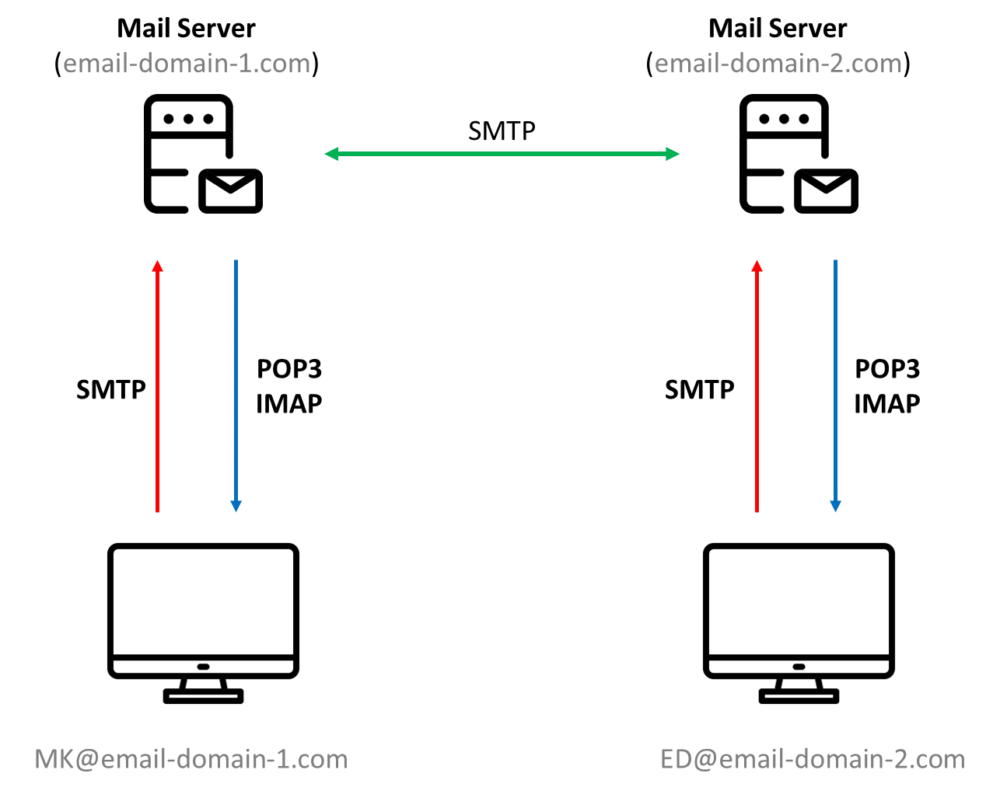

### **1. SMTP (Simple Mail Transfer Protocol)**

| 프로토콜      | 목적         | 주요 포트        | 특징                          |
| --------- | ---------- | ------------ | --------------------------- |
| SMTP      | 이메일 전송     | 25, 465, 587 | 메일 서버 간 또는 클라이언트-서버 간 메일 전달 |

- **목적**: 이메일 전송을 위한 프로토콜입니다. 메일 클라이언트에서 메일 서버로, 또는 메일 서버 간에 이메일을 전달하는 데 사용됩니다.
- **특징**:
  - TCP 기반의 7계층(응용 계층) 프로토콜입니다.
  - 메일 전송 과정에서 신뢰성 있는 연결(TCP)을 제공합니다.
  - 메일 전송자 → 메일 서버 → 수신자 메일 서버로의 경로를 책임집니다.
- **포트별 차이**:
  - **25번 포트**: 기본 SMTP 포트로, 서버 간 메일 전송에 주로 사용됩니다. 하지만 스팸 메일 문제로 인해 일부 ISP에서는 차단할 수 있습니다.
  - **465번 포트**: SSL/TLS 암호화를 사용한 SMTP 전송을 위해 사용되지만, 비공식적으로 사용되는 포트입니다.
  - **587번 포트**: 현재 표준으로 권장되는 포트로, 메일 클라이언트가 메일 서버로 이메일을 보내는 데 사용됩니다. STARTTLS 명령을 통해 암호화된 통신이 가능합니다.
- **사용 사례**:
  - Gmail, Outlook 등 메일 서비스 제공자가 사용.

---

### **2. SSH (Secure Shell)**

| 프로토콜      | 목적         | 주요 포트   | 특징                          |
| --------- | ---------- | ------- | --------------------------- |
| SSH       | 원격 서버 관리   | 22      | 암호화된 연결로 보안성 제공             |

- **목적**: 원격 서버에 안전하게 접속하고 관리하기 위한 프로토콜입니다.
- **특징**:
  - TCP 기반으로 데이터를 암호화하여 보안성을 제공합니다.
  - 원격 서버에서 명령어 실행, 터널링 등의 작업을 지원합니다.
  - 기본 포트는 **22번**
- **보안 강화**:
  - 패스워드 기반 인증 외에도 공개키/비밀키 기반 인증을 지원하여 보안성을 높입니다.
  - 중간자 공격(Man-in-the-Middle Attack) 방지 기능 포함.
- **사용 사례**:
  - 리눅스 서버 관리.
  - AWS, Google Cloud 등의 클라우드 서버에 접근.

---

### **3. WebSocket**

| 프로토콜      | 목적         | 주요 포트   | 특징                          |
| --------- | ---------- | ------- | --------------------------- |
| WebSocket | 실시간 양방향 통신 | 80, 443 | HTTP 기반 초기 연결, 이후 지속적 연결 유지 |

- **목적**: 실시간 양방향(full-duplex) 통신을 지원하는 프로토콜입니다.
- **특징**:
  - 초기 연결은 HTTP/HTTPS 프로토콜을 사용하지만, 이후 WebSocket 핸드셰이크 과정을 통해 지속적인 연결(Persistent Connection)을 유지합니다.
  - HTTP와 달리 요청-응답 방식이 아닌, 서버와 클라이언트 간 실시간 데이터 교환이 가능합니다.
  - 기본적으로 **80번(HTTP)**과 **443번(HTTPS)** 포트를 사용하므로 방화벽 우회가 용이합니다.
- **사용 사례**:
  - 채팅 애플리케이션(실시간 메시지 전송).
  - 실시간 주식 거래 플랫폼.
  - 온라인 게임에서의 실시간 데이터 동기화.

---

### **4. XRDP**
| 프로토콜 | 목적         | 주요 포트  | 특징                         |
| ---- | ---------- | ------ | -------------------------- |
| XRDP | 원격지 GUI 제어 | 3389   | RDP 기반으로 리눅스/Windows 모두 지원 |

- **목적**: 원격지에서 GUI 환경을 통해 서버를 제어하기 위한 프로토콜입니다.
- **특징**:
  - RDP(Remote Desktop Protocol)를 기반으로 하며, 리눅스 환경에서도 사용 가능하도록 구현되었습니다.
  - 기본 포트는 **3389번**이며, Windows의 RDP와 호환됩니다.
  - 원격지에서 마우스, 키보드 입력을 전달하고, 서버의 화면을 실시간으로 전송받습니다.
- **사용 사례**:
  - 리눅스 서버에 GUI 도구를 사용하여 접근.
  - 가상 데스크톱 환경에서 원격 작업 수행.

---

### **5. FTP (File Transfer Protocol)**

| 프로토콜      | 목적         | 주요 포트        | 특징                          |
| --------- | ---------- | ------------ | --------------------------- |
| FTP       | 파일 전송      | 20, 21       | 데이터 전송 신뢰성 보장, 기본 보안 취약     |
- **목적**: 파일 전송을 위한 프로토콜입니다.
- **특징**:
  - TCP 기반으로 데이터 전송의 신뢰성을 보장합니다.
  - 두 개의 포트를 사용합니다:
    - **21번 포트**: 제어 연결(Control Connection) - 명령어 및 인증 처리.
    - **20번 포트**: 데이터 연결(Data Connection) - 실제 파일 전송.
  - 기본적으로 암호화되지 않으므로 보안성이 취약합니다.
- **보안 강화**:
  - FTPS(File Transfer Protocol Secure): SSL/TLS를 사용하여 암호화.
  - SFTP(Secure File Transfer Protocol): SSH를 통해 암호화된 파일 전송.
- **사용 사례**:
  - 웹사이트 운영 시 파일 업로드/다운로드.
  - 대용량 파일 공유.