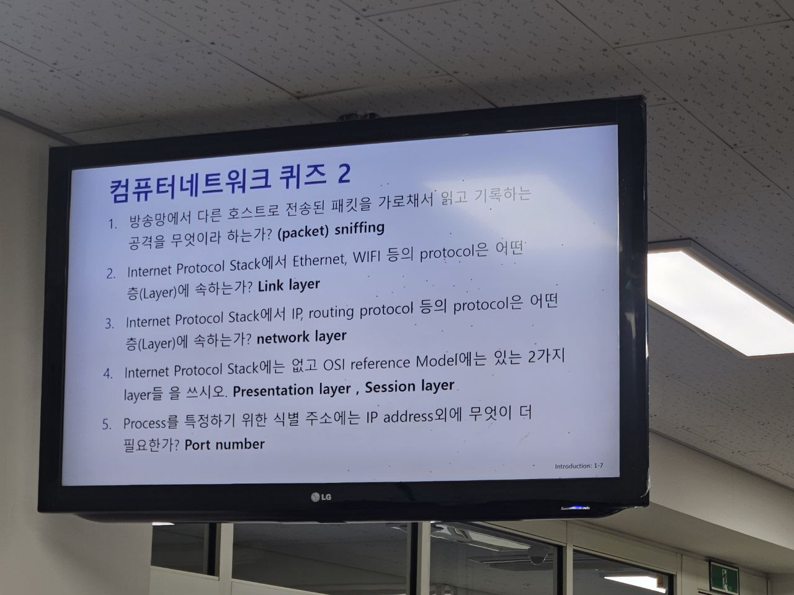
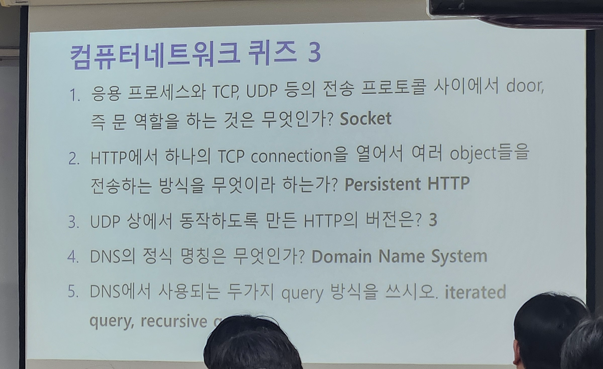
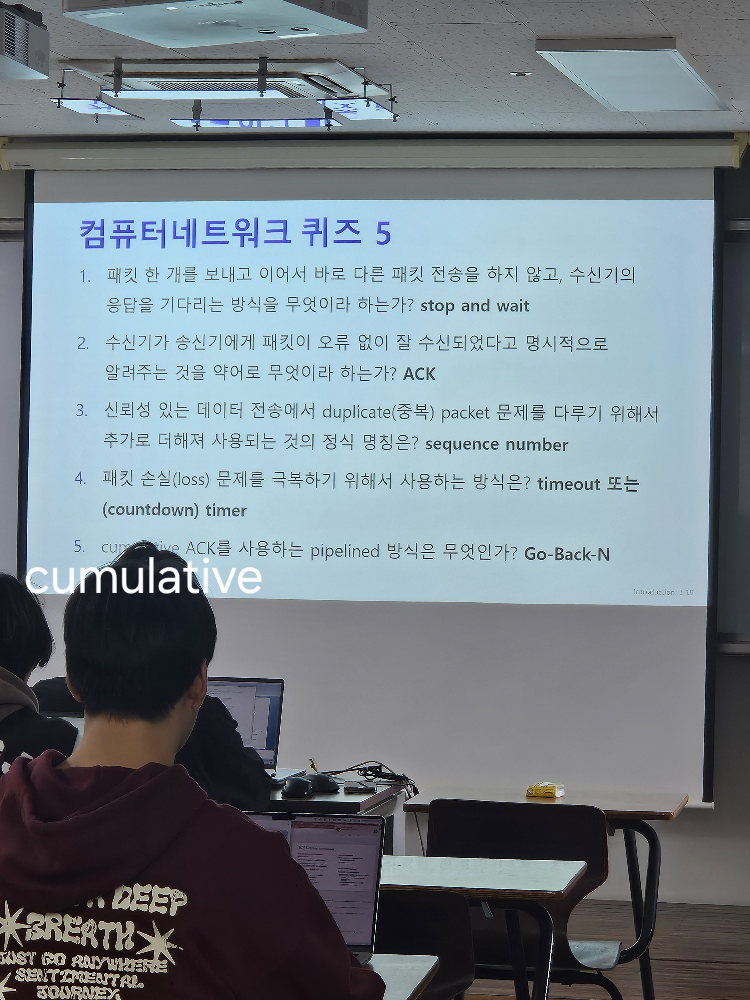
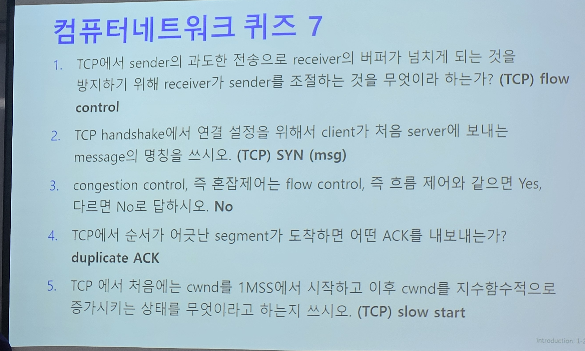
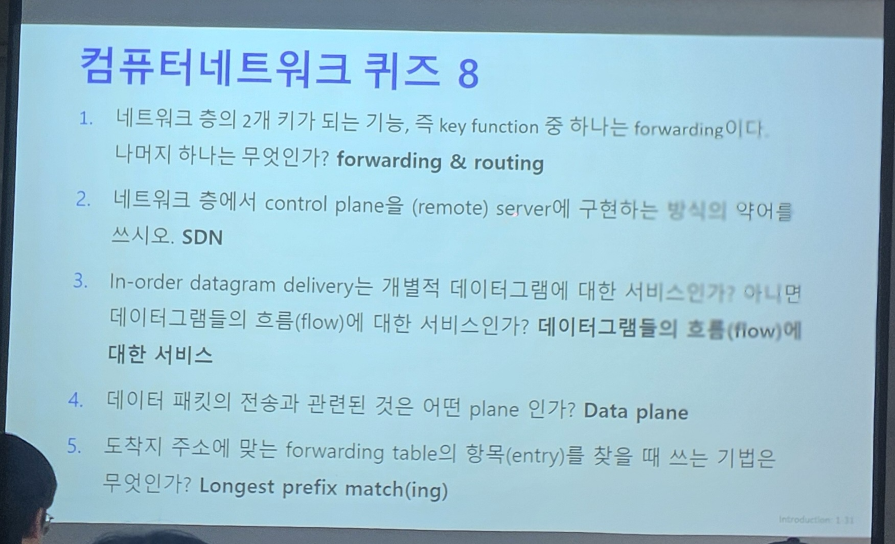
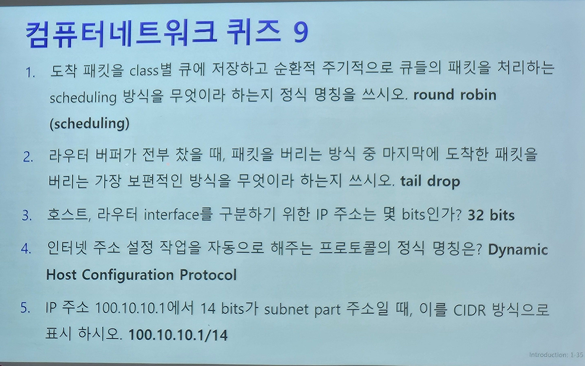
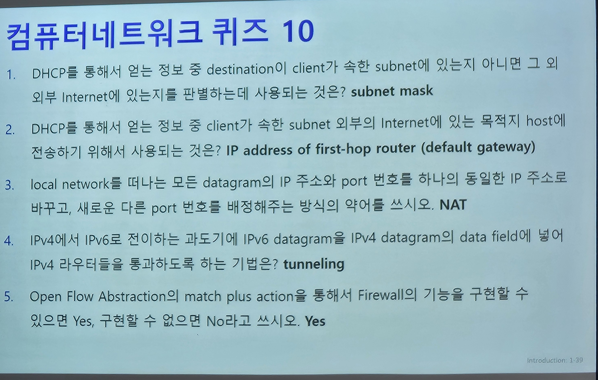
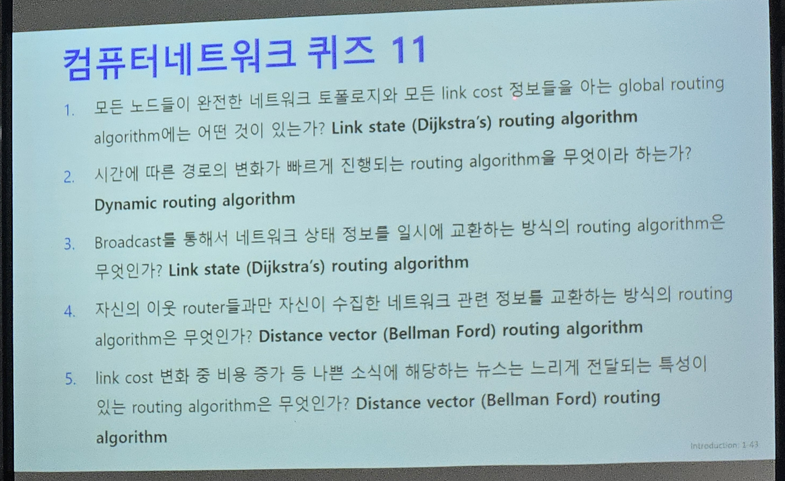
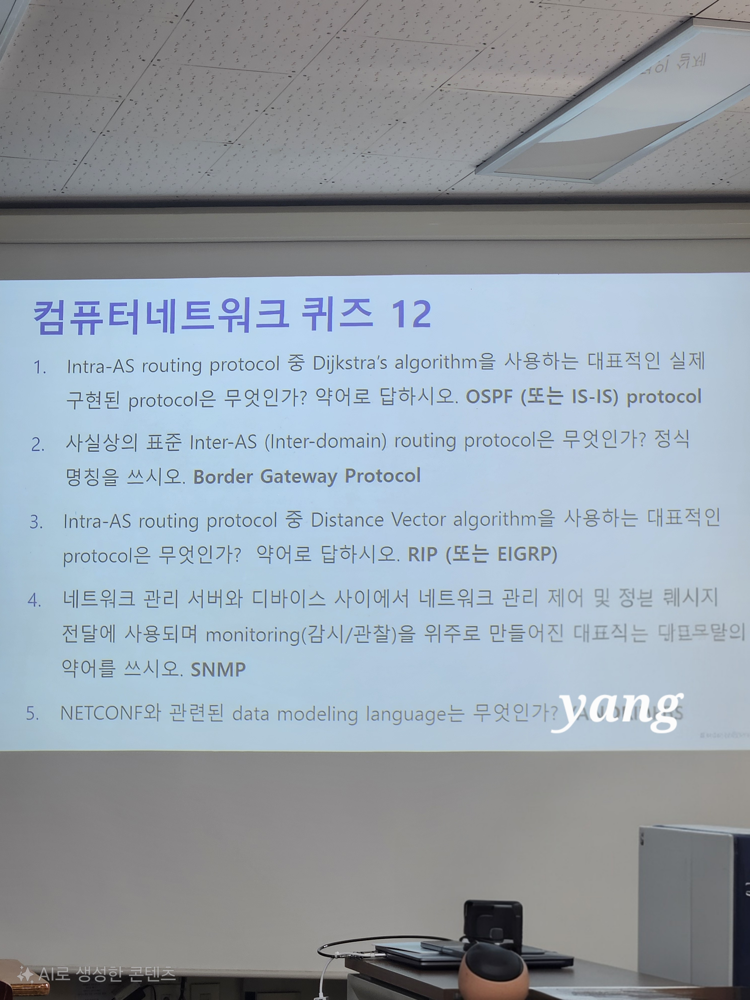

 

> 5번은 iterated query, recursive query 를 사용

### 중간고사

ack, nak : 비트 에러 대비용
seq : 순서 확인용
timeout : 패킷 손실 대비용

- tcp 에서 timeout 이 발생하면 timeout 이 발생한 패킷만 재전송한다( 잘 도착한 패킷은 버퍼링하기 때문에 필요없음 )
- GBN, SR 의 원형은 받은 패킷번호를 ack vs TCP 는 받고난후 다음에 받을 패킷번호를 ack
- TCP RENO
- 

32 - 14 = 18

18 -> 2\^18

NAT

(1).jpg)1. TDMA
RAandom access
csma/cd
binary ...
48