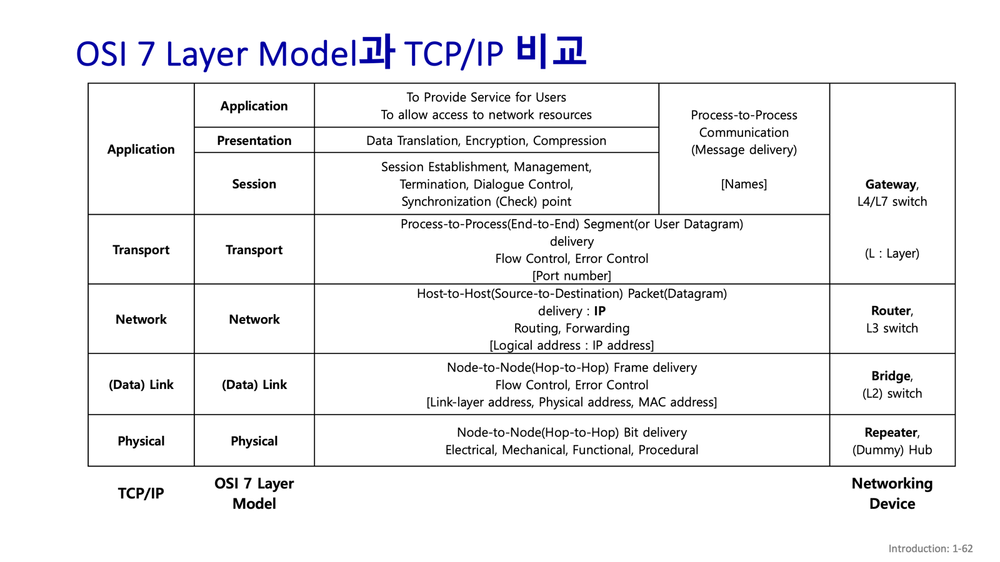

## 전송 4계층
### TCP

### 3계층

- FCFS
- Priority
- RR(round robin)
- weighted fair
- 

network neutality ( 망 중립성 )  
각 ISP 각 자원을 어떻게 분배할 것인가?  
- protecting free speech
- encouraging innovation, compatition
- 

link s

### chapter4

- 보장된 전달
- 지연 제한 이내의 보장된 전달
- 순서화 패킷 전달
- 최소 대역폭 보장
- 보안 서비스

