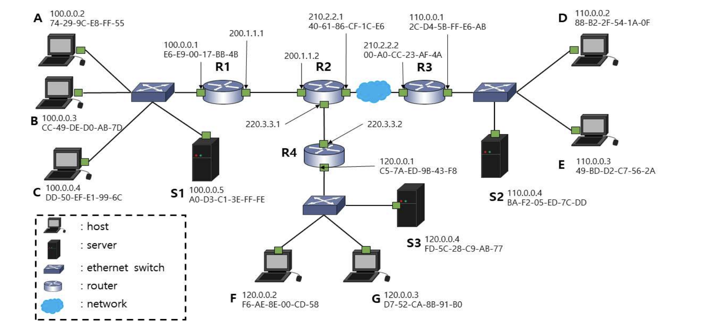

# 네트워크 라우터의 패킷 서비스 순서 문제

패킷 크기는 모두 동일하며, 다음 순서로 도착하여 큐에 이미 들어가 있다고 가정합니다:  
**P1, P2, P3, P4, P5, P6, P7, P8, P9, P10, P11, P12**

각 패킷은 아래와 같이 **클래스(Class)** 별로 분류되어 있습니다:

- **Class 1**: P2, P4, P7, P12
- **Class 2**: P3, P5, P10
- **Class 3**: P1, P6, P8, P9, P11

## 5. Round Robin Scheduling (5점)

- 서비스는 **Class 3 큐부터 시작**됩니다.
- 각 클래스 내부에서는 **패킷 번호 순서대로** 서비스가 진행됩니다.

### 요구사항:
Round Robin 스케줄링 방식에 따라 패킷이 **실제로 서비스되는 순서를 기술하시오**.


## 6. Weighted Fair Queueing (WFQ) Scheduling (5점)

- 각 클래스의 가중치:
  - Class 1: 3
  - Class 2: 2
  - Class 3: 4
- **패킷 전송 시간은 동일**하다고 가정합니다.
- **가중치 계산 결과가 동일한 경우**, **번호가 작은 패킷이 우선**으로 서비스됩니다.

### 요구사항:
WFQ 스케줄링 방식에 따라 패킷이 **실제로 서비스되는 순서를 기술하시오**.


각 스케줄링 기법에 따른 패킷 서비스 순서는 다음과 같습니다.

---

## 5. 라운드 로빈(Round Robin) 스케줄링

서비스 순서: **P1, P2, P3, P6, P4, P5, P8, P7, P10, P9, P12, P11**

#### 설명

라운드 로빈 스케줄링은 각 클래스 큐를 순서대로 돌아가며 공평하게 한 번씩 서비스하는 방식입니다. 문제의 조건에 따라 Class 3부터 시작하여 Class 1, Class 2 순서(3 → 1 → 2)로 순환하며 각 큐의 첫 번째 패킷을 서비스합니다.

- **1차 순환:** Class 3의 **P1**, Class 1의 **P2**, Class 2의 **P3**
- **2차 순환:** Class 3의 **P6**, Class 1의 **P4**, Class 2의 **P5**
- **3차 순환:** Class 3의 **P8**, Class 1의 **P7**, Class 2의 **P10** (이후 Class 2는 비어있음)
- **4차 순환:** Class 3의 **P9**, Class 1의 **P12** (이후 Class 1은 비어있음)
- **5차 순환:** Class 3에 남은 **P11**을 서비스합니다.

---

## 6. WFQ(Weighted Fair Queueing) 스케줄링

서비스 순서: **P1, P2, P3, P6, P4, P8, P5, P7, P9, P11, P12, P10**

#### 설명

WFQ 스케줄링은 가중치를 기반으로 각 패킷의 가상 종료 시간(Virtual Finish Time)을 계산하고, 이 값이 가장 작은 패킷을 우선적으로 서비스합니다. 가상 종료 시간은 **`이전 패킷의 종료 시간 + (패킷 전송 시간 / 가중치)`** 공식으로 계산됩니다. 모든 패킷의 크기가 동일하므로 '패킷 전송 시간'을 임의의 값(예: 12)으로 가정하여 계산할 수 있습니다.

- **주어진 가중치:** Class 1 = 3, Class 2 = 2, Class 3 = 4

1. **시작:** 각 큐의 첫 패킷(P1, P2, P3)의 가상 종료 시간을 계산합니다.
    
    - P1(C3, w=4): `12 / 4 = 3`
    - P2(C1, w=3): `12 / 3 = 4`
    - P3(C2, w=2): `12 / 2 = 6`
    - ➡️ **P1** 선택 (값이 가장 작음)
2. **다음:** P1이 서비스된 Class 3의 다음 패킷(P6)의 가상 종료 시간을 계산합니다.
    
    - P6(C3): `3 (P1의 값) + 12 / 4 = 6`
    - P2(C1): `4`
    - P3(C2): `6`
    - ➡️ **P2** 선택
3. **다음:** P2가 서비스된 Class 1의 다음 패킷(P4)을 계산합니다.
    
    - P4(C1): `4 (P2의 값) + 12 / 3 = 8`
    - P6(C3): `6`
    - P3(C2): `6`
    - ➡️ P3와 P6의 값이 같으므로 패킷 번호가 낮은 **P3** 선택

이와 같은 방식으로 모든 패킷의 가상 종료 시간을 순차적으로 계산하고 비교하여 전체 서비스 순서를 결정합니다.

# 네트워크 최단 경로 문제

## 네트워크 정보

주어진 간선(링크)와 비용(Cost):

- `ut` : 5  
- `uv` : 6  
- `ux` : 2  
- `tw` : 2  
- `vx` : 2  
- `xw` : 2  
- `xw` : 4 *(중복된 링크, 동일 노드 간 두 개의 연결 존재)*  
- `xy` : 3  
- `xz` : 2  
- `wz` : 1  
- `yz` : 1  

각 점에서의 least cost path를 찾는 문제입니다.  
총 **20점** (문제 7: 10점, 문제 8: 10점)

---

## 7. Dijkstra’s Algorithm (10점)

**요구사항:**  
node `u`에서 출발하여 **Dijkstra’s algorithm**을 사용해 각 노드(`t, v, w, x, y, z`)까지의 **least cost path**를 찾는 과정을 다음 표에 작성하시오.

만약 동일 Step에서 **비용이 같은 경우**, **알파벳 순서가 빠른 노드를 먼저 선택**합니다.

### 제시된 표 형식:

| Step | N' | D(t),p(t) | D(v),p(v) | D(w),p(w) | D(x),p(x) | D(y),p(y) | D(z),p(z) |
|------|----|-------------|-------------|-------------|-------------|-------------|-------------|
| 0    | u  |             |             |             |             |             |             |
| 1    |    |             |             |             |             |             |             |
| 2    |    |             |             |             |             |             |             |
| 3    |    |             |             |             |             |             |             |
| 4    |    |             |             |             |             |             |             |
| 5    |    |             |             |             |             |             |             |
| 6    |    |             |             |             |             |             |             |

> - `D(n)` : node `n`까지의 누적 최소 비용  
> - `p(n)` : 이전(predecessor) 노드

---

## 8. Bellman-Ford Algorithm (10점)

**요구사항:**  
node `u`에서 출발하여 **Bellman-Ford algorithm**을 사용하여 hop 수를 증가시키며 각 노드(`t, v, w, x, y, z`)까지의 **least cost path**를 찾는 과정을 다음 표에 작성하시오.

각 단계에서 어떤 **이웃**(neighbor)에게 전달해야 하는지도 함께 기술하시오.

### 제시된 표 형식:

| From u | Cost to, (to neighbor of u) | t | v | w | x | y | z |
|--------|-------------------------------|---|---|---|---|---|---|
| up to 1 hop |                               |   |   |   |   |   |   |
| up to 2 hops |                              |   |   |   |   |   |   |
| up to 3 hops |                              |   |   |   |   |   |   |
| up to 4 hops |                              |   |   |   |   |   |   |


# 네트워킹 관련 문제 (총 20점)

## 9. 서브넷팅 (Subnetting) 문제 (5점)

**문제:**  
`212.20.100.0/25` 네트워크에서 **각 서브넷당 20개의 호스트**가 사용할 수 있도록 **서브넷팅**(Subnetting)을 수행하려고 합니다.  
이때, **최대한 많은 서브넷을 생성**하기 위한 조건에 따라 다음 질문에 답하시오.

### 질문:
1. 생성되는 **최대 서브넷의 개수**는 얼마입니까?
2. 이렇게 만든 모든 서브넷을 사용할 경우, **실제 사용 가능한 최대 호스트의 개수**는 몇 개인가요?

---

## 10. 슈퍼네팅 (Supernetting) 문제 (5점)

**문제:**  
`212.20.100.0/25` 네트워크에 다른 네트워크를 합쳐서 **약 500대 규모의 단일 네트워크**(호스트 수 약 500개)를 만들기 위해 **슈퍼네팅**(Supernetting)을 수행하려고 합니다.

### 질문:
- 슈퍼네팅에 필요한 **다른 네트워크 주소**와
- **합쳐진 단일 네트워크 주소**를 **CIDR 표기법**으로 각각 제시하시오.

---

## 11. SDN/OpenFlow Flow Table 문제 (5점)

**문제:**  
SDN 환경에서 다음과 같은 네트워크 구성이 있습니다:

- 호스트: `h1`, `h2`, `h3`, `h4`
- 스위치: `s1`, `s2`, `s3`

호스트 `h1`과 `h2`에서 보낸 데이터그램들이 `s3` 스위치를 거쳐 `s2`로 보내져, 최종적으로 `h3` 또는 `h4`로 전달되도록 하고자 합니다.

`s3` 스위치의 **OpenFlow Flow Table**에 이 기능을 처리할 수 있는 **2개의 엔트리**(match & action)를 작성하시오.

---

## 12. NAT (Network Address Translation) 문제 (5점)

**문제:**  
다음 그림과 같은 NAT 라우터가 있다고 가정합니다.

- 내부 네트워크 IP 대역: `192.168.0.0/24`
- 외부 공인 IP 주소: `210.100.10.5`
- 포트 번호 할당 범위: `4000 ~ 65535`

라우터는 아래와 같은 방식으로 연결된 세 호스트의 패킷을 처리하고 있습니다:

| 호스트 | 내부 IP | 외부 목적지 IP |
|--------|----------|----------------|
| H1     | 192.168.0.1 | 172.16.0.10    |
| H2     | 192.168.0.2 | 10.10.10.10    |
| H3     | 192.168.0.3 | 8.8.8.8        |

### 질문:
1. 각 호스트가 동시에 동일한 외부 서버(예: `8.8.8.8`)에 접속할 때, **NAT 테이블**에 저장되어야 하는 정보를 포함한 예시를 작성하시오.
2. NAT 라우터가 외부에서 들어오는 응답 패킷을 올바른 내부 호스트로 전달하는 방법을 설명하시오.

## 📝 데이터 전송 시 CRC(Error Detection) 계산 문제

### 문제 내용

데이터 `D = 10111001010`을 전송할 때, **순환 중복 검사**(CRC, Cyclic Redundancy Check)를 사용하여 오류를 탐지하려고 합니다.

이때 사용하는 **생성자**(Generator Polynomial)는 `G = 1001`입니다.

### 요구 사항

- 이 데이터에 **CRC 값을 추가**하기 위해 필요한 **체크섬**(FCS, Frame Check Sequence) 필드 값을 **계산하시오**
- 계산 과정과 결과 값을 명확히 보이시오  
(5점)

---

### 🔍 예시 형식

- 데이터: `D = 10111001010`
- 생성자: `G = 1001` (4비트)
- CRC 길이: `G의 비트 수 - 1 = 3비트`
- 따라서 데이터 뒤에 3개의 0을 붙여서 나눗셈 수행
- 나머지를 CRC 값으로 하여 데이터에 첨가

## 📝 네트워킹 관련 문제 정답 및 풀이

### 9. 서브넷팅 (Subnetting) 문제

1. **최대 서브넷 개수:** **4개**
2. **최대 사용 가능 호스트 개수:** **120개**

---

#### 📜 풀이 과정

1. **호스트 비트 계산:** 각 서브넷에 20개의 호스트가 필요하므로, `2^h - 2 ≥ 20` 공식을 만족하는 호스트 비트(`h`)를 찾아야 합니다.
    - `2^h ≥ 22` 이므로, `h=5`가 됩니다 (2^5 = 32). 즉, 각 서브넷은 5개의 호스트 비트를 가져야 합니다.
2. **서브넷 비트 계산:** 주어진 네트워크 `212.20.100.0/25`는 기본적으로 7개의 호스트 비트(`32-25=7`)를 가집니다.
    - 여기서 새로운 호스트 비트로 5개를 사용하면, 서브넷을 만드는 데 사용할 수 있는 비트는 `7 - 5 = 2`비트입니다.
3. **최종 계산:**
    - **최대 서브넷 수:** `2^2 = 4`개
    - **서브넷당 사용 가능 호스트 수:** `2^5 - 2 = 30`개
    - **전체 사용 가능 호스트 수:** `30개/서브넷 * 4개 서브넷 = 120`개

### 10. 슈퍼네팅 (Supernetting) 문제

- **필요한 다른 네트워크 주소:** `212.20.101.0/24`
- **합쳐진 단일 네트워크 주소:** `212.20.100.0/23`

---

#### 📜 풀이 과정

1. **필요한 호스트 수 계산:** 약 500개의 호스트를 지원하려면 `2^H ≥ 500`을 만족하는 호스트 비트(`H`)가 필요합니다.
    - `2^9 = 512`이므로, 총 9개의 호스트 비트가 필요합니다.
2. **슈퍼넷 마스크 결정:** 9개의 호스트 비트를 사용하면 새로운 네트워크의 프리픽스는 `32 - 9 = 23`이 됩니다. 즉, `/23` 네트워크를 만들어야 합니다.
3. **네트워크 통합:**
    - `/23` 네트워크는 512개의 IP 주소를 포함하며, 이는 2개의 `/24` 네트워크를 합친 크기입니다.
    - 주어진 `212.20.100.0/25`는 `212.20.100.0/24` 블록에 포함됩니다.
    - `212.20.100.0/24`와 인접한 블록인 `212.20.101.0/24`를 합치면 `212.20.100.0/23` 슈퍼넷이 생성됩니다.

### 11. SDN/OpenFlow Flow Table 문제

`s3` 스위치의 Flow Table에 다음과 같은 2개의 엔트리를 추가합니다. (h1 IP: `10.0.0.1`, h2 IP: `10.0.0.2`로 가정, 포트는 상황에 맞게 가정)

|   |   |   |
|---|---|---|
|**Entry**|**Match (매치 조건)**|**Action (동작)**|
|**1**|`in_port=1`, `eth_type=0x0800`, `ipv4_src=10.0.0.1`|`output:2`|
|**2**|`in_port=1`, `eth_type=0x0800`, `ipv4_src=10.0.0.2`|`output:2`|

---

#### 📜 설명

- **Match:** `s3` 스위치로 들어오는 패킷을 검사하는 조건입니다.
    - `in_port=1`: h1, h2가 연결된 방향의 포트에서 들어온 패킷.
    - `eth_type=0x0800`: IPv4 패킷.
    - `ipv4_src`: 출발지 IP 주소가 `h1` 또는 `h2`인 경우.
- **Action:** Match 조건이 일치할 때 수행할 동작입니다.
    - `output:2`: `s2` 스위치와 연결된 2번 포트로 패킷을 전달(Forwarding)합니다.

### 12. NAT (Network Address Translation) 문제

1. **NAT 테이블 예시:** (3개 호스트가 동시에 `8.8.8.8:443`에 접속하는 경우)

|   |   |   |
|---|---|---|
|**내부 출발지 IP:Port**|**외부(공인) 출발지 IP:Port**|**외부 목적지 IP:Port**|
|`192.168.0.1:1001`|`210.100.10.5:4000`|`8.8.8.8:443`|
|`192.168.0.2:2002`|`210.100.10.5:4001`|`8.8.8.8:443`|
|`192.168.0.3:3003`|`210.100.10.5:4002`|`8.8.8.8:443`|

2. **응답 패킷 전달 방법:** 외부 서버에서 온 응답 패킷이 NAT 라우터의 공인 IP(`210.100.10.5`)로 도착하면, 라우터는 **패킷의 목적지 포트 번호**를 확인합니다. 예를 들어, 목적지 포트가 `4001`이라면, 라우터는 NAT 테이블을 조회하여 이 포트가 내부 호스트 `192.168.0.2:2002`와 매핑된 것을 확인합니다. 그 후, 패킷의 목적지 IP와 포트를 `192.168.0.2:2002`로 변환하여 해당 내부 호스트에게 정확히 전달합니다.

### CRC(Error Detection) 계산 문제

- **계산된 CRC 체크섬(FCS) 값:** **`001`**

---

#### 📜 계산 과정

1. **준비:** 생성자 `G = 1001`는 4비트이므로 데이터 `D = 10111001010` 뒤에 `4 - 1 = 3`개의 `0`을 추가합니다.
    
    - 나눗셈 대상 데이터: `10111001010000`
2. **이진 나눗셈 (XOR 연산):**

```
          10101100011  <- 몫 (중요하지 않음)
        ____________
    1001 | 10111001010000
           1001
           ----
            01010
             1001
            -----
             00111
              0000
             -----
              01110
               1001
              -----
               01110
                1001
               -----
                01111
                 1001
                -----
                 01100
                  1001
                 -----
                  01010
                   1001
                  -----
                   00110
                    0000
                   -----
                    01100
                     1001
                    -----
                     0101  <- 최종 나머지 (Remainder)
```

    **수정된 계산:**

```
          10111001010000
    G=    1001
    XOR   1001
          ----
          001010
           0000
          ----
           1010
           1001
          ----
           00110
            0000
          ----
            1100
            1001
          ----
            1011
            1001
          ----
            0100
             000
          ----
             1000
             1001
          ----
             001  <- 최종 나머지 (Remainder)
```

5. **결과:** 계산된 최종 나머지 `001`이 CRC 체크섬(FCS) 값입니다. 이 값을 원본 데이터 뒤에 붙여 `10111001010**001**`을 전송합니다.


다음은 주어진 내용을 바탕으로 **정리된 마크다운 형식의 문제**입니다:

---

# 네트워크 구성 및 통신 관련 문제 (총 30점)


## 주어진 조건 요약

- **S3**: 다른 호스트들이 사용하는 서버  
- **S1**: DNS 서버  
- **S2**: 웹 서버 (`www.neighbor.com`)  
- **D**: 호스트가 `subnet mask 255.255.254.0`인 네트워크에 새로 접속  
- D는 웹 브라우저에서 `www.neighbor.com`을 요청하는 상황을 기반으로 문제 해결

---

## 13. 네트워크 설정 정보 확인 문제 (5점)

D 호스트가 새로 접속한 네트워크에서 인터넷 사용을 위해 네트워크 관련 설정을 시행하고 있습니다.

### 질문:
1. **호스트가 속한 네트워크 주소**(실제 숫자)를 쓰시오.
2. **외부 인터넷과 데이터그램 송수신을 담당할 기기 인터페이스의 주소**를 **CIDR 표기법**으로 쓰시오.

---

## 14. DHCP Request Frame 전송 문제 (5점)

D 호스트가 새로 접속한 네트워크는 이더넷이며, 인터넷 사용을 위해 **DHCP**를 사용하여 네트워크 관련 설정을 수행합니다.

### 질문:
- 이때 전송되는 **DHCP Request 메시지가 담긴 Layer 2 프레임**의 **destination 주소**는 무엇입니까?

---

## 15. ARP Protocol 활용 문제 (5점)

D 호스트가 `www.neighbor.com`의 IP 주소를 알아내기 위해 응용 계층(Application Layer)의 질의를 보낸 후, 해당 질의가 링크 계층(Link Layer)까지 도달했습니다.

이제 이 질의를 외부 인터넷으로 내보내야 하는 상황입니다.

D 호스트는 외부 인터넷과 데이터그램 송수신을 담당할 기기 인터페이스의 IP 주소는 알고 있지만, **해당 주소에 대응되는 Layer 2 주소**(MAC 주소)는 모르고 있습니다.

### 질문:
1. 이 문제를 해결하기 위해 사용하는 **프로토콜의 정식 명칭**을 쓰시오.
2. 해당 프로토콜을 사용해서 알아낸 **Layer 2 주소**(MAC 주소)를 쓰시오.

---

## 16. DNS 질의 응답 패킷의 Source IP 문제 (5점)

D 호스트가 `www.neighbor.com`의 IP 주소를 알아내기 위해 보낸 DNS 질의에 대한 응답 패킷이 **라우터 R2**에 도착했습니다.

이후 R2에서 해당 네트워크 계층(IP Datagram) 패킷을 외부로 보낼 때 사용하는 **source IP 주소**는 무엇입니까?

---

## 17. TCP 연결 설정 시 ACK Segment의 Source Layer 2 주소 문제 (5점)

D 호스트가 `www.neighbor.com`의 IP 주소를 알아낸 후, 홈페이지 요청을 위한 TCP 연결 설정을 시작했습니다.

이때 전송된 **ACK 세그먼트**(TCP Segment)가 **라우터 R3**에 도착했고, 이후 R3에서 외부로 보내는 **링크 계층**(Layer 2) 프레임에서 사용되는 **source 주소**는 무엇입니까?

---

## 18. 웹 서버 응답 패킷의 Destination Layer 2 주소 문제 (5점)

D 호스트의 홈페이지 요청에 대해, 웹 서버(`www.neighbor.com`)로부터 온 응답 패킷이 **라우터 R2**에 도착했습니다.

이후 R2에서 D 호스트로 보내는 **링크 계층**(Layer 2) 프레임에서 사용되는 **destination 주소**는 무엇입니까?

---

필요하시면 각 문제에 대한 **풀이 예시 및 설명도 함께 제공해 드릴 수 있습니다.**  
풀이 원하시는 문제 번호를 알려주세요 😊


네, 주어진 네트워크 구성도와 문제를 바탕으로 각 질문에 대한 답변을 정리해 드립니다.

---

### **13. 네트워크 설정 정보 확인 문제**

1. **호스트가 속한 네트워크 주소**: 호스트 D의 IP 주소 `110.0.0.2`와 서브넷 마스크 `255.255.254.0`를 AND 연산하면 네트워크 주소를 알 수 있습니다.
    
    - **정답: `110.0.0.0`**
2. **외부 인터넷과 데이터그램 송수신을 담당할 기기(게이트웨이) 인터페이스의 주소**: 호스트 D가 속한 네트워크의 게이트웨이는 라우터 R3입니다. R3의 해당 인터페이스 IP 주소는 `110.0.0.1`이며, 서브넷 마스크 `255.255.254.0`는 23비트를 사용하므로 CIDR 표기법으로는 `/23`입니다.
    
    - **정답: `110.0.0.1/23`**

---

### **14. DHCP Request Frame 전송 문제**

DHCP를 통해 IP 주소를 할당받기 전이므로, 호스트 D는 네트워크에 있는 모든 기기에게 요청을 보내기 위해 브로드캐스트 주소를 사용해야 합니다. Layer 2(이더넷) 환경에서의 브로드캐스트 주소는 정해져 있습니다.

- **정답: `FF-FF-FF-FF-FF-FF`**

---

### **15. ARP Protocol 활용 문제**

1. **프로토콜의 정식 명칭**: IP 주소를 이용해 동일 네트워크 내의 상대방 MAC 주소(Layer 2 주소)를 알아내기 위해 사용하는 프로토콜은 주소 결정 프로토콜(ARP)입니다.
    
    - **정답: `Address Resolution Protocol (ARP)`**
2. **알아낸 Layer 2 주소**: D 호스트는 게이트웨이인 R3의 IP 주소(`110.0.0.1`)에 해당하는 MAC 주소를 알아내야 합니다. 구성도에서 R3의 해당 인터페이스 MAC 주소를 확인할 수 있습니다.
    
    - **정답: `2C-DA-5B-FF-E6-AB`**

---

### **16. DNS 질의 응답 패킷의 Source IP 문제**

DNS 서버 S1(`100.0.0.5`)이 보낸 응답 패킷은 라우터를 거치면서 Layer 2 헤더(MAC 주소)는 계속 바뀌지만, 일반적인 라우팅 환경(NAT가 없다는 가정 하에)에서 Layer 3 헤더의 Source IP와 Destination IP는 바뀌지 않습니다. 따라서 R2를 통과할 때도 패킷의 출발지 IP 주소는 S1의 주소입니다.

- **정답: `100.0.0.5`**

---

### **17. TCP 연결 설정 시 ACK Segment의 Source Layer 2 주소 문제**

ACK 세그먼트가 R3에 도착하여 외부 인터넷(R2 방향)으로 나갈 때, R3는 새로운 Layer 2 프레임을 만듭니다. 이때 프레임의 출발지(source) 주소는 패킷을 내보내는 R3 인터페이스의 MAC 주소가 됩니다.

- **정답: `00-A0-CC-23-AF-4A`**

---

### **18. 웹 서버 응답 패킷의 Destination Layer 2 주소 문제**

문제의 시나리오(웹 서버 S2의 응답이 R2에 도착)는 실제 구성과 맞지 않지만, 질문의 의도("라우터를 거쳐 D 호스트에게 최종적으로 전달되는 프레임의 목적지")를 고려하여 풀이합니다. 외부에서 온 패킷이 마지막 라우터(R3)를 거쳐 최종 목적지인 호스트 D에게 전달될 때, 이 마지막 구간에서 사용되는 Layer 2 프레임의 목적지 주소는 호스트 D의 MAC 주소입니다.

- **정답: `88-82-2F-54-1A-0F`**