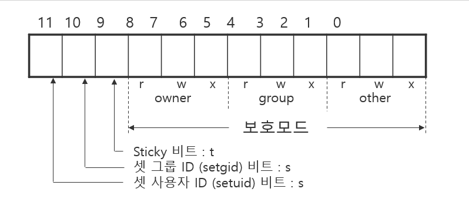

1. open()
2. creat()
3. close()
4. read()
5. write()
6. lseek()
7. Disk
8. I/O efficiency
9. dup(), dup2()
10. stat(), fstat(), lstat()
11. access()

> 파일 디스크립터
> 프로세스가 실행될때 기본적으로 여는 파일은 3개 각각 0(STDIN), 1(STDOUT) ,2(STDERR)

> man -s 2 open : 과 같이 메뉴얼 파일을 볼 수 있다

## open

```c
int open (const char *pathname, int flags);
int open (const char *pathname, int flags, mode_t mode);
```

int open (const char *pathname, int flags);
int open (const char *pathname, int flags, mode_t mode);
파일 디스크립터 값을 반환 -1 은 실패
- flags : 파일을 열 때 취해지는 구체적 행동을 기술한다
	- 파일 엑세스 플레그(필수 플래그) : 1개 필수
		-  O_RDONLY(00) : 읽기 모드 (파일 엑세스 플레그)
		- O_WRONLY(01) : 쓰기 모드 (파일 엑세스 플레그)
		- O_RDRW(02) : 읽기 쓰기 모드 (파일 엑세스 플레그)
	- 파일 생성 플래그 File Creation Flags (선택 플래그) : 생성과정에 영향
		- O_CREAT: 파일이 존재하지 않을 경우 새 파일을 생성합니다.
		- O_EXCL: `O_CREAT`와 함께 사용되며, 파일이 이미 존재하면 오류를 발생시킵니다. 이를 통해 파일의 중복 생성을 방지합니다.
		- O_TRUNC: 파일이 이미 존재할 경우, 파일 내용을 비웁니다.
		- O_CLOEXEC : 파일 디스크립터가 생성될 때, 해당 프로세스가 `exec()` 시스템 호출을 통해 새로운 프로그램으로 전환될 때 자동으로 닫히도록 설정
		- O_DIRECTORY : 이 플래그는 지정된 경로가 반드시 디렉토리여야 함을 나타냅니다. 만약 경로가 디렉토리가 아닐 경우, `open()` 호출은 실패합니다.
		- O_NOCTTY : 이 플래그는 열린 파일이 제어 터미널이 되지 않도록 합니다.
		- O_NOFOLLOW :  이 플래그는 심볼릭 링크를 따라가지 않도록 설정합니다. 만약 지정된 경로가 심볼릭 링크인 경우, open() 호출은 실패합니다.
		- O_TMPFILE : 이름 없는 임시 파일 생성
	- 파일 상태 플래그 (File Status Flags) (선택 플래그) :  파일이 열린 후의 I/O 동작에 영향을 미침
		- O_APPEND: 파일을 추가 모드로 열어, 매번 쓰기 전에 파일 끝으로 이동
		- O_ASYNC: 입출력이 가능할 때 SIGIO 신호를 생성하는 비동기 모드 활성화
		- O_DIRECT: 캐시 영향을 최소화한 I/O 수행
		- O_DSYNC: 데이터 일관성 보장 동기화 쓰기 모드
		- O_LARGEFILE: 큰 파일을 열 수 있도록 허용
		- O_NOATIME: 파일 접근 시간을 업데이트하지 않음
		- O_NONBLOCK: 비차단 모드로 파일 열기
		- O_PATH: 파일을 열지 않고 파일 디스크립터만 반환
		- O_SYNC: 파일 데이터와 메타데이터가 모두 동기화된 상태에서 쓰기 완료
		- ... 등등

- 모드 : mode_t = unsigned int (/usr/include/sys/types.h 에 선언되어 있음)
	- Flag에 O_CREAT를 지정한 경우에만 필요
	- 0-8비트는 파일의 보호모드 9-11 비트는 sticky 비트 공유모드
	- **S_IRUSR** (읽기 권한, 소유자): 소유자에게 읽기 권한 부여
	- **S_IWUSR** (쓰기 권한, 소유자): 소유자에게 쓰기 권한 부여
	- **S_IXUSR** (실행 권한, 소유자): 소유자에게 실행 권한 부여
	- **S_IRGRP** (읽기 권한, 그룹): 그룹에게 읽기 권한 부여
	- **S_IWGRP** (쓰기 권한, 그룹): 그룹에게 쓰기 권한 부여
	- **S_IXGRP** (실행 권한, 그룹): 그룹에게 실행 권한 부여
	- **S_IROTH** (읽기 권한, 기타): 기타 사용자에게 읽기 권한 부여
	- **S_IWOTH** (쓰기 권한, 기타): 기타 사용자에게 쓰기 권한 부여
	- **S_IXOTH** (실행 권한, 기타): 기타 사용자에게 실행 권한 부여
	- **S_ISUID** (셋 사용자 ID 비트): 셋 사용자 ID 비트 설정
	- **S_ISGID** (셋 그룹 ID 비트): 셋 그룹 ID 비트 설정
	- **S_ISVTX** (스티키 비트): 스티키 비트 설정

## create
` int creat(const char *pathname, mode_t mode);`

- creat( pathname, mode ); 
- open ( pathname, O_WRONLY | O_CREAT | O_TRUNC, mode);
- 2개는 기능이 동일
- 이때 소유자 모드는 변경하지 않는다
## close
열린 파일 닫기

## read

```c
ssize_t  read (int filedes,  void *buf,  size_t nbytes);
```

- buf 읽은 데이터를 담을 메모리의 시작 주소
- nbytes 읽을 바이트 수


## write

```c
ssize_t  write (int filedes, void *buf, size_t nbytes);
```

- read 와 반대
copy.c

```c
```

## lseek