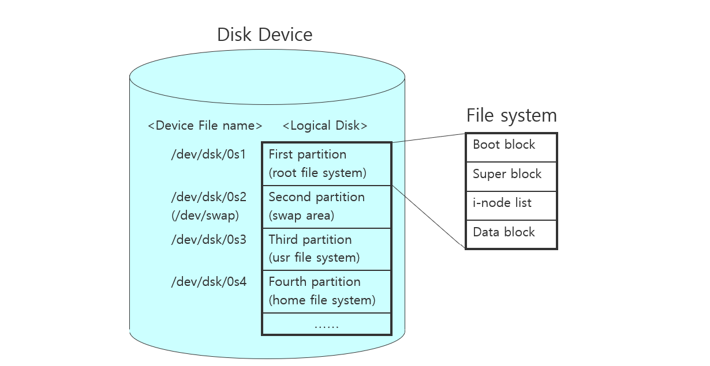
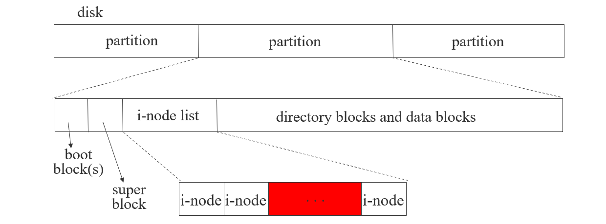
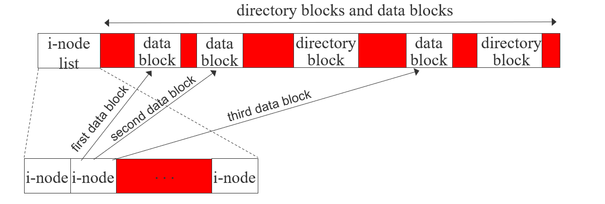
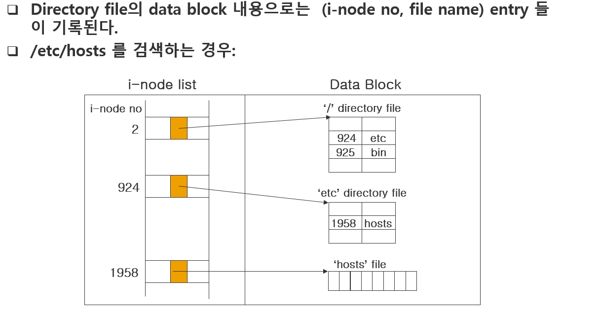
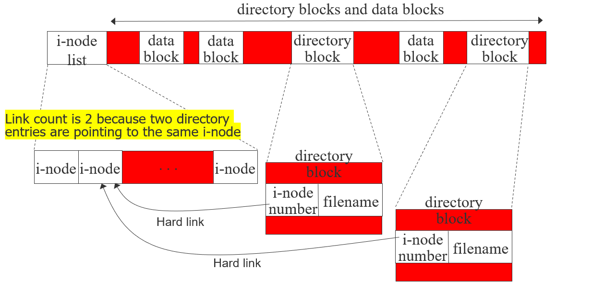
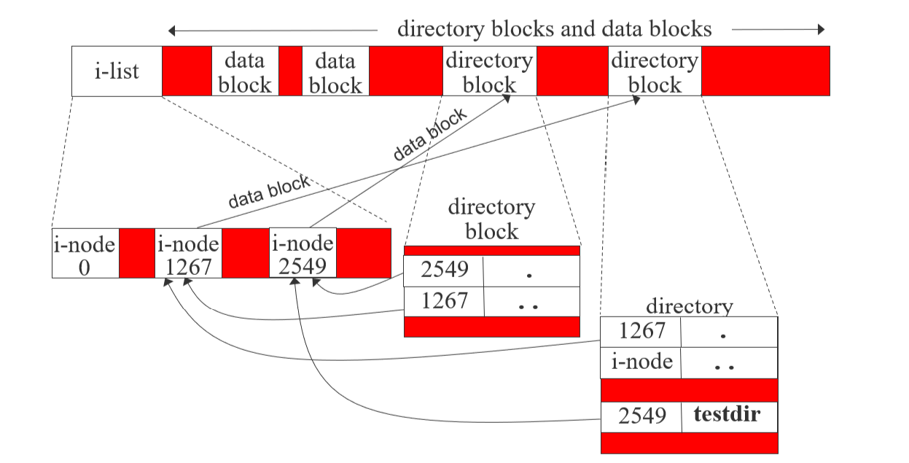
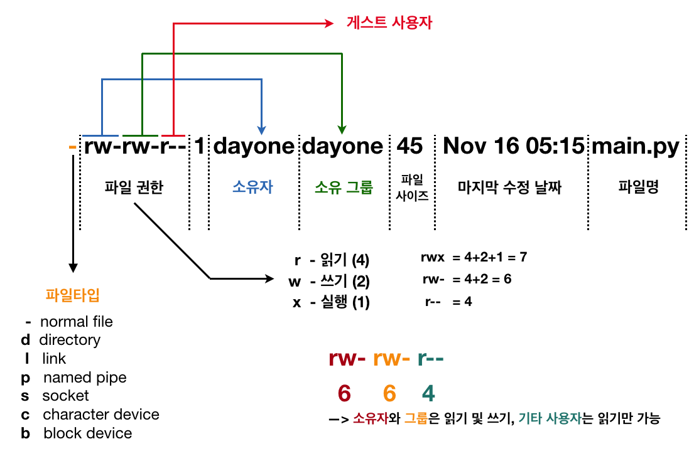
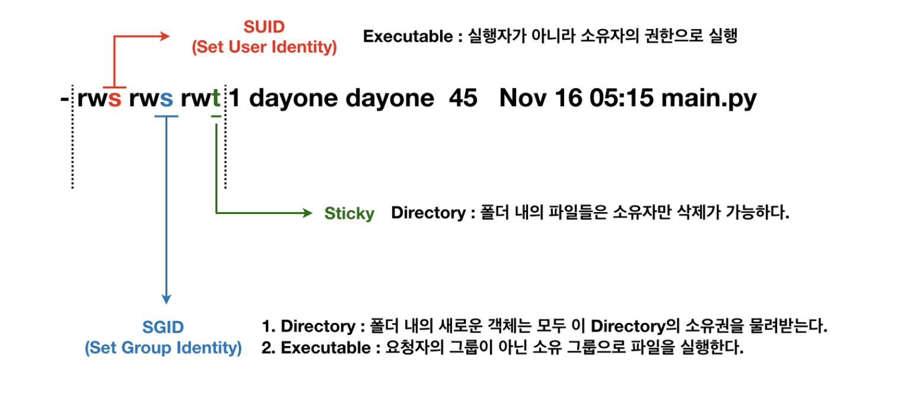

1. 1.link() / unlink() / remove() / rename()
2. umask()
3. chmod() / fchmod()
4. truncate() / ftruncate()
5. utime()
6. Directory
7. mkdir() / opendir() / readdir() / closedir() / rewinddir() / rmdir()
8. chdir() / getcwd()
9. Symbolic link
10. sync() / fsync()

## 파일 시스템






- Boot block
	- First block of the file system
	- Program to run system is located
- Super block
	- Boot 다음 영역
	- file system 관리 정보
		- size of file system
		- info for free block
		- info for i-node
			- file type
			- access permission bits
			- file size
			- Time stamp
			- Number of links
			- pointers to data blocks for the file
			- stat 구조체의 field들은 i-node에서 읽어온다
		- block to modify that super block is modified
		- etc
	- resides(상주하다) in kernel memory space in DRAM
	- Needed to be consistent with the super block in disk
	- Use "sync" system call (also a user cmd)
- i-node block list
	- Super block 다음의 영역
	- Consists of many i-nodes
		- 1 i-node / 1 file
		- Identified by the i-node no.
		- File 관리에 필요한 정보 저장
- Data block
	- Last area in the file system
	- Contains the data for general files and directory files.
		- general files
		- directory files
			- file name
			- i-node numbers for files
### hard link
Link from directory block to i-node
Use i-node number to make the link (Linux command ‘ln’)
Hard link는 같은 file system 내부에서만 연결 가능

> **만약 디렉토리일 경우**
> inode block 의 inode 값은 특정 디렉토리의 data block 상의 주소를 가리킴
> -> data block 디렉토리 file 내부에 특정 파일의 inode 를 가리키는 주소값이 들어있음
> -> inode block 의 inode 가 특정 파일의  data block 상의 주소를 가리킴
>  
> 
> - i-node 2549 link count 최소 3
> - i-node 1267 link count 최소 2
> - 루트 디렉토리의 경우 부모디렉토리(..)가 자기자신(.) 과 동일한 inode 를 가리킴

> **link count of i-node**
> number of directory entries that is pointing to an i-node
> stat 구조체의 st_link
> **링크 카운트(link count)는 파일 시스템에서 특정 i-node가 얼마나 많은 디렉토리 엔트리와 연결되어 있는지를 나타내는 값 즉 나(i-node)를 가리키는 주소들 갯수**

> 방금 생성된 디렉토리 link count 가 기본적으로 2인 이유
> 상위 부모의 inode 가 가리키는 주소에 data block 에 디렉토리 정보(디렉토리 엔트리)에 나의 inode주소 값이 있다
> 나의 inode 가 가리키는 주소에 data block 에 디렉토리 정보에 (.) 이라는 나의 inode 를 가리키는 inode주소 값이 있다

### Symbolic link
- Linux command ‘% ln –s /usr/lib lib’
- ex) lrwxrwxrwx 1 root   7   Sep 25  07:14   lib -> /usr/lib
	- File name: lib
	- Contents of file: /usr/lib
	- File size: 7 bytes
- The contents of file (data block) is the pathname of the target link

### Operations on file
- Deleting a file
	- If a file is deleted in a directory block, link count of i-node decreases
	- If link count become zero, both i-node and data blocks of a file are deleted
	- 일반 파일 삭제 과정
		- 상위 디렉토리 정보(directory entry)에 나의 inode 주소값이 적혀있는 것을 지운다
		- 자연스레 나를 가리키는 디렉토리 정보가 사라졌으므로 link count 값이 1 줄어든다
		- 만약 link count 값이 0 이면 나의 inode 주소를 가리키는 주소를 가진 개체들이 없으므로 data block 의 값을 삭제해도 된다
- Moving a file
	- Linux command: mv
	- Directory entry is changed without changing the i-node and data block of file 

### 파일 권한

umask : 가린다의 의미 mask 에 파일을 생성할 때 umask 값을 사용하여 적절히 생성한다

특수 권한

[리눅스 파일 권한](../../temp/리눅스%20파일%20권한.md)
**Set UID**
- 파일에 Set-UID 비트가 설정되면 다른 사용자가 파일을 실행했을때 해당 사용자의 권한이 아닌 파일의 소유자 권한으로 실행.
- Set-UID 비트를 설정하기 위해 소유자 허가권에 s를 추가하거나 앞에 4를 붙여줌.
  (ex 4750 => rwsr-x---)

**Set GID**
- 파일에 Set-GID 비트가 설정되면 다른 사용자가 파일을 실행했을때 해당 사용자의 권한이 아닌 그룹의 권한으로 실행
- Set-GID 비트를 설정하기 위해 소유자 허가권에 s를 추가하거나 앞에 2를 붙여줌.
  (ex 4750 => rwsr-x---)

**Sticky-Bit** 디렉토리만 설정 가능
- sticky-bit가 설정된 디렉토리에 파일을 생성하면 해당 파일은 생성한 사람의 소유가 되며, 오직 소유자와 root에게만 해당 파일에 대한 삭제 및 변경의 권한이 있다.
- 스티키비트 추가하기위해 문자방식인경우 t를 사용하고 숫자방식인경우 1 사용.


## link

```c
int  link (const char *cur_path, const char *new_path);
```

- This call makes a new link/directory entry (new_path) to an existing file (cur_path)
	- 같은 i-node를 가리키는 directory entry가 하나 더 만들어짐
	- 해당 i-node의 link count가 하나 증가
- Return values
	- Success: 0, link count increases
	- Error: -1
- Parameter
	- cur_path: current hard link (or pathname)
	- new_path: new hard link (or pathname)

>보통 link count가 0이 되면 해당 파일은 삭제되지만, 다른 프로세스가 사용중인 파일이 삭제되는 것을 방지하기 위해 link count가 0에 도달했더라도 그 파일을 open 한 프로세스의 수가 0 이상이면 삭제하지 않는다
>파일이 close 될 때 kernel은 그 파일을 open 한 프로세스 수가 0 인지 확인하고, 0 일 경우 link count가 0 인지 확인하고 삭제한다

unlink

## remove

```c
int remove (const char *pathname);
```

if mathname is nomal file => remove = unlink
if mathnaem is dir file => remove = rmdir

## rename

```c
int rename(const char *oldpath, const char *newpath);
```

`rename()` 함수는 파일의 이름을 변경하며, 필요시 디렉토리 간에 이동할 수 있습니다. 이 함수는 다음과 같은 특성을 가지고 있습니다:
- **하드 링크와의 영향**: 다른 하드 링크(예: `link(2)`를 사용하여 생성된 링크)에 대해서는 영향을 미치지 않습니다.
- **열린 파일 디스크립터**: `oldpath`에 대한 열린 파일 디스크립터는 영향을 받지 않습니다.

`rename()` 작업이 성공하는지 여부는 여러 가지 제약 조건에 따라 결정됩니다. 아래는 관련된 오류 상황입니다:
- **newpath가 이미 존재하는 경우**: `rename()`은 원자적으로 대체되므로, 이 시점에서 다른 프로세스가 `newpath`를 접근하려고 할 때 파일이 없다고 발견되는 상황은 없습니다. 그러나 `oldpath`와 `newpath`가 모두 파일을 참조하는 상태가 발생할 수 있는 시간 여유가 있습니다.
- **oldpath와 newpath가 동일한 하드 링크인 경우**: 두 경로가 동일한 파일을 참조하고 있다면, `rename()`은 아무 작업도 하지 않고 성공 상태를 반환합니다.
- **newpath가 존재하지만 작업이 실패하는 경우**: 어떤 이유로든 작업이 실패하면, `rename()`은 `newpath`의 인스턴스를 그대로 유지합니다.
- **oldpath가 디렉토리를 참조하는 경우**: 이 경우, `newpath`는 존재하지 않거나 비어 있는 디렉토리를 지정해야 합니다.
- **oldpath가 심볼릭 링크를 참조하는 경우**: 링크가 이름이 변경됩니다. 만약 `newpath`가 심볼릭 링크를 참조한다면, 해당 링크는 덮어씌워집니다.


## umask

```c
mode_t umask(mode_t newmask);
```

- newmask: bitwise OR
	- S_IRUSR, S_IWUSR, S_IXUSR
	- S_IRGRP, S_IWGRP, S_IXGRP
	- S_IROTH, S_IWOTH, S_IXOTH
