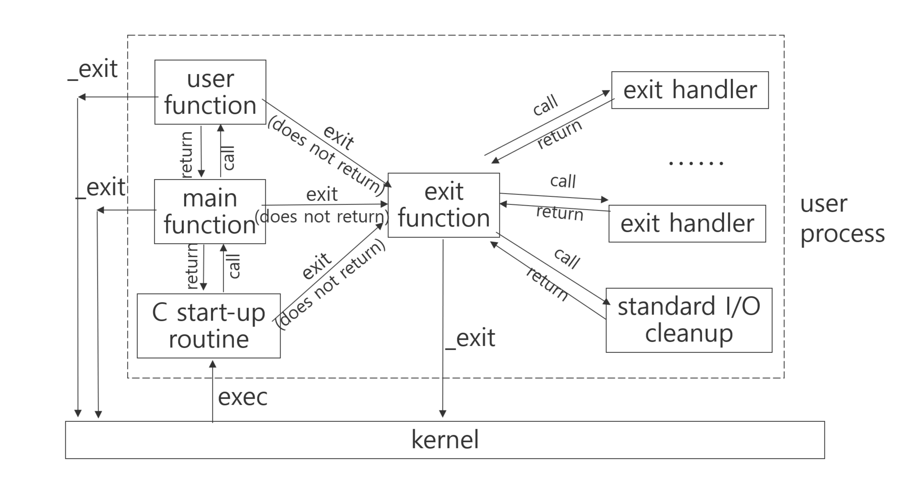
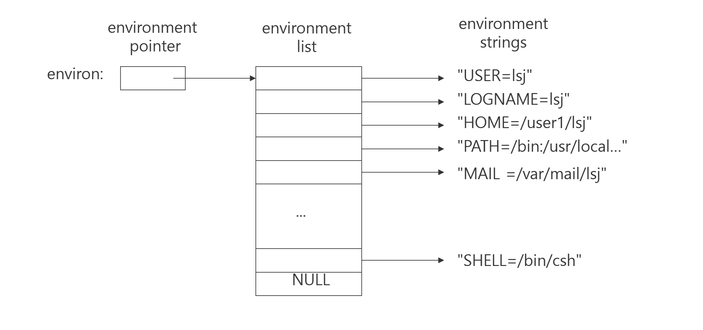

qexec() 이후에 오는 문자에 의해 구별되는 표시는 다음의 의미가 있다
  l -> 인자 정보를 개개의 문자열 데이터를 가르키는 포인터 arg0,    
       arg1……. argn으로 전달한다
  v -> 인자 정보를 개개의 문자열 데이터를 가리키는 포인터 배열의
       선두주소 argv로 전달한다
  e -> envp 정보를 전달한다
  p -> p를 사용하는 경우, 실행할 파일이름을 환경 변수 PATH로 지정한 디렉토리 안에서 찾아내어 실행한다
## 1. `execve()`
- **축약어**: `exec` + `v` (vector) + `e` (environment)
- **설명**: 
  - "exec"는 실행을 의미하며, "v"는 인수를 배열 형태로 받고, "e"는 환경 변수를 배열 형태로 받는다는 것을 나타냅니다.
  
## 2. `execv()`
- **축약어**: `exec` + `v` (vector)
- **설명**: 
  - "exec"는 실행을 의미하며, "v"는 인수를 배열 형태로 받는다는 것을 나타냅니다. 환경 변수를 설정할 수 없습니다.

## 3. `execvp()`
- **축약어**: `exec` + `v` (vector) + `p` (path)
- **설명**: 
  - "exec"는 실행을 의미하며, "v"는 인수를 배열 형태로 받고, "p"는 `PATH` 환경 변수를 통해 파일을 찾는다는 것을 나타냅니다.

## 4. `execle()`
- **축약어**: `exec` + `l` (list) + `e` (environment)
- **설명**: 
  - "exec"는 실행을 의미하며, "l"은 인수를 개별적으로 받는다는 것을 나타내고, "e"는 환경 변수를 배열 형태로 받는다는 것을 나타냅니다.

## 5. `execl()`
- **축약어**: `exec` + `l` (list)
- **설명**: 
  - "exec"는 실행을 의미하며, "l"은 인수를 개별적으로 받는다는 것을 나타냅니다. 환경 변수를 설정할 수 없습니다.

## 6. `execlp()`
- **축약어**: `exec` + `l` (list) + `p` (path)
- **설명**: 
  - "exec"는 실행을 의미하며, "l"은 인수를 개별적으로 받고, "p"는 `PATH` 환경 변수를 통해 파일을 찾는다는 것을 나타냅니다.

## 정리

| 함수 이름    | 축약어 설명                              | 인수 형태                          | 환경 변수 지원 |
| -------- | ----------------------------------- | ------------------------------ | -------- |
| `execve` | exec + v (vector) + e (environment) | 파일 이름 + argv[] + envp[]        | 지원       |
| `execv`  | exec + v (vector)                   | 파일 경로 + argv[]                 | 지원하지 않음  |
| `execvp` | exec + v (vector) + p (path)        | 파일 이름 + argv[]                 | 지원하지 않음  |
| `execle` | exec + l (list) + e (environment)   | 파일 이름 + arg1, arg2, ... + NULL | 지원       |
| `execl`  | exec + l (list)                     | 파일 경로 + arg1, arg2, ... + NULL | 지원하지 않음  |
| `execlp` | exec + l (list) + p (path)          | 파일 이름 + arg1, arg2, ... + NULL | 지원하지 않음  |