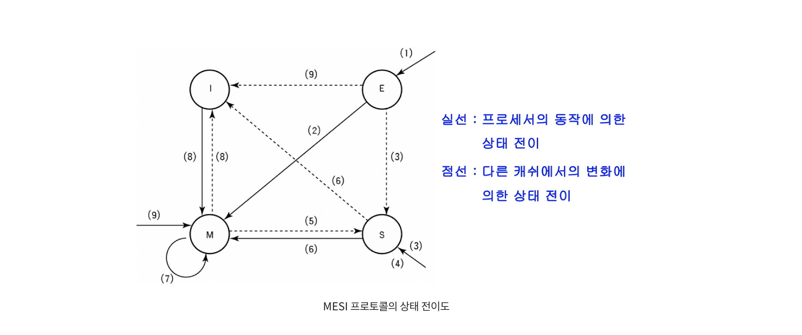

- PC : 다음에 인출될 명령어의 주소
- AC : 임시저장
- IR : 최근에 인출된 명령어
- MAR : 기억장치 접근 주소
- MBR : 기억장치 접근 데이터
- SP : 스텍 최상위 주소
- 


### 2장
### 사이클
#### 인출 사이클

```assembly
MAR <- PC
MBR <- M[MAR], PC <- PC + 1
IR <- MBR
```

#### 실행 사이클
load

```json

```

#### 인터럽트 사이클

```assembly
MBR <- PC
MAR <- SP, PC <- ISR 의 시작 주소
M[MAR] <- MBR , SP <- SP-1
```

#### 간접 사이클

```assembly
MAR <- IR(addr)
MBR <- M[MAR]
IR(addr) <- MBR
```

#### Sub call
인터럽트 사이클과 비슷  
`CALL X` 명령시

```assembly
MBR <- PC
MAR <- SP, PC <- X
M[MAR] <- MBR, SP <- SP - 1
```

`RET` 명령시

```assembly
SP <- SP + 1
MAR <- SP
PC <- MBR <- M[MAR]
```

### 4장

제어 유니트  
- 명령어 해독기 inscruction decoder
- CAR 제어 주소 레지스터 : 다음에 실행할 마이크로 명령어의 주소를 저장하는 레지스터
- 제어 기억장치(control memory) : 마이크로명령어들로 이루어진 마이크로프로그램을 저장하는 내부 기억 장치
- CBR 제어 버퍼 레지스터 : 제어 기억장치로 부터 읽혀진 마이크로 명령어를 일시적으로 저장하는 레지스터
- SBR 서브 루틴 레지스터 : 마이크로프로그램에서 서브 루틴이 호출되는 경우에 현재의 CAR 을 일시적으로 저장하는 레지스터
- 순서제어 모듈(sequencing module) : 마이크로명령어의 실행 순서를 결정하는 회로들의 집합
- 


인출 사이클 마이크로 프로그램

```assembly
ORG 4
INDRT : IRTAR  U   JMP   NEXT                   ; MAR <- IR(addr),
											    ; 다음 마이크로명령어 실행
		READ   U   JMP   NEXT                   ; MBR <- M[MAR],
											    ; 다음 마이크로 명령어 실행  
		BRTIR  U   RET                          ; IR(addr) <- MBR,
												; 실행 사이클 루틴으로 복귀
```

### MESI

- 수정 (M : Modified) 상태 : 데이터가 수정(변경) 된 상태
- 베타 (E : Exclusive) 상태 : 유일한 복사본이고, 주기억장치의 내용과 동일한 상태
- 공유 (S : Shared) 상태 : 데이터가 두 개 이상의 프로세서 캐시에 적재되어 있는 상태
- 무효 (I : Invalid) 상태 : 데이터가 다른 프로세서에 의해 수정되어 무효가 된 상태

1. 초기 cache miss 후 캐쉬로 등록 ( - -> E )
2. 수정 (메인 메모리 반영  x) ( E -> M )
3. 다른 코어가 값을 읽는 경우 ( E -> S , M->S, - -> S , -> S )
4. ..
5. 캐시간 전송이 가능할 수도 못할 수도 있음 못하면 메인메모리에 update 후 동기화
6. 수정( 메인 메모리 반영 x ) ( S->M )
7. 수정( 메인 메모리 반영 x ) ( M->M )
8. 다른 코어가 M 인상태에서 수정 ( M->I, I->M )
9. 