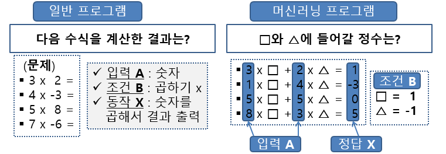

- T task : 해야할 작업
- E experience : 학습
- P performance : 작업 성능

### 머신러닝 분류

- 기준1: 사람의 지도/감독 여부 (학습하는 동안 감독의 형태나 주어지는 정보량에 따른 분류)
	- 지도(Supervised) : 레이블(타겟) 이 포함
	     분류(classification), 회귀(regression) 정답이 포함되어 있는가
	- 비지도(unsupervised) :  : 레이블이 없는 훈련 데이터 : 
	     군집(Clustering), 시각화(Visualization), 차원 축소(Dimensionality Reduction), 이상 탐지(Anomaly Detection), 이상 탐지(Anomaly Detection), 연관 규칙 학습(Association Rule Learning)
	- 준지도(semi-supervised) : 지도 + 비지도
	- 강화(reinforcement)학습 : 학습에 대한 피드백 제공
- 기준2 : 실시간으로 주어지는 데이터에 대한 점진적인 학습 가능 여부
	- 온라인 학습 vs 배치 학습
- 기준3 : 훈련을 통해 알고 있는 데이터 포인트와 새로운 데이터 포인트를 비교하는 방식인지, 아니면 훈련 데이터셋에서 패턴을 발견하고 그에 기반한 예측 모델을 만드는 것인지
	- 사례 기반 학습 vs 모델 기반 학습

---
#### 세부


- 분류
- 회귀 : 중고자 가격 예측
- 군집 : 비슷한 특징을 가진 그룹으로 나누는 것 (분류과 다른점은 레이블이 없다) :  k-means, DBSCAN, 계층 군집 분석
- 시각화 : 레이블이 없는 고차원(여러 특성(feature)들로 이루어진) 데이터를 분석하여 도식화가 가능한 2D 또는 3D 표현을 만들어줌
- 차원 축소 : original information의 손실을 최소화 하면서 데이터의 차원(특성)을 줄이기 
  ex) 상관관계가 높은 자동차의 주행거리과 연식을 “마모 정도”라는 하나의 특성으로 합침
- 이상 탐지 : 정상 샘플들을 이용하여 머신러닝 모델 훈련 후 주어진 새로운 샘플의 정상 여부를 판단
- 특이치 탐지(Novelty Detection) : 전혀 오염되지 않은 clean 훈련 데이터 학습 후 학습된 훈련 데이터와 달라 보이는 데이터 탐지
- 연관 규칙 학습(Association Rule Learning) :  특성 간 흥미로운 관계 찾기
  마트 판매 기록 데이터에 대해 연관 규칙 학습 적용 예) 바비큐 소스와 감자를 구매한 고객이 스테이크도 구매하는 경향을 찾아냄
- 


군집과 vs 시각화의 다른점
이상탐지 vs 특이치 탐지
**특이치 탐지** 는 "강아지 vs. 고양이"처럼 명확한 범주 분류
**이상 탐지** 는 "대부분의 강아지와 다른 특이한 사례"


### numpy
- **Axis(축):** NumPy에서 각 차원을 축이라고 부릅니다.
- **Rank(랭크):** 배열의 축 개수입니다. 예를 들어, 3x4 행렬은 랭크가 2입니다.
- **Shape(형태):** 배열의 각 축 길이를 나타내는 튜플입니다. 예: `(3, 4)`
- **Size(크기):** 배열의 총 요소 수입니다. 예: 3x4 행렬의 경우 `size=12`.

boolean indexing  
`m < 25 # equivalent to m < [25, 25, 25, 25]`  
`array([ True,  True, False, False])`


### **Broadcasting의 세 가지 주요 규칙**
- **규칙 1: 배열의 차원(rank)을 맞추기 위해 작은 차원의 배열에 1을 추가**
- **규칙 2: 크기가 1인 차원은 필요한 크기만큼 확장**
- **규칙 3: 최종적으로 모든 차원의 크기가 일치해야 함**


### dataframe
여러가지 방법으로 생성이 가능하다  
python_ dict + pandas_series  
`{"Mango":series1, "Apple":series2, "Banana":series3}`  
  
리스트를 값으로 갖는 dict

```python
dict2 = {'state': ['Ohio', 'Ohio', 'Ohio', 'Nevada', 'Nevada', 'Nevada', 'NY', 'NY', 'NY'],
'year': [2000, 2001, 2002, 2001, 2002, 2003, 2002, 2003, 2004],
'pop': [1.5, 1.7, 3.6, 2.4, 2.9, 3.2, 8.3, 8.4, 8.5]}
```

중첩 dict

```python
dict3 = {'Nevada': {2001: 2.4, 2002: 2.9},
			'Ohio': {2000: 1.5, 2001: 1.7, 2002: 3.6}}
```