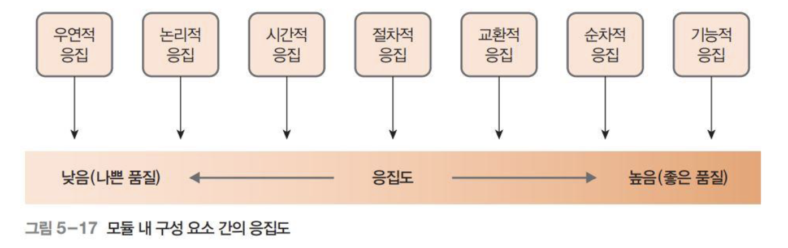

총 10문제가 나온다

1. 소프트웨어 공학 구성요소 4가지 (상세내용x)
2. 폭포수 모델의 장점과 단점
3. 에자일 모델-스크럼의 장점과 단점
4. UML 유스케이스 다이어그램 - 구성요소 엑터, 유스케이스, 관계 3가지 (설명x)
5. UML 클래스 다이어그램 - 클래스 다이어그램의 관계 연관관계 합성연관관계 등등 관계들
6. 프로젝트 계획단계 개발비 산정에서 간이 기능점수 산정방법
7. 객체지향 단계에서오버로딩과 오버라이딩에 대한 차이점 설명
8. 응집도과 결합도에 대해 차이점과 설명
9. ms 아키텍처의 장단점
10. 테스트 단계에서 확인테스트와 검증 테스트
11. 동적 테스트를 각각의 테스트 영세기반 ,화이트, 블랙박스 등등 각각에 대해 알기
12. cmi 5개 단계 설명 42p??

## 소프트웨어 공학 구성요소 4가지
- 공학적 접근
- 표준화
- 자동화 도구 활용
- 품질 보증 체제

## 폭포수 모델의 장점과 단점
장점
- 관리가 용이
- 체계적으로 문서화할 수 있음
- 요구사항의 변화가 적은 프로젝트에 적합
단점
- 각 단계는 앞 단계가 완료되어야 수행할 수 있음(순서가 있음)
- 각 단계마다 작성된 결과물이 완벽한 수준으로 작성되어야 다음 단계에 오류 를 넘겨주지 않음(앞 순서가 매우 중요함)
- 사용자가 중간에 가시적인 결과를 볼 수 없어 답답해할 수 있음( 빠른 결과물이 없음 )

## 에자일 모델-스크럼의 장점과 단점
장점
- 반복 주기마다 생산되는 실행 가능한 제품을 통해 사용자와 충분히 의견을 나 눌 수 있음
- 일일 회의를 함으로써 팀원들 간에 신속한 협조와 조율이 가능
- 일일 회의 시 직접 자신의 일정을 발표함으로써 업무에 집중할 수 있는 환경이 조성
- 다른 개발 방법론에 비해 단순하고 실천 지향적
- 스크럼 마스터는 개발 팀원들이 목표 달성에 집중할 수 있도록 팀의 문제를 해 결
- 프로젝트의 진행 현황을 볼 수 있어 신속하게 목표와 결과 추정이 가능
- 프로젝트의 진행 현황을 볼 수 있어 목표에 맞게 변화를 시도할 수 있음
단점
- 반복 주기가 끝날 때마다 실행 가능하거나 테스트할 수 있는 제품을 만들어야 하는데 이 작업이 많아지면 그만큼의 작업 시간이 더 필요
- 일일 스크럼 회의 시간(15분)이 넘어가면 작업시간이 늦어지고 작업하는데 방해 받을 수 있음
- 투입 공수를 측정하지 않기 때문에 작업이 얼마나 효율적으로 수행되었는지 알기 어려움
- 프로세스 품질을 평가하지 않기 때문에 품질 관련 활동이 미약하고 따라서 품질의 정 도를 알 수 없음

## UML 종류
유스케이스, 클래스, 순차, 활동, 컴포던트, 배치
## UML 유스케이스 다이어그램 - 구성요소 엑터, 유스케이스, 관계 3가지 (설명x)
엑터, 유스케이스, 관계

## UML 클래스 다이어그램 - 클래스 다이어그램의 관계 연관관계 합성연관관계 등등 관계들
- 연관관계 : 두 객체가 서로 참조할수 있는 관계
- 직접 연관 관계 : 한쪽 객체만 다른 객체를 참조할 수 있는 관계
- 일반화 관계 : 상속을 의미
- 합성 연관 관계 : 범위가 큰 클래스가 사라지면 그 컴포턴트들도 사라지는 관계

## 프로젝트 계획단계 개발비 산정에서 간이 기능점수 산정방법
사용자 관점의 기능만으로 소프트웨어 개발 비용 산정에 활용 => 모를때(초기에) 는 평균복잡도 가중치를 사용하여 측정한다
데이터 기능(내부 논리 파일, 외부 연계 파일)과 트랜잭션 기능(외부입력, 외부조회, 외부출력) 이 있다
기능점수산정법(정규기능, 간이 기능)

오버로딩 : 중복정의 : 언어별로 지원하는 범위가 다르지만 cpp 의 경우 동일한 메서드 이름임에도 다른 매개변수 개수나 자료형으로 구분할 수 있다 심지어 연산자 또한 오버로딩이 가능하다
오버라이딩 : 재정의 : 상속관계의 클래스 관계에서 상위 클래스에서 정의한 메서드를 무시하고 하위 클래스에서 동일한 이름으로 다시 재정의해서 사용하는 것이다
## 응집도과 결합도에 대해 차이점과 설명
응집도 : 응집도는 모듈 내부의 구성요소들이 얼마나 밀접하게 관련되어 있는지를 나타내는 지표
결합도 : 결합도는 모듈 사이의 의존성을 나타내는 지표
즉 모듈 내부 지표 = 응집도, 모듈 외부 지표 = 결합도
%20image%2020240611180633.png)
 
## ms 아키텍처의 장단점
MSA 아키텍처
• 여러 개의 작은 서비스로 구성되어 각 서비스가 독립적으로 개발되고 배포되는 구조
• MSA로 구성되어 있는 애플리케이션의 경우 전체 시트템이 분산되어 있어 개발, 배포가 독립적으로 가능하며 확장성과 유지관리가 용이함.
• 모놀리식 아키텍처 (Monolithic Architecture) : 전통적인 개발 방식으로 하나의 프로젝 트에 모든 기능을 함께 포함
• MSA의 장점
• 서비스 간 독립성으로 인해 확장성과 유연성이 높아진다.
• 기능 고립성이라는 특징 때문에 일부 서비스가 실패하더라도 전체 시스템에 큰 영향을 미치지 않는다.
• MSA의 단점
• 서비스 간 통신이 필요하며, 서로 간 연결 구축 및 관리의 복잡성이 증가한다.
• 초기 개발 및 통신 등에 시간이 소요된다

## 테스트 단계에서 확인테스트와 검증 테스트
시각에 따른 테스트
- 확인 테스트 : 개발자 기준에서 의도된 동작이 올바르게 동작하는가(개발 모든 단계)
- 검증 테스트 : 고객 기준에서 의도된 동작이 올바르게 동작하는가

- **목적**:
    - 확인 테스트: 소프트웨어가 설계 및 명세서 요구 사항을 충족하는지 확인
    - 검증 테스트: 소프트웨어가 사용자와 이해관계자의 요구 사항을 실제로 충족하는지 확인
- **시점**:
    - 확인 테스트: 개발 과정 전반에 걸쳐 지속적으로 수행
    - 검증 테스트: 주로 개발 완료 후, 배포 전에 수행
- **방법**:
    - 확인 테스트: 코드 리뷰, 워크스루, 인스펙션, 정적 분석 등
    - 검증 테스트: 기능 테스트, 시스템 테스트, 사용자 수용 테스트(UAT), 베타 테스트 등
- **중점**:
    - 확인 테스트: 소프트웨어의 내부 품질
    - 검증 테스트: 소프트웨어의 외부 품질
## 동적 테스트를 각각의 테스트 영세기반 ,화이트, 블랙박스 등등 각각에 대해 알기
명세 기반 테스트 = 블랙박스 테스트
입력 과 출력만의 비료로
- 신텍스 기법 = 문법을 기준으로 옳은가
- 분할 기법 = 해당 영역에 들어가는가
- 경계값 분석 = 경계값에서도 잘 동작하는가
- 원인 결과 그래프
- 
구현기반 테스트 = 화이트 테스트
코드수준의 검증
- 문장 검증 기준
- 분기 검증 기준 = 조건문에서 TF 모두 추적
• 조건 검증 기준 = 큰 조건을 분리하여 작게 각각 추적
• 분기/조건 검증 기준
• 다중 조건 검증 기준
• 기본 경로 테스트

## cmi 5개 단계 설명 42p??
성숙도 수준
- 초기단계 : 프로세스 없음 예측 불가능
- 관리단계 : 규칙화된 프로세스
- 정의단계 : 표준화된 프로세스
- 정량적 관리 단계 : 예측가능한 프로세스
- 최적화 단계 : 지속적 개선 프로세스

