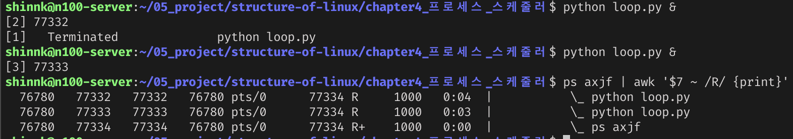

1. os 전체에서 특정 시점의 running 상태의 프로세스는 논리 코어의 개수에 관계없이 무조건 1개이다?
   (x?)
	1. R 상태의 프로세스가 동시에 실행되는 중이다 (2번째 열이 pid 번호를 나타냄) 또한 2개의 loop 프로그램에서 2개의 코어가 사용됨
	   ```python
	   loop.py 파일
	   while:
	      pass
	   ```
	   %20image%2020240401150006.png)
	2. 프로세스가 병렬적으로 실행되는 조건이 무었인가?
	3. 프로세스는 일반적으로 자원을 공유하지는 않지만 공유메모리, 동일 파일 접근등 동시에 동일한 자원에 접근하는 상황이 발생할 수도 있다 이때 쓰레드의 동시성 문제처럼 문제가 발생하지는 않는가?
