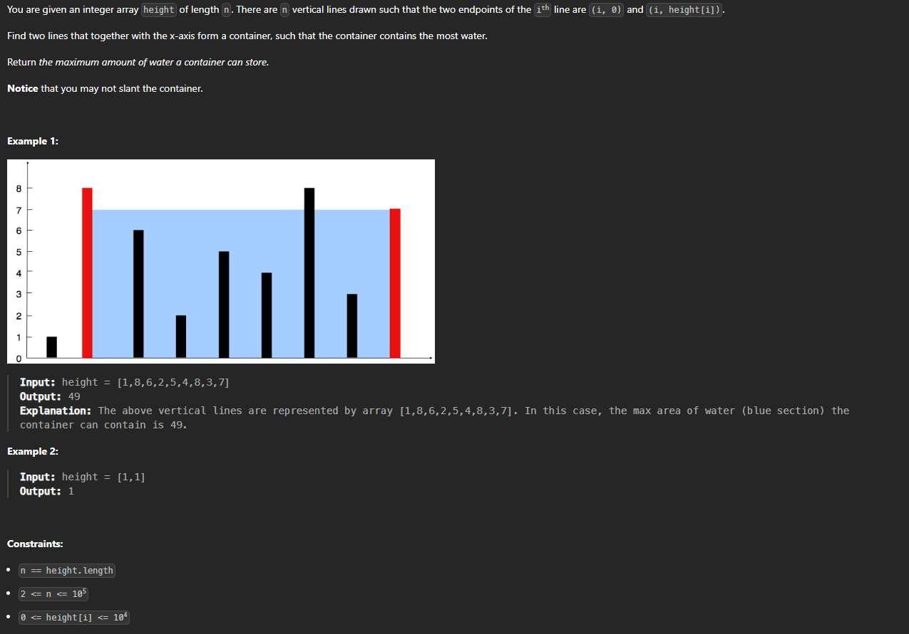

완전 탐색의 $O(n^2)$ 시간 탐색을 
선형시간 $O(n)$ 으로 변경

완전 탐색 풀이

```cpp
class Solution {
public:
    int maxArea(vector<int>& height) {
        int ret = 0;
        for(int i = 0 ; i< height.size()-1 ; i++){
            for(int j = i + 1; j < height.size() ; j++){
                int width = j - i;
                int length = min(height[i], height[j]);
                int area = width * length;
                if(ret < area) ret = area;
            }
        }
        return ret;
    }
};
```

이 문제를 선형시간으로 풀 수 있는 이유 
2개의 포인터를 양쪽 끝으로 지정하고 포인터(넓은 의미의)를 이동 시킬 때(width 크기가 큰것 부터 작은 순으로 탐색), 만약 left 위치의 높이가 작다고 가정할 때 right 위치를 줄이면 width 가 줄어들기 때문에 총 넓이가 무조건 작다고 할 수 있다 만약 `height[right]` 가 `height[left]` 보다 작더라 하더라도 더 작아진다고 할 수 있으므로 넓이가 작아지는 것은 확실 그러므로 가짓수를 확실 하게 쳐 낼 수 있다

> 결론 이미 해당 높이의 최대 영역을 가지고 있기 때문

```cpp
class Solution {
public:
    int maxArea(vector<int>& height) {
        int left = 0;
        int right = height.size() - 1;
        int max_area = 0;
        while(left < right){
            // 넓이 구하기
            int w = right - left;
            int h = min(height[left], height[right]);
            int area = h * w;
            max_area = max(max_area, area);

            // 포인터 이동
            if(height[left] < height[right]) left++;
            else if(height[left] > height[right]) right--;
            else {
                left++;
                right--;
            }
        }
        return max_area;
    }
};
```