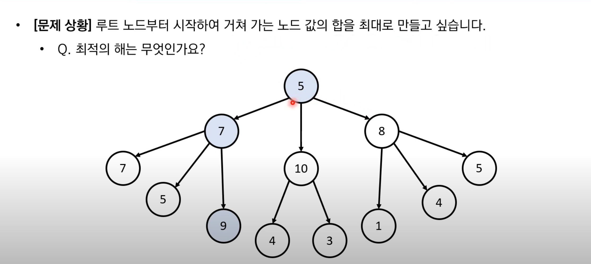

그리디 알고리즘을 적용하여 최적해를 구할 수 있는 문제는 다음 두 조건을 만족한다.
1. **greedy choice property**: 현재 선택이 이 후의 선택에 영향을 주지 않음
2. **optimal substructure**: 매 순간의 최적의 해가 문제 전체에 대한 최적의 해여야 함

5 -> 10 -> 3 선택
지금 가장 큰값을 선택한다고 해서 노드 값의 합을 보장할 수 없다
현재 선택이 이후에 영향을 준다고 할 수 있다
매순간 최적의 해가 문제 전체에 대한 최적해라고 말할 수 없다

## 문제 예시
[334. Increasing Triplet Subsequence](334.%20Increasing%20Triplet%20Subsequence.md)

가장 큰 회폐 단위부터 최대한 돈을 거슬러 준다 해당 화폐의 몫은 답이 보장된다 ==> 그리디