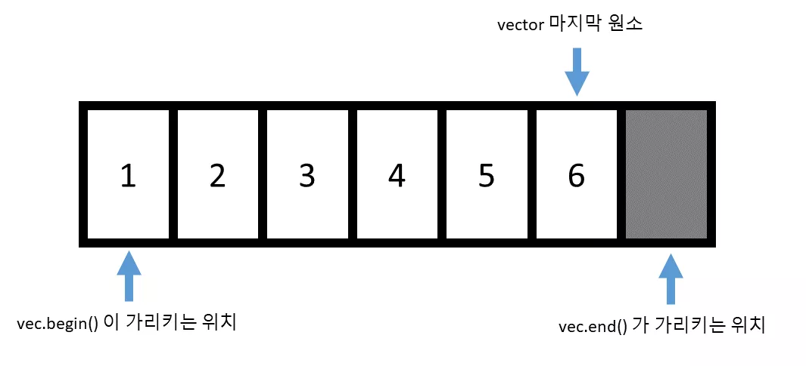
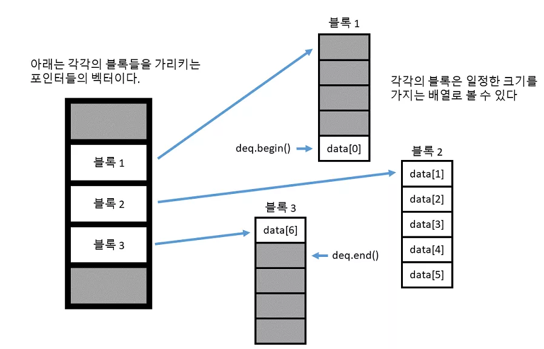

## Standard Template Library - STL
- 임의 타입의 객체를 보관할 수 있는 컨테이너 (container)
- 컨테이너에 보관된 원소에 접근할 수 있는 반복자 (iterator)
- 반복자들을 가지고 일련의 작업을 수행하는 알고리즘 (algorithm)
[cpp reference](https://en.cppreference.com/w/cpp/container)
다음은 C++의 주요 컨테이너와 관련된 개념에 대한 간단한 설명입니다:


## Container


- 시퀀스 컨테이너 (Sequence Container)
	- **`array`** (C++11): 고정 길이 배열
	- **`vector`**: 동적 가변 길이 배열
	- **`inplace_vector`** (C++26): 동적으로 크기를 조정 가능하지만, 고정된 용량을 가지는 연속 배열로, 요소가 메모리 내에서 제자리에서 관리됨. 메모리 사용을 최적화하고 성능을 개선하기 위해 설계됨.
	- **`deque`**: 분할 가변 길이 배열 + 양방향 capacity
	- **`forward_list`** (C++11): 단방향 링크드 리스트
	- **`list`**: 양방향 링크드 리스트

- 연관 컨테이너 (Associative Container)
	- **`set`**: 중복되지 않는 키를 저장하며, 키의 존재 여부를 빠르게 확인.
	- **`map`**: 키와 값을 쌍으로 저장하며 특정 키에 대한 값을 조회. `[]` 사용 가능하다
	- **`multiset`**: 중복된 키를 허용하는 set.
	- **`multimap`**: 중복된 키를 허용하는 map. `[]` 사용 불가능
	- **커스텀 클래스 객체를 `set/map` 혹은 `unordered_set/map`에 추가하기**: 사용자 정의 타입을 사용할 경우, 비교 연산자 또는 해시 함수를 정의해야 함.

- 정렬되지 않는 연관 컨테이너 (unordered Associative Containers)
	- **`unordered_set`**: 해시 테이블을 기반 set
	- **`unordered_map`**: 해시 테이블을 기반 map

- Container Adaptors 
	- 기본 컨테이너를 사용하여 특정 데이터 구조(예: 스택, 큐)로 동작하도록 변환하는 클래스 템플릿.
	- **`stack`**: LIFO(Last In First Out) 구조로, 마지막에 추가된 요소가 가장 먼저 제거됨.
	- **`queue`**: FIFO(First In First Out) 구조로, 먼저 추가된 요소가 먼저 제거됨.
	- **`priority_queue`**: 우선순위에 따라 요소가 제거되며, 가장 높은 우선순위의 요소가 먼저 처리됨.
	- **`flat_set`**, **`flat_map`**, **`flat_multiset`**, **`flat_multimap`**: 내부적으로 정렬된 벡터를 사용하여 빠른 탐색과 삽입을 제공하는 컨테이너.

- View
	- 데이터의 특정 부분이나 배열을 참조하여 효율적으로 접근하고 관리할 수 있도록 하는 객체
	- **`span`**: 연속적인 메모리 블록에 대한 뷰로, 크기와 포인터를 통해 부분 배열을 쉽게 다룰 수 있음.
	- **`mdspan`**: 다차원 배열에 대한 뷰로, 다양한 차원의 배열을 효과적으로 접근하고 관리할 수 있도록 설계됨.


### vector
- 임의의 위치 원소 접근 (`[], at`) : $O(1)$
- 맨 뒤에 원소 추가 및 제거 (`push_back`/`pop_back`) : amortized $O(1)$; (평균적으로 $O(1)$ 이지만 최악의 경우(공간을 새로 할당하고, 모두 복사) $O(n)$ )
- 임의의 위치 원소 추가 및 제거(한칸씩 민다) (`insert, erase`) : $O(n)$
- 벡터의 크기를 리턴하는 함수인 `size` 의 경우, 그리턴하는 값의 타입은 `size_type` 멤버 타입으로 정의
```cpp
for (std::vector<int>::iterator itr = vec.begin(); itr != vec.end(); ++itr) {
  std::cout << *itr << std::endl;
}
```
반복자 사용
%20image%2020241221083329.png)
만일 `begin() == end()` 라면 원소가 없는 벡터
`*, + 등 배열 포인터 그대로 사용 가능`

erase 실행 등 지우거나 추가할 경우 유효하지 않은 반복자 조심 
```cpp
  std::vector<int>::iterator itr = vec.begin();
  std::vector<int>::iterator end_itr = vec.end();

  for (; itr != end_itr; ++itr) {
    if (*itr == 20) {
      vec.erase(itr);
    }
  }
```

역반복자 사용이유
아래 코드는 오류가 발생하는데 `vector` 의 `index` 를 담당하는 타입이 부호 없는 정수 이기 때문
i 가 0 일때 -1 을 한다면 오버플로우 발생으로 가장 큰수가 되어버림 2^32 -1
```cpp

int main() {
  std::vector<int> vec;
  vec.push_back(1);
  vec.push_back(2);
  vec.push_back(3);

  // 끝에서 부터 출력하기
  for (std::vector<int>::size_type i = vec.size() - 1; i >= 0; i--) {
    std::cout << vec[i] << std::endl;
  }

  return 0;
}
```
범위기반 for 문 아래의 형태로 썼을 경우, `elem` 에 `vec` 의 원소들이 매 루프 마다 복사되서 들어가게 됩니다. 마치
`elem = vec[i];` 와 동일
```cpp
for (int elem : vec) {
  std::cout << "원소 : " << elem << std::endl;
}
```
레퍼런스 범위 기반 for문
만약에 복사 하기 보다는 레퍼런스를 받고 싶다면 어떨까요? 매우 간단합니다. 단순히 레퍼런스 타입으로 바꾼다
```cpp

template <typename T>
void print_vector(std::vector<T>& vec) {
  // 전체 벡터를 출력하기
  for (typename std::vector<T>::iterator itr = vec.begin(); itr != vec.end();
       ++itr) {
    std::cout << *itr << std::endl;
  }
}

template <typename T>
void print_vector_range_based(std::vector<T>& vec) {
  // 전체 벡터를 출력하기
  for (const auto& elem : vec) {
    std::cout << elem << std::endl;
  }
}

int main() {
  std::vector<int> vec;
  vec.push_back(1);
  vec.push_back(2);
  vec.push_back(3);
  vec.push_back(4);

  std::cout << "print_vector" << std::endl;
  print_vector(vec);
  std::cout << "print_vector_range_based" << std::endl;
  print_vector_range_based(vec);

  return 0;
}
```


### list
> 양방향 링크드 리스트
- 임의의 위치에 있는 원소에 접근을 바로 할 수 없다
- `[]` 나 `at` 함수가 아예 정의되어 있지 않다
- 임의의 위치에 원소를 추가하거나 제거하는 작업이 $O(n)$ 이였지만 리스트의 경우 $O(1)$ 으로 매우 빠르게 수행
- 반복자의 타입이 `BidirectionalIterator` 타입 (벡터의 반복자는 `RandomAccessIterator` 이고 `RandomAccessIterator` 는 `BidirectionalIterator` 를 상속받고 있다)
- `itr++    // itr ++`
- `itr--  // --itr` 도 됩니다.
- `itr + 5  // 불가능!`

### deque

- O(1) 으로 임의의 위치의 원소에 접근
- 맨 뒤에 원소를 추가/제거 하는 작업도 O(1)
- 맨 앞에 원소를 추가/제거 하는 작업 까지도 O(1)
- 임의의 위치에 있는 원소를 제거/추가 하는 작업은 벡터와 마찬가지로 O(n) 으로 수행
-  이 때문에 원소들이 어디에 저장되어 있는지에 대한 정보를 보관하기 위해 추가적인 메모리가 더 필요로 합니다.
- 기존의 벡터와는 조금 다르게, 새로 할당 시에 앞쪽 및 뒤쪽 모두에 공간을 남겨놓게 됩니다. (벡터의 경우 뒤쪽에만 공간이 남았지요)
-  덱 역시 벡터 처럼 임의의 위치에 원소에 접근할 수 있으므로 `[]` 와 `at` 함수를 제공하고 있고, 반복자 역시 `RandomAccessIterator` 타입 이고 벡터랑 정확히 동일한 방식으로 작동합니다.


참고
- 일반적인 상황에서는 그냥 벡터를 사용한다 (거의 만능이다!)
- 만약에 맨 끝이 아닌 중간에 원소들을 추가하거나 제거하는 일을 많이 하고, 원소들을 순차적으로만 접근 한다면 리스트를 사용한다.
- 만약에 맨 처음과 끝 모두에 원소들을 추가하는 작업을 많이하면 덱을 사용한다.


### set
```cpp
template <typename T>
void print_set(std::set<T>& s) {
  // 셋의 모든 원소들을 출력하기
  std::cout << "[ ";
  for (typename std::set<int>::iterator itr = s.begin(); itr != s.end();
       ++itr) {
    std::cout << *itr << " ";
  }
  std::cout << " ] " << std::endl;
}
```
- `10 -> 50 -> 20 -> 40 -> 30` 으로 넣었지만 실제로 반복자로 원소들을 모두 출력했을 때 나온 순서는 `10 -> 20 -> 30 -> 40 -> 50` 순으로 나왔다는 점

set 의 경우 비교 연산자를 통해 비료를 진행한다 이때 `A<B` 가 false && `B<A` false 인 경우 서로를 같다고 생각한다 만약 두 원소가 서로 다르다면, 반드시 A < B 또는 B < A 중 하나는 true여야 한다
```cpp
class Todo {
  int priority;
  std::string job_desc;
  ...
}
```
```cpp
bool operator<(const Todo& t) const {
  if (priority == t.priority) {
    return job_desc < t.job_desc;
  }
  return priority > t.priority;
}
```
이런식으로 정의 하지 않고 아래처럼 정의하면 동일 우선순위 다른 일을 같은 객체로 판단해서 추가 하지 않는다
```cpp
bool operator<(const Todo& t) const { return priority > t.priority; }
```
`operator<` 는 다음과 같은 조건들을 만족해야 합니다. (A 랑 B 가 다른 객체라면)
- `A < A` 는 거짓
- `A < B != B < A`
- `A < B` 이고 `B < C` 이면 `A < C`
- `A == B` 이면 `A < B` 와 B `< A` 둘 다 거짓
- `A == B` 이고 `B == C` 이면 `A == C`
- 이것을 만족하면 strict weak ordering 을 만족한다고 말한다


## iterator

아래는 C++ STL 컨테이너별 이터레이터 타입을 표로 정리한 것입니다:


## algorithm
```cpp
template <typename Iter>
void do_something(Iter begin, Iter end);
```

```cpp
template <typename Iter, typename Pred>
void do_something(Iter begin, Iter end, Pred pred)
```

와 같은 꼴을 따르고 있습니다. 전자의 경우, 알고리즘을 수행할 반복자의 시작점과 끝점 바로 뒤를 받고, 후자의 경우 반복자는 동일하게 받되, '특정한 조건' 을 추가 인자로 받게 됩니다. 이러한 '특정한 조건'을 서술자(Predicate) 이라고 부르며 저기 `Pred` 에는 보통 `bool` 을 리턴하는 함수 객체(Functor) 를 전달하게 됩니다.


```cpp
#include <iostream>
#include <vector>

// 12바이트 단위 할당
void* operator new(std::size_t count) {
    std::cout << count << " bytes 할당 " << std::endl;
    return malloc(count);
}

// 벡터의 요소를 출력하는 함수
void printVector(const std::vector<int>& vec) {
    std::cout << "현재 요소: ";
    for (int i : vec) {
        std::cout << i << " ";
    }
    std::cout << std::endl;
}

int main() {
    std::vector<int> vec = {1, 2, 3};

    // 벡터의 iterator를 얻습니다.
    std::vector<int>::iterator it = vec.begin();

    printVector(vec); // 벡터 출력

    // 첫 번째 요소를 출력합니다.
    std::cout << "첫 번째 요소 (iterator 사용): " << *it << std::endl;

    // 벡터에 요소 추가 (iterator 무효화 가능성)
    vec.push_back(4);
    // 이 시점에서 it는 무효화되었습니다.
    // std::cout << "첫 번째 요소 (무효화된 iterator 사용): " << *it << std::endl; // 이 줄은 주석 처리해야 합니다.

    // 요소 삭제 (iterator 무효화)
    it = vec.erase(vec.begin()); // 첫 번째 요소를 제거합니다.
    // 이 시점에서 it은 제거된 요소의 다음 요소를 가리킵니다.
    std::cout << "제거 후 첫 번째 요소 (iterator 사용): " << *it << std::endl;

    printVector(vec); // 벡터 출력

    return 0;
}


12 bytes 할당 
현재 요소: 1 2 3 
첫 번째 요소 (iterator 사용): 1
24 bytes 할당 
제거 후 첫 번째 요소 (iterator 사용): 2
현재 요소: 2 3 4 
```
백터는 12 -> 24 -> 48 단위로 할당이 되는 것 같다
삽입되거나 지워질 때 할당되면 기존 반복자 무효
vec.begin(), vec.end() 위치의 값이 지워지면 반복자 무효

## transform
>transform (시작 반복자, 끝 반복자, 결과를 저장할 컨테이너의 시작 반복자, Pred)


### find
```cpp
template <class InputIt, class T>
InputIt find(InputIt first, InputIt last, const T& value)
```
`first` 부터 `last` 까지 쭈르륵 순회하면서 `value` 와 같은 원소가 있는지 확인하고 있으면 이를 가리키는 반복자를 리턴
O(n) : 순차 탐색
`set` 에서 사용하는 [find](https://modoocode.com/261) 함수의 경우 $O(log⁡n)$ 으로 수행(정렬되어 있어서 이분 탐색 가능)
`unordered_set` 의 경우 [find](https://modoocode.com/261) 함수가 $O(1)$ 로 수행될 수 있는데 그 이유는 `unordered_set` 내부에서 자체적으로 해시 테이블을 이용해서 원소들을 빠르게 탐색
### lambda
> \[capture list\] (받는 인자) -> 리턴 타입 { 함수 본체 }
> \[capture list\] ( 받는 인자) {함수 본체}
- `[]` : 아무것도 캡쳐 안함
- `[&a, b]` : `a` 는 레퍼런스로 캡쳐하고 `b` 는 (변경 불가능한) 복사본으로 캡쳐
- `[&]` : 외부의 모든 변수들을 레퍼런스로 캡쳐
- `[=]` : 외부의 모든 변수들을 복사본으로 캡쳐


## iterator


| 컨테이너                | 이터레이터 타입               | 비고                  |
| ------------------- | ---------------------- | ------------------- |
| `std::vector`       | Random Access Iterator | 인덱스 접근 가능           |
| `std::deque`        | Random Access Iterator | 양쪽 끝에서 삽입/삭제 가능     |
| `std::list`         | Bidirectional Iterator | 앞뒤로 이동 가능, 임의 접근 불가 |
| `std::set`          | Bidirectional Iterator | 정렬된 상태로 요소 저장       |
| `std::multiset`     | Bidirectional Iterator | 정렬된 상태로 요소 저장       |
| `std::map`          | Bidirectional Iterator | 키-값 쌍을 정렬된 상태로 저장   |
| `std::multimap`     | Bidirectional Iterator | 키-값 쌍을 정렬된 상태로 저장   |
| `std::array`        | Random Access Iterator | 고정 크기 배열, 인덱스 접근 가능 |
| `std::forward_list` | Forward Iterator       | 앞 방향으로만 이동 가능       |

BidirectionalIterator
상속
RandomAccessIterator

[remove](https://modoocode.com/266) 함수의 경우 반복자의 타입이 `ForwardIterator` 입니다.


**1. 주요 반복자 종류**

| 반복자 유형                        | 정의 및 역할                                                           |
| ----------------------------- | ----------------------------------------------------------------- |
| **`iterator`**                | 읽기와 쓰기 모두 가능한 일반 반복자입니다.                                          |
| **`const_iterator`**          | 읽기 전용 반복자입니다. 값을 수정할 수 없도록 보장합니다.                                 |
| **`reverse_iterator`**        | 컨테이너를 뒤에서 앞으로(iterate) 순회할 때 사용하는 반복자입니다.                         |
| **`const_reverse_iterator`**  | 읽기 전용의 역방향 반복자입니다.                                                |
| **`pointer`** 그냥 포인터          | 일반적으로 반복자는 내부적으로 포인터(`T*`)로 정의되므로, 반복자 타입이 포인터와 동일한 동작을 할 수 있습니다. |
| **`const_pointer`** const 포인터 | 읽기 전용의 포인터입니다.                                                    |

**주요 메서드**

| 메서드             | 설명                                                      |
| --------------- | ------------------------------------------------------- |
| **`begin()`**   | 컨테이너의 첫 번째 요소를 가리키는 반복자를 반환합니다.                         |
| **`end()`**     | 컨테이너의 마지막 요소 **다음**을 가리키는 반복자를 반환합니다. (범위를 벗어난 포인터와 비슷) |
| **`cbegin()`**  | 첫 번째 요소를 가리키는 `const_iterator`를 반환합니다.                  |
| **`cend()`**    | 마지막 요소 다음을 가리키는 `const_iterator`를 반환합니다.                |
| **`rbegin()`**  | 마지막 요소를 가리키는 `reverse_iterator`를 반환합니다.                 |
| **`rend()`**    | 첫 번째 요소 **이전**을 가리키는 `reverse_iterator`를 반환합니다.         |
| **`crbegin()`** | `const_reverse_iterator`로 마지막 요소를 가리킵니다.                |
| **`crend()`**   | `const_reverse_iterator`로 첫 번째 요소 이전을 가리킵니다.            |


## vector


**Vector의 초기화**

| **구문**                                | **설명**                     |
| ------------------------------------- | -------------------------- |
| `vector<자료형> 변수명`                     | **백터 생성**                  |
| `vector<자료형> 변수명(숫자)`                 | **숫자만큼 백터 생성 후 0으로 초기화**   |
| `vector<자료형> 변수명 = { 변수1, 변수2, ... }` | **백터 생성 후 오른쪽 변수 값으로 초기화** |
| `vector<자료형> 변수명[] = {, }`            | **백터 배열(2차원 백터) 선언 및 초기화** |
| `vector<vector<자료형>> 변수명`             | **2차원 백터 생성**              |
| `vector<자료형> 변수명.assign(범위, 값)`       | **범위 내에서 값을 초기화**          |

**Vector의 Iterators (시간복잡도와 반환값)**

| **구문**       | **설명**                         | **시간복잡도** | **반환값**            |
| ------------ | ------------------------------ | --------- | ------------------ |
| `v.begin()`  | **백터 시작점의 주소 값 반환**            | O(1)      | `iterator`         |
| `v.end()`    | **백터 (끝부분 + 1)의 주소값 반환**       | O(1)      | `iterator`         |
| `v.rbegin()` | **백터의 끝 지점을 시작점으로 반환**         | O(1)      | `reverse_iterator` |
| `v.rend()`   | **백터의 (시작 + 1) 지점을 끝 부분으로 반환** | O(1)      | `reverse_iterator` |

**Vector Element Access**

|**구문**|**설명**|**시간복잡도**|**반환값**|
|---|---|---|---|
|`v.at(i)`|**백터의 i번째 요소 접근 (범위 검사함)**|O(1)|요소 값|
|`v[i]`|**백터의 i번째 요소 접근 (범위 검사 안함)**|O(1)|요소 값|
|`v.front()`|**백터의 첫 번째 요소 접근**|O(1)|첫 번째 요소 값|
|`v.back()`|**백터의 마지막 요소 접근**|O(1)|마지막 요소 값|

**Vector에 요소 삽입**

| **구문**               | **설명**                            | **시간복잡도**        | **반환값**             |
| -------------------- | --------------------------------- | ---------------- | ------------------- |
| `v.push_back(값)`     | **백터의 마지막 부분에 요소 추가**             | 평균 O(1), 최악 O(n) | 없음                  |
| `v.pop_back()`       | **백터의 마지막 부분 제거**                 | O(1)             | 없음                  |
| `v.insert(삽입위치, 값)`  | **사용자가 원하는 위치에 요소 삽입**            | 평균 O(n)          | 삽입된 위치의 `iterator`  |
| `v.emplace(삽입위치, 값)` | **사용자가 원하는 위치에 요소 삽입 (복사생성자 없음)** | 평균 O(n)          | 삽입된 위치의 `iterator`  |
| `v.emplace_back(값)`  | **백터의 마지막 부분에 요소 추가 (복사생성자 없음)**  | 평균 O(1), 최악 O(n) | 없음                  |
| `v.erase(위치)`        | **지정한 위치의 요소를 제거**                | 평균 O(n)          | 삭제 후 위치의 `iterator` |
| `v.clear()`          | **백터의 모든 요소 제거**                  | O(n)             | 없음                  |
| `v.resize(크기)`       | **백터 크기 조정**                      | O(n)             | 없음                  |
| `v.swap(다른 백터)`      | **백터와 백터를 교환**                    | O(1)             | 없음                  |

**Vector Capacity**

| **구문**              | **설명**                      | **시간복잡도** | **반환값**           |
| ------------------- | --------------------------- | --------- | ----------------- |
| `v.empty()`         | **백터가 비어있는지 확인**            | O(1)      | `true` 또는 `false` |
| `v.size()`          | **백터의 크기 반환**               | O(1)      | 크기 값              |
| `v.capacity()`      | **백터의 실제 할당된 크기 반환**        | O(1)      | 크기 값              |
| `v.max_size()`      | **백터의 최대 크기 반환**            | O(1)      | 최대 크기 값           |
| `v.reserve(크기)`     | **백터의 최소 크기 예약**            | O(n)      | 없음                |
| `v.shrink_to_fit()` | **백터의 capacity를 실제 크기에 맞춤** | O(n)      | 없음                |

## set

 **Member Functions**

| **구문**                   | **설명**                                   | **반환값**                      | **시간 복잡도**          |
|----------------------------|--------------------------------------------|---------------------------------|--------------------------|
| **constructor**            | 셋을 생성합니다.                           | 없음                            | O(1)                     |
| **destructor**             | 셋을 소멸합니다.                           | 없음                            | O(1)                     |
| **operator=**              | 컨테이너에 값을 할당합니다.               | `set&`                          | O(n)                     |
| **get_allocator**          | 연관된 할당자를 반환합니다.               | `allocator_type`               | O(1)                     |

 **Iterators**

| **구문**                   | **설명**                                   | **반환값**                      | **시간 복잡도**          |
|----------------------------|--------------------------------------------|---------------------------------|--------------------------|
| **begin**                  | 시작 위치의 반복자를 반환합니다.          | `iterator`                     | O(1)                     |
| **cbegin**                 | 시작 위치의 상수 반복자를 반환합니다.     | `const_iterator`               | O(1)                     |
| **end**                    | 끝 위치의 반복자를 반환합니다.            | `iterator`                     | O(1)                     |
| **cend**                   | 끝 위치의 상수 반복자를 반환합니다.       | `const_iterator`               | O(1)                     |
| **rbegin**                 | 역순으로 시작 위치의 반복자를 반환합니다. | `reverse_iterator`             | O(1)                     |
| **crbegin**                | 역순으로 시작 위치의 상수 반복자를 반환합니다. | `const_reverse_iterator`      | O(1)                     |
| **rend**                   | 역순으로 끝 위치의 반복자를 반환합니다.   | `reverse_iterator`             | O(1)                     |
| **crend**                  | 역순으로 끝 위치의 상수 반복자를 반환합니다. | `const_reverse_iterator`      | O(1)                     |

 **Capacity**

| **구문**                   | **설명**                                   | **반환값**                      | **시간 복잡도**          |
|----------------------------|--------------------------------------------|---------------------------------|--------------------------|
| **empty**                  | 컨테이너가 비어있는지 확인합니다.         | `bool`                          | O(1)                     |
| **size**                   | 원소의 개수를 반환합니다.                 | `size_type`                    | O(1)                     |
| **max_size**               | 최대 가능한 원소의 개수를 반환합니다.     | `size_type`                    | O(1)                     |

 **Modifiers**

| **구문**                   | **설명**                                   | **반환값**                      | **시간 복잡도**          |
|----------------------------|--------------------------------------------|---------------------------------|--------------------------|
| **clear**                  | 내용을 지웁니다.                          | 없음                            | O(n)                     |
| **insert**                 | 원소 또는 노드를 삽입합니다.              | `pair<iterator, bool>`          | O(log n)                 |
| **insert_range**           | 원소의 범위를 삽입합니다. (C++23)         | `void`                          | O(n)                     |
| **emplace**                | 인플레이스에서 원소를 생성합니다.         | `pair<iterator, bool>`          | O(log n)                 |
| **emplace_hint**           | 힌트를 사용하여 인플레이스에서 원소를 생성합니다. | `pair<iterator, bool>`      | O(log n)                 |
| **erase**                  | 원소를 삭제합니다.                        | `size_type`                    | O(log n)                 |
| **swap**                   | 내용을 교환합니다.                        | 없음                            | O(1)                     |
| **extract**                | 컨테이너에서 노드를 추출합니다. (C++17)   | `node_type`                    | O(log n)                 |
| **merge**                  | 다른 컨테이너로부터 노드를 스파이스합니다. (C++17) | `void`                      | O(n)                     |

 **Lookup**

| **구문**          | **설명**                             | **반환값**                    | **시간 복잡도** |
| --------------- | ---------------------------------- | -------------------------- | ---------- |
| **count**       | 특정 키와 일치하는 원소의 개수를 반환합니다.          | `size_type`                | O(log n)   |
| **find**        | 특정 키를 가진 원소를 찾습니다.                 | `iterator`                 | O(log n)   |
| **contains**    | 특정 키를 가진 원소가 있는지 확인합니다. (C++20)    | `bool`                     | O(log n)   |
| **equal_range** | 특정 키와 일치하는 원소의 범위를 반환합니다.          | `pair<iterator, iterator>` | O(log n)   |
| **lower_bound** | 주어진 키보다 작지 않은 첫 번째 원소의 반복자를 반환합니다. | `iterator`                 | O(log n)   |
| **upper_bound** | 주어진 키보다 큰 첫 번째 원소의 반복자를 반환합니다.     | `iterator`                 | O(log n)   |

 **Observers**

| **구문**                   | **설명**                                   | **반환값**                      | **시간 복잡도**          |
|----------------------------|--------------------------------------------|---------------------------------|--------------------------|
| **key_comp**               | 키를 비교하는 함수를 반환합니다.          | `key_compare`                  | O(1)                     |
| **value_comp**             | 값 타입의 객체에서 키를 비교하는 함수를 반환합니다. | `value_compare`              | O(1)                     |

## string
​

**1. 특정 원소 접근 방법**

|                 |                           |
| --------------- | ------------------------- |
| **str.at(idx)** | idx 위치 문자 반환, 범위 유효성 체크 O |
| **str[idx]**    | idx 위치 문자 반환, 범위 유효성 체크 X |
| **str.front()** | 문자열의 가장 앞의 문자 반환          |
| **str.back()**  | 문자열의 가장 뒤의 문자 반환          |


**2. 문자열의 크기**

|                         |                                                  |
| ----------------------- | ------------------------------------------------ |
| **str.length()**        | 문자열 길이 반환                                        |
| **str.size()**          | 문자열 길이 반환(length()와 동일)                          |
| **str.max_size()**      | 최대한 메모리 할당할 경우 저장할 수 있는 문자열 길이 반환                |
| **str.capacity()**      | 문자열의 메모리 크기 반환                                   |
| **str.resize(n)**       | str을 n의 크기로 만듦. 삭제 또는 빈 공간으로 채움                  |
| **str.resize(n, 'a')**  | n이 str 길이보다 크면 빈 공간을 'a'로 채움                     |
| **str.shrink_to_fit()** | capacity가 실제 사용하는 메모리보다 큰 경우 메모리 줄여 줌(메모리 낭비 제거) |
| **str.reserve(n)**      | 사이즈 n 만큼의 메모리 미리 할당                              |
| **str.empty()**         | str이 빈 문자열인지 확인                                  |


**3. 문자열 삽입/추가/삭제**

|                            |                                           |
| -------------------------- | ----------------------------------------- |
| str.append(str2)           | str 뒤에 str2 문자열을 이어 붙여 줌(str + str2 와 같음) |
| str.append(str2, n ,m)     | str 뒤에 'str2의 n index 부터 m개의 문자'를 이어 붙여 줌 |
| str.append(n, 'a')         | str 뒤에 n 개의 'a'를 붙여 줌                     |
| str.insert(n, str2)        | n번째 index 앞에 str2 문자열을 삽입함                |
| str.replace(n, k, str2)    | n번째 index 부터 k개의 문자열을 str2로 대체함           |
| str.clear()                | 저장된 문자열을 모두 지움                            |
| str.erase()                | clear()와 같음                               |
| str.erase(n, m)            | n번째 index부터 m개의 문자를 지움                    |
| str.erase(n, m) ← iterator | n~m index 문자열을 지움(n, m은 iterator임)        |
| str.push_back(c)           | str의 맨 뒤에 c를 붙여 줌                         |
| str.pop_back()             | str의 맨 뒤의 문자를 제거                          |
| str.assign(str2)           | str 에 str2 문자열을 할당함                       |


**4. 부분 문자/비교/복사/찾기**

|                            |                                                        |
| -------------------------- | ------------------------------------------------------ |
| **str.substr()**           | str 전체를 반환                                             |
| **str.substr(n)**          | str의 n번째 index부터 끝까지 부분 문자열 반환                         |
| **str.substr(n, k)**       | str의 n번째 index부터 k개의 부분 문자열 반환                         |
| **str.compare(str2)**      | str과 str2가 같은지 비교, str<str2인 경우 음수, str>str2인 경우 양수 반환 |
| **str.copy(str2, k, n)**   | str의 n번째 index부터 k개의 문자열 복사                            |
| **str.find("abcd")**       | "abcd"가 str에 포함되어 있는지 확인, 찾으면 해당 부분 첫 index 반환         |
| **str.find("abcd", n)**    | n번째 index부터 "abcd"를 찾음                                 |
| **str.find_first_of("/")** | "/"가 처음 나타나는 index                                     |
| **str.find_last_of("/")**  | "/"가 마지막으로 나타나는 index                                  |


**5. 기타 유용한 함수들**


|                                    |                                                                  |
| ---------------------------------- | ---------------------------------------------------------------- |
| **str.c_str()**                    | string을 c스타일의 문자열로 변경                                            |
| **str.begin()**                    | string의 시작 iterator 반환                                           |
| **str.end()**                      | string의 끝 iterator 반환                                            |
| **swap(str, str2)**                | str과 str2를 바꿔줌                                                   |
| **str = str2 + str3**              | str2와 str3를 붙여서 str에 복사함                                         |
| **str += str2**                    | str 뒤에 str2를 붙여줌                                                 |
| **str = str2**                     | str에 str2 복사 (Deep Copy)                                         |
| **str == str2**                    | str과 str2가 같은지 확인                                                |
| **str > str2, str < str2**         | str이 str2보다 사전순으로 앞인지 뒤인지 확인                                     |
| **isdigit(c)**                     | `#include <cctype>`, c가 숫자인지 확인, 숫자이면 0이 아닌 숫자 반환                |
| **isalpha(c)**                     | `#include <cctype>`, 알파벳 확인, 대문자는 1 반환, 소문자는 2 반환, 알파벳이 아니면 0 반환 |
| **toupper(c)**                     | `#include <cctype>`, c를 대문자로 변환                                  |
| **tolower(c)**                     | `#include <cctype>`, c를 소문자로 변환                                  |
| **stoi(), stof(), stol(), stod()** | 문자열을 숫자로 변환(int, float, long, double)                            |
| **to_string(n)**                   | 숫자 n을 문자열로 변환                                                    |