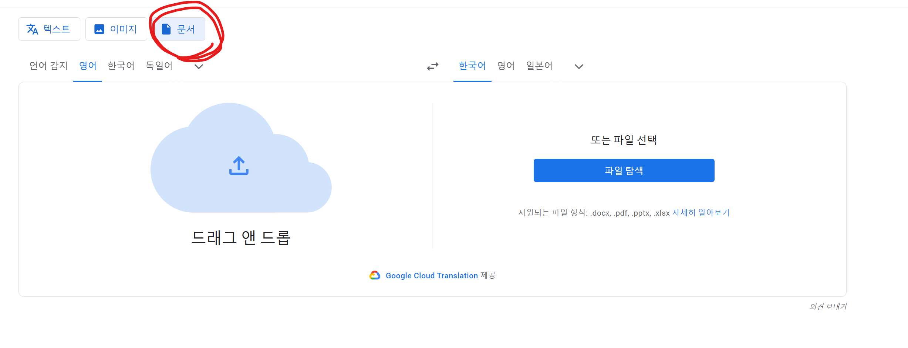
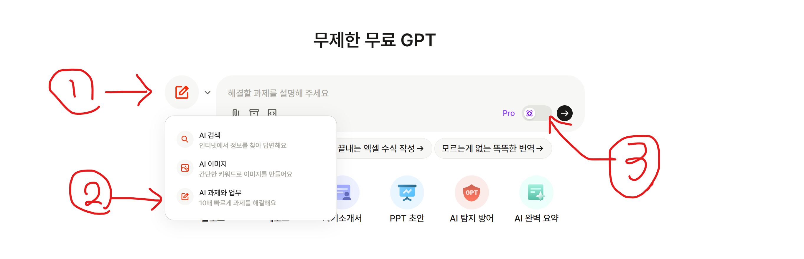

2024/10/25자 생성
## 영어 pdf 문서 통번역(정확도 순위별 정렬)(하이퍼 링크)
1. [DeepL](https://www.deepl.com/ko/translator/files) => 5,000자까지, 로그인(회원가입) 필요
2. [papago](https://papago.naver.com/docs/) => 10MB 이하 1만자 이하, 로그인(회원가입) 필요
3. [google translate](https://translate.google.com/?hl=ko&tab=wT&sl=en&tl=ko&op=translate) => 클릭 이후 상단 문서로 이동

## LLM 사용 (AI)
1. [뤼튼](https://wrtn.ai/) => 무제한, 로그인 필요
2. [chatGPT](https://chatgpt.com/) => 거이 무제한, 로그인 필요
3. [Claude](https://claude.ai/) => 가장 똑똑하지만 제한량이 있음, 로그인 필요
4. [Microsoft AI Copliot](https://copilot.microsoft.com/) => microsoft AI 
5. [Google AI gemini](https://gemini.google.com/app) => 구글이 만ems AI