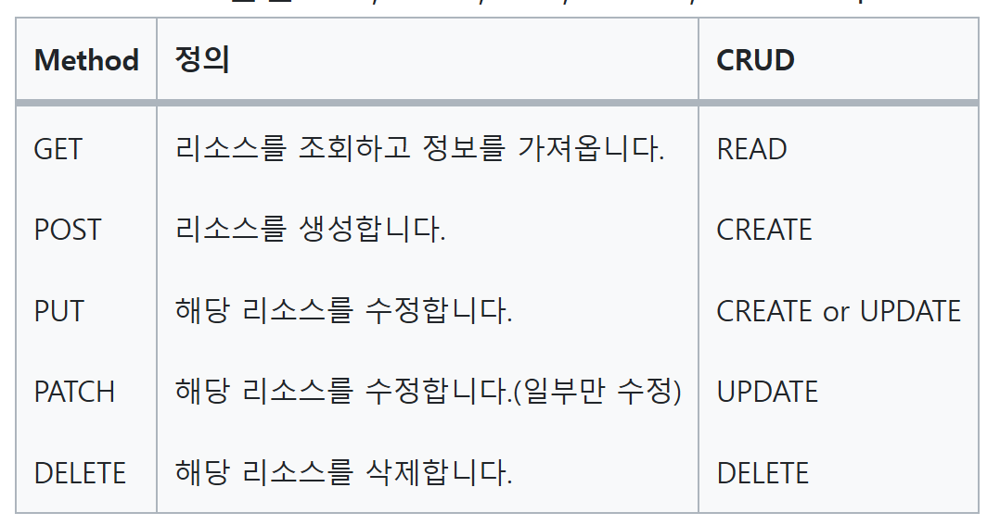

RESTful API는 현대 웹 애플리케이션의 필수 요소로 자리잡았습니다. 그러나 RESTful API를 설계할 때는 몇 가지 원칙을 따르는 것이 중요합니다. 이번 글에서는 RESTful API 설계의 핵심 원칙과 그 원칙을 예시를 통해 자세히 살펴보겠습니다. 이 원칙들을 준수하면 API의 일관성과 확장성을 높이고, 개발자들에게 편의성을 제공할 수 있습니다.

  

## 1. 자원(리소스) 기반 URI

자원(리소스) 기반 URI는 RESTful API의 핵심입니다. 각 자원은 고유한 URI(Uniform Resource Identifier)를 가지며, 이를 통해 자원을 식별합니다. 자원 기반 URI는 설계의 일관성을 유지하고 의미를 명확하게 전달하는 데 도움을 줍니다. 예를 들어, 다음과 같은 URI를 사용하여 각각의 리소스를 다룰 수 있습니다.

#### **사용자 리소스를 다루는 API**

- 모든 사용자 정보를 가져옴: GET /users
- 새로운 사용자를 생성함: POST /users
- 특정 사용자의 정보를 가져옴: GET /users/{id}
- 특정 사용자의 정보를 업데이트함: PUT /users/{id}
- 특정 사용자를 삭제함: DELETE /users/{id}
- 특정 사용자의 모든 포스트 정보를 가져옴: GET /users/{id}/posts
- 특정 사용자에게 새로운 포스트를 생성함: POST /users/{id}/posts
- 특정 사용자의 특정 포스트 정보를 가져옴: GET /users/{id}/posts/{post_id}
- 특정 사용자의 특정 포스트 정보를 업데이트함: PUT /users/{id}/posts/{post_id}
- 특정 사용자의 특정 포스트를 삭제함: DELETE /users/{id}/posts/{post_id}
- 특정 사용자의 정보 일부를 업데이트함: PATCH /users/{id}
- 특정 사용자의 특정 포스트 정보 일부를 업데이트함: PATCH /users/{id}/posts/{post_id}

#### **도서 리소스를 다루는 API**

- 모든 도서 정보를 가져옴: GET /books
- 새로운 도서를 생성함: POST /books
- 특정 도서의 정보를 가져옴: GET /books/{id}
- 특정 도서의 정보를 업데이트함: PUT /books/{id}
- 특정 도서를 삭제함: DELETE /books/{id}
- 특정 도서의 모든 리뷰 정보를 가져옴: GET /books/{id}/reviews
- 특정 도서에 새로운 리뷰를 생성함: POST /books/{id}/reviews
- 특정 도서의 특정 리뷰 정보를 가져옴: GET /books/{id}/reviews/{review_id}
- 특정 도서의 특정 리뷰 정보를 업데이트함: PUT /books/{id}/reviews/{review_id}
- 특정 도서의 특정 리뷰를 삭제함: DELETE /books/{id}/reviews/{review_id}

#### **이벤트 리소스를 다루는 API**

- 모든 이벤트 정보를 가져옴: GET /events
- 새로운 이벤트를 생성함: POST /events
- 특정 이벤트의 정보를 가져옴: GET /events/{id}
- 특정 이벤트의 정보를 업데이트함: PUT /events/{id}
- 특정 이벤트를 삭제함: DELETE /events/{id}
- 특정 이벤트의 모든 참가자 정보를 가져옴: GET /events/{id}/participants
- 특정 이벤트에 새로운 참가자를 추가함: POST /events/{id}/participants
- 특정 이벤트의 특정 참가자 정보를 가져옴: GET /events/{id}/participants/{participant_id}
- 특정 이벤트의 특정 참가자 정보를 업데이트함: PUT /events/{id}/participants/{participant_id}
- 특정 이벤트의 특정 참가자를 삭제함: DELETE /events/{id}/participants/{participant_id}

#### **게시물 리소스를 다루는 API**

- 모든 게시물 정보를 가져옴: GET /posts
- 새로운 게시물을 생성함: POST /posts
- 특정 게시물의 정보를 가져옴: GET /posts/{id}
- 특정 게시물의 정보를 업데이트함: PUT /posts/{id}
- 특정 게시물을 삭제함: DELETE /posts/{id}

#### **상품 리소스를 다루는 API**

- 모든 상품 정보를 가져옴: GET /products
- 새로운 상품을 생성함: POST /products
- 특정 상품의 정보를 가져옴: GET /products/{id}
- 특정 상품의 정보를 업데이트함: PUT /products/{id}
- 특정 상품을 삭제함: DELETE /products/{id}

#### **주문 리소스를 다루는 API**

- 모든 주문 정보를 가져옴: GET /orders
- 새로운 주문을 생성함: POST /orders
- 특정 주문의 정보를 가져옴: GET /orders/{id}
- 특정 주문의 정보를 업데이트함: PUT /orders/{id}
- 특정 주문을 삭제함: DELETE /orders/{id}

#### **프로필 리소스를 다루는 API**

- 모든 프로필 정보를 가져옴: GET /profiles
- 새로운 프로필을 생성함: POST /profiles
- 특정 프로필의 정보를 가져옴: GET /profiles/{id}
- 특정 프로필의 정보를 업데이트함: PUT /profiles/{id}
- 특정 프로필을 삭제함: DELETE /profiles/{id}

#### **뉴스 리소스를 다루는 API**

- 모든 뉴스 정보를 가져옴: GET /news
- 새로운 뉴스를 생성함: POST /news
- 특정 뉴스의 정보를 가져옴: GET /news/{id}
- 특정 뉴스의 정보를 업데이트함: PUT /news/{id}
- 특정 뉴스를 삭제함: DELETE /news/{id}

  

## 2. HTTP 동사 활용

HTTP 프로토콜은 다양한 동사(메서드)를 제공합니다. RESTful API 설계에서는 이러한 동사를 적절하게 활용하여 API의 의도를 명확하게 전달해야 합니다.

- GET: 리소스의 정보를 조회하기 위해 사용합니다.
- POST: 리소스를 생성하기 위해 사용합니다.
- PUT: 리소스의 정보를 업데이트하기 위해 사용합니다.
- DELETE: 리소스를 삭제하기 위해 사용합니다.
- PATCH: 리소스의 일부분을 업데이트하기 위해 사용합니다.

  

## 3. 적절한 상태 코드 반환

HTTP 상태 코드는 API의 응답에 포함되어 클라이언트에게 작업 결과를 알려줍니다. RESTful API 설계에서는 적절한 상태 코드를 반환하여 클라이언트가 요청에 대해 올바르게 대응할 수 있도록 해야 합니다. 일반적으로 사용되는 몇 가지 상태 코드는 다음과 같습니다:

1xx - Informational (정보)  
100 - Continue (계속): 요청이 계속될 수 있음을 나타냄  
101 - Switching Protocols (프로토콜 변경): 프로토콜 전환을 요청한 경우 사용

2xx - Successful (성공)  
200 - OK: 성공적인 요청에 대한 응답  
201 - Created (생성됨): 새 리소스가 성공적으로 생성됨  
202 - Accepted (수락됨): 요청이 받아들여졌지만 아직 처리되지 않음  
204 - No Content (콘텐츠 없음): 응답 본문이 없음을 나타냄  
206 - Partial Content (부분 콘텐츠): 부분 콘텐츠를 반환하는 경우 사용

3xx - Redirection (리다이렉션)  
300 - Multiple Choices (다중 선택): 리소스에 여러 가지 선택지가 있음  
301 - Moved Permanently (영구적으로 이동): 리소스가 새로운 URI로 이동함  
302 - Found (찾음): 리소스가 일시적으로 다른 URI로 이동함  
304 - Not Modified (수정되지 않음): 리소스가 변경되지 않았으므로 클라이언트가 캐시 사용

4xx - Client Error (클라이언트 오류)  
400 - Bad Request (잘못된 요청): 잘못된 요청으로 인해 서버가 요청을 이해하지 못함  
401 - Unauthorized (권한 없음): 인증이 필요한 리소스에 대한 접근 권한 없음  
403 - Forbidden (금지됨): 접근이 거부됨  
404 - Not Found (찾을 수 없음): 요청한 리소스가 서버에서 찾을 수 없음  
405 - Method Not Allowed (허용되지 않은 메서드): 지원되지 않는 HTTP 메서드를 사용했을 때 사용  
429 - Too Many Requests (요청 너무 많음): 클라이언트가 요청 제한을 초과함

5xx - Server Error (서버 오류)  
500 - Internal Server Error (내부 서버 오류): 서버 내부 오류로 인해 요청을 처리할 수 없음  
502 - Bad Gateway (게이트웨이 오류): 게이트웨이 서버에서 업스트림 서버로의 잘못된 응답 수신  
503 - Service Unavailable (서비스 이용 불가): 서버가 일시적으로 서비스 이용 불가 상태임  
504 - Gateway Timeout (게이트웨이 시간 초과): 게이트웨이 서버가 업스트림 서버로부터 응답을 기다리는 동안 시간 초과 발생

  

## 4. 적절한 데이터 포맷

RESTful API에서는 주로 JSON(JavaScript Object Notation)이나 XML(Extensible Markup Language)과 같은 데이터 포맷을 사용합니다. JSON은 경량이며 다양한 프로그래밍 언어에서 지원되기 때문에 널리 사용됩니다. 응답 데이터의 형식은 Accept 헤더를 통해 클라이언트가 지정할 수 있으며, 요청 데이터는 Content-Type 헤더를 통해 서버에게 전달됩니다.

  

## 5. 적절한 인증과 권한 부여

보안은 모든 API 설계에서 중요한 고려 사항입니다. RESTful API에서는 적절한 인증(Authentication)과 권한 부여(Authorization) 메커니즘을 구현해야 합니다. 대표적인 방법으로는 API 키, OAuth, JWT(Json Web Token) 등이 있습니다. 이를 통해 사용자 인증 및 권한 부여를 제어하고 API의 안전성을 강화할 수 있습니다.

  

## 마치며

RESTful API 설계는 일관성과 확장성을 고려하여 자원 기반 URI, HTTP 동사 활용, 적절한 상태 코드 반환, 적절한 데이터 포맷, 적절한 인증과 권한 부여 등의 원칙을 따라야 합니다. 이러한 원칙을 준수하면 API의 사용성과 유지보수성이 향상되며, 개발자와 클라이언트 간의 협업을 원활하게 할 수 있습니다. RESTful API 설계는 웹 애플리케이션의 핵심 부분이므로, 항상 최선의 노력을 기울여야 합니다.