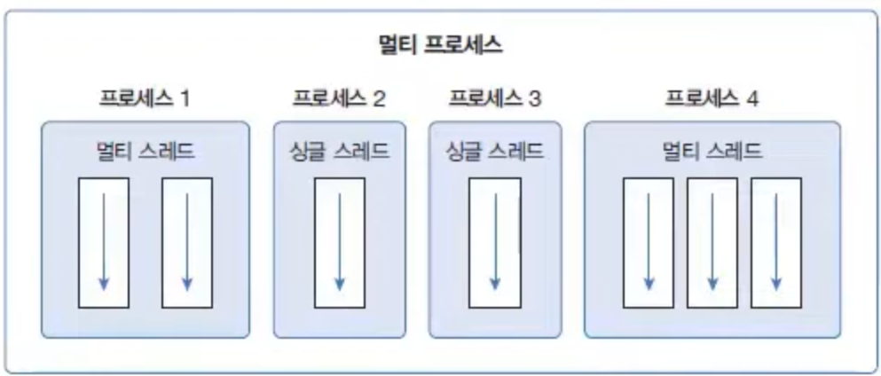
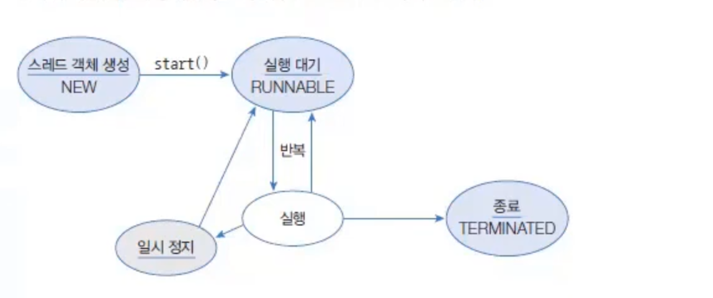
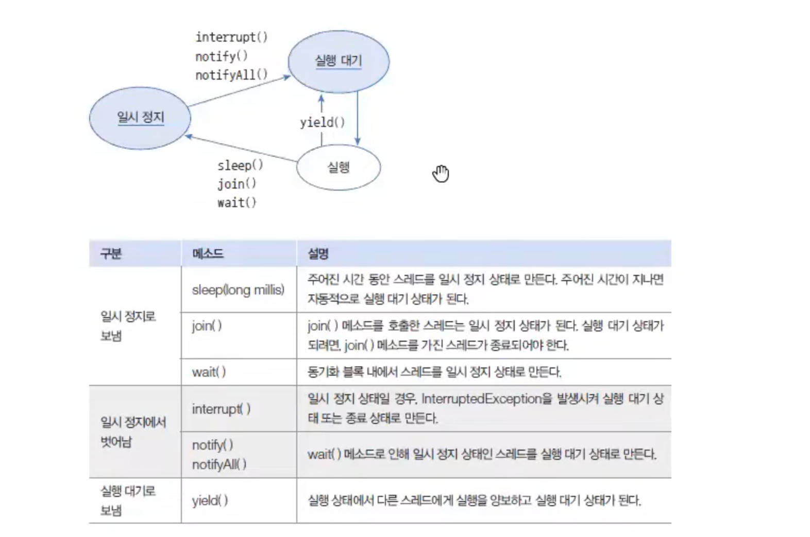

[java 메모리(memory)](memory)).md) 참고
210440.png)

java는 thread의
## 쓰레드 구현 방법

- Thread 상속
- Runnable 인터페이스 구현
```java
Thread thread = new Thread(){ // Thread 상속 및 익명 클래스로 사용
	@Override
	public void run() { 여기에 사용
	}
};
thread.start();
```

```java
Thread thread = new Thread(new Runnable(){ // Runnable 구현 및 생성자의 인자
	@Override
	public void run() { 여기에 사용
	}
});
thread.start();
```
Thread 를 상속한 객체는 그 자체로 하나의 쓰레드 객체를 의미하지만
Runnable 인터페이스를 구현한 객체는 쓰레드로 들어가 일거리라는 의미이다 그러므로 Thread 객체를 new Thread 할 때 생성자에 넣어주어야 한다


## 스레드 상태

- NEW : Thread 객체만 생성된 상태
- RUNNABLE : thread.start() 이후 실행중인 상태 또는 cpu 스케줄링 순서에 따라 대기 상태
- 일시정지
	- BLOCKED : 특정 조건시 풀린다 ex) Scanner 사용자 입력 기다림
	- WAITING : 
	- TIMED_WAITING : 시간 지난후 풀린다 ex) sleep()

   TERMINATED;

1. [**NEW**: 쓰레드가 생성되었지만 아직 시작되지 않은 상태입니다](https://www.geeksforgeeks.org/lifecycle-and-states-of-a-thread-in-java/)[1](https://www.geeksforgeeks.org/lifecycle-and-states-of-a-thread-in-java/). [이 상태에서는 쓰레드가 아직 실행되지 않았으므로 시스템 자원이 할당되지 않습니다](https://www.geeksforgeeks.org/lifecycle-and-states-of-a-thread-in-java/)[2](https://web.mit.edu/java_v1.0.2/www/tutorial/java/threads/states.html).
2. [**RUNNABLE**: 쓰레드가 실행 중이거나 언제든지 실행할 준비가 된 상태입니다](https://docs.oracle.com/javase/8/docs/api/java/lang/Thread.State.html)[3](https://docs.oracle.com/javase/8/docs/api/java/lang/Thread.State.html). [이 상태에서 쓰레드는 실제로 실행 중일 수도 있고, 운영 체제로부터 다른 리소스를 기다리고 있을 수도 있습니다](https://www.geeksforgeeks.org/lifecycle-and-states-of-a-thread-in-java/)[1](https://www.geeksforgeeks.org/lifecycle-and-states-of-a-thread-in-java/).
3. [**BLOCKED**: 쓰레드가 모니터 잠금을 획득하려고 시도하지만 현재 다른 쓰레드가 잠금을 보유하고 있는 상태입니다](https://docs.oracle.com/javase/8/docs/api/java/lang/Thread.State.html)[3](https://docs.oracle.com/javase/8/docs/api/java/lang/Thread.State.html). [쓰레드는 잠금을 획득할 때까지 BLOCKED 상태에 머무릅니다](https://stackoverflow.com/questions/15680422/difference-between-wait-and-blocked-thread-states)[4](https://stackoverflow.com/questions/15680422/difference-between-wait-and-blocked-thread-states).
4. [**WAITING**: 쓰레드가 무기한으로 다른 쓰레드가 특정 작업을 수행하기를 기다리는 상태입니다](https://docs.oracle.com/javase/8/docs/api/java/lang/Thread.State.html)[3](https://docs.oracle.com/javase/8/docs/api/java/lang/Thread.State.html). [이 상태는 쓰레드가 `Object.wait()` 또는 `Thread.join()` 메서드를 호출했을 때 발생합니다]()` 또는 `Thread.join()` 메서드를%20호출했을%20때%20발생합니다)[5](https://www.baeldung.com/java-lang-thread-state-waiting-parking).
5. [**TIMED_WAITING**: 쓰레드가 다른 쓰레드가 특정 작업을 수행하기를 지정된 시간 동안 기다리는 상태입니다](https://docs.oracle.com/javase/8/docs/api/java/lang/Thread.State.html)[3](https://docs.oracle.com/javase/8/docs/api/java/lang/Thread.State.html). [이 상태는 쓰레드가 `Thread.sleep()`, `Object.wait(timeout)`, `Thread.join(timeout)` 등의 메서드를 호출했을 때 발생합니다]()`, `Object.wait(timeout)`, `Thread.join(timeout)` 등의%20메서드를%20호출했을%20때%20발생합니다)[6](https://www.atatus.com/blog/jvm-thread-insights-spot-diagnose-waiting-threads/).
6. [**TERMINATED**: 쓰레드가 종료된 상태입니다](https://www.geeksforgeeks.org/lifecycle-and-states-of-a-thread-in-java/)[3](https://docs.oracle.com/javase/8/docs/api/java/lang/Thread.State.html). [쓰레드는 작업을 성공적으로 완료하거나 오류로 인해 종료되거나 강제로 종료될 때 이 상태에 들어갑니다](https://howtodoinjava.com/java/multi-threading/java-thread-life-cycle-and-thread-states/)[7](https://howtodoinjava.com/java/multi-threading/java-thread-life-cycle-and-thread-states/).



wait(), notify(), notifyAll() 은 Object 메서드
나머지는 Thread 메서드

## 쓰레드 그룹
실제로는 쓰레드는 계층이라는 것이 없지만 java 에서는 쓰레드를 계층 관계 그룹으로 관리 할 수 있다 prioity 우선순위 설정 기능을 활용 할 수 있다


## 쓰레드 풀
쓰레드의 무한 증가를 막기위해 제한된 개수만큼 정해 놓고 작업 큐에 들어오는 작업들을 쓰레드가 하나씩 맡아 처리하는 방식