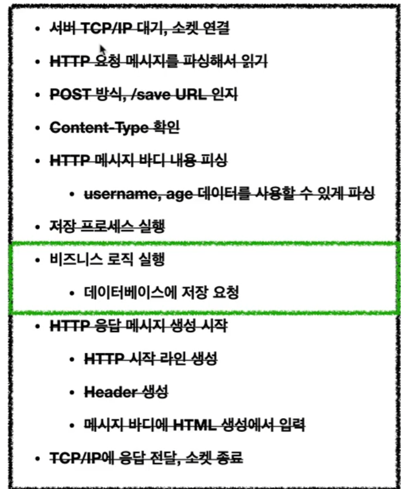

%20image%2020240214041835.png)
일반적으로 java 진영에서 많이 사용됨
소켓 연결 http 파싱후 읽기 등 일반적으로 동일한 방식의 http 방식의 처리를 객체화 하여 쉽게 처리하게 해줌

사용자 입장에서 비지니스 로직 파트만 실행될 수 있게 한다

- HttpServletRequest 요청된 http 정보를 객체화 오버라딩해서 사용
- HttpServletResponse 응답용 http 정보를 객체화됨 