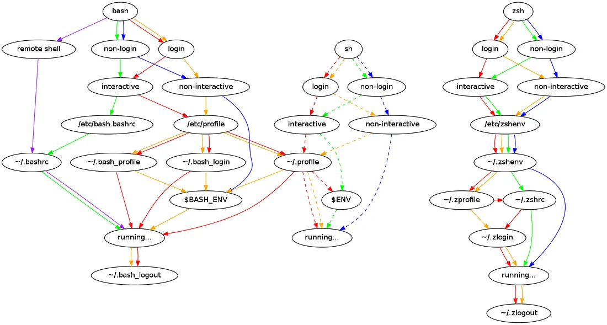

linux bash 기준으로 설명

## Login Shell vs non Login Shell
- Login Shell : ssh, x 윈도우 접속시 userid passwd 입력해서 들어가는 방법
- Non Longin Shell : 이미 다른 로그인 된 shell 에서 shell 을 fork 형태로 불러내는 방법

## Interactive Shell vs non Interactive Shell
   타 프로그래밍 언어와의 큰 차이이다 interactive Shell 은 python 명령어 입력시 나타나는 것과 비슷한 것으로 사용자 입력을 순차적으로 입력 받을 수 있는 방식이다
   이에 반해 non interactive shell 은 `python hello.py` 같이 실행한다

특수 메개 변수
- `$1`, `$2`, `$3`, ...는 [위치 매개변수](https://www.gnu.org/software/bash/manual/html_node/Positional-Parameters.html) 입니다 .
- `"$@"`모든 위치 매개변수의 배열과 유사한 구성입니다 `{$1, $2, $3 ...}`.
- `"$*"`는 모든 위치 매개변수의 IFS 확장입니다 `$1 $2 $3 ...`.
- `$#`위치 매개변수의 수입니다.
- `$-`쉘에 설정된 현재 옵션.
- `$$`현재 쉘의 pid(서브쉘 아님)
- `$_`가장 최근 매개변수(또는 시작 후 즉시 현재 쉘을 시작하는 명령의 절대 경로).
- `$IFS`(입력) 필드 구분 기호입니다.
- `$?`가장 최근의 포그라운드 파이프라인 종료 상태입니다.
- `$!`가장 최근 백그라운드 명령의 PID입니다.
- `$0`쉘 또는 쉘 스크립트의 이름입니다