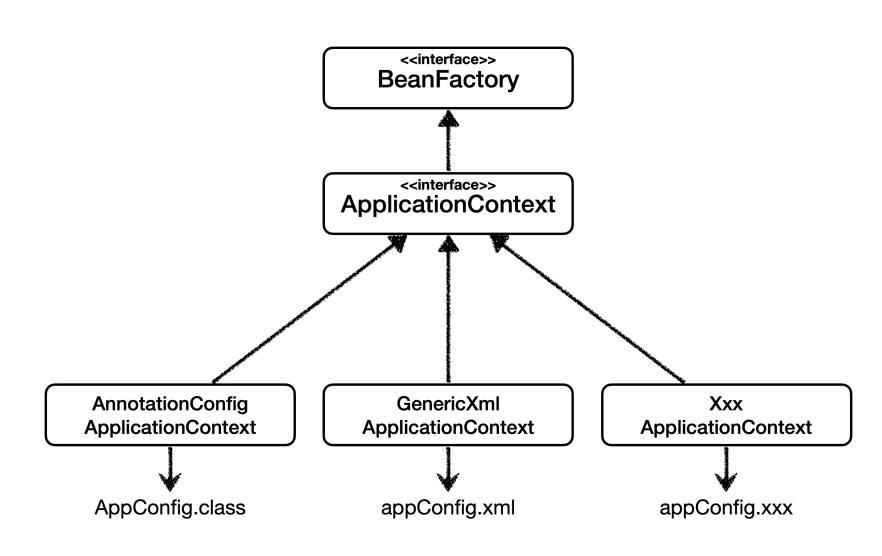

**스프링 빈의 이벤트 라이프사이클**
스프링 컨테이너 생성
-> 스프링 빈 생성 
-> 의존관계 주입
-> 초기화 콜백
-> 사용
-> 소멸전 콜백
-> 스프링 종료

> 스프링빈 생성시 생성자 의존관계일떄는 같이 
> 
설정정보(xml, java etc)를 바탕으로 빈을 관리하는 컨테이너를 생성 


## 스프링 빈 생성 & 의존관계 주입
### 수동
```java
@Configuration // 중복되는 객체생성을 막아준다
public class AppConfig {
    @Bean
    public MemberService memberService(){
        return new MemberServiceImpl(memberRepository());}
    @Bean
    public OrderService orderService(){
        return new OrderServiceImpl(memberRepository(), discountPolicy()); //필드 주입을 한다면 필요 없음}
    @Bean
    public DiscountPolicy discountPolicy() {
        return new RateDiscountPolicy();}
    @Bean
    public MemberRepository memberRepository() {
        return new MemoryMemberRepository();}
}
```
@Configration 바이트 조작 기술을 통해 중복되는 객체(memberRepository) 생성을 1개만 생성해 공유해 준다
@Bean 메서드 수준의 어노테이션을 통해 return 되는 값을 객체로 만들어준다

### 자동
```java
@Component
public class OrderServiceImpl implements OrderService{
    private final MemberRepository memberRepository;
    private final DiscountPolicy discountPolicy;
  
    @Autowired
    public OrderServiceImpl(MemberRepository memberRepository,                                DiscountPolicy discountPolicy){
        this.memberRepository = memberRepository;
        this.discountPolicy = discountPolicy;
    }
    ...
}
```

```java
@Configuration
@ComponentScan
public class AutoAppconfig {
}
```


실제 객체를 만들고 싶은 클래스에 @Component 어노테이션을 통해 이 클래스로부터 생성되는 객체를 spring bean 으로 등록하고 싶음을 알린다
@Autowired 어노테이션을 통해 의존관계를 주입
@Component 어노테이션을 통해 @Component 를 탐색


## 초기화 콜백 & 소멸전 콜백
스프링은 크게 3가지 방법으로 빈 생명주기 콜백을 지원한다.
- 인터페이스(InitializingBean, DisposableBean)
- 설정 정보에 초기화 메서드, 종료 메서드 지정
- @PostConstruct, @PreDestroy 애노테이션 지원
### 인터페이스
스프링 의존 설계
InitializingBean -> afterPropertiesSet 구현
DisposableBean -> destory 구현
### 설정정보 초기화 메서드
수동 등록에서만 가능
```java
@Bean (initMethod = "init",
		destoryMethod = "close") // 메서드 이름을 자신이 설정
```

> 일반적으로 라이브러리들의 종료 메서드는 close, shutdown
> destoryMethod 의 default 값은 (infered) 추론으로 자동으로 라이브러리의 종료 메서드를 불러준다


### 어노테이션
@PostConstruct
@PreDestroy
> 자동 등록 컴포넌트 스캔과 잘 어울림