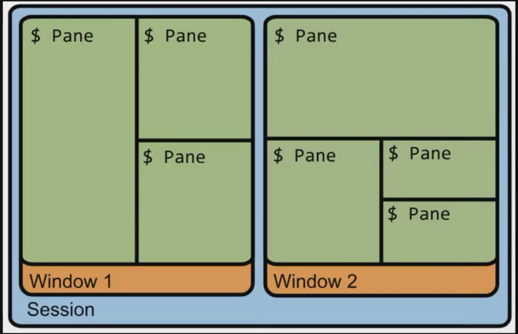
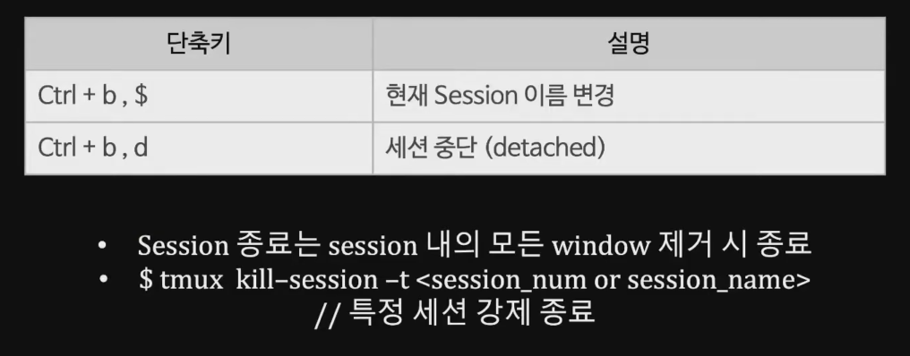
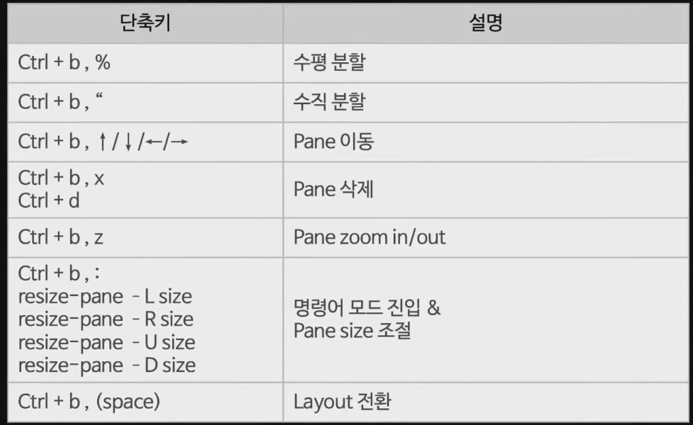

`tmux`는 터미널 멀티플렉서로, 하나의 터미널 창에서 여러 세션을 관리할 수 있게 해줍니다. 아래에 `tmux`의 기본 사용법(생성, 접근, 종료 등)을 정리해 드릴게요.

---

## 🔹 1. tmux 설치 확인 (리눅스 기준)

```bash
tmux -V  # 버전 확인
```

설치가 필요하다면:

- 우분투/데비안:

  ```bash
  sudo apt install tmux
  ```

- CentOS:

  ```bash
  sudo yum install tmux
  ```

- macOS (Homebrew):

  ```bash
  brew install tmux
  ```

---

## 🔹 2. 세션 생성

```bash
tmux new -s [세션이름]
```

예시:

```bash
tmux new -s mysession
```

이렇게 하면 `mysession`이라는 이름의 새로운 tmux 세션이 시작됩니다.

---

## 🔹 3. tmux에서 나가기 (detach)

**tmux 세션 안에서 나와서도 계속 실행되도록 하려면:**

```bash
Ctrl + b 를 누른 후 d 를 누릅니다.
```

> 즉, `Ctrl+b` → `d` 순서로 입력하면 현재 세션에서 분리(detach)됩니다.

---

## 🔹 4. 실행 중인 세션 보기

```bash
tmux ls
```

또는

```bash
tmux list-sessions
```

출력 예시:

```
mysession: 1 windows (created Mon Jan  1 00:00:00 2024)
anothersession: 2 windows (created Mon Jan  1 00:05:00 2024)
```

---

## 🔹 5. 세션에 다시 접속 (attach)

```bash
tmux attach -t [세션이름]
```

예시:

```bash
tmux attach -t mysession
```

---

## 🔹 6. 세션 종료 (kill)

### 특정 세션 종료:

```bash
tmux kill-session -t [세션이름]
```

예시:

```bash
tmux kill-session -t mysession
```

### 모든 세션 종료:

```bash
tmux kill-server
```

---

## 🔹 7. 윈도우 및 패널 관리 (부가 정보)

| 기능 | 명령어 |
|------|--------|
| 새 윈도우 만들기 | `Ctrl + b` → `c` |
| 윈도우 전환 | `Ctrl + b` → `n` (다음), `p` (이전) |
| 화면 분할 (수평) | `Ctrl + b` → `"` |
| 화면 분할 (수직) | `Ctrl + b` → `%` |
| 패널 전환 | `Ctrl + b` → `o` |
| 패널 크기 조절 | `Ctrl + b` → `Alt + 방향키` |

---

## 🔹 8. 기본 세션 없이 tmux 시작

```bash
tmux
```

이렇게 하면 자동으로 `0`번 이름의 세션이 생성되고 들어갑니다.

---

필요하시면 `.tmux.conf` 설정 파일 예제나 고급 사용법도 알려드릴 수 있어요! 😊  
추가 질문 있으신가요?
