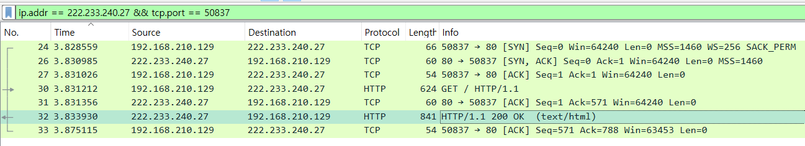
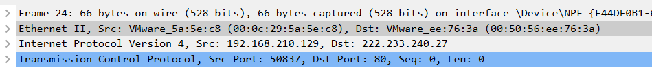

내가 만든 웹서버 shinnk.iptime.org html과 css 로만 만들어진 단순한 index.html 파일을 요청하는 상황이다
chrome 프로세스가 port 50837를 사용한다
웹서버는 80 포트로 listen 중이다 http
wire shark 로 확인하였다
(https 의 경우 ssl 암호화 과정때문에 프로토콜이 일부 보이지 않는다 그래서 http 로 진행)

ng)

총 7개의 통신 흔적이 보인다
http 통신은 tcp 를 사용한다 그러므로 3way handshake 과정이 선행된다

- no 24
- no 26
- no 27
- no 30
- no 31
- no 32
- no 33

24 26 27  가 3 way handshake 과정이다

