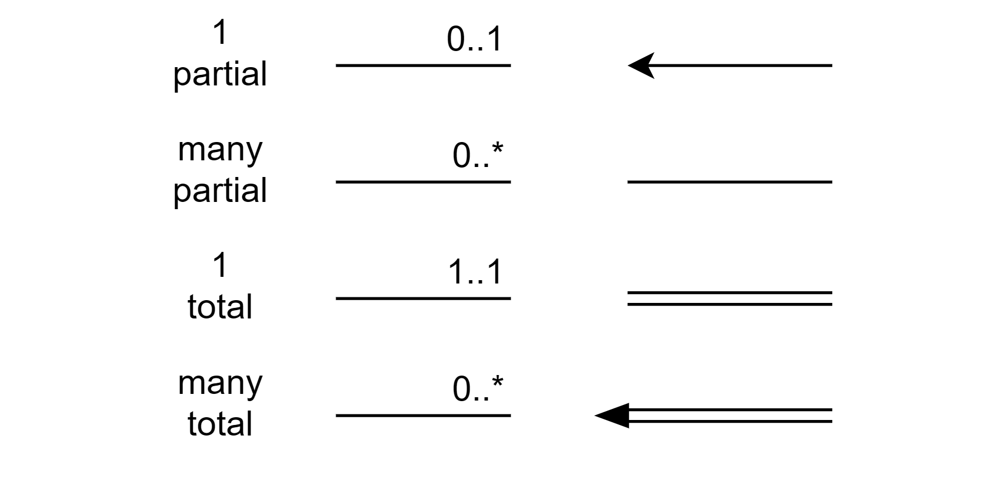

ER diagram 설명 및 스키마 변경
스키마의 좋은 나쁜 설계 판별

요구사항 명세서 -> 개념적 설계(ERD ER diagram) -> 기능적 요구사항 명세서 -> 논리적 설계(ddl) -> 물리적 설계(인덱싱 파일 구성)

- redundancy : database 에서 attribute 는 1개만 있는 것이 좋다 왜래키로 지정하자 dept_name 은 departname 을 pk 로 가져가고 나머지는 fk 로 만들자

- entity 개체 : 사람A : 속성의 집합
- entity set 개체 집합 : instructor : 개체의 집합
- attribute 속성 : 구성원들이 소유하는 설명 특성
- value 값 : 속성의 특정 값
- value set = domain : 속성이 가질 수 있는 값 집합
- relationship 관계 : 개채 사이의 연관성 : 교수와 학갱의 지도교수 관계
- relationship set : 관계 집합
- relationship instance : 실제 조직내의 명명된 개체들 사이에 연관성
- participation 참여 : entity set (개체 집합) 사이의 연관
	- mapping cardinality || cardinality ratio 대응 키디널리티 또는 카니널리티 비율 : 대응수+
	- total vs partial
- role 역할 : 관계에서 개체가 행하는 기능
- 
---
- 재귀 관계집합 : course - prereq : role 적는 것이 특히 재귀관계집합 이해에 도움이 된다
- descriptive attribute 설명속성 : student - takes - sections 에서 task 는 학생의 성적 기록을 위해 grade 속성을 저장하기를 원한다
- multivalued attribute : 다중값 속성 : student - takes - sections 에서 성적은 분반 1개에 1개의 성적을 받을 수 있는데 여러개의 성적이 들어간다면 grade 속성이 많은 것을 저장해야 한다
- 관계집합 차수 : 관계집합에 참여하는 개체집합의 수 2 이상
---
- 

paricipation 표기??
%20image%2020241012082751.png)

식별관계는 설명속성을 가질수없다 약한 개체 집합과 연관될수 있기 때문

### 복합속성을 지닌 강한 개체 집합의 표현
만약 전번이 2개 이상 가진 교수의 경우 어케할까
instructor_phone(<u>ID</u>, <u>phone_number</u>)
이렇게 해서 표현한다
ID 는 instructor 의 fk 인 id 로 여기서는 왜래키 이자 pk 이다

식별관계 에서의 브릿지 table 가능성

weak entity set

