## 1장
가내수공업
공장재 수공업
공장제 기계공업
산업

분류
1차 2차 3차 산업

clark의 법칙
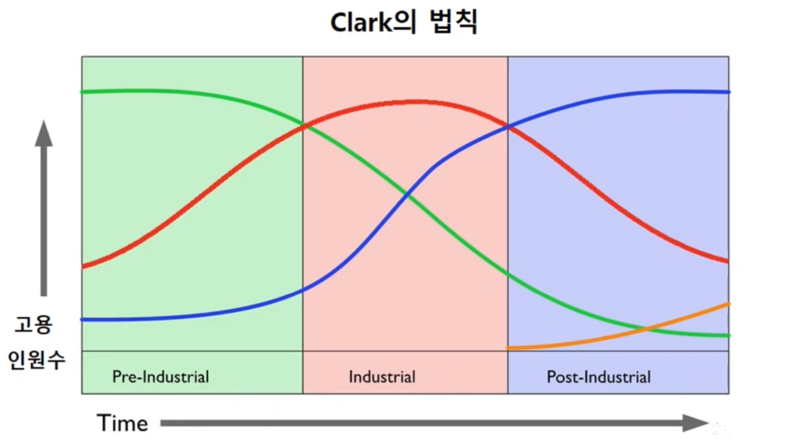%20image%2020240912024542.png)
초록선 1차
빨간선 2차
파란선 3차
주황선 4차

표준 산업 분리 KSCIC
21개의 대분류
소분류
세분류
세세분류
4단계의 분리 1197개 2024기준

의로용품업체를 지원사업이 실행되면 사업자 등록증에 등록된 산업에 해당되는 산업만 수혜를 얻는다

분업
과학적 관리 (작업관리)
테일러 시간관점
길브레스 동작관점 서블릭 (마이크로노미터)(cycle graph)
간트 간트차트 

---

이동조립 시스템에 의한 대량생산
- 이동조립법(포드 시스템)
- modern times 찰리 채플린(영화)
품질관리 연구
- 품질 관리도
작업심리 연구
- 호손 실험 : 물리적 조건 < 심리적 조건
- 인간관계론 태동 
- 호손효과
재고 관리에 대한 연구
- harris의 경제적 주문량(EOQ)
- 완충 재고 개념을 포함하면서 재고관리 주제로 확장

## 2장
시스템 systema 통합 전체를 의미하는 그리스어
시스템 요건
- 목표 존재
- 목표를 달성하기 위한 기능이 존재
- 유기적 상호작용

## 3장

### 경제학적 산업 공학
시장 중심
수요중심
#### 핵심기준 1 수요의 대체성
- 대체재(소비/수요 관점)
- 보완재(소비/수요 관점)
- 독립재(소비/수요 관점)

- 가격 탄력성: $E_d = \frac{\Delta Q / Q}{\Delta P / P} = \frac{\ \text{수요의 변화율}}{\ \text{가격의 변화율}}$
	- 1가지 재화를 따진다
	- 여기서 중요한 것은 변화가 아닌 변화율이다 그 이유는 아래의 사진에서 변화만을 따지면 이상한 결과가 나온다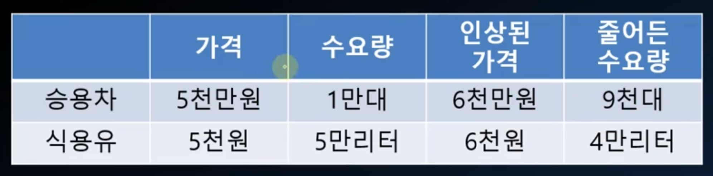
	- e > 1 :가격 탄력적 : 특정 모델 스마트폰이 비싸질 수록 특정 모델 스마트폰 수요가 떨어진다
	- e < 1 : 가격 비탄력적 : 치킨이 비싸진다고 수요는 변하지 않는다, 석유가 오른다고 수요는 변하지 않는다
- 교차 탄력성 $E_{xy} = \frac{\ \text{수요의 변화율 (상품 X)}}{\ \text{가격의 변화율 (상품 Y)}}$
	- 2가지 재화의 관계를 따진다
	- 여기서 중요한 것은 변화가 아닌 변화율이다 
	- e > 0 : 대체제 : 아반떼가 못생기면 k5 가 잘 팔린다
	- e < 0 : 보완재 : 자동차 산업이 호황이면 자동차 보험도 호황이다
> 어떤 2가지 재화가 동일한 산업인지 판단할 때 2가지 수요가 대채성 성향을 보일때 수요의 대채성 관점으로는 같은 산업이라고 판단한다
> 캐스퍼 가격이 조금 오른다고 g90 이 더 잘팔리지는 않는다 즉 대채성 성향을 보이지 않고 오히려 독립재적 특징을 보인다 하지만 수요의 대채성을 기준으로 산업을 정의한다면 g90 과 캐스퍼는 같은 산업이 아니라는 이상한 결론이 나온다 그래서 다른 방향으로도 접근해볼 필요가 있다

#### 핵심기준2 가격의 상관성
두 재화가 같은 산업에 속한다면 수요의 변화로 받는 가격 영향의 크기나 방향도 유사
- 이것을 보자 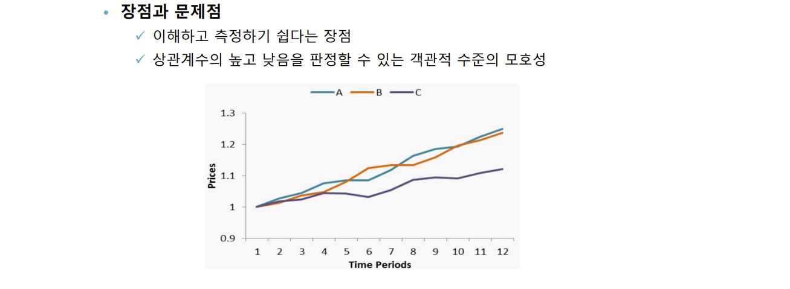

### 공학적 산업 공학
생산중심
기술 중심

### 산업 구조와 시스템 접근
### 산업 조직과 시스템 접근
- 주요기준 1 : 산업 집중도
	- 산업을 지배하는 힘이 소수 기업에 집중되어 있는지 아니면 많은 기업에 분산되어 있는지에 대한 지표
- 주요기준 2 : 시장의 경쟁 형태
  
| 경쟁 형태  | 기업의 수 | 제품 차별성   | 진입/퇴출장벽 |
| ------ | ----- | -------- | ------- |
| 완전경쟁   | 많음    | 
낮음      | 낮음      |
| 독점적 경쟁 | 많음    | 부분 시장 지배 | 낮음      |
| 과점    | 소수    | 낮음 or 높음 | 높음      |
| 독점     | 한개    | -        | 높음      |

- 정량적 지표 : 집중도 지수 CR 
	- CRN 상위 N 개 기업의 집중도
		- CR1 >= 50 : 독점
		- CR2 >= 75 : 복점
		- CR3 >= 75 : 과점
		- CR4 < 40 : 경쟁
	- 장점: 이해 및 측정이 용이함
	- 단점: 측정 대상으로 포함된 N개 기업 전체의 집중도 값은 알 수 있으나 개별기업 각각의 차이는 알 수 없음
- 허핀달 인덱스 HI
	- 분산과 일정 부분 비슷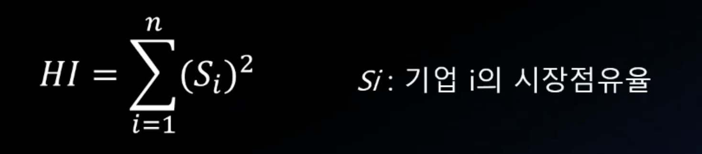
	- 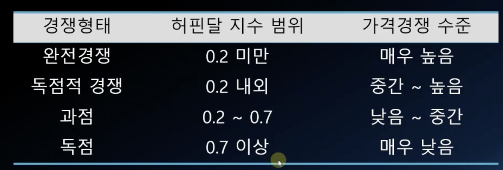

### 산업 분석과 시스템 접근

- Five-forces 모형(Porter, 1979): 전략적 목적에서의 산업시스템 분석
	- 기본 가정: 기업의 수익성, 경쟁력, 매력도의 핵심은 5가지 구조적 요인(force)
	- 기존경쟁자 – 경쟁수준
		- 경쟁 기업의 수
		- 시장의 크기
		- 시장의 성장률
		- 제품의 차별성 수준
		- 고정 비용
		- 철수 장벽의 수준(높이)
	- 공급자 – 교섭력 (원자재 남품 대상 기업)
		- 경쟁 기업의 수공급자의 수
		- 공급 제품(서비스)의 차별성
		- 공급 제품(서비스)의 대체재 수
		- 공급자 변경 용이성
		- 공급자의 대형화 가능성
	- 구매자 - 교섭력 (구매자의 힘)
		- 구매자의 수
		- 구매량
		- 대체재 수
		- 구매자의 집중도(소수 구매자의 비중)
		- (구매자 입장에서) 공급자 교체 비용
		- 제품(서비스)의 차별성
		- 브랜드 인지도
	- 잠재적 경쟁자 – 진입장벽
		- 초기 자본금
		- 법률적 제도적 규제 수준
		- 규모의 경제 도달 가능성
		- 제품(서비스)의 차별화
		- 브랜드 충성도
		- 유통 채널의 이용 용이성
		- 철수 장벽의 수준(높이)
	- 대체재 – 등장 가능성
		- 향후 대체재의 수
		- 대체재의 질적 수준
		- 대체재의 가격
		- 구매자의 대체재 구매 가능성

## 4장
### 기업조직과 시스템 접근
- 기업의 규모 (scale)
	- 정량적 기준 : 매출액, 종업원수, 자본금 등 → 대기업, 중견기업, 중소기업 분류
	- 전략적 기준 : “규모의 경제” 개념과 연계
- 규모의 경제 (economies of scale)
	- 기업의 규모가 커지면서 얻을 수 있는 비용의 절감효과나 생산의 확대효과
- 범위의 경제 (economies of scope)
	- 여러 재화를 따로 생산하는데 드는 비용과 묶어서 함께 생산하는데 드는 비용의 크기를 비교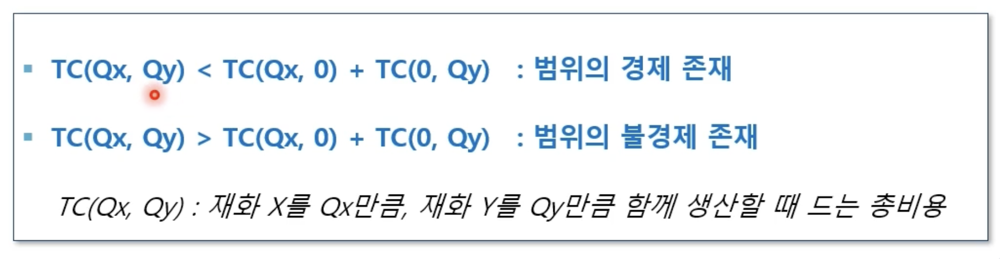
- 기업의 성장 옵션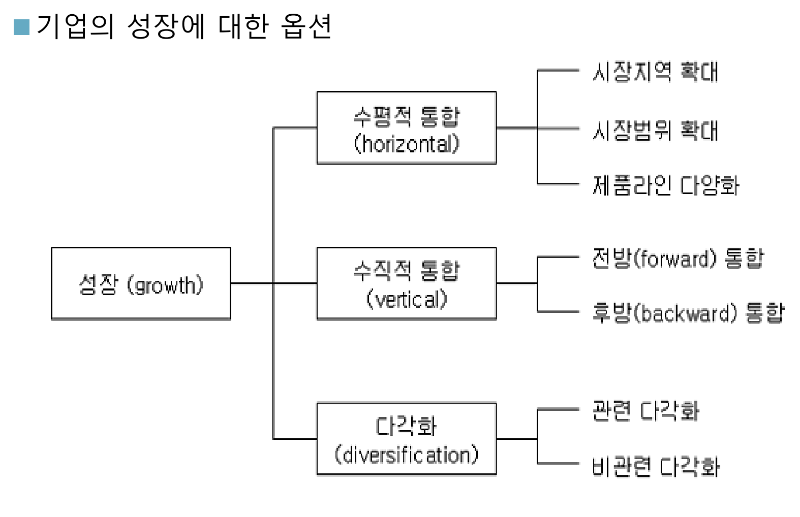

### 경영전략과 시스템 접근

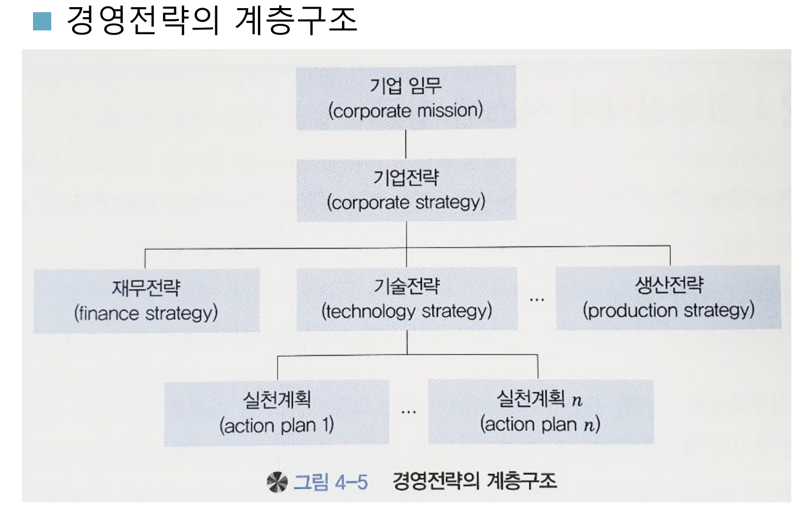

- 기본분석 - SWOT 분석
	- 기업 내부의 강점(S: Strength)
	- 약점(W: Weakness)
	- 기업 외부의 기회(O: Opportunity)
	- 위협(T: Threat) 요인을 종합적으로 분석
- SWOT 분석의 절차
- 1단계: 기업(사업) 프로필 분석 – 업종, 시장 영역, 경쟁 상황, 최고경영층 능력과 비전 등
- 2단계: 외부환경 분석 – 시장요인, 경쟁요인, 경제요인, 기술 요인, 사회 요인 등
- 3단계: 기회-위협 요인 도출
- 4단계: 내부조건 분석 – 마케팅 능력, 재무 능력, 연구개발 능력, 생산/물류능력, 관리 능력
- 5단계: 강점-약점 요인 도출
- 6단계: SWOT 매트릭스 도출
- 7단계: 전략 방향 제시
	- 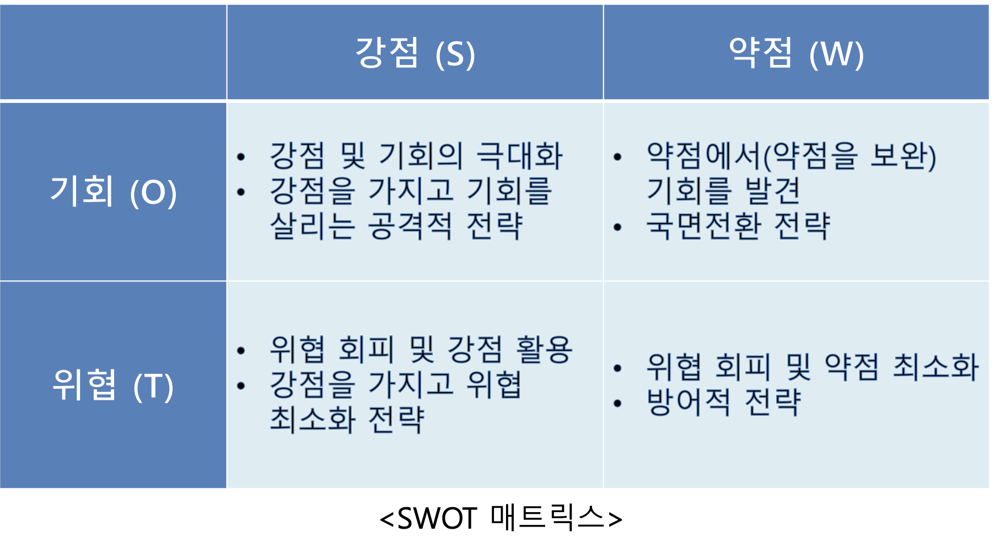
- 포지션 분석 (위상 분석)
	- 분석과 조사의 대상이 되는 중요 요인들에 대해서, 우리 기업 또는 제품이 다른 기업과 비교하여 상대적으로 어떤 위상을 차지하는지 살펴보는 분석
	- 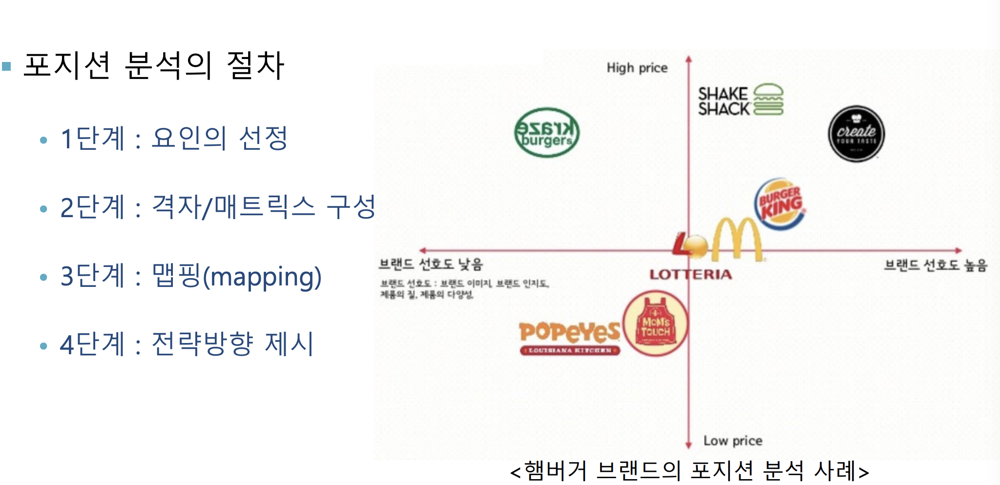
- 포트폴리오 분석 (분포 분석)
	- 기업이 현재 수행하고 경영 과제와 미래에 수행할 과제들이 전체적으로 어떻게 분포되어 있는가를 살펴보는 분석
	- 목적과 용도
		- 분포도 작성 : 기업의 보유 제품라인 / 비즈니스의 균형 정도 파악
		- 전략방향 조정 : 포트폴리오를 개선/조정할 수 있는 전략적 방향 및 비율 결정
	- 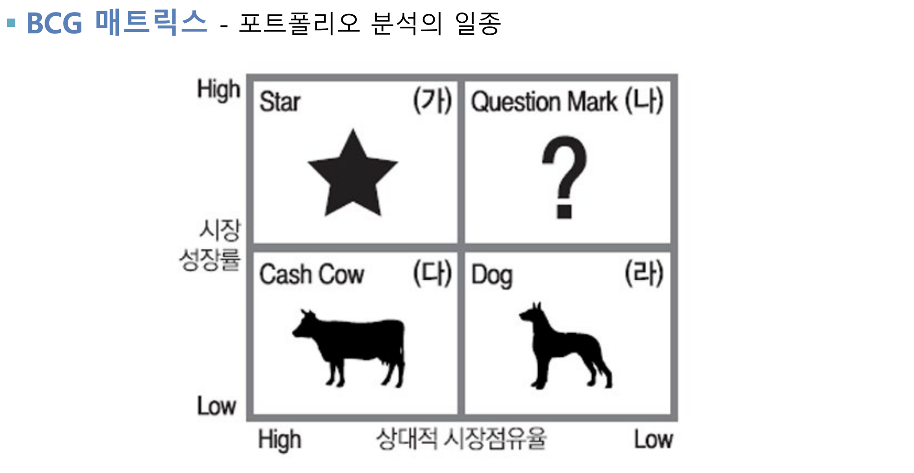
- 동태 분석 (Dynamic Analysis)
	- 분석대상이 되는 요인의 상태가 시간의 흐름에 따라 어떻게 변화하고 있는지를 살펴보는 분석
	- 분석대상 요인의 변화방향과 변화율
	- 분석대상 요인의 중장기적 성장성이나 경쟁력

원가 우위 전략
차별화 전략
집중화 전략
### 경영조직과 시스템 접근

## 5장

### 제품의 유형
계획생산(MST)
주문 생산 (MTO)
주문 조립 (ATO) 부품 제고 있음
주문 설계 (DTO)

소품종 대량생산 전략 vs 다품종 소량생산 전략

대량맞춤 전략 (mass customization)
### 제조공정 분류

공정별 배치 – Job Shop
 유사한 기능을 가지는 설비들을 모아 한 지역에 배치
 유연성은 높으나, 효율성은 낮음

제품별 배치 – Flow Shop
 특정 제품(부품)의 생산에 필요한 설비만을 뽑아 한 장소(라인)에 배치
 자동차 조립라인, 자동차 차체성형 라인, TV 조립라인, 맥주 생산라인
 효율성은 높으나, 유연성은 낮음

고정형 배치
 생산 제품이 하나의 장소에 고정되어 있고, 인력과 물자가 이동하는 형태
 대형선박 조선, 항공기 생산, 건축
 인력과 자재의 이동 비용이 크고, 설비 활용도가 낮음

### 제품과 공정의 조합

### 설비입지