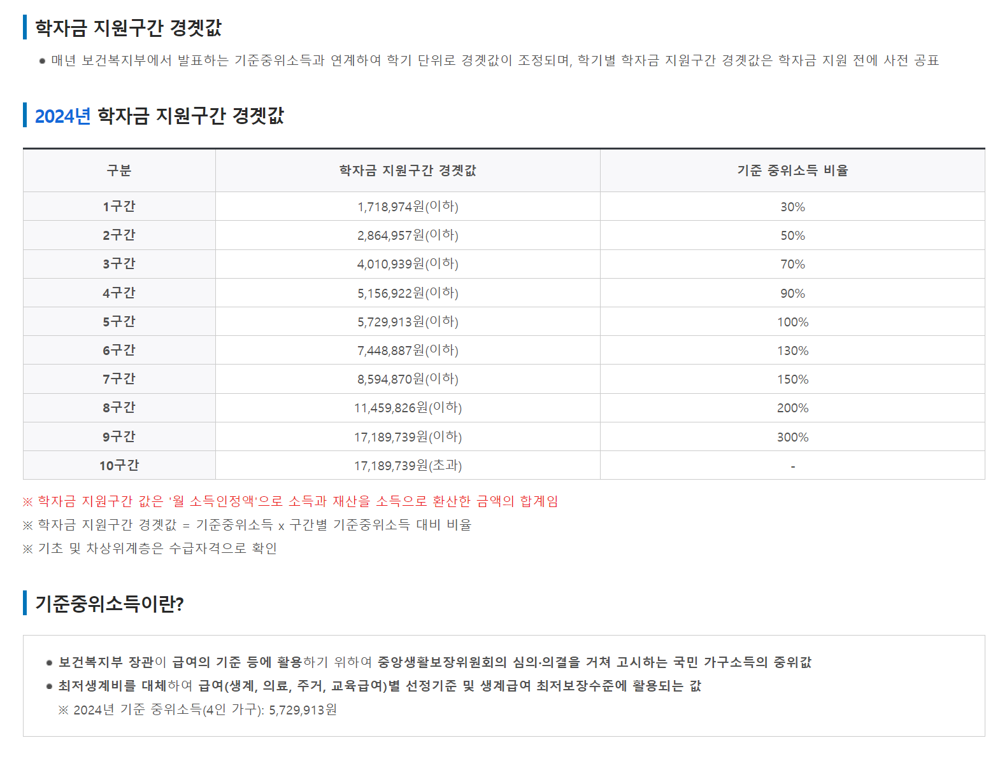

## 학자금 대출
3000 만원의 대출금의 경우 1.7% 기준 1년에 510,000 의 이자가 발생하고 한달 42500원의 이자금이 발생되게 된다
2000만원의 대출금의 경우 1.7% 기준 1년에 28,333 의 이자가 발생하고 한달 28333원의 이자금이 발생되게 된다

## 세대주 관련
주민등록법상
세법상
주택청약시

**주민등록법상과 관련되 세대주** 의 경우에는 단순히 전입신고를 통해 세대주가 인정되게 된다
**세법상**의 경우에는 전입신고와 (30세 이상 또는 결혼 또는 중위소득 40 이상(2024 기준 891,378원)(지난 1년이상)) 을 받으면 인정되게 된다
**주택청약시** 세대주 요건의 경우에는 위의 경우 세법상 경우를 따라가지만 무주택 기간산정에(보통은 만 30세 이상부터 카운트가 되고, 만 30세 전이라도 혼인시에는 혼인신고 시점부터 무주택 기간이 산정됩니다)

## 소득기준
%20image%2020240826145746.png)
중위소득 50% 1인 가구 기준 1,114,223
중위 소득 40% 1인 가구 기준 891,378

cb300

임페리알레400
메테오350
아퀼라300