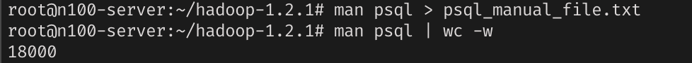
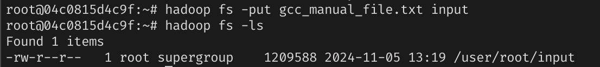
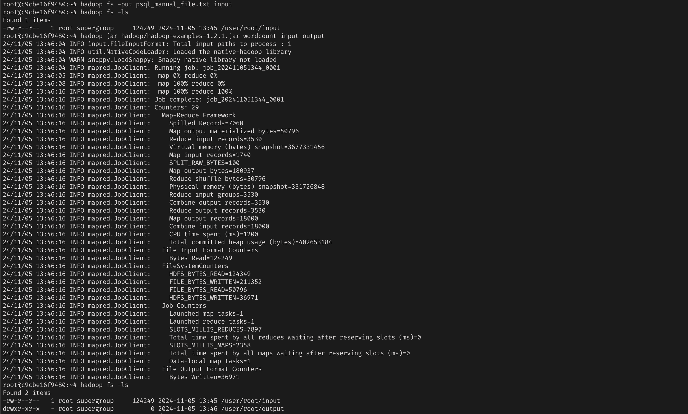
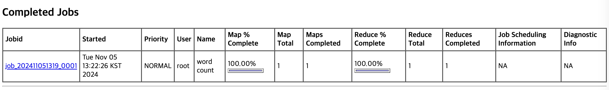
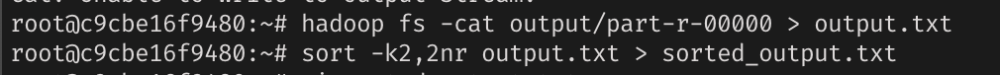
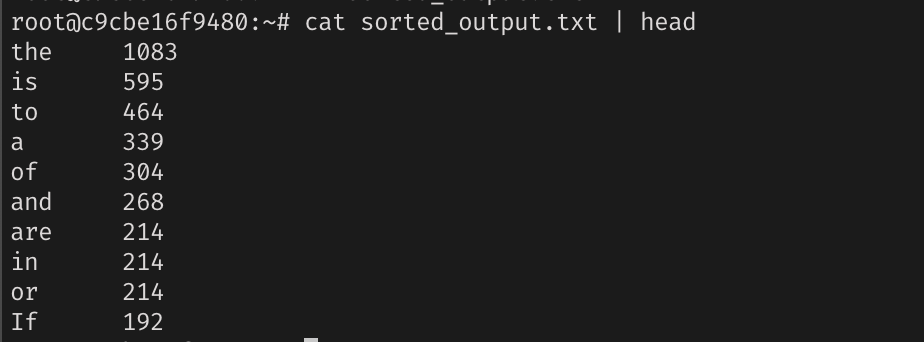

## 하둡 컨테이너를 구성하고자 하는 환경(가상머신, 리눅스 서버 등) 설명
초기 arm 기반 mac 에서 실행되지 않아
홈서버를 사용하여 x86-64 cpu, linux ubuntu server 버전에서 ssh 로 접근하여 사용하였음
```bash
-p 50070:50070 
-p 50030:50030
``` 
등을 사용하여 실행시 적절하게 외부에서 hdfs mapreduce 웹 인터페이스 또한 접근가능


## WordCount 실행 결과

psql manual 파일을 사용하였다 
psql_manual_file.txt 를 하둡파일시스템으로 input


실행 및 웹 인터페이스로 접근한 완료된 word count 작업



-k2,2nr: 두 번째 필드(빈도수)를 기준으로 내림차순(nr)으로 정렬


결과예시


