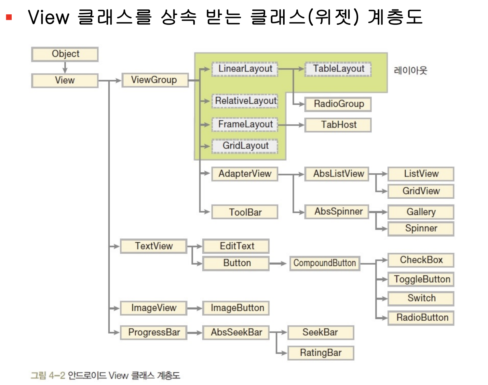
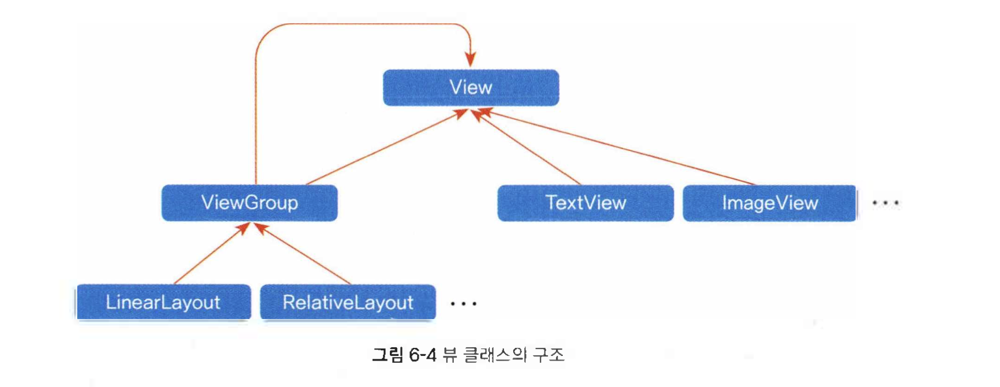
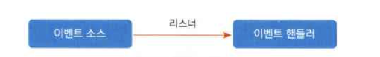

## kotlin 기본 문법

### ​kotlin keyword
#### 1. Hard Keywords  
*(문법 구조에 필수적이며, 식별자로 절대 사용할 수 없음)*

| 키워드 | 설명 |
|--------|------|
| `as` (cast) | 타입 캐스팅 (`val x = obj as String`) |
| `as` (import) | 임포트 시 별칭 지정 (`import foo.Bar as Baz`) |
| `as?` | 안전한 타입 캐스팅 (실패 시 `null` 반환) |
| `break` | 루프 또는 라벨 블록 탈출 |
| `class` | 클래스 정의 |
| `continue` | 현재 루프 반복 건너뛰기 |
| `do` | `do-while` 루프 시작 |
| `else` | `if` 조건의 대안 블록 |
| `false` | 불리언 상수: 거짓 |
| `for` | 컬렉션/범위 반복 (`for (i in list)`) |
| `fun` | 함수 정의 |
| `if` | 조건 분기 |
| `in` | 범위/컬렉션 멤버 확인 또는 `for` 루프에서 사용 |
| `!in` | `in`의 부정 |
| `interface` | 인터페이스 정의 |
| `is` | 타입 확인 (`if (obj is String)`) |
| `!is` | `is`의 부정 |
| `null` | 널 참조 값 |
| `object` | 싱글톤 객체 또는 익명 객체 정의 |
| `package` | 패키지 선언 |
| `return` | 함수 또는 라벨에서 반환 |
| `super` | 상위 클래스 참조 |
| `this` | 현재 객체 참조 |
| `throw` | 예외 발생 |
| `true` | 불리언 상수: 참 |
| `try` | 예외 처리 블록 시작 |
| `typealias` | 타입 별칭 정의 |
| `typeof` | Kotlin/JS 전용; 일반 Kotlin에서는 사용되지 않음 |
| `val` | 읽기 전용 변수 선언 |
| `var` | 변경 가능한 변수 선언 |
| `when` | 다중 조건 분기 (`switch` 대체) |
| `while` | 조건이 참일 동안 반복 |

---

#### 2. Soft Keywords  
*(특정 문맥에서만 키워드로 동작하며, 일반 식별자로 사용 가능)*

| 키워드 | 설명 |
|--------|------|
| `by` | 위임 구현 (`class C : B by b`) |
| `catch` | `try-catch`에서 예외 처리 블록 |
| `constructor` | 주/부생성자 명시 (`class A constructor(...)`) |
| `delegate` | 속성 위임 내부 식별자 (컴파일러용) |
| `dynamic` | Kotlin/JS에서 동적 타입 선언 |
| `field` | 커스텀 getter/setter 내 백킹 필드 참조 |
| `file` | 파일 레벨 식별자 (메타프로그래밍/컴파일러용) |
| `finally` | `try-finally`에서 항상 실행되는 블록 |
| `get` | 속성 getter 정의 (`val x: Int get() = ...`) |
| `import` | 패키지/클래스 임포트 |
| `init` | 초기화 블록 (`init { ... }`) |
| `param` | 어노테이션 파라미터 식별자 |
| `property` | 속성 관련 메타정보 식별자 |
| `receiver` | 확장 함수 수신 객체 식별자 |
| `set` | 속성 setter 정의 (`var x: Int set(value) { ... }`) |
| `setparam` | setter 내 파라미터 식별자 (`value`) |
| `where` | 제네릭 제약 조건 (`<T> where T : Comparable<T>`) |

---

#### 3. Modifier Keywords  
*(선언에 대한 속성 또는 동작을 지정)*

| 키워드 | 설명 |
|--------|------|
| `actual` | 멀티플랫폼 프로젝트에서 실제 구현 지정 |
| `abstract` | 추상 클래스 또는 멤버 (구현 없음) |
| `annotation` | 어노테이션 클래스 정의 |
| `companion` | 컴패니언 객체 선언 (`companion object { }`) |
| `const` | 컴파일 타임 상수 (`const val MAX = 100`) |
| `crossinline` | 람다 내 non-local return 금지 |
| `data` | 데이터 클래스 (`equals`, `hashCode`, `toString` 자동 생성) |
| `enum` | 열거 클래스 정의 |
| `expect` | 멀티플랫폼에서 예상 선언 |
| `external` | 외부(Native/JS) 구현 선언 |
| `final` | 오버라이드 불가 (기본값, 명시적 사용 드묾) |
| `infix` | 중위 함수 (`a plus b` 대신 `a plus b`) |
| `inline` | 함수/클래스를 호출 위치에 인라인 확장 |
| `inner` | 내부 클래스 (외부 클래스 인스턴스 참조 가능) |
| `internal` | 같은 모듈 내에서만 접근 가능 |
| `lateinit` | 나중에 초기화되는 non-null `var` |
| `noinline` | 람다를 인라인하지 않음 |
| `open` | 오버라이드 가능 (기본은 `final`) |
| `operator` | 연산자 오버로딩 함수 지정 |
| `out` | 공변성 제네릭 (`Producer<out T>`) |
| `override` | 상위 클래스/인터페이스 멤버 재정의 |
| `private` | 선언된 스코프 내에서만 접근 가능 |
| `protected` | 하위 클래스까지 접근 가능 |
| `public` | 모든 곳에서 접근 가능 (기본 접근 수준) |
| `reified` | 인라인 함수에서 제네릭 타입 실체화 |
| `sealed` | 제한된 하위 클래스 집합 (밀봉 클래스) |
| `suspend` | 코루틴에서 사용 가능한 함수 |
| `tailrec` | 꼬리 재귀 최적화 함수 |
| `vararg` | 가변 인자 (`fun f(vararg args: Int)`) |

---

#### 4. Special Identifiers  
*(특정 문맥에서만 특별한 의미를 가지는 식별자)*

| 식별자 | 설명 |
|--------|------|
| `field` | 커스텀 getter/setter 내에서 백킹 필드 참조 (`get() = field`) |
| `it` | 람다 식에서 단일 파라미터의 암시적 이름 (`list.map { it * 2 }`) |

> ✅ **참고**:  
> - `field`는 속성 접근자 내에서만 특별한 의미를 가지며, 그 외에서는 일반 식별자로 사용 가능합니다.  
> - `it`은 람다 파라미터가 하나일 때 자동으로 사용되는 이름입니다.  

### basic data type

```kotlin
var a: Boolean = true     // 논리 (true, false)
var b: Byte = 123         // 8 트 정수 (-128 ~ 127) 
var c: Short = 123        // 16비트 정수 (-32768 ~ 32767) 
var d: Int = 123          // 32비트 정수 (-2 31 ~ 2 31 -1) 
var e: Long = 123L        // 64비트 정수 (-2 63 ~ 2 63 -1) 
var f: Float = 12.3F      // 32비트 부동 소수점
var g: Double = 12.3      // 64비트 부동 소수점 
var h: Char = 'A'         // 문자 (글자 하나)
var i: String= "ABC"      // 문자열
```




## 안드로이드 컴포넌트란
### android component

안드로이드 앱은 네 가지 핵심 구성 요소, 즉 **안드로이드 컴포넌트**로 이루어져 있습니다.  
이들은 각각 다른 역할을 수행하며, 앱이 정상적으로 동작하도록 지원합니다.  
네 가지 컴포넌트는 다음과 같습니다:

#### 1. **액티비티 **(Activity)  
액티비티는 **앱의 화면을 구성하는 컴포넌트**입니다.  
사용자가 보는 하나의 화면(예: 로그인 화면, 메인 화면 등)은 하나의 액티비티로 표현됩니다.  
앱을 실행하면, 기본 액티비티가 시작되어 그 내용이 안드로이드 기기의 화면에 표시됩니다.  
따라서 **화면을 출력하려면 반드시 액티비티를 만들어야 합니다**.
##### 관련 폴더 및 파일:
- **`res/layout/`**  
  → 액티비티의 UI를 정의하는 **XML 레이아웃 파일**이 위치합니다.  
  예: `activity_main.xml`, `login_screen.xml`  
  → `setContentView(R.layout.activity_main)`에서 참조됨.
- **`src/` (Kotlin/Java 소스 코드)**  
  → 각 액티비티는 `AppCompatActivity`를 상속하는 클래스로 구현됩니다.  
  예: `MainActivity.kt`
- **`AndroidManifest.xml`**  
  → 모든 액티비티는 반드시 여기에 `<activity>` 태그로 등록되어야 합니다.  
  → LAUNCHER 액티비티는 `<intent-filter>`로 지정됩니다.
- **`res/values/strings.xml`, `colors.xml`, `dimens.xml` 등**  
  → 액티비티 UI에서 사용하는 텍스트, 색상, 크기 등의 값 정의.

> **액티비티는 `res/layout/`과 가장 밀접**하며, `AndroidManifest.xml`에 등록되고, `src/` 내 클래스로 구현됩니다.

---

#### 2. **서비스 **(Service)  
서비스는 **백그라운드에서 장시간 작업을 수행하는 컴포넌트**입니다.  
화면을 표시하지 않으며, 사용자와 직접 상호작용하지 않습니다.  
예를 들어, 음악 재생, 파일 다운로드, 위치 추적과 같은 작업은 앱이 백그라운드에 있어도 계속 실행되어야 하므로 서비스를 사용합니다.
##### 관련 폴더 및 파일:
- **`src/` (Kotlin/Java 소스 코드)**  
  → `Service` 또는 `IntentService`, `JobIntentService` 등을 상속하는 클래스로 구현.  
  예: `MusicPlaybackService.kt`
- **`AndroidManifest.xml`**  
  → `<service android:name=".MusicPlaybackService" />`로 등록 필수.  
  → 권한이 필요한 경우 `<uses-permission>`과 함께 사용.
- **`res/` 폴더와의 관계**:  
  → 서비스는 **UI가 없으므로 `layout`이나 `drawable` 등과 직접적 연관 없음**.  
  → 단, 알림(Notification)을 표시할 경우 `res/drawable/`의 아이콘을 사용할 수 있음.

> **서비스는 주로 `src/`와 `AndroidManifest.xml`에 의존**, 리소스 폴더와는 간접적 연관만 있음.

---

#### 3. **콘텐츠 프로바이더 **(Content Provider)  
콘텐츠 프로바이더는 **앱 간에 데이터를 공유하는 컴포넌트**입니다.  
안드로이드 기기에는 여러 앱이 설치되어 있고, 이들 사이에서 데이터를 안전하게 주고받을 필요가 있습니다.  
예를 들어, 카카오톡에서 프로필 사진을 변경할 때 갤러리 앱의 사진을 선택할 수 있습니다.  
이때 갤러리 앱은 자신의 이미지 데이터를 **콘텐츠 프로바이더를 통해 공유**하고, 카카오톡은 이를 통해 데이터에 접근합니다.
##### 관련 폴더 및 파일:
- **`src/`**  
  → `ContentProvider`를 상속하는 클래스로 구현.  
  예: `ContactProvider.kt`
- **`AndroidManifest.xml`**  
  → `<provider>` 태그로 등록 필수.  
  → `android:authorities` 속성으로 고유 URI 지정 (예: `com.example.app.provider`).
- **데이터베이스 관련**:  
  → 일반적으로 `Room`, `SQLiteOpenHelper`와 함께 사용되며, 이는 `src/` 내부에 구현됨.
- **`res/` 폴더와의 관계**:  
  → 콘텐츠 프로바이더 자체는 리소스 폴더와 **거의 무관**.  
  → 단, 공유되는 데이터가 이미지일 경우 `res/drawable/` 또는 외부 저장소 경로를 반환할 수 있음.

> **콘텐츠 프로바이더는 `src/`와 `AndroidManifest.xml` 중심**, 리소스 폴더와는 거의 독립적.

---

#### 4. **브로드캐스트 리시버 **(Broadcast Receiver)  
브로드캐스트 리시버는 **시스템에서 발생하는 특정 이벤트에 반응하는 컴포넌트**입니다.  
여기서 말하는 이벤트는 사용자의 터치나 클릭과 같은 화면 상의 동작이 아니라,  
**시스템 수준의 이벤트**를 의미합니다.  
예를 들어, 기기 부팅 완료, 배터리 잔량 부족, 네트워크 연결 상태 변경 등이 있습니다.  
이러한 이벤트가 발생하면, 등록된 브로드캐스트 리시버가 자동으로 실행되어 적절한 처리를 수행할 수 있습니다.
##### 관련 폴더 및 파일:
- **`src/`**  
  → `BroadcastReceiver`를 상속하는 클래스로 구현.  
  예: `BootReceiver.kt`
- **`AndroidManifest.xml`**  
  → 정적 등록 시 `<receiver>` 태그 사용.  
  예: 기기 부팅 시 실행되려면 `<intent-filter>`에 `android.intent.action.BOOT_COMPLETED` 지정.
- **동적 등록**:  
  → 액티비티나 서비스 내에서 `registerReceiver()`로 코드 상에서 등록 가능 → 이 경우 Manifest 등록 불필요.
- **`res/` 폴더와의 관계**:  
  → 리시버는 **UI 없이 이벤트만 처리**하므로 리소스 폴더와 거의 무관.  
  → 단, 이벤트 처리 결과로 알림을 띄울 경우 `res/drawable/` 아이콘 사용 가능.

> **브로드캐스트 리시버는 `src/`와 `AndroidManifest.xml`에 의존**, 리소스 폴더와는 거의 관련 없음.

---

#### 정리

| 컴포넌트           | 태그           | 주요 역할                |
| -------------- | ------------ | -------------------- |
| **액티비티**       | `<activity>` | 화면 표시 및 사용자 인터페이스 제공 |
| **서비스**        | `<service>`  | 백그라운드에서 장시간 작업 실행    |
| **콘텐츠 프로바이더**  | `<provider>` | 앱 간 데이터 공유           |
| **브로드캐스트 리시버** | `<receiver>` | 시스템 이벤트 수신 및 처리      |
|                |              |                      |
### resource folder 리소스 폴더 와 R.java
 - drawable： 이미지 리소스
 - layout： UI 구성에필요한 XML 리소스
 - mipmap： 앱 아이콘 이미지
 - values： 문자열 등의 값으로 이용되는 리소스

> R.java 는 **모든 리소스를 컴포넌트 코드에서 참조할 수 있게 해주는 브릿지** 역할

> R.java 의 경우 AGP 3.6 부터 제거 되었고 현재 R.txt 와 R.jar 형태로만 존재한다

```bash
$ find app/build -name "R.*"
app/build/intermediates/compile_and_runtime_not_namespaced_r_class_jar/debug/processDebugResources/R.jar
app/build/intermediates/runtime_symbol_list/debug/processDebugResources/R.txt

$ jar -tf app/build/intermediates/compile_and_runtime_not_namespaced_r_class_jar/debug/processDebugResources/R.jar

## 특정 리소스 파일 검색
$ grep -i "person1\|send\|test" app/build/intermediates/runtime_symbol_list/debug/processDebugResources/R.txt
int drawable abc_vector_test 0x7f070077
int drawable person1 0x7f0700e4
int drawable send 0x7f0700e5
int drawable test_level_drawable 0x7f0700e6
int id immediateStop 0x7f0800dc
int layout ime_base_split_test_activity 0x7f0b002d
int layout ime_secondary_split_test_activity 0x7f0b002e
```

### GUI 기본 개념

#### 관심사의 분리 **(Separation of Concerns)

모든 GUI 프레임워크는 다음 세 가지 책임을 **명확히 분리**하려는 목표를 공유합니다:

| 역할                        | 책임                 | 핵심 질문                            |
| ------------------------- | ------------------ | -------------------------------- |
| **1. 구조 **(Structure)     | 화면에 **무엇이 있는가**?   | “어떤 컴포넌트들이 있고, 어떻게 배치되어 있는가?”    |
| **2. 스타일 **(Presentation) | 화면이 **어떻게 보이는가**?  | “색상, 크기, 여백, 폰트, 정렬은 어떻게 되는가?”   |
| **3. 동작 **(Behavior)      | 화면이 **어떻게 반응하는가**? | “버튼 클릭 시 무엇을 하며, 데이터는 어떻게 바뀌는가?” |

#### **각 역할의 구현 방식: 플랫폼별 비교**

| 역할                    | **Web **(HTML/CSS/JS)                                            | **Android **(Jetpack Compose 제외)                                                                       | **iOS **(SwiftUI)                                                                        | **Flutter**                                                                            | **데스크톱 **(예: Qt)                                   |
| --------------------- | ---------------------------------------------------------------- | ------------------------------------------------------------------------------------------------------ | ---------------------------------------------------------------------------------------- | -------------------------------------------------------------------------------------- | -------------------------------------------------- |
| **구조**<br>(무엇을 보여줄까?) | **HTML**<br>→ 태그 기반 계층 구조                                        | **XML 레이아웃 파일**<br>→ `<LinearLayout>`, `<TextView>` 등                                                  | **Swift 코드**<br>→ 선언적 뷰 DSL (`VStack`, `Text`, `Button`)                                 | **Dart 위젯 트리**<br>→ `Column`, `Text`, `ElevatedButton`                                 | **QML **(Qt Modeling Language)<br>또는 **C++ 위젯 트리** |
| **스타일**<br>(어떻게 보일까?) | **CSS**<br>→ 완전 분리된 스타일 시트<br>→ 클래스, 선택자, 반응형 디자인                | **XML 속성 + 스타일 리소스**<br>→ `android:padding`, `style="@style/MyButton"`<br>→ `dimens.xml`, `colors.xml` | **메서드 체인**<br>→ `.frame(width: 100)`, `.foregroundColor(.blue)`<br>→ `ViewModifier`로 재사용 | **위젯 내장 속성**<br>→ `TextStyle`, `BoxDecoration`, `SizedBox`<br>→ `ThemeData`로 전역 스타일 통일 | **QSS **(Qt Style Sheets)<br>또는 **속성 바인딩**         |
| **동작**<br>(어떻게 반응할까?) | **JavaScript **(또는 TypeScript)<br>→ DOM 이벤트, 상태 관리 (React/Vue 등) | **Kotlin / Java**<br>→ `setOnClickListener`, ViewModel, LiveData                                       | **Swift**<br>→ `@State`, `@Binding`, `Button(action: { ... })`                           | **Dart**<br>→ 상태 관리 (`setState`, `Provider`, `Riverpod`)                               | **C++ / JavaScript**<br>→ 슬롯/시그널, 이벤트 핸들러          |

> 💡 **공통점**:  
> - 모두 **트리 구조**(Tree)로 UI를 표현 (DOM, View Hierarchy, Widget Tree 등)  
> - **선언적**(Declarative) 방식이 주류 (특히 최신 프레임워크)  
> - **상태 → UI**의 단방향 흐름을 지향

#### **추상화된 개념 이름 **(Cross-Platform Terminology)

| 개념 | 설명 | 대응 용어 예시 |
|------|------|----------------|
| **UI Tree / Element Tree** | 컴포넌트의 계층 구조 | DOM Tree, View Hierarchy, Widget Tree |
| **Layout System** | 크기와 위치를 계산하는 방식 | CSS Box Model, Android LayoutParams, SwiftUI Auto Layout, Flutter RenderObject |
| **Styling System** | 시각적 속성 관리 체계 | CSS, Android Themes, SwiftUI Modifiers, Flutter ThemeData |
| **Reactivity / State Management** | 상태 변화 → UI 자동 갱신 | React Hooks, Android ViewModel, SwiftUI `@State`, Flutter `setState` |

#### **진화 방향: 선언적 UI와 통합**

과거에는 **명령형**(Imperative) 방식이 일반적이었으나 (예: `button.setWidth(100)`),  
최근에는 **선언적**(Declarative) 방식이 표준이 되었습니다:

> “**어떻게 그리는가**”가 아니라,  
> “**어떤 상태일 때 어떤 UI를 원하는가**”를 기술

- **React** → Virtual DOM + 선언적 JSX  
- **Jetpack Compose / SwiftUI / Flutter** → 순수 함수형 UI, 상태 기반 재구성  
- **Web Components / CSS Container Queries** → 웹도 선언적/컴포넌트 기반으로 진화 중

#### **요약: GUI 개발의 거시적 틀**

```text
                     ┌───────────────────────┐
                     │      사용자 입력       │
                     │   (터치, 클릭, 키보드)  │
                     └──────────┬────────────┘
                                ▼
                     ┌───────────────────────┐
                     │     동작 **(Behavior)    │ ← 프로그래밍 언어
                     │   (상태 변경, 로직 처리)  │
                     └──────────┬────────────┘
                                ▼
                     ┌───────────────────────┐
                     │     구조 **(Structure)   │ ← 마크업 또는 선언적 코드
                     │   (어떤 컴포넌트가 있는가)│
                     └──────────┬────────────┘
                                ▼
                     ┌───────────────────────┐
                     │     스타일 **(Style)     │ ← 시각적 속성
                     │   (크기, 색상, 여백 등)   │
                     └──────────┬────────────┘
                                ▼
                     ┌───────────────────────┐
                     │      렌더링 엔진        │
                     │ (브라우저, OS, 프레임워크)│
                     └───────────────────────┘
```

---


#### General Sizing Strategies
| 종류                                             | 설명                            | 대표 예시                                                      |
| ---------------------------------------------- | ----------------------------- | ---------------------------------------------------------- |
| **절대 크기 **(Absolute / Fixed Size)              | 고정된 수치로 크기를 지정                | `width: 200px`,`height: 100dp`                             |
| **상대 크기 **(Relative Size)                      | 부모, 형제, 화면 등 다른 요소에 비례해 크기 결정 | `width: 50%`,`flex: 1`,`weight`                            |
| **콘텐츠 기반 크기 **(Content-based / Intrinsic Size) | 내부 콘텐츠에 따라 자동 조정              | `wrap_content`,`width: fit-content`,`intrinsicContentSize` |
| **부모 기반 크기 **(Parent-filling Size)             | 부모 컨테이너를 꽉 채움                 | `match_parent`,`width: 100%`,`flex: 1`(특정 상황)              |
#### 결론

> **모든 현대 GUI 시스템은 “구조–스타일–동작”이라는 3층 구조를 따르며**,  
> 플랫폼에 따라 표현 방식은 다르지만 **동일한 설계 철학**을 공유합니다.  
> 이 틀을 이해하면 **어떤 UI 프레임워크든 빠르게 학습하고 전이할 수 있습니다**.

이 구조는 단순한 기술 분류를 넘어, **효율적인 소프트웨어 설계 원칙** 그 자체입니다.
현대 GUI**(Graphical User Interface)** 개발은 **선언적**(declarative) 접근 방식을 많이 사용하며, 이는 일반적으로 다음과 같은 **3가지 핵심 역할 분담**으로 구성됩니다:


### 레이아웃 구성 방법
- 레이아웃 xml 을 통해 선언적으로 구성
- 엑티비티 코드로 작성하는 방법

코드로 구성하는 방법  

```kotlin
class MainActivity : AppCompatActivity() {
    override fun onCreate(savedInstanceState: Bundle?) {
        super.onCreate(savedInstanceState)

        // 이름 문자열을 출력할 TextView 생성
        val name = TextView(this).apply {
            typeface = Typeface.DEFAULT_BOLD
            text = "Lake Louise"
        }

        // 이미지를 출력할 ImageView 생성
        val image = ImageView(this).apply {
            setImageDrawable(ContextCompat.getDrawable(this, R.drawable.lake_l))
        }

        // 주소 문자열을 출력할 TextView 생성
        val address = TextView(this).apply {
            typeface = Typeface.DEFAULT_BOLD
            text = "Lake Louise, AB, 캐나다"
        }

        // 세로 방향 LinearLayout 생성 및 설정
        val layout = LinearLayout(this).apply {
            orientation = LinearLayout.VERTICAL
            gravity = Gravity.CENTER

            // 뷰들을 LinearLayout에 추가
            addView(name, LinearLayout.LayoutParams.WRAP_CONTENT, LinearLayout.LayoutParams.WRAP_CONTENT)
            addView(image, LinearLayout.LayoutParams.WRAP_CONTENT, LinearLayout.LayoutParams.WRAP_CONTENT)
            addView(address, LinearLayout.LayoutParams.WRAP_CONTENT, LinearLayout.LayoutParams.WRAP_CONTENT)
        }

        // 최종 레이아웃을 화면에 설정
        setContentView(layout)
    }
}


```

### Empty Views Activity 실행 흐름

```
AndroidManifest.xml
<intent-filter> 내부에
<action android:name="android.intent.action.MAIN" />  
<category android:name="android.intent.category.LAUNCHER" />
가 있는 엑티비티를 열어야 한다
android:name=".MainActivity"
이므로 MainAvtivity 를 컴포넌트(액티비티)를 실행
---
MainAvtivity.ks
setContentView(R.layout.activity_main) 에 따라
activity_main.xml 를 로드

---

레이아웃이 하는 일
**화면 전체를 차지하는 `ConstraintLayout`** 을 만들고,
그 안에 **"Hello World!" 텍스트를 정중앙에 표시**하며,
**코드에서 이 레이아웃을 `R.id.main`으로 참조**할 수 있도록 ID를 부여합니다.

```

### 안드로이드 리소스 식별자 종류 및 사용 사례 종합표

| 리소스 유형<br>(Resource Type) | 정의 위치<br>(Resource Directory / File) | 주요 목적 | XML에서 사용 예 | 코드에서 참조 방식 | 실제 사용 사례 |
|-------------------------------|----------------------------------------|----------|------------------|---------------------|----------------|
| **`id`** | 레이아웃 XML 내부 (`android:id`) | 뷰를 코드에서 식별 | `android:id="@+id/submit_button"` | `R.id.submit_button` | `findViewById(R.id.submit_button)`로 버튼 제어 |
| **`string`** | `res/values/strings.xml` | 텍스트 내용 관리, 다국어 지원 | `android:text="@string/app_name"` | `R.string.app_name` | `getString(R.string.welcome)`로 메시지 표시 |
| **`color`** | `res/values/colors.xml` | 색상 값 정의 및 재사용 | `android:textColor="@color/primary"` | `R.color.primary` | `ContextCompat.getColor(context, R.color.error)` |
| **`dimen`** | `res/values/dimens.xml` | 여백, 크기, 글자 크기 정의 | `android:padding="@dimen/activity_margin"` | `R.dimen.activity_margin` | `resources.getDimension(R.dimen.text_size)` |
| **`style`** | `res/values/styles.xml` | 뷰 또는 앱 전체의 디자인 규칙 정의 | `style="@style/CustomButton"` | `R.style.CustomButton` | 액티비티 테마: `android:theme="@style/Theme.MyApp"` |
| **`layout`** | `res/layout/` 폴더 내 XML 파일 | 화면 UI 구조 정의 | — (파일 자체가 리소스) | `R.layout.activity_main` | `setContentView(R.layout.activity_main)` |
| **`drawable`** | `res/drawable/` 폴더 | 이미지, 아이콘, 벡터 그래픽 | `android:src="@drawable/ic_home"` | `R.drawable.ic_home` | `ImageView.setImageResource(R.drawable.logo)` |
| **`mipmap`** | `res/mipmap-*/` 폴더 | **앱 아이콘 전용** 이미지 | `android:icon="@mipmap/ic_launcher"` | `R.mipmap.ic_launcher` | `AndroidManifest.xml`에서 앱 아이콘 지정 |
| **`array`** | `res/values/arrays.xml` | 문자열/정수 배열 정의 | — | `R.array.countries` | `resources.getStringArray(R.array.countries)` |
| **`bool`** | `res/values/bools.xml` | 논리값 상수 정의 | `android:enabled="@bool/is_pro"` | `R.bool.is_pro` | `resources.getBoolean(R.bool.is_tablet)` |
| **`integer`** | `res/values/integers.xml` | 정수 상수 정의 | `android:max="@integer/max_count"` | `R.integer.max_count` | `resources.getInteger(R.integer.retry_limit)` |
| **`anim`** | `res/anim/` 폴더 | 뷰 애니메이션 정의 | — | `R.anim.fade_in` | `overridePendingTransition(R.anim.slide_in, R.anim.slide_out)` |
| **`animator`** | `res/animator/` 폴더 | 속성 애니메이션 (Property Animation) | — | `R.animator.rotate` | `AnimatorInflater.loadAnimator(context, R.animator.bounce)` |
| **`menu`** | `res/menu/` 폴더 | 액션바, 컨텍스트 메뉴 정의 | — | `R.menu.main_menu` | `menuInflater.inflate(R.menu.main_menu, menu)` |
| **`xml`** | `res/xml/` 폴더 | 설정, 검색, 키보드 등 구조화된 데이터 | — | `R.xml.preferences` | `PreferenceFragmentCompat`에서 설정 로드 |
| **`font`** | `res/font/` 폴더 | 커스텀 글꼴 정의 | `android:fontFamily="@font/nanum_gothic"` | `R.font.nanum_gothic` | `ResourcesCompat.getFont(context, R.font.my_font)` |
| **`raw`** | `res/raw/` 폴더 | 원시 데이터 파일 (오디오, JSON 등) | — | `R.raw.sound_effect` | `MediaPlayer.create(context, R.raw.bgm)` |
| **`plurals`** | `res/values/strings.xml` | 복수형 문자열 (수량에 따라 문장 변경) | — | `R.plurals.item_count` | `resources.getQuantityString(R.plurals.item_count, 3, 3)` |

---

#### 📌 참고 설명

- **`@+id/` vs `@id/`**:  
  - `@+id/name` → **새로 생성** (처음 사용 시)  
  - `@id/name` → **기존 ID 참조** (이미 정의된 경우)

- **`drawable` vs `mipmap`**:  
  - `drawable`: 일반 이미지 (버튼 아이콘, 배경 등)  
  - `mipmap`: **앱 런처 아이콘 전용** → 시스템이 다양한 해상도에서 안정적으로 표시

- **`dimen` 단위**:  
  - `dp` → 화면 밀도 독립적 길이 (여백, 크기)  
  - `sp` → 사용자 글꼴 크기 설정 반영 (텍스트 크기)

- **`plurals` 예시** (`strings.xml`):

  ```xml
  <plurals name="item_count">
      <item quantity="zero">아이템 없음</item>
      <item quantity="one">%d개의 아이템</item>
      <item quantity="other">%d개의 아이템들</item>
  </plurals>
  ```

### 뷰 클래스


#### Android 레이아웃(Layout) 및 UI 뷰(View) 종류


Android SDK에서 제공하는 주요 **레이아웃(ViewGroup)** 및 **UI 뷰(View)** 컴포넌트를 아래 표로 정리했습니다.  
- **레이아웃**(Layout/ViewGroup): 다른 뷰를 담을 수 있는 컨테이너 역할  
- **UI 뷰**(View): 사용자와 직접 상호작용하거나 정보를 표시하는 위젯

| 분류 | 클래스 이름 | 설명 | 주요 특징 |
|------|-------------|------|-----------|
| **레이아웃 **(ViewGroup) | `LinearLayout` | 자식 뷰를 수평(`horizontal`) 또는 수직(`vertical`)으로 배열 | `layout_weight`, `orientation` 사용 |
|  | `RelativeLayout` | 자식 뷰 간 또는 부모 기준 상대 위치로 배치 | `layout_alignParent*`, `layout_toRightOf` 등 사용 |
|  | `ConstraintLayout` | 유연하고 성능 좋은 제약 기반 레이아웃 | `layout_constraint*` 속성, 플랫 계층 구조 가능 |
|  | `FrameLayout` | 자식 뷰를 스택처럼 겹쳐 배치 (기본: 좌상단) | 간단한 오버레이, 프래그먼트 컨테이너로 자주 사용 |
|  | `GridLayout` | 그리드(행/열) 형태로 자식 뷰 배치 | `row`, `column`, `span` 지정 가능 |
|  | `CoordinatorLayout` | 자식 뷰 간 상호작용(예: 스크롤 동작) 지원 | `Behavior` 기반, Material Design과 통합 |
|  | `ScrollView` | 세로 스크롤 가능한 단일 자식 컨테이너 | 자식은 하나만 허용 (보통 `LinearLayout` 등 포함) |
|  | `HorizontalScrollView` | 가로 스크롤 가능한 단일 자식 컨테이너 | `ScrollView`의 수평 버전 |
|  | `RecyclerView` | 대량 데이터 리스트/그리드 효율적 표시 | `ViewHolder`, `LayoutManager`, `Adapter` 사용 |
|  | `ViewPager` / `ViewPager2` | 좌우 스와이프로 페이지 전환 | `Fragment` 또는 뷰 페이징, `ViewPager2`는 `RecyclerView` 기반 |
|  | `AppBarLayout` | `Toolbar` 등과 함께 스크롤 동작 통합 | `CoordinatorLayout`과 함께 사용 |
|  | `DrawerLayout` | 슬라이딩 드로어(네비게이션 메뉴) 제공 | 좌/우 사이드 메뉴 구현 |
|  | `SwipeRefreshLayout` | 내부 뷰를 당겨서 새로고침 | `onRefresh()` 콜백 제공 |
| **UI 뷰 **(View) | `TextView` | 텍스트 표시 | `text`, `textSize`, `textColor` 등 |
|  | `EditText` | 사용자 텍스트 입력 | `inputType`, `hint`, `imeOptions` 등 |
|  | `Button` | 클릭 가능한 버튼 | `text`, `onClick` |
|  | `ImageButton` | 이미지 기반 버튼 | `src`로 이미지 지정 |
|  | `ImageView` | 이미지 표시 | `src`, `scaleType`, `adjustViewBounds` |
|  | `CheckBox` | 체크 가능 토글 | `checked`, `onCheckedChanged` |
|  | `RadioButton` | 라디오 버튼 (RadioButtonGroup 내 사용) | 단일 선택 |
|  | `RadioGroup` | `RadioButton` 그룹 컨테이너 | `ViewGroup`이지만 UI 위젯 성격 강함 |
|  | `Switch` / `ToggleButton` | ON/OFF 토글 스위치 | `checked`, `textOn`/`textOff` |
|  | `ProgressBar` | 진행 상태 표시 | `indeterminate`, `progress`, `max` |
|  | `SeekBar` | 사용자가 값을 드래그로 선택 | `progress`, `thumb`, `onProgressChanged` |
|  | `RatingBar` | 별점 평가 UI | `numStars`, `rating`, `stepSize` |
|  | `Spinner` | 드롭다운 선택 목록 | `Adapter`, `onItemSelected` |
|  | `AutoCompleteTextView` | 입력 시 자동 완성 제안 | `Adapter`, `threshold` |
|  | `WebView` | 웹 콘텐츠 표시 | HTML/JavaScript 렌더링 |
|  | `SurfaceView` / `TextureView` | 고성능 그래픽/비디오 렌더링 | 별도 렌더링 스레드 사용 |
|  | `CardView` | 그림자와 모서리 둥근 카드 UI | `cardElevation`, `cardCornerRadius` |
|  | `FloatingActionButton` (FAB) | Material Design 플로팅 액션 버튼 | `src`, `size`, `onClick` |
|  | `Toolbar` | 액션바 대체 커스텀 타이틀바 | 메뉴, 타이틀, 네비게이션 아이콘 포함 가능 |

> **참고**:
> - 모든 뷰는 `android.view.View`를 상속하며, 레이아웃은 `android.view.ViewGroup` (View의 하위 클래스)를 상속합니다.
> - Material Components (예: `MaterialButton`, `TextInputLayout`) 등은 위 기본 위젯을 확장한 라이브러리 기반 뷰입니다.
> - 커스텀 뷰를 직접 정의하여 사용할 수도 있습니다.

#### Android 뷰 속성 분류: 레이아웃 속성 vs UI 뷰 속성

Android에서 뷰(View)는 두 가지 주요 속성 범주로 나뉩니다:

1. **레이아웃 (Layout Attributes)**: 부모 레이아웃(ViewGroup)이 자식 뷰의 배치를 제어하기 위해 사용하는 속성입니다.  
   → 예: `android:layout_width`, `android:layout_height`, `app:layout_constraint...` 등  
   → 이 속성들은 **자식 뷰에서 선언되지만, 실제로는 부모 레이아웃이 해석**합니다.

2. **UI 뷰 속성(View Attributes)**: 뷰 자체의 외형, 동작, 상태 등을 제어하는 속성입니다.  
   → 예: `android:text`, `android:background`, `android:onClick` 등  
   → 이 속성들은 **해당 뷰 클래스 내부에서 직접 처리**됩니다.

아래 표는 대표적인 속성들을 분류한 것입니다.

| 속성 이름                                                                 | 범주          | 설명                                                       | 사용 가능한 뷰/레이아웃                                                                      | 추가                                      |
| --------------------------------------------------------------------- | ----------- | -------------------------------------------------------- | ---------------------------------------------------------------------------------- | --------------------------------------- |
| `android:layout_width`                                                | 레이아웃 속성     | 뷰의 가로 크기 지정 (`match_parent`, `wrap_content`, 고정값)        | 모든 ViewGroup의 자식 뷰                                                                 |                                         |
| `android:layout_height`                                               | 레이아웃 속성     | 뷰의 세로 크기 지정                                              | 모든 ViewGroup의 자식 뷰                                                                 | ex)                                     |
| `android:layout_margin*` (`top`, `bottom`, `start`, `end` 등)          | 레이아웃 속성     | 뷰 외부 여백 지정                                               | 모든 ViewGroup의 자식 뷰                                                                 |                                         |
| `android:layout_gravity`                                              | 레이아웃 속성     | 부모 내에서 뷰의 정렬 방식 (LinearLayout, FrameLayout 등에서 사용)       | LinearLayout, FrameLayout 자식                                                       |                                         |
| `android:layout_weight`                                               | 레이아웃 속성     | LinearLayout에서 공간 배분 비율 지정                               | LinearLayout 자식                                                                    |                                         |
| `app:layout_constraint*`                                              | 레이아웃 속성     | ConstraintLayout에서 제약 조건 정의                              | ConstraintLayout 자식                                                                |                                         |
| `android:layout_alignParent*`                                         | 레이아웃 속성     | RelativeLayout에서 부모 기준 정렬                                | RelativeLayout 자식                                                                  |                                         |
| `android:layout_toRightOf`, `android:layout_below` 등                  | 레이아웃 속성     | RelativeLayout에서 다른 뷰 기준 배치                              | RelativeLayout 자식                                                                  |                                         |
| `android:text`                                                        | UI 뷰 속성     | TextView 계열 뷰에 표시할 텍스트                                   | TextView, Button, EditText 등                                                       |                                         |
| `android:background`                                                  | UI 뷰 속성     | 뷰의 배경 지정 (색상, drawable 등)                                | 모든 View                                                                            |                                         |
| `android:padding*` (`left`, `right`, `top`, `bottom`, `start`, `end`) | UI 뷰 속성     | 뷰 내부 여백 지정                                               | 모든 View                                                                            |                                         |
| `android:onClick`                                                     | UI 뷰 속성     | 클릭 이벤트 핸들러 지정                                            | 모든 View                                                                            |                                         |
| `android:visibility`                                                  | UI 뷰 속성     | 뷰의 표시 여부 (`visible`, `invisible`: 자리 차지, `gone`: 자리 사라짐) | 모든 View                                                                            | 코드에서 사용 : View.VISIBLE,  View.INVISIBLE |
| `android:enabled`                                                     | UI 뷰 속성     | 뷰의 활성화 상태                                                | 모든 View                                                                            |                                         |
| `android:src`                                                         | UI 뷰 속성     | ImageView에 표시할 이미지 리소스                                   | ImageView                                                                          |                                         |
| `android:hint`                                                        | UI 뷰 속성     | EditText의 힌트 텍스트                                         | EditText                                                                           |                                         |
| `android:textColor`                                                   | UI 뷰 속성     | 텍스트 색상                                                   | TextView 계열                                                                        |                                         |
| `android:gravity`                                                     | UI 뷰 속성     | 뷰 내부 콘텐츠 정렬 방식                                           | TextView, Button 등 콘텐츠 포함 뷰                                                        |                                         |
| `android:id`                                                          | **UI 뷰 속성** | 뷰의 고유 식별자 지정. 코드에서 참조하거나, 레이아웃 제약 조건에서 참조 가능             | **모든 View 및 ViewGroup**(`TextView`,`Button`,`LinearLayout`,`ConstraintLayout`등 전부) |                                         |

> **참고**:  
> - `layout_*` 접두사가 붙은 속성은 **부모 레이아웃에 따라 다르게 해석**되며, 해당 부모 레이아웃에서만 유효합니다.  
> - 일반 `android:*` 속성은 뷰 자체에 적용되며, 뷰 클래스가 지원해야 사용 가능합니다.  
> - `app:*` 네임스페이스는 커스텀 속성 또는 ConstraintLayout, Material Design 컴포넌트 등에서 사용됩니다.

- `android:id="@+id/text"`, `findViewByld()`
- width height 의 경우 3가지 방식 사용가능
	-  수치 : px, dp
	- match_parent : 부모의 크기 전체
	- wrap_content : 자신의 적절한 크기

> **프로퍼티**(property) == **필드 + getter + setter** 내부적으로는 여전히 private 필드가 있고, public getter/setter 메서드가 생성 즉 문법적 설탕

#### `inputType` 속성값

| 속성값                 | 설명 |
|------------------------|------|
| `none`                 | 입력 유형을 지정하지 않은 상태. 모든 문자 입력 가능하며 줄바꿈 가능 |
| `text`                 | 문자열 한 줄 입력 |
| `textCapCharacters`    | 대문자 입력 모드 (모든 문자가 자동으로 대문자) |
| `textCapWords`         | 각 단어의 첫 글자를 자동으로 대문자로 입력 |
| `textCapSentences`     | 각 문장의 첫 글자를 자동으로 대문자로 입력 |
| `textMultiLine`        | 여러 줄 입력 가능 |
| `textNoSuggestions`    | 단어 입력 시 키보드의 추천 단어(자동 완성)를 표시하지 않음 |
| `textUri`              | URL 입력 모드 (URL에 적합한 키보드 레이아웃 제공) |
| `textEmailAddress`     | 이메일 주소 입력 모드 (이메일 형식에 맞는 키보드 제공) |
| `textPassword`         | 비밀번호 입력 모드. 입력한 문자는 점(●)으로 표시되며, 키보드는 영문자, 숫자, 특수 문자만 표시 |
| `textVisiblePassword`  | `textPassword`와 동일하나, 입력한 문자가 그대로 보임 (가시적 비밀번호) |
| `number`               | 숫자만 입력 가능한 모드 |
| `numberSigned`         | `number`와 동일하나, 부호(마이너스 `-`) 입력 가능 |
| `numberDecimal`        | `number`와 동일하나, 소수점(`.`) 입력 가능 |
| `numberPassword`       | 숫자 키만 사용 가능하며, 입력 내용은 점(●)으로 표시 (숫자 기반 비밀번호) |
| `phone`                | 전화번호 입력 모드 (전화기 스타일 키패드 제공) |

#### 뷰 바인딩 : findViewByld() 대신 뷰를 찾는 방법
build.gradle 파일을 열고 android 영역에 viewBinding.isEnabled = true를 설정  
레이아웃 XML 파일에 등록된 뷰 객체를 포함하는 클래스가 자동으로 만들어진다  

자동으로 만들어 지는 클래스의 이름은 레이아웃 XML 파일명을 따릅니다. 첫 글자를 대문자
로 하고 밑줄`(_)`은 빼고 뒤에 오는 단어를 대문자로 만든 후 ‘Binding’을 추가합니다. 예를 들
어 다음과 같습니다.
• activity_main.xml -> ActivityMainBinding
• item_main.xml -> ItemMainBinding

```kotlin
class MainActivity : AppCompatActivity() {
    override fun onCreate(savedInstanceState: Bundle?) {
        super.onCreate(savedInstanceState)

        // 바인딩 객체 획득
        val binding = ActivityMainBinding.inflate(layoutInflater)

        // 액티비티 화면 출력
        setContentView(binding.root)

        // 뷰 객체 이용 (visibleBtn 클릭 시 targetView 보이기)
        binding.visibleBtn.setOnClickListener {
            binding.targetView.visibility = View.VISIBLE
        }

        // 뷰 객체 이용 (invisibleBtn 클릭 시 targetView 숨기기)
        binding.invisibleBtn.setOnClickListener {
            binding.targetView.visibility = View.INVISIBLE
        }
    }
}
```

> 뷰 바인딩 의도적 비 활성화 tools:viewBindingIgnore="true" 를 레이아웃 안에 넣는다

#### Linear Layout
직선 배치
- **android:orientation="vertical"**: 자식 뷰를 **세로 방향**으로, 위에서 아래로 쌓습니다. (열, Column)
- **android:orientation="horizontal"**: 자식 뷰를 **가로 방향**으로, 왼쪽에서 오른쪽으로 쌓습니다. (행, Row)

##### layout_weight 속성
**핵심 원리: `layout_weight`는 "남은 공간"에 작동한다**

1. 먼저, **`layout_width` 또는 `layout_height`가 고정값이나 `wrap_content`인 자식 뷰들**의 크기를 계산합니다.
2. 그 후, **부모 레이아웃의 전체 크기에서 이미 사용된 공간을 뺀 "남은 공간**"을 계산합니다.
3. 이 **남은 공간을 `layout_weight` 비율에 따라 분배**합니다.

> 🔑 따라서, **"남은 공간이 존재해야 `layout_weight`가 효과를 발휘"** 합니다.

#####  세로 방향 LinearLayout (`orientation="vertical"`) 기준

| 상위 레이아웃의 `height` | 자식 뷰의 `layout_height` | `layout_weight` 효과 |
|------------------------|--------------------------|---------------------|
| `match_parent`         | `0dp`                    | ✅ **효과 있음** → 남은 공간이 있음 |
| `wrap_content`         | `0dp`                    | ❌ **거의 효과 없음** → 남은 공간 ≈ 0 |
| `match_parent`         | `wrap_content` + `weight`| ⚠️ **비추천** → 예측 불가능한 동작 |
| `wrap_content`         | `wrap_content` + `weight`| ❌ **의미 없음** → 공간이 없음 |
##### Gravity 속성
**핵심 원리: `gravity`는 "내부 정렬", `layout_gravity`는 "외부 정렬"**
두 속성은 정렬 대상이 완전히 다릅니다.

1.  **`android:gravity`**: **뷰 자신 내부의 콘텐츠**(예: 텍스트, 아이콘)를 정렬합니다.
    -   *“내 안에 있는 글자를 어디에 둘까?”*
2.  **`android:layout_gravity`**: **부모 레이아웃 안에서 뷰 자체**를 정렬합니다.
    -   *“부모 공간 안에서 나를 어디에 둘까?”*

> 🔑 LinearLayout에서는 `layout_gravity`가 레이아웃의 **주축(orientation)과 수직인 방향으로만 작동**합니다. 주축 방향으로는 정렬할 수 없습니다.

##### LinearLayout 방향 기준

| LinearLayout 방향   | `layout_gravity`가 **유효한 축**                     | 설명                              |
| ----------------- | ----------------------------------------------- | ------------------------------- |
| `vertical` (세로)   | **수평 축** (`left`, `center_horizontal`, `right`) | ✅ 자식 뷰를 좌/우/가운데로 정렬 가능          |
| `vertical` (세로)   | **수직 축** (`top`, `bottom` 등)                    | ❌ **무시됨** (이미 위에서 아래로 쌓고 있음)    |
| `horizontal` (가로) | **수직 축** (`top`, `center_vertical`, `bottom`)   | ✅ 자식 뷰를 상/하/가운데로 정렬 가능          |
| `horizontal` (가로) | **수평 축** (`left`, `right` 등)                    | ❌ **무시됨** (이미 왼쪽에서 오른쪽으로 쌓고 있음) |
##### layout_weight 예시

###### 경우 1: 부모가 `match_parent` → **`layout_weight` 작동**

```xml
<LinearLayout
    android:layout_width="match_parent"
    android:layout_height="match_parent" <!-- 전체 화면 -->
    android:orientation="vertical">

    <Button
        android:layout_width="match_parent"
        android:layout_height="0dp"
        android:layout_weight="1" /> <!-- 남은 공간 전부 차지 -->

</LinearLayout>
```

→ 화면 전체 중 **남은 공간 = 전체 높이** → `weight`가 잘 작동.

###### 경우 2: 부모가 `wrap_content` → **`layout_weight` 무시됨**

```xml
<LinearLayout
    android:layout_width="match_parent"
    android:layout_height="wrap_content" <!-- 콘텐츠 크기만 -->
    android:orientation="vertical">

    <Button
        android:layout_width="match_parent"
        android:layout_height="0dp"
        android:layout_weight="1" />
</LinearLayout>
```

→ 부모는 "자식 크기만큼만" 높이를 갖습니다.  
→ 자식은 `0dp`이므로 **처음에 높이 = 0** → **남은 공간 = 0** → `weight`가 **0을 나누는 꼴** → **버튼이 보이지 않음**.
###### 예시 3: **혼합된 height 설정 + weight (세로 LinearLayout)**

```xml
<LinearLayout
    xmlns:android="http://schemas.android.com/apk/res/android"
    android:layout_width="match_parent"
    android:layout_height="match_parent"
    android:orientation="vertical">

    <!-- 고정 높이 헤더 -->
    <TextView
        android:layout_width="match_parent"
        android:layout_height="60dp"
        android:text="헤더"
        android:background="#FFCDD2" />

    <!-- wrap_content인 콘텐츠 -->
    <TextView
        android:layout_width="match_parent"
        android:layout_height="wrap_content"
        android:text="이건 짧은 설명입니다."
        android:background="#BBDEFB" />

    <!-- weight로 남은 공간 차지 -->
    <Button
        android:layout_width="match_parent"
        android:layout_height="0dp"
        android:layout_weight="1"
        android:text="남은 공간 전체 (weight=1)"
        android:background="#C8E6C9" />

    <!-- 또 다른 weight 뷰 -->
    <Button
        android:layout_width="match_parent"
        android:layout_height="0dp"
        android:layout_weight="2"
        android:text="남은 공간의 2/3 (weight=2)"
        android:background="#FFCC80" />

</LinearLayout>
```

- 부모: `height="match_parent"` → **전체 화면**
- 먼저 `60dp` 헤더 + `wrap_content` 텍스트 뷰가 공간을 차지
- **남은 공간** = 전체 높이 − (60dp + 텍스트 높이)
- 이 남은 공간을 **weight 비율 1:2**로 나눔:
  - 첫 번째 버튼: **1/3**
  - 두 번째 버튼: **2/3**

✅ **`layout_weight`가 잘 작동** — 부모가 `match_parent`이기 때문.

---

###### 예시 4: **부모가 `wrap_content`인 중첩 LinearLayout → weight 무시됨**

```xml
<LinearLayout
    xmlns:android="http://schemas.android.com/apk/res/android"
    android:layout_width="match_parent"
    android:layout_height="match_parent"
    android:orientation="vertical"
    android:padding="16dp">

    <!-- ⚠️ 이 LinearLayout은 wrap_content! -->
    <LinearLayout
        android:layout_width="match_parent"
        android:layout_height="wrap_content"
        android:orientation="vertical"
        android:background="#E0E0E0">

        <Button
            android:layout_width="match_parent"
            android:layout_height="0dp"
            android:layout_weight="1"
            android:text="버튼 A (weight=1)" />

        <Button
            android:layout_width="match_parent"
            android:layout_height="0dp"
            android:layout_weight="1"
            android:text="버튼 B (weight=1)" />

        <TextView
            android:layout_width="match_parent"
            android:layout_height="wrap_content"
            android:text="이 텍스트는 항상 보임"
            android:background="#FFF9C4" />

    </LinearLayout>

    <!-- 아래는 정상적으로 작동하는 예 -->
    <Button
        android:layout_width="match_parent"
        android:layout_height="0dp"
        android:layout_weight="1"
        android:layout_marginTop="16dp"
        android:text="이 버튼은 전체 화면의 남은 공간 차지"
        android:background="#C8E6C9" />

</LinearLayout>
```

- **중첩된 내부 LinearLayout**:
  - `height="wrap_content"` → **자식 크기만 계산**
  - 자식 버튼들은 `height="0dp"` → **초기 높이 = 0**
  - `TextView`만 `wrap_content` → **실제 높이 있음**
  - **남은 공간 = 0** → **두 weight 버튼은 높이 0 → 화면에 보이지 않음!**
  - 오직 `TextView`만 회색 배경 영역에 표시됨.

- **외부 LinearLayout의 마지막 버튼**:
  - 부모는 `match_parent` → **남은 공간 있음**
  - `layout_weight="1"` → **화면 하단에 정상 표시**

✅ 이 예시는 **중첩 레이아웃에서 부모 크기 설정이 weight 동작을 완전히 바꾼다**는 점을 보여줍니다.

###### 💡 핵심 교훈

| 상황 | `layout_weight` 동작 |
|------|---------------------|
| 부모가 `match_parent` 또는 고정 높이 | ✅ **정상 작동** — 남은 공간 분배 |
| 부모가 `wrap_content` | ❌ **거의 항상 무시** — 남은 공간 없음 |
| `wrap_content` + `layout_weight` 혼합 | ⚠️ **비추천** — 성능 저하 + 예측 불가 |
| 중첩 레이아웃 | 🔍 **각 레이어별로 부모 크기 확인 필수** |

##### Gravity 속성 예시

##### `gravity`와 `layout_gravity`의 핵심 차이

- **`android:gravity`**: **뷰 내부 콘텐츠**의 정렬 방식을 지정합니다.  
  → *“내 안에 있는 텍스트나 자식 요소를 어디에 놓을까?”*

- **`android:layout_gravity`**: **부모 레이아웃 내에서 해당 뷰 자체**의 위치를 지정합니다.  
  → *“부모 안에서 나를 어디에 놓을까?”*

> 🔑 두 속성은 **완전히 다른 대상**에 작용하므로 혼동하지 말 것.

---

###### LinearLayout 기준 동작 원리

LinearLayout은 자식 뷰를 **한 방향**(수평 또는 수직)으로만 배치하므로,  
`layout_gravity`는 **그 반대 방향**에서만 효과를 발휘합니다.

| LinearLayout 방향 | `layout_gravity`가 **유효한 축** | 예시 |
|------------------|-------------------------------|------|
| `horizontal`     | **수직 축** (`top`, `center_vertical`, `bottom`) | 버튼을 위/가운데/아래로 정렬 |
| `vertical`       | **수평 축** (`left`, `center_horizontal`, `right`) | 버튼을 왼쪽/가운데/오른쪽으로 정렬 |

> ⚠️ 같은 축(예: `vertical`에서 `layout_gravity="top"`)은 무시됩니다.  
> → LinearLayout은 수직 방향으로 자식을 쌓기 때문에, **수직 위치는 이미 결정됨**.

---

###### 예시 1: 수직 LinearLayout에서 `layout_gravity` 사용

```xml
<LinearLayout
    android:layout_width="match_parent"
    android:layout_height="match_parent"
    android:orientation="vertical"
    android:background="#E0E0E0">

    <Button
        android:layout_width="wrap_content"
        android:layout_height="wrap_content"
        android:layout_gravity="center_horizontal"
        android:text="가운데 정렬" />

    <Button
        android:layout_width="wrap_content"
        android:layout_height="wrap_content"
        android:layout_gravity="right"
        android:text="오른쪽 정렬" />

    <TextView
        android:layout_width="match_parent"
        android:layout_height="wrap_content"
        android:gravity="center"
        android:text="이 텍스트는 뷰 안에서 가운데"
        android:background="#BBDEFB" />

</LinearLayout>
```

- 수직 방향 → `layout_gravity`는 **수평 정렬만 제어**.
- 첫 번째 버튼: 부모 내에서 **가로 중앙**.
- 두 번째 버튼: 부모 내에서 **오른쪽**.
- TextView: `gravity="center"` → **자신의 내부 텍스트를 가로·세로 중앙 정렬** (단, 높이가 `wrap_content`라 세로 중앙은 시각적으로 미약).

✅ `layout_gravity`는 **부모 기준**, `gravity`는 **자기 내부 기준**.

---

###### 예시 2: 수평 LinearLayout에서 `layout_gravity` 사용

```xml
<LinearLayout
    android:layout_width="match_parent"
    android:layout_height="200dp"
    android:orientation="horizontal"
    android:background="#E0E0E0">

    <Button
        android:layout_width="wrap_content"
        android:layout_height="wrap_content"
        android:layout_gravity="top"
        android:text="위" />

    <Button
        android:layout_width="wrap_content"
        android:layout_height="wrap_content"
        android:layout_gravity="center_vertical"
        android:text="세로 중앙" />

    <Button
        android:layout_width="wrap_content"
        android:layout_height="wrap_content"
        android:layout_gravity="bottom"
        android:text="아래" />

</LinearLayout>
```

- 수평 방향 → `layout_gravity`는 **수직 정렬만 제어**.
- 각 버튼이 부모 높이(`200dp`) 내에서 **상단, 중앙, 하단**에 위치.

> 💡 부모 높이가 `wrap_content`라면 모든 버튼이 붙어 있어 `layout_gravity` 효과가 **시각적으로 보이지 않음**.  
> → **부모에 충분한 여유 공간이 있어야 `layout_gravity`가 드러남**.

---

###### 예시 3: `gravity` vs `layout_gravity` 혼합

```xml
<LinearLayout
    android:layout_width="300dp"
    android:layout_height="150dp"
    android:orientation="vertical"
    android:background="#FFEBEE">

    <TextView
        android:layout_width="match_parent"
        android:layout_height="0dp"
        android:layout_weight="1"
        android:gravity="center"
        android:layout_gravity="center_horizontal"
        android:text="gravity=center\n(layout_gravity는 무시됨)"
        android:background="#B2DFDB" />

</LinearLayout>
```

- `TextView`는 수직 LinearLayout의 자식 → `layout_gravity="center_horizontal"`는 **유효**.
  - 하지만 `layout_width="match_parent"`이므로 **가로로 이미 꽉 찬 상태** → `layout_gravity` 효과 없음.
- `gravity="center"` → **내부 텍스트가 가로·세로 중앙 정렬**.

✅ **`layout_width="match_parent"`일 때는 `layout_gravity`가 무의미**할 수 있음.  
→ 정렬을 원하면 `wrap_content` + `layout_gravity` 조합 사용.

---

###### 💡 핵심 교훈

| 속성 | 대상 | 주의 사항 |
|------|------|----------|
| `android:gravity` | **뷰 내부 콘텐츠** (텍스트, 아이콘 등) | 뷰 크기가 콘텐츠보다 커야 효과 시각화 |
| `android:layout_gravity` | **부모 내에서의 뷰 위치** | LinearLayout 방향의 **반대 축**에서만 작동 |
| 조합 사용 시 | 두 속성은 독립적 | `match_parent`와 `layout_gravity`는 충돌 가능 |
| 부모 크기 | `wrap_content`면 정렬 효과 미약 | **여유 공간 확보 필수** |

> ✅ **명심**:  
> - `gravity` → “내 속 내용 정렬”  
> - `layout_gravity` → “나를 부모 안에서 정렬”  
> - LinearLayout에서는 **정렬 가능한 축이 제한됨**.
네, 요청하신 형식과 스타일에 맞춰 `RelativeLayout`에 대한 설명을 작성해 드리겠습니다.

---

#### RelativeLayout
상대 레이아웃

**핵심 원리: 모든 뷰는 ID를 통해 서로, 또는 부모와의 '관계'를 통해 위치가 결정된다.**

RelativeLayout은 자식 뷰들을 직선으로 쌓는 LinearLayout과 달리, 다른 뷰(Sibling)나 부모 레이아웃(Parent)을 기준으로 상대적인 위치를 지정하는 매우 유연한 레이아웃입니다. "A의 아래에 B를 놓아라", "C를 부모의 오른쪽에 붙여라" 와 같은 규칙들의 조합으로 화면을 구성합니다.

> 🔑 **ID 지정이 필수적**입니다. 관계를 설정하려면 기준이 될 뷰에 `android:id`가 반드시 있어야 합니다.

---

##### RelativeLayout의 주요 배치 규칙

RelativeLayout의 속성은 크게 3가지 그룹으로 나눌 수 있습니다.

1.  **다른 뷰(Sibling)를 기준으로 위치 지정**
    - *“버튼 B를 버튼 A의 오른쪽에 두겠다”*

| 속성 | 설명 |
|---|---|
| `android:layout_above="@+id/기준뷰"` | 지정한 ID를 가진 뷰의 **위쪽**에 배치합니다. |
| `android:layout_below="@+id/기준뷰"` | 지정한 ID를 가진 뷰의 **아래쪽**에 배치합니다. |
| `android:layout_toLeftOf="@+id/기준뷰"` | 지정한 ID를 가진 뷰의 **왼쪽**에 배치합니다. |
| `android:layout_toRightOf="@+id/기준뷰"` | 지정한 ID를 가진 뷰의 **오른쪽**에 배치합니다. |

2.  **다른 뷰(Sibling)를 기준으로 정렬**
    - *“버튼 B의 상단 라인을 이미지 A의 상단 라인에 맞추겠다”*

| 속성 | 설명 |
|---|---|
| `android:layout_alignTop="@+id/기준뷰"` | 지정한 뷰와 **위쪽** 가장자리를 맞춥니다. |
| `android:layout_alignBottom="@+id/기준뷰"` | 지정한 뷰와 **아래쪽** 가장자리를 맞춥니다. |
| `android:layout_alignLeft="@+id/기준뷰"` | 지정한 뷰와 **왼쪽** 가장자리를 맞춥니다. |
| `android:layout_alignRight="@+id/기준뷰"` | 지정한 뷰와 **오른쪽** 가장자리를 맞춥니다. |
| `android:layout_alignBaseline="@+id/기준뷰"` | 텍스트 뷰의 경우, **텍스트 기준선(Baseline)**을 맞춥니다. |

3.  **부모(Parent) 레이아웃을 기준으로 정렬**
    - *“이 버튼을 화면 정중앙에 놓겠다”*

| 속성 | 설명 |
|---|---|
| `android:layout_alignParentTop="true"` | 부모의 **위쪽** 가장자리에 맞춥니다. |
| `android:layout_alignParentBottom="true"`| 부모의 **아래쪽** 가장자리에 맞춥니다. |
| `android:layout_alignParentLeft="true"` | 부모의 **왼쪽** 가장자리에 맞춥니다. |
| `android:layout_alignParentRight="true"` | 부모의 **오른쪽** 가장자리에 맞춥니다. |
| `android:layout_centerHorizontal="true"` | 부모의 **수평 중앙**에 배치합니다. |
| `android:layout_centerVertical="true"` | 부모의 **수직 중앙**에 배치합니다. |
| `android:layout_centerInParent="true"` | 부모의 **수평 및 수직 중앙**에 배치합니다. |

---

##### RelativeLayout 예시

###### 예시 1: 기본적인 상대 위치 지정

```xml
<RelativeLayout
    xmlns:android="http://schemas.android.com/apk/res/android"
    android:layout_width="match_parent"
    android:layout_height="match_parent">

    <!-- 기준점이 될 버튼 A -->
    <Button
        android:id="@+id/buttonA"
        android:layout_width="wrap_content"
        android:layout_height="wrap_content"
        android:text="버튼 A (기준)" />

    <!-- 버튼 A의 아래, 오른쪽에 위치 -->
    <Button
        android:id="@+id/buttonB"
        android:layout_width="wrap_content"
        android:layout_height="wrap_content"
        android:layout_below="@id/buttonA"
        android:layout_toRightOf="@id/buttonA"
        android:text="버튼 B" />

</RelativeLayout>
```

- **`buttonA`**: 아무런 규칙이 없으므로 부모의 좌측 상단(0,0)에 위치합니다.
- **`buttonB`**: `buttonA`의 아래(`layout_below`)이면서 동시에 오른쪽(`layout_toRightOf`)에 위치하게 됩니다.

---

###### 예시 2: 부모 기준 정렬 (화면 우측 하단에 버튼 배치)

```xml
<RelativeLayout
    xmlns:android="http://schemas.android.com/apk/res/android"
    android:layout_width="match_parent"
    android:layout_height="match_parent">

    <TextView
        android:layout_width="wrap_content"
        android:layout_height="wrap_content"
        android:text="화면 콘텐츠"
        android:textSize="24sp" />

    <!-- 부모의 오른쪽, 아래쪽에 붙이기 -->
    <Button
        android:layout_width="wrap_content"
        android:layout_height="wrap_content"
        android:layout_alignParentRight="true"
        android:layout_alignParentBottom="true"
        android:layout_margin="16dp"
        android:text="플로팅 버튼" />

</RelativeLayout>
```

- Floating Action Button과 유사한 UI를 만들 때 유용합니다.
- `layout_alignParentRight="true"` 와 `layout_alignParentBottom="true"` 두 규칙을 통해 **부모의 우측 하단 코너**에 뷰를 고정시킵니다.

---

###### 예시 3: 복합적인 실제 레이아웃 (프로필 UI)

```xml
<RelativeLayout
    xmlns:android="http://schemas.android.com/apk/res/android"
    android:layout_width="match_parent"
    android:layout_height="wrap_content"
    android:padding="16dp">

    <!-- 1. 프로필 이미지 (기준점 1) -->
    <ImageView
        android:id="@+id/profile_image"
        android:layout_width="60dp"
        android:layout_height="60dp"
        android:layout_alignParentLeft="true"
        android:layout_centerVertical="true"
        android:src="@mipmap/ic_launcher" />

    <!-- 2. 시간 텍스트 (기준점 2) -->
    <TextView
        android:id="@+id/timestamp"
        android:layout_width="wrap_content"
        android:layout_height="wrap_content"
        android:layout_alignParentRight="true"
        android:text="2시간 전" />

    <!-- 3. 사용자 이름 -->
    <TextView
        android:id="@+id/user_name"
        android:layout_width="wrap_content"
        android:layout_height="wrap_content"
        android:layout_toRightOf="@id/profile_image"
        android:layout_toLeftOf="@id/timestamp"
        android:layout_marginLeft="16dp"
        android:text="Android User"
        android:textSize="18sp"
        android:textStyle="bold" />

    <!-- 4. 설명 -->
    <TextView
        android:id="@+id/description"
        android:layout_width="wrap_content"
        android:layout_height="wrap_content"
        android:layout_below="@id/user_name"
        android:layout_alignLeft="@id/user_name"
        android:layout_marginTop="4dp"
        android:text="RelativeLayout은 유연합니다." />

</RelativeLayout>
```

- **`profile_image`**: 부모의 **왼쪽**에 붙고 **수직 중앙** 정렬.
- **`timestamp`**: 부모의 **오른쪽**에 붙음.
- **`user_name`**: `profile_image`의 **오른쪽**이면서 `timestamp`의 **왼쪽**에 위치하여, 두 뷰 사이에 공간을 채웁니다.
- **`description`**: `user_name`의 **아래**에 위치하며, 왼쪽 라인을 `user_name`과 **동일하게 맞춥니다**(`layout_alignLeft`).

✅ 이처럼 여러 뷰의 관계를 사슬처럼 엮어 복잡한 UI를 효과적으로 만들 수 있습니다.

---

###### ⚠️ `RelativeLayout`의 주의사항

1.  **순환 종속성 (Circular Dependency)**
    - A 뷰가 B 뷰의 오른쪽에(`toRightOf="B"`) 있고, B 뷰가 A 뷰의 오른쪽에(`toRightOf="A"`) 있도록 서로를 참조하면 앱이 비정상 종료될 수 있습니다. 뷰의 관계는 한 방향으로만 흐르도록 설계해야 합니다.

2.  **성능 문제**
    - 뷰의 위치를 결정하기 위해 레이아웃 계산을 두 번(Two measurement passes) 수행하는 경우가 많아, 뷰가 매우 많은 복잡한 구조에서는 성능 저하를 유발할 수 있습니다.
    - 중첩된 `RelativeLayout`은 성능에 더욱 좋지 않습니다.

3.  **기준점 부재**
    - 뷰에 아무런 위치 규칙을 주지 않으면, 기본값으로 **부모의 좌측 상단 (0, 0)에 겹쳐서** 표시됩니다. 의도치 않게 뷰들이 겹쳐 보인다면 위치 규칙이 누락되었는지 확인해야 합니다.

###### 💡 핵심 교훈

| 항목         | 설명                                                                                                                                                            |
| ---------- | ------------------------------------------------------------------------------------------------------------------------------------------------------------- |
| **핵심 개념**  | **ID를 통한 관계 설정.** 뷰들이 서로 또는 부모를 기준으로 위치를 잡습니다.                                                                                                                |
| **장점**     | 중첩을 줄이면서 복잡하고 유연한 UI를 만들 수 있습니다.                                                                                                                              |
| **단점**     | 뷰가 많아지면 관계가 복잡해지고, XML 가독성이 떨어지며 성능 저하가 발생할 수 있습니다.                                                                                                           |
| **주의사항**   | 순환 종속성 오류를 피하고, 기준점 ID를 명확히 해야 합니다.                                                                                                                           |
| **현대적 대안** | **`ConstraintLayout`**. `RelativeLayout`의 모든 기능과 그 이상을 제공하면서 성능이 더 뛰어나고, 강력한 편집기(Layout Editor)를 지원합니다. **새로운 레이아웃을 작성할 때는 `ConstraintLayout` 사용이 적극 권장됩니다.** |


#### FrameLayout
프레임 레이아웃

**핵심 원리: 뷰를 겹겹이 쌓는 가장 단순한 레이아웃**

마치 투명한 종이를 포개듯, 나중에 추가된 뷰가 가장 위에 올라오는 구조입니다. 자식 뷰들은 기본적으로 부모의 좌측 상단에 쌓이기 시작합니다.

> 🔑 위치를 제어하려면 `layout_gravity`를, 화면에 보이거나 숨기려면 `visibility` 속성을 함께 사용합니다.

---

##### FrameLayout의 주요 속성

LinearLayout이나 RelativeLayout처럼 복잡한 위치 지정 규칙은 없습니다. 대신 다음 두 속성이 핵심적인 역할을 합니다.

1.  **`android:layout_gravity`**: **부모 FrameLayout 안에서 자식 뷰를 정렬**합니다.
    -   *“나를 부모 프레임 안에서 어디에 둘까?”*
    -   `center`, `top`, `bottom`, `left`, `right` 값을 조합하여 사용합니다. (예: `top|right`)

2.  **`android:visibility`**: **뷰를 화면에 보여줄지 여부를 결정**합니다.
    -   `visible`: 뷰를 화면에 보여줍니다. (기본값)
    -   `invisible`: 뷰를 화면에서 숨기지만, **차지하던 공간은 그대로 유지**됩니다.
    -   `gone`: 뷰를 화면에서 숨기고, **차지하던 공간도 함께 사라집니다**.

---

##### FrameLayout 예시

###### 예시 1: 기본적인 뷰 겹치기와 정렬

```xml
<FrameLayout
    xmlns:android="http://schemas.android.com/apk/res/android"
    android:layout_width="match_parent"
    android:layout_height="200dp"
    android:background="#E0E0E0">

    <!-- 배경이 될 이미지 -->
    <ImageView
        android:layout_width="match_parent"
        android:layout_height="match_parent"
        android:scaleType="centerCrop"
        android:src="@drawable/background_image" />

    <!-- 이미지 위에 겹쳐질 텍스트 -->
    <TextView
        android:layout_width="wrap_content"
        android:layout_height="wrap_content"
        android:layout_gravity="bottom|right"
        android:layout_margin="16dp"
        android:text="Sample Text"
        android:textColor="@android:color/white"
        android:background="#80000000"
        android:padding="8dp"/>

</FrameLayout>
```

- `ImageView`가 먼저 추가되어 배경처럼 맨 아래에 깔립니다.
- 그 위에 `TextView`가 겹쳐집니다.
- `TextView`는 `layout_gravity="bottom|right"` 속성으로 인해 프레임의 **우측 하단**에 위치하게 됩니다.

---

###### 예시 2: `visibility`를 이용한 뷰 전환 (로딩 화면)

```xml
<FrameLayout
    xmlns:android="http://schemas.android.com/apk/res/android"
    android:layout_width="match_parent"
    android:layout_height="match_parent">

    <!-- 로딩이 끝나면 보여줄 콘텐츠 -->
    <ImageView
        android:id="@+id/content_image"
        android:layout_width="match_parent"
        android:layout_height="match_parent"
        android:src="@drawable/my_content"
        android:visibility="invisible" /> <!-- 처음엔 숨김 -->

    <!-- 로딩 중에 보여줄 프로그레스 바 -->
    <ProgressBar
        android:id="@+id/loading_indicator"
        android:layout_width="wrap_content"
        android:layout_height="wrap_content"
        android:layout_gravity="center"
        android:visibility="visible" /> <!-- 처음엔 보임 -->

</FrameLayout>
```

- 처음 화면에서는 `ProgressBar`만 중앙에 보입니다.
- 코드(Activity/Fragment)에서 데이터 로딩이 완료되면 `visibility` 속성을 동적으로 변경합니다.

```kotlin
// 로딩 완료 후
binding.loadingIndicator.visibility = View.GONE     // 프로그레스 바 숨기기 (공간도 제거)
binding.contentImage.visibility = View.VISIBLE    // 이미지 보여주기
```

✅ `FrameLayout`은 이렇게 **같은 공간에서 서로 다른 뷰를 번갈아 보여줘야 할 때** 매우 유용합니다.

---

##### 💡 핵심 교훈

| 항목        | 설명                                                                                             |
| --------- | ---------------------------------------------------------------------------------------------- |
| **핵심 기능** | **뷰 겹치기 (Stacking)**. 나중에 선언된 뷰가 위에 온다.                                                        |
| **위치 지정** | `android:layout_gravity`를 사용하여 부모 내에서 정렬한다.                                                    |
| **동적 제어** | `android:visibility` 속성 (`visible`, `invisible`, `gone`)을 이용해 뷰를 제어하는 것이 핵심 용도.                |
| **주요 용도** | - **화면 전환**: 탭(Tab) 화면처럼 한 번에 하나의 화면만 보여줄 때.<br>- **UI 오버레이**: 비디오 위의 재생 버튼, 이미지 위의 프로그레스 바 등. |
| **단순함**   | 단 하나의 자식 뷰를 담는 가장 간단한 컨테이너로도 사용된다. (예: `Fragment`를 담는 컨테이너)                                    |

#### GridLayout
표 (격자) 레이아웃

**핵심 원리: 뷰를 보이지 않는 표(spreadsheet)의 셀에 순서대로 배치한다.**

GridLayout은 자식 뷰들을 행(row)과 열(column)으로 구성된 격자무늬에 배치하는 레이아웃입니다. LinearLayout처럼 한 방향으로 뷰를 추가하지만, 지정된 행/열의 개수를 채우면 자동으로 다음 줄로 넘어가는 특징이 있습니다.

> 🔑 `orientation`으로 주된 흐름 방향을 정하고, `columnCount` 또는 `rowCount`로 한 줄에 몇 개의 뷰를 넣을지 결정합니다.

---

##### GridLayout의 기본 배치 규칙

GridLayout 자체에 설정하는 속성들입니다.

| 속성 | 설명 |
|---|---|
| `android:orientation` | 뷰를 배치할 주된 방향을 결정합니다.<br>- `horizontal` (기본값): 왼쪽 → 오른쪽으로 채우고, 꽉 차면 아래로 줄바꿈.<br>- `vertical`: 위 → 아래로 채우고, 꽉 차면 오른쪽으로 줄바꿈. |
| `android:columnCount` | **가로 방향으로 배치할 열의 개수**를 지정합니다. `orientation="horizontal"`일 때 핵심 속성입니다. |
| `android:rowCount` | **세로 방향으로 배치할 행의 개수**를 지정합니다. `orientation="vertical"`일 때 핵심 속성입니다. |

---

##### 자식 뷰의 핵심 속성

각각의 자식 뷰에 설정하여 위치, 크기, 병합을 제어합니다.

| 속성 | 설명 |
|---|---|
| `android:layout_row` | 뷰가 위치할 **행의 인덱스**(0부터 시작)를 직접 지정합니다. |
| `android:layout_column` | 뷰가 위치할 **열의 인덱스**(0부터 시작)를 직접 지정합니다. |
| `android:layout_rowSpan` | 현재 뷰가 **세로로 몇 개의 셀을 병합(차지)할지** 지정합니다. (기본값: 1) |
| `android:layout_columnSpan`| 현재 뷰가 **가로로 몇 개의 셀을 병합(차지)할지** 지정합니다. (기본값: 1) |
| `android:layout_gravity` | **셀 안에서 뷰를 정렬**하거나, **뷰를 늘려 셀을 채우도록** 합니다.<br>- `center`, `top`, `bottom`, `left`, `right`: 셀 내부 정렬<br>- `fill`, `fill_horizontal`, `fill_vertical`: 뷰를 확장하여 셀 공간 채우기 |

---

##### GridLayout 예시

###### 예시 1: 기본적인 그리드 배치 (계산기 키패드)

```xml
<GridLayout
    xmlns:android="http://schemas.android.com/apk/res/android"
    android:layout_width="wrap_content"
    android:layout_height="wrap_content"
    android:columnCount="3"
    android:orientation="horizontal">

    <Button android:text="1" />
    <Button android:text="2" />
    <Button android:text="3" />
    <Button android:text="4" />
    <Button android:text="5" />
    <Button android:text="6" />

</GridLayout>
```

- `columnCount="3"`이므로 버튼이 가로로 3개씩 배치됩니다.
- 4번째 버튼(`text="4"`)은 자동으로 다음 줄의 첫 번째 칸으로 넘어갑니다.

---

###### 예시 2: 셀 병합(`columnSpan`)과 채우기(`gravity="fill"`)

```xml
<GridLayout
    xmlns:android="http://schemas.android.com/apk/res/android"
    android:layout_width="match_parent"
    android:layout_height="wrap_content"
    android:columnCount="4">

    <!-- 이 뷰는 가로 4칸을 모두 차지 -->
    <TextView
        android:layout_columnSpan="4"
        android:layout_gravity="fill_horizontal"
        android:text="0"
        android:textSize="48sp"
        android:gravity="right"/>

    <Button android:text="7" />
    <Button android:text="8" />
    <Button android:text="9" />
    <Button android:text="/" />
    
    <!-- 이 뷰는 세로 2칸을 차지 -->
    <Button
        android:layout_rowSpan="2"
        android:layout_gravity="fill_vertical"
        android:text="="/>

</GridLayout>
```

- **TextView**: `layout_columnSpan="4"`로 **4개의 열을 병합**하여 한 줄을 모두 차지합니다. `layout_gravity="fill_horizontal"`로 너비를 꽉 채웁니다.
- **'=' 버튼**: `layout_rowSpan="2"`로 **2개의 행을 병합**하여 세로로 긴 버튼이 됩니다. `layout_gravity="fill_vertical"`로 높이를 꽉 채웁니다.

✅ `Span` 속성은 셀을 병합할 뿐, 뷰의 크기를 늘리지는 않습니다. **뷰를 실제로 확장하려면 `layout_gravity`의 `fill` 계열 값**을 함께 사용해야 합니다.

---

###### 예시 3: 특정 위치 지정 (`row`, `column`)

```xml
<GridLayout
    xmlns:android="http://schemas.android.com/apk/res/android"
    android:layout_width="match_parent"
    android:layout_height="wrap_content"
    android:columnCount="3"
    android:rowCount="3">

    <Button android:text="A (0,0)" />
    <!-- (0,1)은 비워둠 -->
    <Button android:text="B (0,2)"
        android:layout_column="2"/>

    <!-- C 버튼을 (2,1) 위치에 강제 배치 -->
    <Button android:text="C (2,1)"
        android:layout_row="2"
        android:layout_column="1" />

</GridLayout>
```

- 뷰를 순서대로 배치하지 않고, `layout_row`와 `layout_column`을 이용해 원하는 셀에 직접 배치할 수 있습니다.
- 지정되지 않은 셀은 빈 공간으로 남게 됩니다.

---

###### ⚠️ GridLayout 사용 시 주의점 및 TableLayout과의 비교

- **`TableLayout`과의 차이**:
  - `TableLayout`은 `<TableRow>` 태그로 각 행을 명시적으로 선언해야 해서 구조가 더 경직됩니다.
  - `GridLayout`은 `columnCount`나 `rowCount`만 지정하면 자동으로 줄바꿈을 처리해 훨씬 유연합니다.
- **`layout_gravity`의 중요성**: 셀 병합(`Span`)이나 공간 채우기를 할 때 `layout_gravity` 속성을 올바르게 사용하는 것이 매우 중요합니다.
- **현대적 대안**: `ConstraintLayout`은 가이드라인(Guideline)과 체인(Chain) 기능을 통해 `GridLayout`보다 더 복잡하고 유연한 그리드 시스템을 평평한 구조(flat hierarchy)로 구현할 수 있어, 복잡한 화면에서는 성능상 더 유리할 수 있습니다.

---

###### 💡 핵심 교훈

| 항목          | 설명                                                       |
| ----------- | -------------------------------------------------------- |
| **핵심 개념**   | **자동 줄바꿈**이 되는 격자무늬(Grid) 레이아웃.                          |
| **주요 속성**   | `orientation`, `columnCount` / `rowCount`로 전체 구조를 잡는다.   |
| **자식 뷰 제어** | `layout_span`으로 셀을 병합하고, `layout_gravity`로 셀을 채우거나 정렬한다. |
| **장점**      | `TableLayout`보다 유연하고 적은 코드로 격자 UI를 만들 수 있다.              |
| **주요 용도**   | 계산기, 갤러리 썸네일, 대시보드 메뉴 등 표 형태의 UI 구성.                     |

#### ConstraintLayout
제약 레이아웃

**핵심 원리: 모든 뷰는 다른 뷰 또는 부모와의 '제약(Constraint)' 관계로 위치가 결정된다.**

ConstraintLayout은 RelativeLayout의 유연함과 LinearLayout의 비율 배치를 합친 것보다 더 강력한 레이아웃입니다. 뷰의 각 가장자리(상, 하, 좌, 우)에 있는 **앵커 포인트(Anchor Point)**를 다른 뷰의 앵커 포인트나 부모 레이아웃에 '연결'하여 위치를 정의합니다. 이를 통해 중첩 없이도 매우 복잡하고 반응형인 UI를 만들 수 있습니다.

> 🔑 **모든 뷰는 최소 하나 이상의 수평 제약과 수직 제약이 있어야 위치가 확정**됩니다. 제약이 없으면 뷰는 (0,0) 좌표(좌측 상단)에 표시됩니다.

---

##### ConstraintLayout의 주요 제약 규칙

속성들은 `누구의(Source)` `어느 쪽(Anchor)`을 `누구의(Target)` `어느 쪽(Anchor)`에 연결할지 정의합니다.

**`app:layout_constraint[SourceAnchor]_to[TargetAnchor]Of="[TargetID]"`** 형식입니다.

1.  **상대 위치 지정 (다른 뷰 또는 부모 기준)**
    - *“이 뷰의 왼쪽(Start)을 저 뷰의 오른쪽(End)에 연결하겠다”*
    - *“이 뷰의 상단(Top)을 부모(parent)의 상단(Top)에 연결하겠다”*

| 속성 | 설명 |
|---|---|
| `app:layout_constraintStart_toStartOf` | **왼쪽** 가장자리를 대상의 **왼쪽** 가장자리에 맞춥니다. |
| `app:layout_constraintStart_toEndOf` | **왼쪽** 가장자리를 대상의 **오른쪽** 가장자리에 맞춥니다. |
| `app:layout_constraintEnd_toStartOf` | **오른쪽** 가장자리를 대상의 **왼쪽** 가장자리에 맞춥니다. |
| `app:layout_constraintEnd_toEndOf` | **오른쪽** 가장자리를 대상의 **오른쪽** 가장자리에 맞춥니다. |
| `app:layout_constraintTop_toTopOf` | **위쪽** 가장자리를 대상의 **위쪽** 가장자리에 맞춥니다. |
| `app:layout_constraintTop_toBottomOf` | **위쪽** 가장자리를 대상의 **아래쪽** 가장자리에 맞춥니다. |
| `app:layout_constraintBottom_toTopOf` | **아래쪽** 가장자리를 대상의 **위쪽** 가장자리에 맞춥니다. |
| `app:layout_constraintBottom_toBottomOf`| **아래쪽** 가장자리를 대상의 **아래쪽** 가장자리에 맞춥니다. |

> 💡 **Start/End vs Left/Right**: `Start/End`는 RTL(Right-to-Left) 언어 환경을 지원하므로 `Left/Right`보다 사용이 권장됩니다.

2.  **크기 조정 (Dimension Constraints)**
    - 뷰의 너비나 높이를 제약 조건에 따라 동적으로 결정합니다.

| `layout_width` / `layout_height` 값 | 설명 |
|---|---|
| `[고정값]` (예: `50dp`) | 뷰의 크기를 고정된 값으로 지정합니다. |
| `wrap_content` | 뷰 내부의 콘텐츠에 맞게 크기를 조절합니다. |
| `0dp` (**match_constraint**) | **가장 중요.** 제약 조건이 허용하는 한 최대한의 공간을 차지하도록 크기를 확장합니다. LinearLayout의 `layout_weight`와 유사한 역할을 합니다. |

3.  **중앙 정렬과 편향 (Bias)**
    - 양쪽(수평 또는 수직)으로 제약이 걸렸을 때, 뷰를 해당 공간 내에서 정렬합니다.

| 속성 | 설명 |
|---|---|
| `app:layout_constraintHorizontal_bias` | 수평 제약 공간 내에서 뷰의 위치를 조절합니다. (0.0=왼쪽, 0.5=중앙, 1.0=오른쪽) |
| `app:layout_constraintVertical_bias` | 수직 제약 공간 내에서 뷰의 위치를 조절합니다. (0.0=위쪽, 0.5=중앙, 1.0=아래쪽) |

---

##### ConstraintLayout 예시

###### 예시 1: 기본적인 제약 관계 설정 (프로필 UI)
제공된 텍스트의 카카오톡 UI 예시를 XML 코드로 분석한 것입니다.

```xml
<androidx.constraintlayout.widget.ConstraintLayout
    xmlns:android="http://schemas.android.com/apk/res/android"
    xmlns:app="http://schemas.android.com/apk/res-auto"
    android:layout_width="match_parent"
    android:layout_height="wrap_content"
    android:padding="16dp">

    <!-- 1. 프로필 이미지: 부모의 왼쪽, 위쪽에 고정 -->
    <ImageView
        android:id="@+id/imageView"
        android:layout_width="50dp"
        android:layout_height="50dp"
        app:layout_constraintStart_toStartOf="parent"
        app:layout_constraintTop_toTopOf="parent"
        app:srcCompat="@drawable/ic_launcher_background" />

    <!-- 2. 시간 텍스트: 부모의 오른쪽, 위쪽에 고정 -->
    <TextView
        android:id="@+id/dateView"
        android:layout_width="wrap_content"
        android:layout_height="wrap_content"
        android:text="9월 7일"
        app:layout_constraintEnd_toEndOf="parent"
        app:layout_constraintTop_toTopOf="parent" />

    <!-- 3. 제목 텍스트: 이미지의 오른쪽, 이미지의 위쪽 라인에 정렬 -->
    <TextView
        android:id="@+id/titleView"
        android:layout_width="wrap_content"
        android:layout_height="wrap_content"
        android:layout_marginStart="16dp"
        android:text="카카오톡"
        app:layout_constraintStart_toEndOf="@+id/imageView"
        app:layout_constraintTop_toTopOf="@+id/imageView" />

    <!-- 4. 메시지 텍스트: 이미지의 오른쪽, 이미지의 아래쪽 라인에 정렬 -->
    <TextView
        android:id="@+id/messageView"
        android:layout_width="wrap_content"
        android:layout_height="wrap_content"
        android:layout_marginStart="16dp"
        android:text="[기기 로그인 알림]"
        app:layout_constraintBottom_toBottomOf="@+id/imageView"
        app:layout_constraintStart_toEndOf="@+id/imageView" />

</androidx.constraintlayout.widget.ConstraintLayout>
```

- **`imageView`**: **왼쪽**은 **부모의 왼쪽**에, **위쪽**은 **부모의 위쪽**에 연결.
- **`dateView`**: **오른쪽**은 **부모의 오른쪽**에, **위쪽**은 **부모의 위쪽**에 연결.
- **`titleView`**: **왼쪽**은 `imageView`의 **오른쪽**에 연결, **위쪽**은 `imageView`의 **위쪽**과 정렬.
- **`messageView`**: **왼쪽**은 `imageView`의 **오른쪽**에 연결, **아래쪽**은 `imageView`의 **아래쪽**과 정렬.

✅ 각 뷰가 다른 뷰나 부모와 어떻게 관계를 맺는지 명확하게 보여줍니다.

---

###### 예시 2: `0dp(match_constraint)`와 Bias를 이용한 동적 크기 및 중앙 정렬

```xml
<androidx.constraintlayout.widget.ConstraintLayout
    xmlns:android="http://schemas.android.com/apk/res/android"
    xmlns:app="http://schemas.android.com/apk/res-auto"
    android:layout_width="match_parent"
    android:layout_height="match_parent">

    <!-- 1. 부모의 중앙에 위치시키기 -->
    <Button
        android:id="@+id/center_button"
        android:layout_width="wrap_content"
        android:layout_height="wrap_content"
        android:text="정중앙 버튼"
        app:layout_constraintStart_toStartOf="parent"
        app:layout_constraintEnd_toEndOf="parent"
        app:layout_constraintTop_toTopOf="parent"
        app:layout_constraintBottom_toBottomOf="parent" />
        <!-- 상하좌우를 모두 부모에 연결하면 자동으로 중앙 정렬됨 -->

    <!-- 2. 남은 공간을 모두 차지하는 텍스트뷰 (0dp) -->
    <TextView
        android:id="@+id/header_text"
        android:layout_width="0dp" <!-- 제약에 따라 너비가 결정됨 -->
        android:layout_height="wrap_content"
        android:layout_marginHorizontal="16dp"
        android:text="이 텍스트는 양 옆의 공간을 채웁니다"
        android:gravity="center"
        app:layout_constraintStart_toStartOf="parent"
        app:layout_constraintEnd_toEndOf="parent"
        app:layout_constraintBottom_toTopOf="@+id/center_button"
        android:layout_marginBottom="16dp"/>

</androidx.constraintlayout.widget.ConstraintLayout>
```

- **`center_button`**: 뷰의 **상/하/좌/우 앵커를 모두 부모에 연결**하면, 뷰는 부모의 정중앙에 위치하게 됩니다. `bias` 값을 조정하여 중앙이 아닌 다른 위치로 옮길 수도 있습니다.
- **`header_text`**: `layout_width="0dp"`로 설정하고 왼쪽과 오른쪽을 부모에 연결하여, **부모의 너비에서 마진을 뺀 나머지 공간을 모두 차지**하게 됩니다. 이는 LinearLayout의 `weight`와 비슷한 효과를 냅니다.

---

###### ⚠️ `ConstraintLayout`의 주의사항

1.  **제약 누락 (Missing Constraints)**
    - 수평 또는 수직 제약 중 하나라도 없으면, 해당 축의 위치가 확정되지 않아 뷰가 레이아웃의 (0,0) 위치로 이동합니다. 레이아웃 편집기는 이런 경우 경고를 표시해 줍니다.

2.  **XML의 복잡성**
    - 뷰가 많아지고 제약이 복잡해지면 XML 코드가 길고 가독성이 떨어질 수 있습니다. 따라서 안드로이드 스튜디오의 **레이아웃 편집기(Layout Editor)**를 사용하는 것이 거의 필수적입니다.

3.  **성능**
    - `ConstraintLayout`은 **평평한 뷰 계층(Flat View Hierarchy)**을 만들도록 설계되었습니다. `LinearLayout`이나 `RelativeLayout`을 여러 번 중첩하는 것보다 단일 `ConstraintLayout`을 사용하는 것이 일반적으로 렌더링 성능에 훨씬 유리합니다.

###### 💡 핵심 교훈

| 항목         | 설명                                                                                        |
| ---------- | ----------------------------------------------------------------------------------------- |
| **핵심 개념**  | **ID와 앵커 포인트(Anchor Point)**를 연결하는 **'제약'**으로 뷰의 위치와 크기를 정의합니다.                           |
| **장점**     | **평평한 계층 구조(Flat Hierarchy)**로 중첩 없이 복잡한 UI 구현이 가능하며, 이는 **성능에 유리**합니다. 매우 유연하고 강력합니다.    |
| **단점**     | XML 코드가 길고 복잡해질 수 있어, **레이아웃 편집기 사용이 거의 필수적**입니다.                                         |
| **주의사항**   | 모든 뷰는 **수평/수직 제약이 모두 필요**합니다. 제약 누락 시 뷰가 의도치 않은 위치(0,0)로 이동할 수 있습니다.                      |
| **현대적 위치** | **현재 안드로이드 UI 개발의 표준 레이아웃**입니다. 새로운 화면을 구성할 때 가장 먼저 고려해야 하며, `RelativeLayout`을 완벽히 대체합니다. |
### 사용자 이벤트 처리
- 터치 이벤트
	- 터치 이벤트 종류
	- 터치 이벤트 발생 좌표
- 키 이벤트

### 사용자 이벤트 처리

안드로이드 앱은 사용자의 다양한 상호작용(터치, 키 입력 등)에 반응해야 합니다. 이는 **이벤트 기반 프로그래밍(Event-driven Programming)** 모델을 통해 이루어집니다. 사용자가 행동을 취하면 시스템이 '이벤트' 객체를 생성하여 앱에 전달하고, 앱은 이 이벤트를 처리할 '리스너(Listener)' 또는 '콜백(Callback)' 함수를 통해 특정 로직을 수행합니다.

#### 터치 이벤트

**핵심 원리: 터치 이벤트는 `Activity`에서 시작하여 계층 구조를 따라 가장 깊은 `View`까지 전달되며, 이 과정에서 특정 뷰가 이벤트를 '소비(consume)'하면 전파가 중단된다.**

터치 이벤트는 `onTouchEvent()` 콜백 함수를 통해 처리되며, `MotionEvent` 객체에 모든 관련 정보가 담겨 있습니다.

##### 터치 이벤트의 종류와 생명주기
터치 이벤트는 단발성이 아니라 하나의 연속된 흐름을 가집니다.

| 이벤트 종류 (in `MotionEvent`) | 설명 |
|---|---|
| `ACTION_DOWN` | 사용자가 화면을 **처음 눌렀을 때** 단 한 번 발생합니다. 모든 터치 상호작용의 시작점입니다. |
| `ACTION_MOVE` | 손가락을 **누른 상태로 움직일 때** 좌표가 바뀔 때마다 연속적으로 발생합니다. 드래그(Drag) 동작을 구현할 때 핵심적인 역할을 합니다. |
| `ACTION_UP` | 사용자가 화면에서 **손가락을 뗄 때** 단 한 번 발생합니다. 터치 상호작용의 종료점입니다. |
| `ACTION_CANCEL` | 터치 이벤트가 비정상적으로 종료될 때 발생합니다. 예를 들어, 뷰를 누른 상태에서 스크롤 가능한 상위 뷰(e.g., `ScrollView`)가 스크롤을 시작하면, 하위 뷰는 이 이벤트를 받게 됩니다. |

##### 터치 이벤트 발생 좌표 (심화)

| 속성 | 설명 | 사용 사례 |
|---|---|---|
| `event.x` / `event.y` | 이벤트가 발생한 **뷰(View)의 좌표계**에서의 상대 좌표. 즉, 해당 뷰의 좌측 상단이 (0,0)입니다. | **뷰 자체의 로직 처리:** 커스텀 버튼 내에서 특정 영역이 눌렸는지 확인하거나, 그림판 앱에서 캔버스 뷰 내부에 그림을 그릴 때 사용합니다. |
| `event.rawX` / `event.rawY` | **화면(Screen)의 좌표계**에서의 절대 좌표. 즉, 스마트폰 화면의 좌측 상단이 (0,0)입니다. | **뷰 외부와의 상호작용:** 뷰를 화면 전체에서 드래그하여 위치를 옮기거나, 화면 특정 위치에 팝업을 띄울 때 기준점으로 사용합니다. |

> 🔑 **시각적 비유**: `rawX/rawY`가 '벽에 걸린 TV 스크린 전체'의 좌표라면, `x/y`는 'TV 화면 속에서 재생되는 영화' 내부의 좌표와 같습니다.

##### 이벤트 소비(Consumption)와 전파(Propagation)
`onTouchEvent()` 함수의 반환값은 이벤트 처리 흐름에서 매우 중요합니다.

-   `return true`: "이 이벤트를 내가 처리했으니(소비했으니), 더 이상 다른 곳으로 전파하지 마세요."
    -   `ACTION_DOWN` 이벤트에 대해 `true`를 반환하면, 이후의 `ACTION_MOVE`, `ACTION_UP` 이벤트가 **모두 이 뷰로 전달**됩니다. 드래그와 같은 연속적인 동작을 구현하려면 필수입니다.
-   `return false` (또는 `super.onTouchEvent(event)`): "나는 이 이벤트를 처리하지 않았으니, 상위 뷰나 기본 동작이 처리하도록 전달하세요."
    -   `ACTION_DOWN`에 대해 `false`를 반환하면, 이후의 `ACTION_MOVE`, `ACTION_UP` 이벤트는 **이 뷰로 전달되지 않습니다.**

```
// CustomView.kt
override fun onTouchEvent(event: MotionEvent?): Boolean {
    when (event?.action) {
        MotionEvent.ACTION_DOWN -> {
            Log.d("TouchEvent", "DOWN 이벤트 발생. 이 뷰가 처리 시작!")
            return true // 이 뷰가 모든 터치 이벤트를 받겠다고 선언
        }
        MotionEvent.ACTION_MOVE -> {
            Log.d("TouchEvent", "MOVE: (${event.x}, ${event.y})")
        }
        MotionEvent.ACTION_UP -> {
            Log.d("TouchEvent", "UP 이벤트 발생. 처리 종료.")
        }
    }
    return super.onTouchEvent(event) // ACTION_DOWN에서 true를 반환했으므로 사실상 이 코드는 거의 호출되지 않음
}
```

#### 키 이벤트

**핵심 원리: 시스템 레벨의 물리적/가상 버튼 입력을 감지하는 메커니즘으로, 일반적인 텍스트 입력(소프트 키보드)과는 완전히 분리되어 있다.**

##### 키 이벤트 콜백 함수

| 콜백 함수 | 설명 |
|---|---|
| `onKeyDown(keyCode, event)` | 키를 **누르는 순간**에 호출됩니다. `event.repeatCount`를 통해 길게 눌렀을 때 반복적으로 호출되는 것을 감지할 수 있습니다. |
| `onKeyUp(keyCode, event)` | 눌렀던 키에서 **손을 떼는 순간**에 호출됩니다. |
| `onKeyLongPress(keyCode, event)`| 사용자가 키를 **길게 누르고 있을 때**, `onKeyDown`이 처음 호출된 후 일정 시간이 지나면 호출됩니다. |

##### 왜 소프트 키보드는 키 이벤트를 발생시키지 않는가?
소프트 키보드는 그 자체가 하나의 독립적인 애플리케이션(**IME**: Input Method Editor)입니다. 사용자가 키를 누르면 IME는 '키 입력' 이벤트를 시스템에 보내는 것이 아니라, '글자' 자체를 현재 포커스된 `EditText`와 같은 뷰에 직접 전달합니다. 따라서 텍스트 변경을 감지하려면 `EditText`의 `addTextChangedListener`와 같은 고수준의 리스너를 사용해야 합니다.

##### 앱에서 처리 가능한 시스템 버튼 (심화)
앱이 전원, 홈 버튼 등을 가로챌 수 없는 이유는 **사용자 경험의 일관성**과 **보안** 때문입니다. 이 버튼들은 어떤 앱을 사용하든 항상 동일하게 동작해야 하는 시스템의 핵심 제어 기능입니다. 만약 악의적인 앱이 홈 버튼을 막는다면 사용자는 앱을 빠져나갈 수 없게 됩니다.

| 구분 | 버튼 종류 | 설명 |
|---|---|---|
| ✅ **처리 가능** | **뒤로 가기, 볼륨 조절** | 앱의 컨텍스트 내에서 사용자 경험을 향상시키기 위해 커스터마이징이 허용됩니다. (예: 게임 중 볼륨 키를 다른 기능으로 매핑) |
| ❌ **처리 불가** | **전원, 홈, 오버뷰** | 시스템의 최상위 제어권을 가지며, 앱이 개입할 수 없도록 OS 레벨에서 차단됩니다. |

##### 뒤로 가기 버튼 처리: `onBackPressed` vs. `OnBackPressedCallback`
`onBackPressed()`가 Deprecated된 이유는 현대 안드로이드 아키텍처, 특히 **Fragment**와의 통합이 어렵기 때문입니다. `Activity`에만 존재하는 이 메서드는 여러 Fragment가 화면을 구성할 때 "현재 활성화된 Fragment가 뒤로 가기 이벤트를 먼저 처리해야 한다"는 로직을 구현하기 복잡하게 만듭니다.

**`OnBackPressedCallback`의 장점:**
1.  **생명주기 인식(Lifecycle-Aware)**: 콜백을 `Activity`나 `Fragment`의 생명주기에 바인딩할 수 있어, 화면이 보일 때만 콜백이 활성화되도록 쉽게 관리할 수 있습니다.
2.  **모듈성 및 유연성**: 각 Fragment나 컴포넌트가 자신만의 뒤로 가기 로직을 독립적으로 등록하고 관리할 수 있습니다.
3.  **동적 활성화/비활성화**: `callback.isEnabled = false` 와 같이 콜백을 실시간으로 켜고 끌 수 있어, 특정 조건(예: 양식 작성 중)에서만 뒤로 가기 동작을 막는 것이 매우 편리합니다.

```kotlin
// Activity의 onCreate 등에서 콜백 등록
// '뒤로 가기'를 두 번 눌러야 종료되는 기능 구현 예시
private var backPressedTime: Long = 0

val callback = object : OnBackPressedCallback(true) { // true: 콜백을 초기에 활성화
    override fun handleOnBackPressed() {
        // 2초 이내에 다시 누르면 액티비티 종료
        if (System.currentTimeMillis() - backPressedTime < 2000) {
            finish()
        } else {
            // 처음 눌렀거나, 누른 지 2초가 지났으면 토스트 메시지 표시
            Toast.makeText(this@MainActivity, "한 번 더 누르면 종료됩니다.", Toast.LENGTH_SHORT).show()
            backPressedTime = System.currentTimeMillis()
        }
    }
}
this.onBackPressedDispatcher.addCallback(this, callback)
```

###### 💡 핵심 교훈

| 항목                                         | 설명                                                                                                                                                                                                                    |
| ------------------------------------------ | --------------------------------------------------------------------------------------------------------------------------------------------------------------------------------------------------------------------- |
| **저수준(Low-level) vs. 고수준(High-level) 이벤트** | `onTouchEvent`, `onKeyDown`은 시스템에서 오는 날 것의 **저수준 이벤트**입니다. 반면 `setOnClickListener`, `addTextChangedListener` 등은 이러한 저수준 이벤트를 조합하고 추상화하여 특정 목적에 맞게 만든 **고수준 이벤트 리스너**입니다. **대부분의 경우, 고수준 리스너를 사용하는 것이 더 간단하고 안정적입니다.** |
| **이벤트 처리의 책임**                             | `return true`를 통해 이벤트를 '소비'하는 것은 해당 이벤트에 대한 모든 책임을 지겠다는 의미입니다. 연속적인 터치 동작(드래그, 핀치 줌 등)을 구현할 때 이 개념을 반드시 이해해야 합니다.                                                                                                     |
| **시스템 동작과의 조화**                            | 키 이벤트를 커스터마이징할 때는 사용자의 일반적인 기대를 해치지 않는 선에서 신중하게 구현해야 합니다. 특히 뒤로 가기 버튼의 기본 동작을 막을 때는 사용자에게 명확한 피드백을 제공해야 합니다.                                                                                                          |
| **아키텍처의 변화 수용**                            | `onBackPressed()`에서 `OnBackPressedCallback`으로의 전환은 안드로이드가 생명주기와 컴포넌트 기반 아키텍처를 얼마나 중요하게 생각하는지를 보여주는 좋은 예입니다. 항상 최신 권장 방식을 따르는 것이 좋습니다.                                                                                 |

#### 뷰 이벤트 처리

안드로이드에서 사용자 상호작용의 가장 기본이 되는 단위는 뷰(View)에서 발생하는 이벤트입니다. 이벤트 처리는 명확하게 역할이 나뉜 세 가지 구성 요소의 협력을 통해 이루어집니다. 이 구조를 이해하면 어떤 뷰의 이벤트라도 일관된 방식으로 처리할 수 있습니다.

##### 뷰 이벤트 처리의 기본 구조

뷰 이벤트 처리는 '이벤트가 발생한 객체'와 '이벤트를 처리할 로직'을 '연결'하는 과정입니다.

*   **이벤트 소스 (Event Source)**: 이벤트가 발생한 뷰 객체 그 자체입니다. (예: 사용자가 터치한 버튼, 체크 상태를 바꾼 체크박스)
*   **이벤트 핸들러 (Event Handler)**: 이벤트가 발생했을 때 실제로 실행될 코드를 담고 있는 객체입니다. 특정 인터페이스를 구현하여 만들어집니다.
*   **리스너 (Listener)**: 이벤트 소스에 이벤트 핸들러를 등록(연결)하는 함수입니다. 보통 `set...Listener()` 형태의 이름을 가집니다.



> **그림 8-6 뷰 이벤트 처리 구조**

즉, **이벤트 소스**에 **리스너** 함수를 사용하여 **이벤트 핸들러**를 등록해두면, 해당 이벤트가 발생했을 때 시스템이 등록된 핸들러의 로직을 실행시켜주는 구조입니다.

아래 코드는 체크박스의 체크 상태가 변경될 때의 이벤트를 처리하는 예시입니다.

*   **이벤트 소스**: `binding.checkbox` 객체
*   **리스너**: `setOnCheckedChangeListener()` 함수
*   **이벤트 핸들러**: `CompoundButton.OnCheckedChangeListener` 인터페이스를 구현한 `object` 익명 객체

```kotlin
// 체크박스 이벤트 처리
// 이벤트 소스      리스너(이벤트 핸들러 등록)            이벤트 핸들러
binding.checkbox.setOnCheckedChangeListener(object : CompoundButton.OnCheckedChangeListener {
    override fun onCheckedChanged(buttonView: CompoundButton?, isChecked: Boolean) {
        Log.d("kkang", "체크박스 클릭, 현재 상태: $isChecked")
    }
})
```


> **그림 8-7 CheckEvent 구조**

대부분의 이벤트 핸들러는 `On...Listener` 형태의 인터페이스를 구현하여 만듭니다. 안드로이드 프레임워크는 `OnClickListener`, `OnLongClickListener`, `OnItemClickListener` 등 다양한 상황에 맞는 인터페이스를 제공합니다.

### 이벤트 핸들러 구현의 3가지 방법

지정된 인터페이스를 구현한 객체를 이벤트 핸들러로 등록한다는 핵심 원칙은 동일하지만, 구현 방식은 코드 구조와 스타일에 따라 여러 가지가 가능합니다.

#### 1. 액티비티에서 인터페이스 구현

Activity 클래스 자체가 리스너 인터페이스를 직접 구현하는 방식입니다.

```kotlin
class MainActivity3 : AppCompatActivity(), CompoundButton.OnCheckedChangeListener {
    override fun onCreate(savedInstanceState: Bundle?) {
        super.onCreate(savedInstanceState)
        val binding = ActivityMain3Binding.inflate(layoutInflater)
        setContentView(binding.root)
        
        // 리스너의 인자로 Activity 자신(this)을 전달
        binding.checkbox.setOnCheckedChangeListener(this)
    }

    // 인터페이스의 추상 메서드 구현
    override fun onCheckedChanged(buttonView: CompoundButton?, isChecked: Boolean) {
        Log.d("kkang", "체크박스 클릭")
    }
}
```

*   **특징 및 장단점**:
    *   **장점**: 관련된 코드가 Activity 클래스 내에 모여있어 간단한 경우 파악하기 쉽습니다.
    *   **단점**: Activity가 여러 종류의 리스너를 구현하면 코드가 비대해지고 역할이 불분명해집니다. (단일 책임 원칙 위배 가능성)

#### 2. 별도의 클래스로 구현

이벤트 핸들러 로직을 완전히 분리된 클래스로 작성하는 방식입니다.

```kotlin
// 이벤트 핸들러를 별도의 클래스로 분리
class MyEventHandler : CompoundButton.OnCheckedChangeListener {
    override fun onCheckedChanged(buttonView: CompoundButton?, isChecked: Boolean) {
        Log.d("kkang", "체크박스 클릭")
    }
}

class MainActivity3 : AppCompatActivity() {
    override fun onCreate(savedInstanceState: Bundle?) {
        super.onCreate(savedInstanceState)
        val binding = ActivityMain3Binding.inflate(layoutInflater)
        setContentView(binding.root)
        
        // 분리된 핸들러 클래스의 인스턴스를 생성하여 등록
        binding.checkbox.setOnCheckedChangeListener(MyEventHandler())
    }
}
```

*   **특징 및 장단점**:
    *   **장점**: 로직이 복잡하거나 여러 곳에서 재사용될 때 유용합니다. 코드의 역할 분리가 명확해져 가독성과 유지보수성이 향상됩니다.
    *   **단점**: 간단한 일회성 이벤트 처리를 위해 매번 클래스를 만드는 것은 번거로울 수 있습니다.

#### 3. SAM 기법 (람다식)으로 구현

코틀린에서 가장 보편적이고 권장되는 방식입니다. 자바의 함수형 인터페이스를 간결한 람다(Lambda) 표현식으로 대체할 수 있는 SAM(Single Abstract Method) 변환을 활용합니다.

```kotlin
class MainActivity3 : AppCompatActivity() {
    override fun onCreate(savedInstanceState: Bundle?) {
        super.onCreate(savedInstanceState)
        val binding = ActivityMain3Binding.inflate(layoutInflater)
        setContentView(binding.root)
        
        // 인터페이스 구현 객체 대신 람다식을 바로 전달
        binding.checkbox.setOnCheckedChangeListener { compoundButton, b ->
            Log.d("kkang", "체크박스 클릭")
        }
    }
}
```

*   **특징 및 장단점**:
    *   **장점**: 코드가 매우 간결하고 직관적입니다. 불필요한 보일러플레이트 코드를 제거하여 생산성이 높습니다.
    *   **단점**: SAM 변환이 가능한 인터페이스(추상 메서드가 하나인 인터페이스)에만 사용할 수 있습니다.

---

### 주요 뷰 이벤트: 클릭과 롱클릭

뷰가 아무리 많아도 이벤트 처리 구조는 동일합니다. 여기서는 모든 뷰의 기반이 되는 `View` 클래스에 정의된 가장 대표적인 두 이벤트를 알아봅니다.

*   **ClickEvent**: 뷰를 짧게 클릭했을 때 발생
*   **LongClickEvent**: 뷰를 길게 눌렀을 때 발생

두 이벤트의 핸들러를 등록하는 리스너 함수는 다음과 같습니다.

*   `open fun setOnClickListener(l: View.OnClickListener?): Unit`
*   `open fun setOnLongClickListener(l: View.OnLongClickListener?): Unit`

SAM 기법을 활용하여 버튼의 클릭, 롱클릭 이벤트를 처리하는 코드는 다음과 같습니다.

```kotlin
binding.button.setOnClickListener {
    Log.d("kkang", "클릭 이벤트")
}

binding.button.setOnLongClickListener {
    Log.d("kkang", "롱클릭 이벤트")
    true // 이벤트 처리가 완료되었음을 알림
}
```

### SAM (Single Abstract Method) 변환 심층 분석

`binding.button.setOnClickListener { ... }`와 같은 람다식 코드가 어떻게 동작하는지 이해하는 것은 매우 중요합니다.

#### 1. Java 방식의 이벤트 핸들러

자바에서는 보통 아래와 같이 익명 내부 클래스(anonymous inner class)를 사용하여 이벤트 핸들러를 작성합니다.

```java
// 자바로 작성한 이벤트 핸들러
binding.btn.setOnClickListener(new View.OnClickListener() {
    @Override
    public void onClick(View view) {
        // ... 클릭 시 실행될 로직 ...
    }
});
```

#### 2. 코틀린의 정식 변환 (object 사용)

위 자바 코드를 코틀린으로 그대로 변환하면 `object` 키워드를 사용한 익명 객체 표현식이 됩니다.

```kotlin
// 코틀린으로 작성한 이벤트 핸들러
binding.btn.setOnClickListener(object: View.OnClickListener {
    override fun onClick(p0: View?) {
        // ... 클릭 시 실행될 로직 ...
    }
})
```

#### 3. 코틀린 SAM 기법을 통한 간소화

코틀린은 **추상 메서드가 단 하나뿐인 자바 인터페이스**를 인자로 받는 자바 함수를 호출할 때, 위와 같은 `object` 표현식 대신 람다식으로 코드를 자동 변환해주는 **SAM 변환** 기능을 제공합니다.

`View.OnClickListener` 인터페이스는 `onClick()`이라는 추상 메서드를 단 하나만 가지고 있습니다. 따라서 코틀린 컴파일러는 아래와 같은 람다식을,

```kotlin
binding.btn.setOnClickListener { ... }
```

내부적으로는 `View.OnClickListener`를 구현한 객체로 변환하여 `setOnClickListener` 함수에 전달해 줍니다. 이 덕분에 개발자는 매우 간결하고 읽기 쉬운 코드를 작성할 수 있습니다.

> **💡 SAM 변환의 조건**
> SAM 변환은 코틀린 코드에서 **자바로 작성된 메서드**를 호출할 때, 그 메서드가 **추상 메서드가 하나인 자바 인터페이스**를 매개변수로 요구하는 경우에만 적용됩니다.

### ❓ 질문 있어요! (Q&A)

> **Q.** 롱클릭 이벤트 핸들러에서 마지막 줄의 `true`를 생략하면 오류가 발생합니다. 어떤 의미인가요?

**A.** 이는 **함수의 반환값**을 의미합니다. `setOnLongClickListener`가 요구하는 `OnLongClickListener` 인터페이스의 추상 메서드 `onLongClick`은 다음과 같이 정의되어 있습니다.

```kotlin
abstract fun onLongClick(v: View!): Boolean
```

메서드의 반환 타입이 `Boolean`이므로, 이벤트를 처리한 후 반드시 `true` 또는 `false`를 반환해야 합니다.

코틀린에서 여러 줄로 구성된 람다식은 **마지막 줄의 실행 결과를 자동으로 반환값으로 취급**합니다. 따라서 `return` 키워드 없이 `true`만 적어도 `onLongClick` 메서드가 `true`를 반환하는 것으로 처리됩니다.

*   `true` 반환: "이 롱클릭 이벤트를 내가 완전히 처리(소비)했음. 이후 다른 이벤트(예: 클릭 이벤트)를 발생시키지 말 것."
*   `false` 반환: "롱클릭 이벤트에 반응은 했지만, 완전히 처리한 것은 아님. 시스템이 이어서 다른 이벤트(예: 클릭 이벤트)를 발생시켜도 됨."


## 추가
### Empty Activity 초기 main.kt 설명

```kotlin
package com.example.myapplication

import android.os.Bundle
import androidx.activity.ComponentActivity
import androidx.activity.compose.setContent
import androidx.activity.enableEdgeToEdge
import androidx.compose.foundation.layout.fillMaxSize
import androidx.compose.foundation.layout.padding
import androidx.compose.material3.Scaffold
import androidx.compose.material3.Text
import androidx.compose.runtime.Composable
import androidx.compose.ui.Modifier
import androidx.compose.ui.tooling.preview.Preview
import com.example.myapplication.ui.theme.MyApplicationTheme

class MainActivity : ComponentActivity() {
    override fun onCreate(savedInstanceState: Bundle?) {
        super.onCreate(savedInstanceState)
        enableEdgeToEdge()
        setContent {
            MyApplicationTheme {
                Scaffold(modifier = Modifier.fillMaxSize()) { innerPadding ->
                    Greeting(
                        name = "Android",
                        modifier = Modifier.padding(innerPadding)
                    )
                }
            }
        }
    }
}

@Composable
fun Greeting(name: String, modifier: Modifier = Modifier) {
    Text(
        text = "Hello $name!",
        modifier = modifier
    )
}

@Preview(showBackground = true)
@Composable
fun GreetingPreview() {
    MyApplicationTheme {
        Greeting("Android")
    }
}
```

네, 좋습니다. 전문가를 대상으로 Jetpack Compose의 내부 아키텍처와 디자인 철학에 초점을 맞춰 해당 코드를 심도 있게 분석해 보겠습니다. 이 코드는 단순해 보이지만, Compose의 핵심 원리들을 압축적으로 보여주는 훌륭한 예시입니다.

---

#### **분석 개요**

이 코드는 크게 세 가지 핵심 레이어를 보여줍니다.

1.  **Framework Integration Layer (`MainActivity`):** 전통적인 Android View 시스템과 새로운 Compose 런타임 간의 브릿지 역할.
2.  **Composition & State Layer (`MyApplicationTheme`, `Scaffold`):** UI 트리를 구성하고, 암시적 데이터를 전파하며, 상태에 따라 UI를 재구성(Recomposition)하는 메커니즘.
3.  **UI Declaration & Modification Layer (`Greeting`, `Text`, `Modifier`):** 실제 UI 노드를 선언하고, 이들의 속성을 데코레이터 패턴으로 확장하는 방식.

이제 각 부분을 내부 구조 중심으로 상세히 살펴보겠습니다.

---

#### **1. Framework Integration Layer: `MainActivity` & `setContent`**

```kotlin
class MainActivity : ComponentActivity() {
    override fun onCreate(savedInstanceState: Bundle?) {
        super.onCreate(savedInstanceState)
        enableEdgeToEdge()
        setContent {
            // ... Composable Content ...
        }
    }
}
```

##### **`ComponentActivity`와 `setContent`의 역할**

*   **`ComponentActivity`**: 단순히 Compose를 쓰기 위한 액티비티가 아닙니다. 이는 `LifecycleOwner`, `ViewModelStoreOwner`, `SavedStateRegistryOwner` 등 현대적인 Android 아키텍처 컴포넌트들의 생명주기와 상태를 관리하는 핵심적인 역할을 합니다.
*   **`setContent`**: 이 함수가 바로 **Compose World로 진입하는 관문**입니다. 내부적으로 다음과 같은 중요한 작업을 수행합니다.
    1.  기존 액티비티의 `contentView`를 제거합니다.
    2.  `ComposeView`라는 특수한 `View`를 생성하여 액티비티의 루트 뷰로 설정합니다.
    3.  이 `ComposeView` 내에서 **새로운 `Composition`을 생성**합니다. `Composition`은 UI 트리의 상태를 추적하고 관리하는 객체입니다.
    4.  `Recomposer`를 액티비티의 생명주기에 연결(attach)합니다. `Recomposer`는 State 변화를 감지하고 Recomposition을 스케줄링하는 백그라운드 코루틴 기반의 스케줄러입니다. `Lifecycle.State.CREATED`에서 시작하여 `Lifecycle.State.DESTROYED`에서 중단됩니다.

##### **`enableEdgeToEdge()`의 내부 동작**

*   이 함수는 단순히 UI를 확장하는 것 이상입니다. 내부적으로 `WindowCompat.setDecorFitsSystemWindows(window, false)`를 호출합니다.
*   이는 Window Decor View가 시스템 인셋(insets)을 더 이상 고려하지 않도록 하여, 앱의 콘텐츠 영역이 상태 표시줄과 내비게이션 바 아래까지 확장되도록 합니다.
*   이후 `ViewCompat.setOnApplyWindowInsetsListener`를 통해 시스템 인셋 정보를 수신하고, 이를 Compose 레이아웃 시스템으로 전달할 준비를 합니다. `Scaffold`와 같은 컴포저블은 이 정보를 활용하여 콘텐츠에 적절한 패딩을 적용하게 됩니다.

---

#### **2. Composition & State Layer: `MyApplicationTheme` & `Scaffold`**

```kotlin
MyApplicationTheme {
    Scaffold(modifier = Modifier.fillMaxSize()) { innerPadding ->
        Greeting(
            name = "Android",
            modifier = Modifier.padding(innerPadding)
        )
    }
}
```

##### **`MyApplicationTheme`와 `CompositionLocal`**

*   `MyApplicationTheme`은 단순한 스타일링 래퍼(wrapper)가 아닙니다. 이는 **`CompositionLocal`**이라는 강력한 메커니즘의 실제 사용 사례입니다.
*   내부적으로 `CompositionLocalProvider`를 사용하여 `LocalColorScheme`, `LocalTextStyle` 등의 `CompositionLocal` 객체에 특정 값(e.g., `MaterialTheme.colorScheme`)을 제공합니다.
*   `CompositionLocal`은 하위 컴포저블 트리 전체에 데이터를 **암시적으로(implicitly)** 전파하는 방법입니다. 모든 컴포저블에 `theme` 객체를 명시적으로 전달하는 'Prop Drilling'을 피할 수 있게 해줍니다.
*   하위 컴포저블(예: `Text`, `Button`)은 `MaterialTheme.colorScheme`과 같은 코드를 통해 현재 스코프의 `CompositionLocal` 값을 읽어와 자신을 렌더링합니다.

##### **`Scaffold`와 Slot-based API**

*   `Scaffold`는 머티리얼 디자인의 구조를 구현한 고수준 컴포저블이며, **Slot-based API**의 대표적인 예시입니다. `topBar`, `bottomBar`, `floatingActionButton`, `content` 등 특정 목적을 가진 람다 파라미터를 "슬롯"으로 제공합니다.
*   가장 중요한 부분은 `content` 람다에 전달되는 `innerPadding: PaddingValues`입니다. 이는 부모 컴포저블(`Scaffold`)이 자식(`Greeting`)의 레이아웃에 필요한 정보를 제공하는 Compose의 협력적인 레이아웃 모델을 보여줍니다.
*   `Scaffold`는 `topBar` 등의 슬롯에 채워진 컴포저블들의 크기를 측정하고, `enableEdgeToEdge`로 인해 발생한 시스템 인셋을 고려하여, 메인 콘텐츠가 그려져야 할 안전한 영역을 계산합니다. 이 계산 결과가 바로 `innerPadding`이며, 자식은 이 값을 `Modifier.padding`에 적용하여 UI가 가려지는 것을 방지합니다.

---

#### **3. UI Declaration & Modification Layer**

##### **`@Composable` 함수의 변환(Transformation)**

```kotlin
@Composable
fun Greeting(name: String, modifier: Modifier = Modifier) { ... }
```

*   `@Composable` 어노테이션은 단순한 마커가 아닙니다. 이는 **Compose 컴파일러 플러그인**을 활성화하는 트리거입니다.
*   컴파일 시점에 컴파일러는 이 함수를 변환하여 두 개의 숨겨진 파라미터를 추가합니다.
    1.  `composer: Composer`: 현재 Composition의 "지휘자" 역할을 합니다. `composer.startNode()`, `composer.emit()` 등의 호출을 통해 UI 트리를 **Slot Table**이라는 내부 데이터 구조에 기록합니다.
    2.  `changed: Int`: 파라미터들의 변경 여부를 추적하는 비트마스크(bitmask)입니다. 이를 통해 Recomposition 시, 변경되지 않은 컴포저블의 실행을 건너뛰는 **Smart Recomposition** 최적화가 가능해집니다. `name` 파라미터가 안정적(stable)이고 이전과 같은 값이라면, `Greeting` 함수의 재실행을 건너뛸 수 있습니다.

##### **`Text` 컴포저블과 UI 노드**

*   `Text`와 같은 기본 컴포저블은 UI 트리의 "잎(leaf)"에 해당합니다.
*   이 함수가 실행되면, 내부적으로 `composer.emitNode`를 호출하여 Slot Table에 `LayoutNode`를 생성합니다.
*   `LayoutNode`는 Compose UI 트리의 기본 단위이며, 측정(measure), 배치(layout), 그리기(draw) 로직을 포함하고 있습니다. `text`, `color` 등의 파라미터는 이 `LayoutNode`의 속성으로 설정됩니다.

##### **`Modifier`의 아키텍처: Decorator Pattern**

```kotlin
modifier = Modifier.padding(innerPadding)
```

*   `Modifier`는 순서가 중요한, 불변(immutable) `Modifier.Element`들의 체인입니다. 이는 **데코레이터 패턴**과 매우 유사하게 동작합니다.
*   `Modifier.padding(innerPadding)`은 `PaddingModifier`라는 `Modifier.Element`를 생성합니다. `MainActivity`에서 `Modifier.fillMaxSize()`는 `SizeModifier`를 생성합니다.
*   Modifier 체인은 바깥쪽부터 안쪽으로 적용됩니다. `Scaffold`의 `Modifier.fillMaxSize()`가 먼저 적용되어 크기를 결정하고, 그 후 `Greeting`의 `Modifier.padding(innerPadding)`이 적용되어 내부 콘텐츠의 위치를 조정합니다.
*   각 `Modifier.Element`는 레이아웃의 특정 단계(measurement, layout, drawing, semantics, input)에 영향을 줄 수 있습니다. 이 아키텍처 덕분에 단일 책임 원칙을 지키면서도 UI 요소의 기능을 유연하게 확장할 수 있습니다.

##### **`@Preview`와 Tooling의 분리**

```kotlin
@Preview(showBackground = true)
@Composable
fun GreetingPreview() { ... }
```

*   `@Preview`는 런타임이 아닌 **Tool-time** 어노테이션입니다.
*   Android Studio는 이 어노테이션을 감지하고, 별도의 프로세스에서 LayoutLib을 사용하여 해당 컴포저블을 렌더링합니다. 이는 앱의 런타임 로직과 UI 렌더링 로직의 완벽한 분리를 보여줍니다.
*   이를 통해 개발자는 전체 앱을 빌드하고 실행할 필요 없이, 각 UI 컴포넌트를 독립적으로 빠르게 개발하고 테스트할 수 있습니다. 이는 컴포넌트 기반 아키텍처(Component-Based Architecture)를 장려하는 Compose의 핵심 철학입니다.

#### **결론**

*   `setContent`를 통해 View 시스템에서 Compose 런타임으로 제어권을 이전하고,
*   `CompositionLocal`로 테마 같은 전역적 데이터를 효율적으로 전파하며,
*   `Scaffold`와 같은 고수준 컴포저블의 Slot API를 통해 구조를 정의하고,
*   컴파일러 플러그인에 의해 변환된 `@Composable` 함수들이 Slot Table에 UI 트리를 선언적으로 기술하며,
*   `Modifier` 체인을 통해 UI 노드의 속성을 계층적으로 꾸미는, 매우 정교하고 잘 설계된 아키텍처를 보여주고 있습니다.

이는 기존의 명령형(imperative) UI 툴킷과 근본적으로 다른, 선언형(declarative) 패러다임이 어떻게 구현되었는지를 명확히 보여주는 교과서적인 예제입니다.
