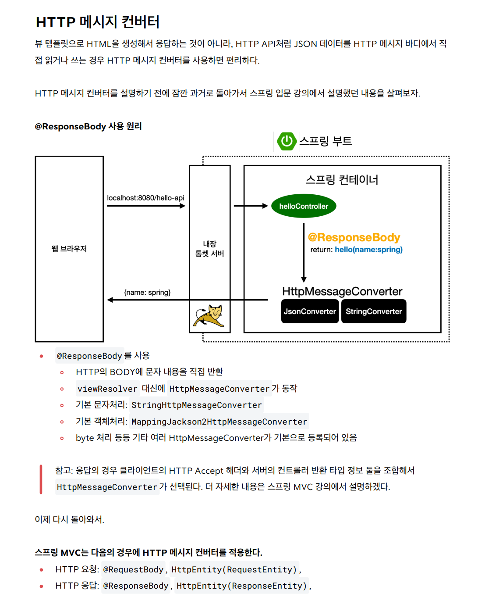
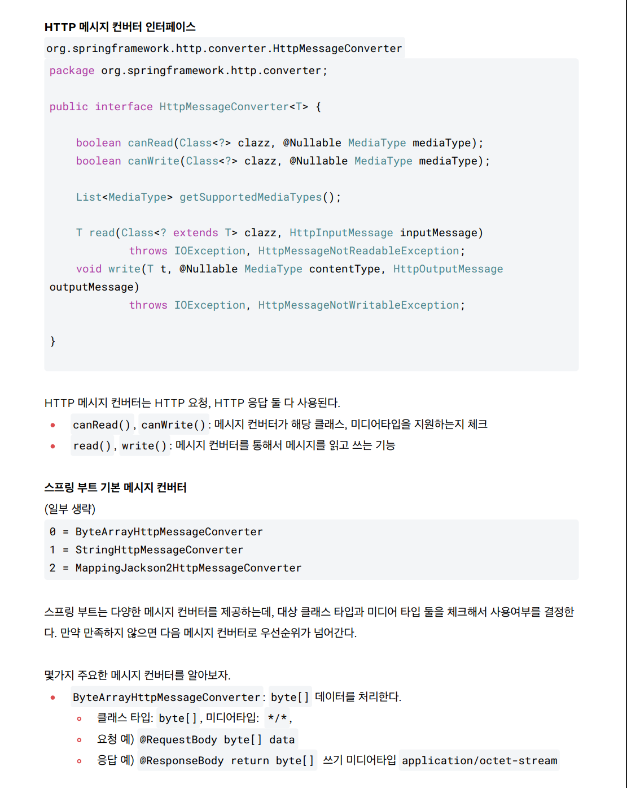
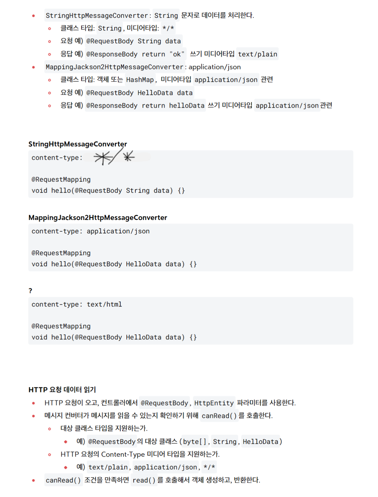
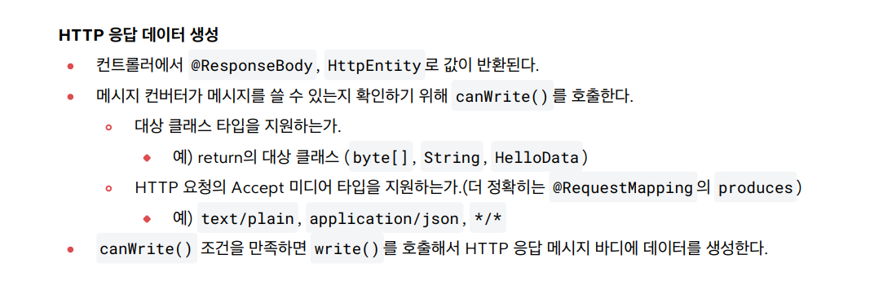
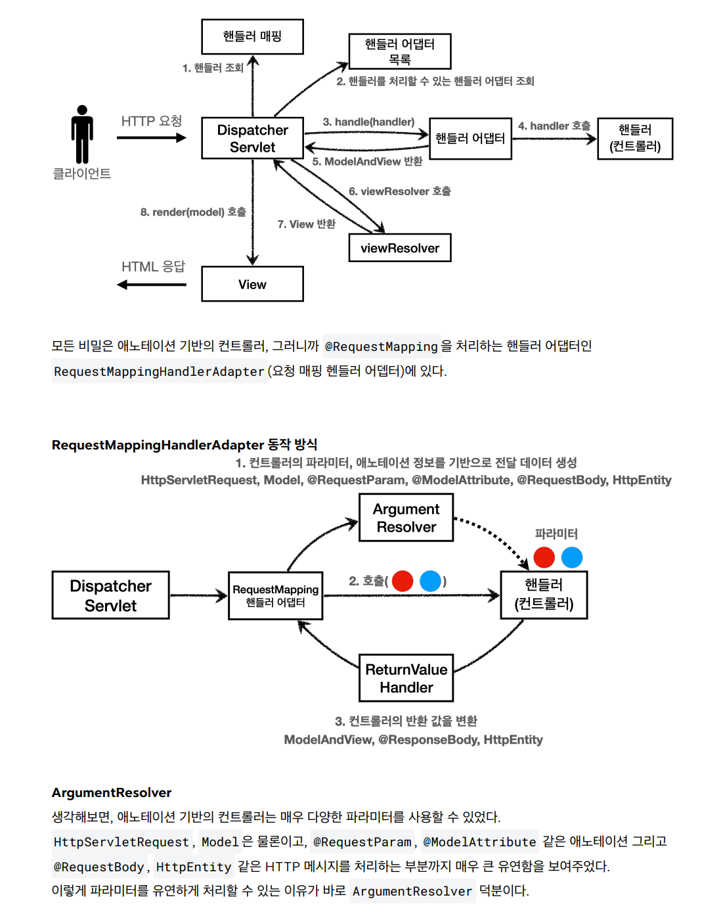
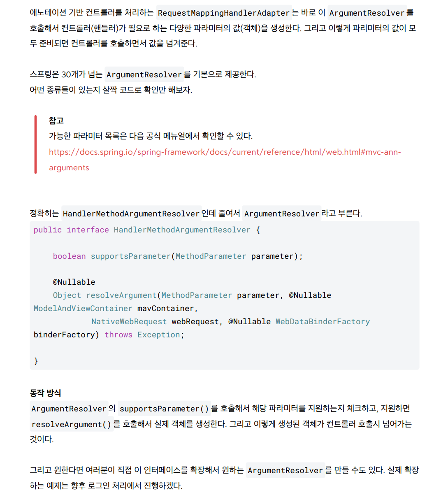

Spring MVC에서 `@Controller` 클래스의 `@RequestMapping` 메서드는 다양한 반환 타입을 지원합니다.  
반환 타입에 따라 **HTTP 응답 생성 방식**이 달라지며, 주요 반환 타입은 다음과 같습니다.


1. HTTP컨버터 작동 x
	1. ModelAndVIew 반환
	2. 뷰이름 반환 : string
2. Http 컨버터 작동 : @RequestBody 또는 HttpEntity(ResponseEntity) 일때만 작동
   byte, string, json 순서로 처리, 요청정보의 media type 도 동시에 활용
	1. byte
	2. String
	3. 객체

### **1. `String` (뷰 이름)**
- HTTP 메시지 컨버터 미작동
- **기본 동작**:  
  반환된 `String`은 **뷰 이름**으로 해석되며, `ViewResolver`가 해당 뷰를 찾아 렌더링합니다.
- **예시**:

  ```java
  @GetMapping("/home")
  public String home(Model model) {
      model.addAttribute("message", "Hello");
      return "home"; // /WEB-INF/views/home.jsp 또는 Thymeleaf 템플릿
  }
  ```

- **특징**:  
  - `Model` 객체를 통해 뷰에 데이터 전달.
  - `@ResponseBody`가 없으면 **뷰 리졸버**가 동작.

---

### **2. `ResponseEntity<?>`**
- HTTP 메시지 컨버터 작동
- **기본 동작**:  
  HTTP 응답의 **상태 코드, 헤더, 본문**을 직접 제어합니다.
- `HttpEntity`는 헤더와 본문을 포함하지만, 상태 코드는 없으며, `ResponseEntity`는 상태 코드를 추가로 지원합니다.
- **예시**:

  ```java
  @GetMapping("/api/data")
  public ResponseEntity<String> getData() {
      return ResponseEntity.status(HttpStatus.CREATED)
                           .header("X-Custom", "Value")
                           .body("Created");
  }
  ```

- **특징**:  
  - `HttpEntity` 상속받아 헤더/본문 설정 가능.
  - `@ResponseBody` 없이도 본문이 HTTP 응답에 직접 기록됨.

---

### **3. `@ResponseBody` 어노테이션**
- HTTP 메시지 컨버터 작동
- **기본 동작**:  
  반환 값이 **HTTP 응답 본문**에 직접 직렬화됩니다.  
  (예: `String` → 텍스트, 객체 → JSON/XML)
- **예시**:

  ```java
  @GetMapping("/api/json")
  @ResponseBody
  public User getUser() {
      return new User("John", 30); // {"name":"John","age":30}
  }
  ```

- **특징**:  
  - `HttpMessageConverter`가 자동으로 데이터 변환 (예: `Jackson` 라이브러리 사용).
  - `@RestController`는 클래스 레벨에 `@ResponseBody`를 포함합니다.

---

### **4. `ModelAndView`**
- HTTP 메시지 컨버터 미작동
- **기본 동작**:  
  **모델 데이터와 뷰 이름**을 동시에 전달합니다.
- **예시**:

  ```java
  @GetMapping("/profile")
  public ModelAndView profile() {
      ModelAndView mav = new ModelAndView("profile");
      mav.addObject("user", new User("Alice", 25));
      return mav;
  }
  ```

- **특징**:  
  - 레거시 코드에서 주로 사용되며, 명시적 제어가 가능합니다.

---

### **5. `void`**
- HTTP 메시지 컨버터 미작동
- **기본 동작**:  
  반환 타입이 `void`인 경우, 다음 중 1개를 선택:
  1. **디폴트 뷰 이름**: 요청 URL을 기반으로 뷰 이름 생성 (예: `/home` → `home` 뷰).
  2. **Response 직접 조작**: `HttpServletResponse`를 파라미터로 받아 수동으로 응답 작성.
- **예시**:

  ```java
  @GetMapping("/manual")
  public void manualResponse(HttpServletResponse response) throws IOException {
      response.getWriter().write("Manual Response");
  }
  ```

---

### **6. POJO (Plain Old Java Object)**
- **기본 동작**:  
  반환된 객체는 **Model에 자동 추가**되며, 뷰에서 참조 가능합니다.  
  (단, `@ResponseBody`가 없을 때)
- **예시**:

  ```java
  @GetMapping("/user")
  public User getUser() {
      return new User("Bob", 28); // Model에 "user"라는 이름으로 추가됨
  }
  ```

- **특징**:  
  - 뷰 템플릿에서 `${user.name}`처럼 접근 가능.

---

### **7. `Callable<?>` 또는 `DeferredResult<?>`**
- **기본 동작**:  
  **비동기 처리**를 위해 사용되며, 별도 스레드에서 결과를 생성합니다.
- **예시**:

  ```java
  @GetMapping("/async")
  public Callable<String> asyncRequest() {
      return () -> {
          Thread.sleep(1000);
          return "asyncResult";
      };
  }
  ```

- **특징**:  
  - 장시간 처리 작업에 유용하며, 스레드 풀을 활용합니다.

---

### **8. `View` 구현체**
- **기본 동작**:  
  직접 `View` 인터페이스를 구현한 객체를 반환해 **커스텀 뷰**를 생성합니다.
- **예시**:

  ```java
  @GetMapping("/custom-view")
  public View getCustomView() {
      return new MyCustomView(); // View 인터페이스 구현체
  }
  ```

---

### **9. `HttpEntity<?>` 또는 `ResponseEntity<?>` 확장**
- **기본 동작**:  
  `HttpEntity`는 헤더와 본문을 포함하지만, 상태 코드는 없으며, `ResponseEntity`는 상태 코드를 추가로 지원합니다.
- **예시**:

  ```java
  @GetMapping("/custom-header")
  public HttpEntity<String> customHeader() {
      HttpHeaders headers = new HttpHeaders();
      headers.add("X-Custom", "Value");
      return new HttpEntity<>("Body", headers);
  }
  ```

---

### **반환 타입 요약**
| **반환 타입**          | **동작 방식**                                  | **주요 사용처**                  |
|-----------------------|---------------------------------------------|---------------------------------|
| `String`              | 뷰 이름 반환                                  | 뷰 템플릿 렌더링 (JSP, Thymeleaf) |
| `ResponseEntity<?>`   | HTTP 상태 코드/헤더/본문 제어                 | REST API, 커스텀 HTTP 응답        |
| `@ResponseBody`       | 객체를 HTTP 본문에 직렬화                     | JSON/XML API 응답                |
| `ModelAndView`        | 모델과 뷰를 동시에 지정                       | 복잡한 뷰 로직                  |
| `void`                | 수동 응답 또는 디폴트 뷰                     | HttpServletResponse 직접 사용  |
| POJO                  | Model에 객체 자동 추가                        | 뷰 템플릿 데이터 전달            |
| `Callable<?>`         | 비동기 처리                                   | 장시간 작업                     |

---

### **핵심 차이: 뷰 vs API 응답**
- **뷰 렌더링**: `String`, `ModelAndView` → `ViewResolver`가 뷰를 찾아 렌더링.
- **API 응답**: `ResponseEntity`, `@ResponseBody` → `HttpMessageConverter`가 데이터 직렬화.


### @ResponsBody 또는 HttpEntity 일때

er가 response 객체에 해당 값을 넣어두고, 흐름이 다시 DispatcherServlet으로 가서(그럼 여기서 modelAndView는 null) 내부 로직에 의해 view를 만드는 과정이 생략되고 http 응답 메시지생성






