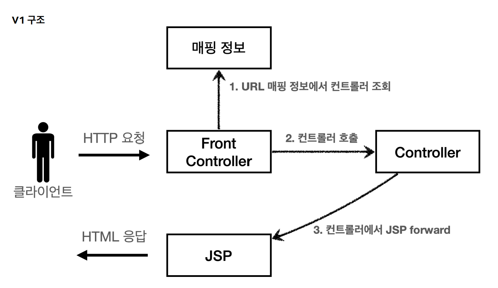
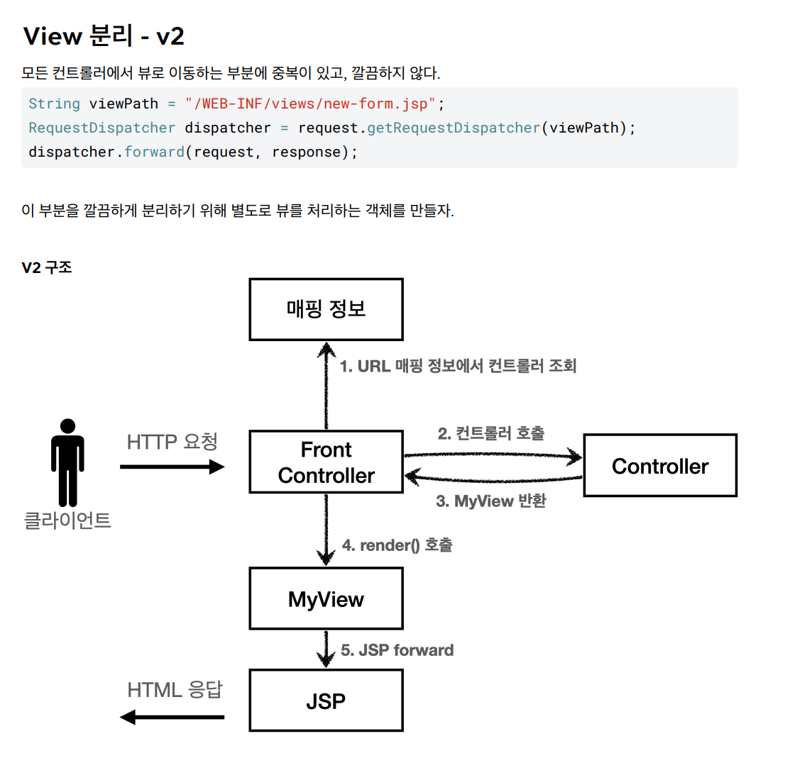
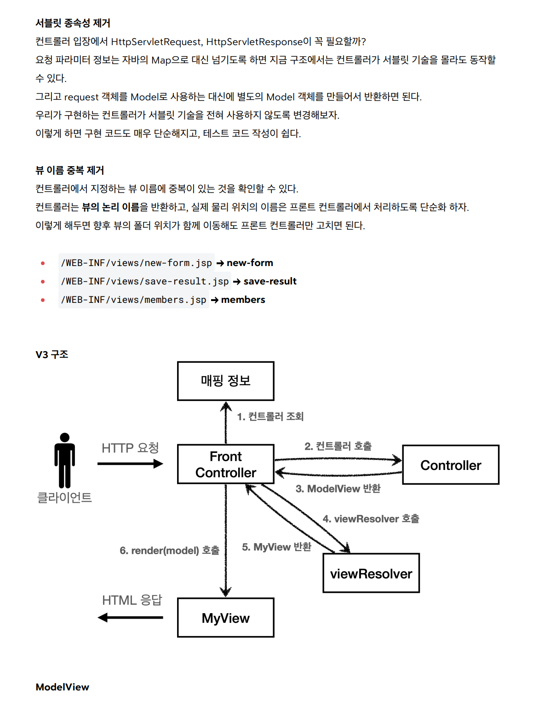
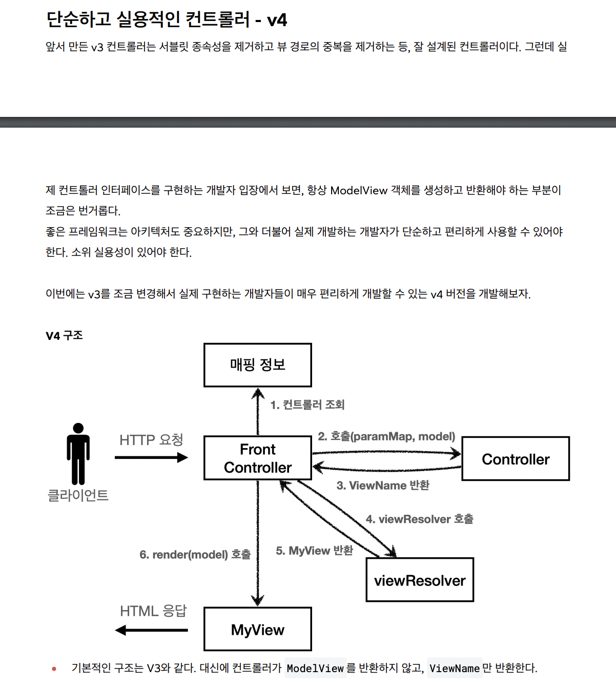
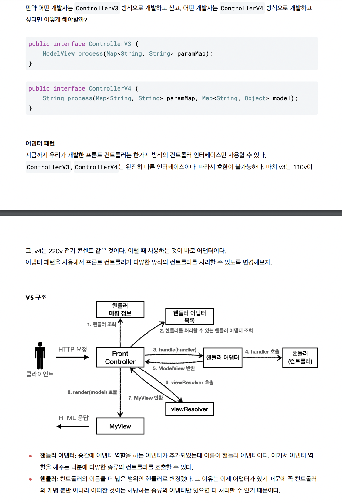
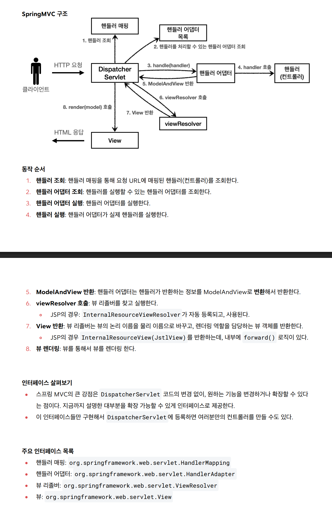

### 개발 순서

java.hello.servlet 패키지에서 시작

1. **basic 패키지** :  was 표준으로 되어 있는 서블릿을 등록하는 방법을 배운다
    WebSservlet 어노테이션 또는 web.xml 파일을 통해 서블릿을 등록할 수 있다
    실제 구현은 HttpServlet 을 상속받아 실제 사용자의 요청 정보(request) 또는 반환 정보(response)를 통제 변환할 수 있다
2. **web.servlet 패키지** : 적절한 요청에 적절한 반환을 하기 위해 반환정보에(response) 원하는 html 을 쌩으로 담아서 넘겨본다
3. **순수 jsp 패키지** : webapp 폴더안에 jsp 라는 이름으로 존재한다 jsp 를 통해 조금더 편안하게 요청을 처리해 보자 (jsp 에서 처리까지 다 해보기)
4. **web.servletmvc 패키지** : 적절한 요청에 jsp 를 통해 view 역할을 분리하여 본다 (jsp 에서 view 의 역할만 맡도록 만든다)
    (단 jsp 에서 view 에서 적절한 값을 렌더링 하기 위해 필요한 저장소가 있는데 이것이 현재 mvc 의 model 로 쓰이고 있고 이것이 HttpServletRequest 에 setAttribute 데 담아야 jsp 에서 참조하기 편하다)
5. **web.frontcontroller 패키지** : 각 버전별로 실제 발전되는 과정을 만들면서 spring 과 비슷하게 만들어 본다
	1. **v1 패키지** : 모든 컨트롤 부분이 모두 서블릿으로 등록될 필요없이 frontContoller 만 서블릿으로 등록해서 처리해보자 
	   프론트 컨트롤러 에서 쉽게 각 컨트롤러를 쉽게 호출하기 위해 다형성을 사용하자
	2. **v2 패키지** : 모든 컨트롤 부분에서 jsp 로 forward 하는 부분이 겹친다 이 부분의 경우 따로 다른 클래스에서 처리하기 위해 MyView 클래스를 도입하자
	   각 컨트롤러에서 MyView만 반환해서 나머지는 프론트 컨트롤러에서 처리자 ( 여기서 약간 의문일 수 있는데 실제 jsp 말고 다른 view 를 사용할 수 있으므로 view 또 추상화하는 것이 좋다)
	3. **v3 패키지** : 이 단계에서 많은 것을 해야 한다 모든 컨트롤 부분에서 http 요청 반환 정보(HttpServletRequest, HttpServletResponse) 가 같이 넘어간다 의존성을 제거해보자
		1. 사용자가 요청한 파라미터 정보는 HttpServletRequest.getParameter 를 통해 받는다 HttpServletRequest 없이 컨트롤러에서 처리하려면 프론트컨트롤러에서 처리해서 java 자료형으로 넘겨주어야 한다
		2. 현재 request 객체를 model 로써 사용하고 있는데 이것을 새롭게 ModelView(MVC 패턴에서 Controller와 View 사이의 데이터 전달 및 뷰 논리적 이름을 관리) 만들자 ( model 의 역할을 함과 동시에 view 의 **논리적 이름 역할**을 함께 가지고 있으므로 ModelView 로 만들었음 )
		3. 사용자의 요청(특정 컨트롤러)과 파라미터를 처리해서 ModelView 를 만들어서 처리시키자
		4. modelView 에 있는 이름으로는 MyView 를 부르는데 부족하다 전체 경로를 만들어 주는 viewResolver 또한 필요하다
	4. **v4 패키지** : 컨트롤러 측에서 ModelView 또한 만들고 싶어하지 않는다 java자료형으로 만들어서 반환시키자
	5. **v5 패키지** : 컨트롤러 측에서 누구는 v3 누구는 v4 로 만들고 싶어한다 둘다 지원할 수 있도록 어뎁터를 만들자 어뎁터를 만들면서 컨트롤러는 더 큰 범위를 다룰 수 있으므로 handler 라고 명명한다 프론트 컨트롤러 측에서 적절한 컨트롤러를 받아서 적절한 어뎁터를 통해 진행시킨다
6. web.springmvc 패키지 : spring 을 사용한 편집


5003267.png)

### v1


### v2

### v3

MyView 클래스가 조금 복잡해 지는데 jsp 의 구조상 [서블릿 객체들](서블릿%20객체들.md) 에 저장해 주어야 쉽게 빼서 사용할 수 있다

JSP는 request.getAttribute() 로 데이터를 조회하기 때문에, 모델의 데이터를 꺼내서 request.setAttribute() 로 담아둔다

만약 view 측에서 쉽게 data 에 접근하는 좋은 방식이 있다면 이렇게 코드를 만들지 않을 수 있다
### v4



### v5


핸들러 <= 컨트롤러 : 동일한 말과 같음

### spring 과 동치
직접 만든 프레임워크 스프링 MVC 비교
FrontController -> DispatcherServlet
handlerMappingMap -> HandlerMapping
MyHandlerAdapter -> HandlerAdapter
ModelView -> ModelAndView
viewResolver -> ViewResolver
MyView -> View


### 실제 spring MVC 구조




### 추가
#### 핸들러(컨트롤러) 관련
컨트롤러가 호출되려면 다음 2가지가 필요하다.
1. HandlerMapping(핸들러 매핑) 핸들러 매핑에서 이 컨트롤러를 찾을 수 있어야 한다. 예) 스프링 빈의 이름으로 핸들러를 찾을 수 있는 핸들러 매핑이 필요하다.
2. HandlerAdapter(핸들러 어댑터) 핸들러 매핑을 통해서 찾은 핸들러를 실행할 수 있는 핸들러 어댑터가 필요하다. 
   예) Controller 인터페이스를 실행할 수 있는 핸들러 어댑터를 찾고 실행해야 한다.
스프링 부트가 자동 등록하는 핸들러 매핑과 핸들러 어댑터 (실제로는 더 많지만, 중요한 부분 위주로 설명하기 위해 일부 생략)
HandlerMapping 
```
0 = RequestMappingHandlerMapping : 애노테이션 기반의 컨트롤러인
	@RequestMapping에서 사용
1 = BeanNameUrlHandlerMapping : 스프링 빈의 이름으로 핸들러를 찾는다.
```
HandlerAdapter
```
0 = RequestMappingHandlerAdapter : 애노테이션 기반의 컨트롤러인 @RequestMapping에서 사용
1 = HttpRequestHandlerAdapter : HttpRequestHandler 처리
2 = SimpleControllerHandlerAdapter : Controller 인터페이스(애노테이션X, 과거에 사용) 처리
```


#### 리졸버 관련

스프링 부트가 자동 등록하는 뷰 리졸버 (실제로는 더 많지만, 중요한 부분 위주로 설명하기 위해 일부 생략) 
```
1 = BeanNameViewResolver : 빈 이름으로 뷰를 찾아서 반환한다. 
	(예: 엑셀 파일 생성 기능 에 사용)
2 = InternalResourceViewResolver : JSP를 처리할 수 있는 뷰를 반환한다.
```

1번 예시
```java
@Component("excelView") // 빈 이름 명시
public class ExcelView implements View {
    @Override
    public void render(Map<String, ?> model, HttpServletRequest request, HttpServletResponse response) {
        // 엑셀 파일 생성 로직
        response.setContentType("application/vnd.ms-excel");
        // ...
    }
}
```
빈 이름으로 리졸버뷰를 만들어서
컨트롤러에서 처리한다