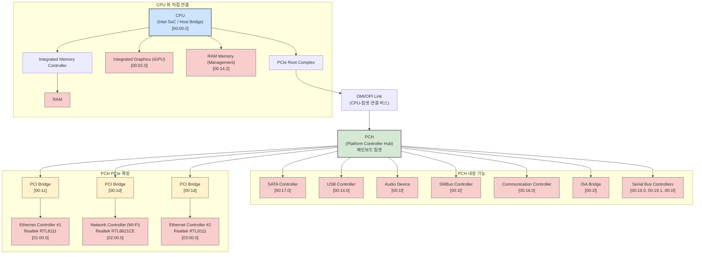

```
            ┌───────────────────────────┐
            │            CPU            │
            │ (Intel SoC / Host Bridge) │
            │         [00:00.0]         │
            └───────┬─────┬─────────────┘
                    │     │
                    │     │
┌───────────────────┴─┐ ┌─┴────────────────────────┐
│ Integrated Memory   │ │ Integrated Devices (On-chip) │
│ Controller (IMC)    │ └─┬────────────────────────┘
└─────────┬───────────┘   │
          │               ├─ Integrated Graphics (iGPU) [00:02.0]
          ↓               │
        ┌───┐             ├─ RAM Memory (Management) [00:14.2]
        │RAM│             │
        └───┘             └─ PCIe Root Complex (CPU의 PCIe 레인 관리자)
                                │
                                │
          ┌─────────────────────┴────────────────────────────────┐
          │ DMI/OPI Link (CPU와 칩셋을 연결하는 전용 고속도로)     │
          └─────────────────────┬────────────────────────────────┘
                                │
                                ↓
            ┌───────────────────────────────────┐
            │   PCH (Platform Controller Hub)   │
            │            (메인보드 칩셋)            │
            └─────────────────┬─────────────────┘
                              │
    ┌─────────────────────────┴──────────────────────────┐
    │ PCH 내장 기능 (Relatively Slower I/O)                │
    ├─ SATA Controller (HDD/SSD) [00:17.0]                │
    ├─ USB Controller [00:14.0]                           │
    ├─ Audio Device (HD Audio) [00:1f]                  │
    ├─ SMBus Controller [00:1f]                         │
    ├─ Communication Controller (Intel ME) [00:16.0]      │
    ├─ ISA Bridge (Legacy) [00:1f]                      │
    ├─ Serial Bus Controllers [00:19.0, 00:19.1, 00:1f] │
    │                                                    │
    │  PCH 자체의 PCIe 레인을 통한 확장                  │
    └─┬──────────────────────────────────────────────────┘
      │
      ├─ PCI Bridge [00:1c] ───▶ Bus 01 ─▶ Ethernet Controller #1 [01:00.0] (Realtek RTL8111)
      │                                       (첫 번째 유선 랜카드)
      │
      ├─ PCI Bridge [00:1d] ───▶ Bus 02 ─▶ Network Controller [02:00.0] (Realtek RTL8821CE Wi-Fi)
      │                                       (무선 랜카드)
      │
      └─ PCI Bridge [00:1d] ───▶ Bus 03 ─▶ Ethernet Controller #2 [03:00.0] (Realtek RTL8111)
                                              (두 번째 유선 랜카드)
```

