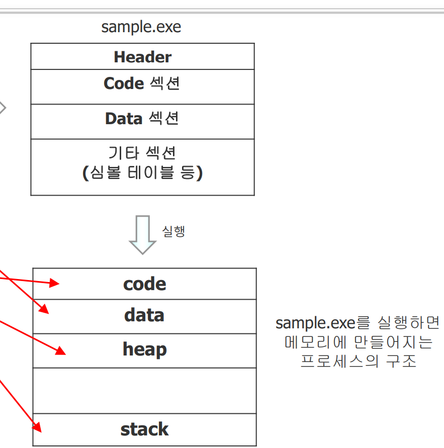

프로그램의 실행파일로 프로세스를 생성해 프로그램을 돌리는 과정에서 각 과정에서 메모리 구조를 확인할 수 있다

## 실행파일
먼저 실행파일이다 실행 파일은 운영체제별 포메멧 별로 다르게 사용되는데 이때 code section 과 data section 은 동일하다 이를 확인하기 위한 방법이 size 명령어이다
하지만  실행 파일의 헤더 및 기타 섹션을 확인하기 위한 방법은 운영 체제와 해당 실행 파일의 포맷(예: ELF, PE, Mach-O 등)에 따라 달라진다 리눅스, 유닉스 계열 시스템에서는 주로 ELF(Executable and Linkable Format) 포맷이 사용되며, Windows에서는 PE(Portable Executable) 포맷, macOS에서는 Mach-O 포맷이 사용된다
### ELF 포맷 (리눅스, 유닉스 계열)
- **readelf**: ELF 포맷의 실행 파일, 오브젝트 파일, 공유 라이브러리 등의 정보를 표시하는 프로그램입니다. 헤더, 섹션 헤더, 프로그램 헤더, 심볼 테이블 등 다양한 정보를 확인할 수 있습니다.
    - 예시 명령어: `readelf -h [파일명]` (ELF 파일의 헤더 정보 표시)
    - 예시 명령어: `readelf -S [파일명]` (섹션 헤더 정보 표시)
- **objdump**: 오브젝트 파일, 실행 파일, 공유 라이브러리의 정보를 보여주는 프로그램입니다. `readelf`보다 더 다양한 정보를 제공할 수 있으며, 디스어셈블리 결과도 확인할 수 있습니다.
    - 예시 명령어: `objdump -h [파일명]` (섹션 헤더 정보 표시)
    - 예시 명령어: `objdump -D [파일명]` (전체 디스어셈블리)
### PE 포맷 (Windows)
- **dumpbin**: Microsoft Visual Studio에 포함된 도구로, PE 포맷의 실행 파일, 오브젝트 파일, DLL 등의 정보를 표시합니다. 헤더, 섹션, 익스포트, 임포트 정보 등을 확인할 수 있습니다.
    - 예시 명령어: `dumpbin /headers [파일명]` (헤더 정보 표시)
    - 예시 명령어: `dumpbin /sections [파일명]` (섹션 정보 표시)
- **PEview**: 그래픽 사용자 인터페이스(GUI)를 제공하는 도구로, PE 파일의 헤더 및 섹션 정보를 쉽게 검토할 수 있습니다.
### Mach-O 포맷 (macOS)
- **otool**: macOS에 포함된 도구로, Mach-O 파일의 정보를 표시합니다. 헤더, 로드 명령, 섹션 정보 등을 확인할 수 있습니다.
    - 예시 명령어: `otool -h [파일명]` (Mach-O 파일의 헤더 정보 표시)
    - 예시 명령어: `otool -l [파일명]` (로드 명령 및 섹션 정보 표시)


## 프로세스
실행 파일의 code 섹션, data 섹션 크기는 정적으로 미리 정해져 있다 이를 확인하는 것은 `size` 명령어를 사용하여 정적으로 분석할 수 있습니다. 하지만 프로세스의 코드, 데이터, 힙, 스택 영역을 실시간으로 확인하려면 다른 접근 방법이 필요합니다. 여기서는 리눅스 기반 시스템에서 이를 확인하는 방법을 중심으로 설명하겠습니다.

1. **/proc 파일 시스템 사용하기**: 리눅스에서는 실행 중인 프로세스의 정보를 `/proc` 파일 시스템을 통해 접근할 수 있습니다. 각 프로세스는 `/proc/[pid]` 디렉토리에 해당하며, 여기에서는 메모리 맵, 스택, 환경 변수 등 다양한 정보를 확인할 수 있습니다.
    
    - **/proc/[pid]/maps**: 이 파일은 프로세스의 메모리 맵을 보여줍니다. 코드, 데이터, 힙, 스택 영역의 주소 범위와 권한을 확인할 수 있습니다.
    - **/proc/[pid]/stat**: 프로세스의 상태, 메모리 사용량 등 다양한 통계 정보를 제공합니다.
    - 사용 예:

        ```bash
        cat /proc/[pid]/maps  # 메모리 맵 확인
        cat /proc/[pid]/stat  # 프로세스 상태 확인
        ```

2. **시스템 모니터링 도구 사용하기**: `top`, `htop`, `ps`, `pmap` 등 다양한 시스템 모니터링 도구를 사용하여 프로세스의 메모리 사용량과 상태를 실시간으로 확인할 수 있습니다.
    
    - `top` 또는 `htop`: 시스템에서 실행 중인 프로세스의 목록을 실시간으로 보여주며, CPU와 메모리 사용량을 확인할 수 있습니다.
    - `ps`: 프로세스의 스냅샷을 보여줍니다. 특정 프로세스의 정보를 확인할 때 사용합니다.
    - `pmap [pid]`: 특정 프로세스의 메모리 맵을 보여줍니다. 코드, 데이터, 힙, 스택 영역의 메모리 사용량을 확인할 수 있습니다.
3. **디버깅 도구 사용하기**: `gdb` 같은 디버거를 사용하여 프로세스를 분석할 수도 있습니다. 프로세스를 디버깅 세션에 연결하면, 코드, 데이터, 힙, 스택 영역의 상세 정보를 실시간으로 확인하고 분석할 수 있습니다.
    - 사용 예:

        ```bash
        gdb -p [pid]  # 실행 중인 프로세스에 대한 디버깅 세션 시작
        ```

    디버깅 세션 내에서는 다양한 명령어를 사용하여 메모리의 내용을 확인하고 분석할 수 있습니다.


%20image%2020240328041330.png)


