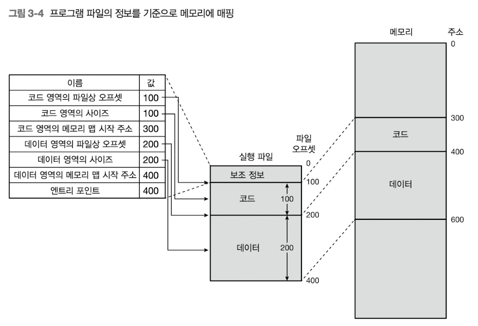

프로세스는 두가지 목적으로 생성한다
- fork() : 다중 프로세스 프로그램 사용 => 현재 프로세스의 메모리 복사 다른 프로세스로 등록
- execve() : 다른 프로그램 실행용( bash 에서 실행할 때 ) => 현재 프로세스의 메모리를 새로운 프로세스의 메모리로 덮어 쓴다

프로세스가 운영체제에게 부여받은 메모리 구조

## 실행파일
실행파일은 리눅스에서는 ELF (excutable linkable format) 형식이며
readelf -h {실행파일 명}
readelf -S {실행파일 명}
으로 사용 가능하다